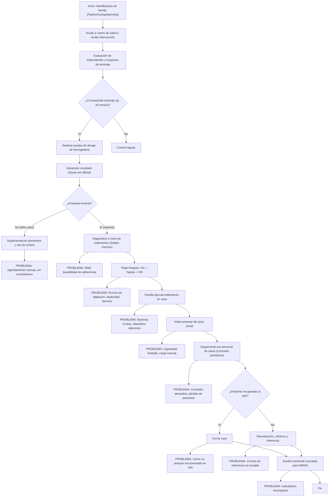
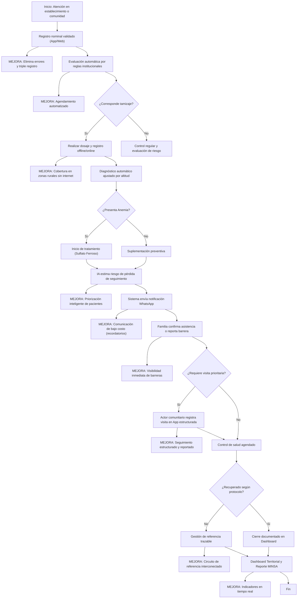
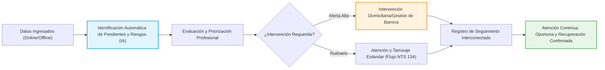
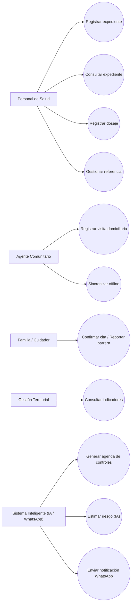
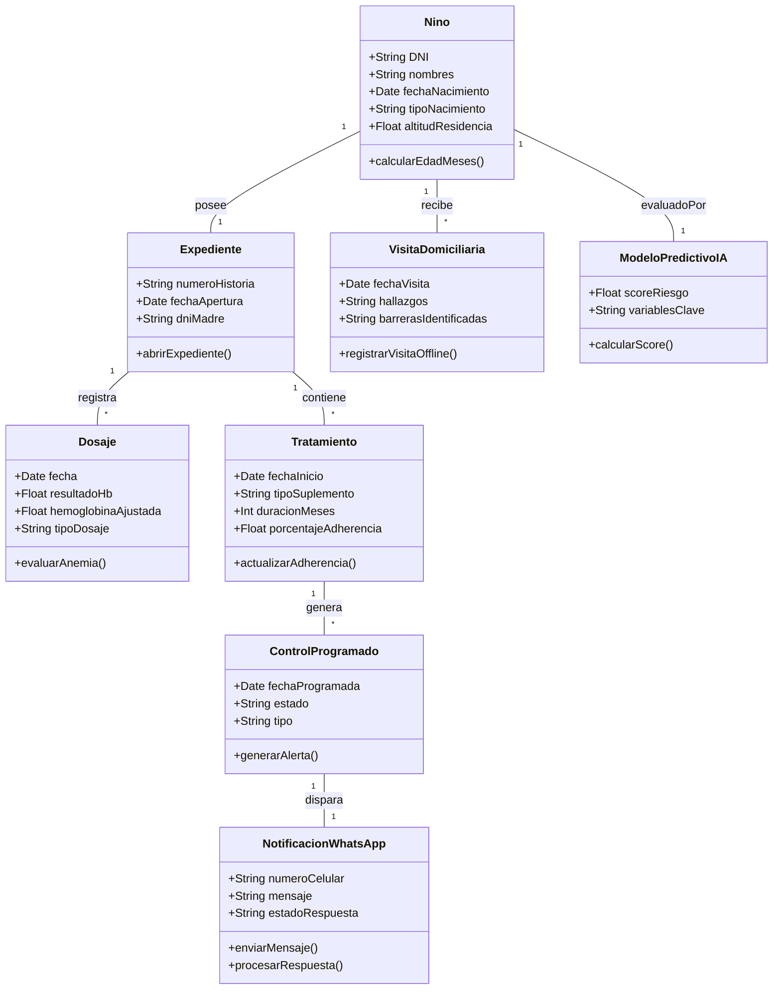

# Entregable Semana 1: Sistema Inteligente para Detección Temprana de Anemia Infantil en Zonas Rurales de Junín

**Nota de versión (v4):** Esta versión integra los hallazgos de las entrevistas con el personal de salud rural, detalla exhaustivamente el modelo predictivo de IA (variables, justificaciones y matriz de ponderación con cálculos explícitos), incorpora las tablas normativas de tamizaje (NTS 134-MINSA), añade ejemplos concretos de notificaciones vía WhatsApp, y presenta todos los diagramas AS-IS, TO-BE, Cadena de Valor, Casos de Uso y Clases requeridos en notación Mermaid con sus respectivas guías de transcripción a PowerDesigner.

### Equipo de Proyecto
| Integrante | Rol |
|---|---|
| Porras Veli Ricardo | Líder de Proyecto / Analista de Procesos |
| Auqui Huincho Tania | Diseñadora de Solución / Prototipado |
| Huamani Rodriguez Jean Piero | Ingeniero de Calidad / QA |

---

## 1. PROBLEMA ORGANIZACIONAL

La región de Junín presenta altos índices de anemia infantil, especialmente en zonas rurales donde factores geográficos, socioeconómicos y de infraestructura limitan el acceso a los servicios de salud. A pesar de los esfuerzos del MINSA y las normativas vigentes (como la NTS N° 134-MINSA/2017/DGIESP), los establecimientos de salud rurales enfrentan graves dificultades para realizar un seguimiento oportuno y continuo a los niños menores de 5 años.

La entrevista realizada al personal de salud rural evidenció que, si bien el tamizaje de hemoglobina se inicia alrededor de los 6 meses y el tratamiento con sulfato ferroso o hierro polimaltosado dura un mínimo de 6 meses continuos, el seguimiento se ve obstaculizado por un sistema de registro fragmentado ("triple registro": historia clínica en papel, tarjeta de control del niño y digitación posterior en el sistema HIS). Esto genera pérdida de datos, retrasos en la programación de citas, y una escasa visibilidad sobre el abandono del tratamiento. Los actores sociales (agentes comunitarios) visitan las casas semanalmente, pero su labor no está integrada tecnológicamente con las postas de salud, lo que retrasa la respuesta ante barreras de atención y pone en riesgo la meta clínica de diagnosticar al niño a los 6 meses y lograr su recuperación al año de edad.

## 2. ACTORES Y NECESIDADES

- **Personal de Salud (Enfermeros, Médicos, Técnicos):** Necesitan centralizar el registro clínico, eliminar la redundancia de datos y recibir alertas automáticas sobre niños en riesgo de abandonar el tratamiento.
- **Actores Sociales (Agentes Comunitarios):** Requieren una herramienta (incluso sin conexión a internet) para registrar de forma estructurada sus visitas domiciliarias semanales y reportar barreras de los pacientes.
- **Familias / Cuidadores de niños menores de 5 años:** Necesitan recordatorios oportunos de sus citas, orientación nutricional y canales accesibles y de bajo costo (como WhatsApp) para confirmar asistencia o reportar barreras (económicas, de transporte).
- **Gestión Territorial (Redes/Microredes de Salud):** Necesitan consolidar la información para reportar al MINSA, visualizar indicadores en tiempo real y coordinar circuitos de referencia médica cuando los casos no se recuperan en el primer nivel.
- **MINSA:** Supervisa el cumplimiento del seguimiento, necesita estadísticas fiables e indicadores de cobertura.

---

## 3. PROCESO AS-IS (SITUACIÓN ACTUAL)

El proceso actual depende del esfuerzo manual del personal y la comunicación boca a boca, caracterizándose por ser reactivo.

**Descripción para PowerDesigner:**
El diagrama AS-IS es un Flujo de Actividades que consta de 20 nodos y compuertas lógicas. Comienza con un evento de inicio que desencadena la atención (Identificación). Cuenta con 3 compuertas lógicas (rombos): decisión de tamizaje, diagnóstico de anemia, y estado de recuperación. Las actividades principales (rectángulos) describen el registro (Triple Registro) y tratamiento. Se incluyen 8 nodos de notas (conectados directamente a las actividades principales) que modelan los "PROBLEMAS" actuales como cuellos de botella y fallas de trazabilidad. Para replicar en PowerDesigner, utilice un "Business Process Model", defina swimlanes (Actor Comunitario, Familia, Personal de Salud, MINSA) y traslade los nodos a sus respectivos responsables, adjuntando las notas de problema a cada tarea manual.

---

## 4. BRECHAS

1. **Brecha de Trazabilidad y Datos:** Triple registro manual (Historia, Tarjeta, HIS) vs. Registro nominal unificado y validado digitalmente.
2. **Brecha de Adherencia:** Falta de seguimiento diario y barreras ocultas (transporte, dinero) vs. Visibilidad integral con notificaciones directas al cuidador (WhatsApp) y reporte de actores sociales.
3. **Brecha de Proactividad:** Identificación del riesgo cuando ya hay abandono vs. Modelo predictivo de IA que detecta anticipadamente a pacientes con alto riesgo de deserción o no recuperación.
4. **Brecha de Conectividad:** Postas rurales aisladas sin reporte diario vs. Aplicación con funcionamiento offline-first y sincronización en diferido.

---

## 5. PROCESO TO-BE (CON INTERVENCIÓN DEL SISTEMA)

El proceso mejorado integra la automatización, la predicción de IA y canales de comunicación accesibles.

**Descripción para PowerDesigner:**
El diagrama TO-BE es un Flujo de Actividades optimizado que incluye 22 nodos principales y notas de mejora. Inicia con el registro nominal y cruza automatizaciones clave del sistema. Cuenta con 4 compuertas de decisión, incorporando la ruta lógica que evalúa si el modelo de IA y las reglas del sistema determinan la necesidad de visita prioritaria en caso de barreras detectadas por WhatsApp. Para PowerDesigner, agrupe en Swimlanes (Sistema Inteligente, Familia, Personal de Salud, Actor Social, Gestión). Los nodos de "MEJORA" deben representarse como "Business Rules" o anotaciones en los procesos automatizados (por ejemplo, el nodo de IA y el de Notificación WhatsApp deben marcarse como servicios automatizados "Service Task").

---

## 6. APORTE DEL SOFTWARE

El sistema transformará el seguimiento de la anemia infantil centralizando la historia clínica mediante un modelo predictivo, soporte sin conexión y comunicación asíncrona.

### 6.1. Esquema Normativo Integrado en el Sistema
El software contiene las reglas de la NTS N° 134-MINSA para generar el agendamiento y validación automáticos, asegurando que el personal aplique el protocolo exacto, del cual se extrae la siguiente matriz de controles para niños sin anemia implementada en el motor de reglas:

**Esquema de tamizaje de hemoglobina (NTS 134-MINSA/2017/DGIESP):**

*Niño Prematuro:*
| Edad | Dosaje | Suplementación |
|---|---|---|
| 1 mes | DHx | PO1 |
| 4 meses | DHc1 | PO2 |
| 6 meses | DHc2 | TA |

*A término (prematuro):*
| Edad | Dosaje | Suplementación |
|---|---|---|
| 4 meses | - | PO1 |

*Niño A término (≥10.5 Hb, sin anemia):*
| Edad | Dosaje | Suplementación |
|---|---|---|
| 6 meses | DHx | SF1 |
| 8 meses | - | SF2 |
| 9 meses | DHc1 | - |
| 10 meses | - | SF3 |
| 1 año | DHc2 | TA |

*Seguimiento (1 año a 1 año 9 meses):*
| Edad | Dosaje | Suplementación |
|---|---|---|
| 1a 3m a 1a 8m | 1a 6m: DHc1 | SF1 a SF6 |
| 1a 9m | DHc2 | TA |

*(Nota: DHx = Tamizaje inicial, DHc = Control de dosaje, SF = Sulfato Ferroso, PO = Hierro preventivo, TA = Término de atención. El sistema extrapola estas tablas para todo rango hasta los 5 años).*

### 6.2. Modelo Predictivo de IA (Estimación de Riesgo)
El sistema integra un modelo de clasificación supervisada (basado en Random Forest o Gradient Boosting) entrenado con data histórica del HIS. Su objetivo **no es prescribir diagnósticos médicos**, sino emitir un *Score de Riesgo (0-100)* que permita al personal de salud priorizar a los pacientes propensos a abandonar el tratamiento. La IA es interpretable mediante valores SHAP.

**Variables propuestas para el modelo:**
| Variable | Tipo | Justificación | Fuente | Peso prop. |
|---|---|---|---|---|
| Edad del niño (meses) | Numérica | Factor crítico normativo (6-35 meses = riesgo pico) | Norma técnica (NTS 134) | 15% |
| Nivel hemoglobina previo | Numérica | Predictor directo evolutivo de la patología | Registro clínico | 20% |
| Altitud de residencia | Numérica | Afecta los valores base y oxígeno | Norma técnica | 10% |
| Adherencia tratamiento % | Numérica | Confirmado en entrevista; fundamental para alta médica | Entrevista / Actor | 15% |
| Días desde último control | Numérica | Mide explícitamente el aislamiento clínico del paciente | Registro HIS | 10% |
| Tipo de nacimiento | Categórica | Esquemas de suplementación varían radicalmente | Norma técnica | 10% |
| N° visitas domiciliarias | Numérica | La frecuencia de seguimiento de actores frena el abandono | Entrevista / App | 8% |
| Zona/distrito rural | Categórica | Mayor incidencia (39%) comprobada | ENDES 2025 | 7% |
| Historial anemia previa | Binaria | Reincidencia biológica y de comportamiento | Registro clínico | 5% |

**Matriz de Ponderación (Relevancia, Disponibilidad y Predicción):**
Cálculo = (Relevancia × 0.40) + (Disponibilidad × 0.30) + (Predictiva × 0.30). Escala del 1 al 5.

| Variable | Relevancia clínica (40%) | Disponibilidad (30%) | Capacidad predictiva (30%) | Puntaje Ponderado (Cálculo) |
|---|---|---|---|---|
| Hemoglobina previa | 5 (5×0.4=2.0) | 5 (5×0.3=1.5) | 5 (5×0.3=1.5) | **5.0** |
| Adherencia tratam. | 5 (5×0.4=2.0) | 3 (3×0.3=0.9) | 5 (5×0.3=1.5) | **4.4** |
| Edad del niño | 4 (4×0.4=1.6) | 5 (5×0.3=1.5) | 4 (4×0.3=1.2) | **4.3** |
| Días último control | 4 (4×0.4=1.6) | 5 (5×0.3=1.5) | 4 (4×0.3=1.2) | **4.3** |
| Tipo nacimiento | 4 (4×0.4=1.6) | 4 (4×0.3=1.2) | 3 (3×0.3=0.9) | **3.7** |
| Altitud residencia | 3 (3×0.4=1.2) | 5 (5×0.3=1.5) | 3 (3×0.3=0.9) | **3.6** |
| Visitas domiciliarias| 3 (3×0.4=1.2) | 3 (3×0.3=0.9) | 4 (4×0.3=1.2) | **3.3** |

### 6.3. Interacción vía Notificaciones de WhatsApp
Conectado mediante la API oficial, el sistema automatiza el vínculo con los padres.
- **Recordatorio:** `"Sra. María, su hijo Juan tiene control de hemoglobina programado para el 15/10. ¿Confirma asistencia? Responda SÍ o NO".`
- **Reporte de Barrera:** Si la familia responde `"NO puedo ir, no tengo pasaje"`, el sistema activa un flag de alerta en el tablero del actor social para coordinar una visita comunitaria o reprogramación especial.

### 6.4. Requisito No Funcional: Funcionamiento Offline
Las zonas rurales de Junín carecen de señal 4G constante. El aplicativo móvil usará arquitectura "Offline-First" (PWA / SQLite local). Según lo entrevistado, los actores sociales recopilan datos en las casas; con la app, registrarán las visitas y consumos de suplementos localmente. Al regresar a la posta de salud o encontrar una zona con WiFi/red, los datos se sincronizarán mediante encriptación (JSON Payload) hacia el servidor central.

---

## 7. VALOR ORGANIZACIONAL (Cadena de Valor del Proceso)

**Descripción para PowerDesigner:**
Este es un Flujo de Valor (Value Stream) de alto nivel representado con 8 nodos de macro-procesos. La transición va de izquierda a derecha ilustrando cómo el tratamiento de la información (Input) cruza los nuevos mecanismos (motor IA destacado en azul y gestión de barreras en naranja) hasta entregar el valor final (Atención continua y recuperación, en verde). En PowerDesigner, utilice un diagrama "Value Stream" o un "Process Hierarchy", donde las cajas representen las fases clave del servicio que añaden valor directo al paciente.

---

## 8. INDICADORES

| **Tipo** | **Indicador** | **Qué mide** | **Cómo se mide** |
| --- | --- | --- | --- |
| Proceso | Cobertura oportuna de medición/control | Atención dentro de ventana normativa NTS 134 | Atendidos oportunamente ÷ elegibles × 100 |
| Proceso | Demora de controles vencidos | Retraso del proceso | Mediana de días entre fecha prevista y realizada |
| Proceso | Cumplimiento de visitas priorizadas | Ejecución comunitaria | Visitas oportunas ÷ visitas priorizadas × 100 |
| Proceso | Cierre oportuno de referencias | Continuidad entre actores | Referencias cerradas a tiempo ÷ referencias vencibles × 100 |
| Producto | Registros que superan validaciones | Calidad del dato (elimina triple registro manual) | Registros sin error crítico/duplicidad ÷ evaluados × 100 |
| Producto | Sincronización offline exitosa | Fiabilidad en zonas rurales sin cobertura | Registros sincronizados y confirmados ÷ pendientes × 100 |
| Producto | Disponibilidad operativa | Uso de funciones esenciales del sistema | Minutos disponibles ÷ minutos programados × 100 |
| Producto | Tasa de entrega de notificaciones WhatsApp | Alcance efectivo del recordatorio a familias | Mensajes entregados y leídos ÷ mensajes enviados × 100 |
| Producto | Precisión del modelo predictivo de IA | Calidad de la priorización de riesgo | Casos alto riesgo confirmados por salud ÷ señalados por modelo × 100 |
| Resultado | Tasa de adherencia al tratamiento | Continuidad del plan terapéutico (sulfato ferroso/hierro polimaltosado) | Niños que recogen suplementos en fecha ÷ diagnosticados × 100 |
| Resultado | Recuperación documentada al año | Resultado clínico confirmado (meta: diagnóstico 6m → recuperación 1a) | Recuperados ÷ casos con control de cierre válido × 100 |
| Valor | Pérdida de seguimiento | Casos sin atención/cierre | Casos sobre umbral sin cierre ÷ casos con seguimiento × 100 |
| Valor | Oportunidades recuperadas | Atención tras acción de seguimiento | Vencidos atendidos tras acción ÷ vencidos con acción × 100 |

No se fijan metas numéricas todavía. Toda futura meta propuesta requerirá línea base y aprobación institucional.

---

## 9. DIAGRAMAS UML COMPLEMENTARIOS

### 9.1. Diagrama de Casos de Uso (Aproximación)

**Descripción para PowerDesigner:**
El Diagrama de Casos de Uso involucra 5 Actores (stickmen en UML) y 11 Casos de Uso (óvalos). El "Sistema Inteligente" actúa como un actor secundario/automatizado que desencadena la estimación y notificación. En PowerDesigner, cree un "Use Case Diagram", coloque los Actores y los Óvalos de casos de uso. Puede agregar relaciones `<<include>>` desde "Generar agenda" hacia "Estimar riesgo", y relaciones de comunicación simples entre los actores físicos y sus transacciones en el sistema.

### 9.2. Diagrama de Clases (Dominio del Sistema)

**Descripción para PowerDesigner:**
Es un Diagrama de Clases UML con 8 Entidades. Cada clase incluye de 3 a 5 atributos tipados y al menos un método representativo. Las multiplicidades destacan: un Niño tiene un Expediente (1 a 1), pero un Expediente tiene muchos Dosajes (1 a muchos). En PowerDesigner, abra un "Class Diagram" (OOM), dibuje las clases (Class) ingresando atributos en la pestaña 'Attributes' y métodos en 'Operations', y trace asociaciones estableciendo la multiplicidad en los roles de conexión.

---

## 10. PREGUNTAS DE ANÁLISIS

### 1. ¿Qué problema del proceso organizacional se pretende resolver?

La discontinuidad, demora y coordinación poco confiable en prevención, medición, registro, seguimiento y recuperación de la anemia infantil en zonas rurales de Junín. Según la entrevista, el proceso actual depende de un triple registro manual (historia clínica, tarjeta de control, HIS), lo que genera errores de digitación, duplicidad y demoras. Los actores sociales visitan semanalmente a las familias pero sin herramientas digitales, y las barreras de adherencia (transporte, economía) permanecen ocultas hasta que el niño ya abandonó el tratamiento. El problema no es simplemente la ausencia de software, sino la pérdida de oportunidades preventivas cuando una indicación o un dosaje no se convierte en seguimiento y acción oportunos.

### 2. ¿Qué actividad del AS-IS genera mayor pérdida de valor?

El seguimiento posterior a la indicación de tratamiento. La entrevista reveló que el objetivo es que un niño diagnosticado a los 6 meses se recupere al año, pero esto requiere 6 meses continuos de tratamiento con sulfato ferroso o hierro polimaltosado, con controles periódicos de hemoglobina. Cuando el seguimiento falla — por inasistencia, barreras familiares no detectadas, capacidad limitada del personal o errores de registro — una medición o prescripción sin control posterior pierde gran parte de su valor clínico. Los actores sociales intentan cubrir esta brecha con visitas semanales, pero su capacidad es insuficiente frente al volumen de familias.

### 3. ¿Qué cambia concretamente en el TO-BE?

Se crea un circuito nominal validado con agenda automatizada, tareas priorizadas, registro de barreras, referencias cerrables e indicadores en tiempo real. Las decisiones clínicas siguen siendo profesionales. Se añaden cuatro mecanismos de apoyo:
- **Notificaciones WhatsApp:** Recordatorios de bajo costo a las familias, con confirmación de cita y reporte de barreras (ej. *"Sra. María, su hijo Juan tiene control de hemoglobina el 15/10. ¿Confirma? Responda SÍ o NO"*).
- **Modelo predictivo de IA:** Estima el riesgo de anemia y de pérdida de seguimiento mediante un score 0-100, priorizando la agenda del personal de salud con explicabilidad (SHAP).
- **Funcionalidad offline:** Permite registrar expediente, dosaje, visitas y barreras sin conexión, sincronizando automáticamente al recuperar señal.
- **Motor de reglas NTS 134:** Automatiza el esquema de tamizaje normativo (DHx, DHc1, DHc2, SF1-SF6, PO1, PO2, TA) para cada niño según edad y tipo de nacimiento.

### 4. ¿Qué actividades serán automatizadas o mejoradas mediante software?

- **Automatizadas:** Validación y deduplicación de registros, agenda de controles según norma NTS 134, sincronización offline, estados de referencia, generación de indicadores.
- **Asistidas:** Convocatoria a familias (WhatsApp), evaluación clínica (antecedentes y datos presentados al profesional), registro en campo (captura offline), visita domiciliaria (priorización y formulario estructurado), priorización de casos (modelo predictivo de IA).
- **No automatizadas:** Diagnóstico y prescripción (criterio profesional), administración del suplemento en el hogar (acción humana de la familia), contacto humano de la visita domiciliaria.

### 5. ¿Cómo se demostrará que el nuevo proceso genera valor?

Comparando con una línea base los siguientes indicadores: cobertura oportuna de controles, demora entre fecha programada y realizada, cierre de visitas y referencias, calidad de datos (registros sin errores), tasa de adherencia al tratamiento, finalización documentada del esquema, y recuperación documentada (hemoglobina normalizada). Una alerta sin acción posterior ni cierre no demuestra valor. Para los componentes nuevos, se hará seguimiento adicional de:
- **WhatsApp:** Tasa de entrega/lectura de mensajes y tasa de confirmación de citas.
- **Modelo de IA:** Precisión del modelo (casos de alto riesgo confirmados por salud ÷ casos señalados por el modelo × 100).
- **Offline:** Registros sincronizados exitosamente ÷ registros pendientes × 100.

Los valores son esperados y deberán comprobarse contra una línea base. No se fijan metas numéricas todavía; toda meta propuesta requerirá aprobación institucional.

---

## 11. FUENTES Y REFERENCIAS

- Documentos del docente: lista de proyectos y Guía de Trabajo Semana 1.
- NTS N° 134-MINSA/2017/DGIESP — Norma Técnica de Salud para el manejo terapéutico y preventivo de la anemia en niños, adolescentes, mujeres gestantes y puérperas. Disponible en: [https://bvs.minsa.gob.pe/local/MINSA/4190.pdf](https://bvs.minsa.gob.pe/local/MINSA/4190.pdf)
- [RM N.° 251-2024-MINSA — NTS 213](https://www.gob.pe/institucion/minsa/normas-legales/5440166-251-2024-minsa) y [RM N.° 429-2024-MINSA](https://www.gob.pe/institucion/minsa/normas-legales/5670414-429-2024-minsa).
- [Plan Multisectorial 2024–2030](https://cdn.www.gob.pe/uploads/document/file/5735214/5093832-decreto-supremo-n-002-2024-sa%282%29.pdf?v=1706299424).
- [Informe de resultados institucionales del Gobierno Regional de Junín](https://www.regionjunin.gob.pe/documentos_region/2026/2026-02-20/GRJ-172953a0409b63c23ea34470753707ceb60228.pdf).
- [ENDES 2025](https://proyectos.inei.gob.pe/endes/2025/ppr/Informe_Indicadores_de_Resultados_de_los_Programas_Presupuestales_ENDES_2025.pdf) — INEI: Indicadores de salud materno infantil y prevalencia de anemia en la región Junín.
- [RM N.° 673-2018-MINEDU](https://www.gob.pe/institucion/minedu/normas-legales/223656-673-2018-minedu) y [convenio DREJ–DIRESA](https://www.gob.pe/institucion/regionjunin-dre/noticias/758978-drej-y-diresa-junin-firman-convenio-para-prevenir-y-recuperar-la-salud-de-estudiantes).
- [Reglamento de la Ley N.° 29733](https://www.gob.pe/institucion/anpd/normas-legales/6554453-16-2024-jus) — Protección de datos personales.
- Entrevista a personal de salud de zona rural de Junín (2026, comunicación personal — nombre del establecimiento omitido por privacidad).
