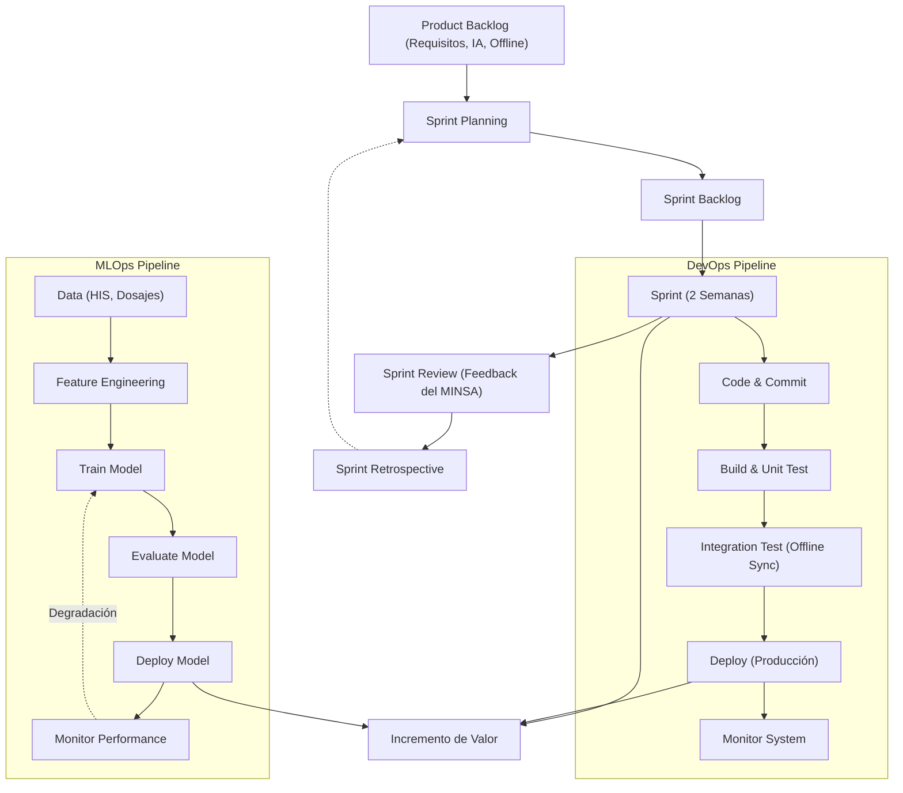

# Entregable — Semana 2: Selección y Justificación del Modelo de Proceso

**Curso:** Procesos de Software (2026-20)
**Proyecto:** Sistema Inteligente para Detección Temprana de Anemia Infantil en Zonas Rurales de Junín
**Equipo:**
| Integrante | Rol |
|---|---|
| Porras Veli Ricardo | Líder de Proyecto / Analista de Procesos |
| Auqui Huincho Tania | Diseñadora de Solución / Prototipado |
| Huamani Rodriguez Jean Piero | Ingeniero de Calidad / QA |

---

## SECCIÓN 1: CARACTERÍSTICAS DEL PROYECTO

| Factor | Situación del proyecto | Nivel: Bajo/Medio/Alto | Evidencia |
|---|---|---|---|
| Incertidumbre de requisitos | Media-Alta: requisitos funcionales base claros por norma técnica MINSA, pero componente IA, interacción WhatsApp y offline tienen incertidumbre | Alto | Norma técnica define tamizaje pero la implementación de IA y offline requiere experimentación |
| Complejidad técnica | Alta: integración de modelo predictivo IA, API WhatsApp, sincronización offline, múltiples actores | Alto | Componentes de ML, API externa, modo offline con sync, múltiples interfaces por rol |
| Cambios esperados | Se esperan cambios conforme se valide con personal de salud y se entrene el modelo IA | Alto | Retroalimentación del personal de salud, refinamiento del modelo predictivo |
| Riesgo tecnológico | Conectividad intermitente en zonas rurales de Junín, rendimiento del modelo IA, integración WhatsApp | Alto | Cobertura móvil variable en zonas rurales de Junín, API WhatsApp Business requiere verificación |
| Necesidad de retroalimentación | Alta: el personal de salud debe validar alertas, agenda, y predicciones del modelo | Alto | Entrevista confirmó que el proceso actual requiere ajustes según resultados |
| Frecuencia de entrega | Se necesita entregar funcionalidad progresivamente para validar con usuarios reales | Alto | Primero registro, luego agenda, luego IA, luego WhatsApp |
| Necesidad de integración | Alta: HIS existente, WhatsApp Business API, modelo IA, módulo offline | Alto | Múltples sistemas y fuentes de datos |
| Participación del usuario | Alta: personal de salud, actores comunitarios y familias son actores clave | Alto | Entrevista mostró que el seguimiento depende de múltiples actores |
| Necesidad de automatización | Alta: CI/CD para despliegue, pipeline de datos para modelo IA, sincronización offline | Alto | Modo offline requiere sync automática, modelo IA requiere reentrenamiento periódico |
| Dependencia de datos | Alta: modelo predictivo necesita datos históricos de HIS, dosajes, adherencia | Alto | El modelo de IA se entrena con datos reales de hemoglobina, edad, altitud, adherencia |
| Necesidad de experimentación | Alta: el modelo predictivo de IA requiere experimentación con algoritmos y features | Alto | Selección de algoritmo (Random Forest vs Gradient Boosting), feature engineering |
| Criticidad del sistema | Alta: afecta seguimiento de salud infantil, errores pueden retrasar atención | Alto | El sistema apoya decisiones de salud; fallas afectan seguimiento de niños con anemia |

**Pregunta orientadora: ¿Cuáles son las 3 características más influyentes?**
1. **Incertidumbre de requisitos y experimentación:** Por ser un modelo basado en IA, no todo está definido desde el inicio.
2. **Riesgo tecnológico y de entorno:** La falta de conectividad requiere modos offline complejos y continuas validaciones.
3. **Necesidad de retroalimentación:** La aceptación por parte del personal de salud es crítica; sin feedback iterativo, el sistema no generará valor en el contexto rural.

---

## SECCIÓN 2: FACTORES DE SELECCIÓN

| Factor | Importancia | ¿Por qué afecta la selección? |
|---|---|---|
| Cambios de requisitos | Alta | El componente de IA y las reglas de tamizaje pueden evolucionar con nueva evidencia y retroalimentación del personal. |
| Retroalimentación | Alta | Se requiere validar predicciones de IA, alertas y notificaciones WhatsApp con personal de salud y familias. |
| Riesgo | Alta | Predicciones incorrectas del modelo podrían desprioritizar casos graves; conectividad intermitente puede perder datos. |
| Integración | Alta | El sistema debe integrarse con HIS existente, WhatsApp Business API, y funcionar offline/online. |
| Entrega incremental | Alta | Es esencial validar el registro nominal antes de agregar IA, y la IA antes de agregar WhatsApp. |
| Automatización | Alta | Pipeline de ML para reentrenamiento, CI/CD para despliegues rurales, sincronización offline automática. |
| Datos e IA | Alta | El modelo predictivo requiere pipeline de datos, experimentación, validación y monitoreo continuo (MLOps). |
| Conectividad intermitente | Alta | Funcionalidad offline obliga a diseñar sync robusta, lo que impacta arquitectura y testing. |

---

## SECCIÓN 3: COMPARACIÓN DE MODELOS

| Modelo | Adaptabilidad | Gestión de riesgos | Entrega incremental | Retroalimentación | Automatización | Adecuación al proyecto | TOTAL |
|---|---|---|---|---|---|---|---|
| Cascada | 1 | 2 | 1 | 1 | 2 | 1 | 8 |
| Incremental | 3 | 3 | 4 | 3 | 2 | 3 | 18 |
| Espiral | 4 | 5 | 3 | 4 | 2 | 3 | 21 |
| Scrum | 5 | 4 | 5 | 5 | 3 | 5 | 27 |
| Kanban | 4 | 3 | 4 | 4 | 3 | 3 | 21 |
| DevOps | 4 | 4 | 5 | 4 | 5 | 4 | 26 |
| MLOps/DataOps | 4 | 4 | 4 | 4 | 5 | 5 | 26 |

**Pregunta orientadora:** El mayor puntaje no necesariamente es el mejor modelo aisladamente, ya que debe considerarse la naturaleza del proyecto y la evidencia recolectada. En este caso, Scrum, DevOps y MLOps destacan en áreas clave, por lo que su combinación representa la mejor solución para nuestro escenario particular.

---

## SECCIÓN 4: MODELO SELECCIONADO

**Modelo Seleccionado: Scrum + DevOps + MLOps**

### Matriz de Decisión por Método Ponderado

Alternativas evaluadas:
- **Alt 1:** Scrum + DevOps + MLOps
- **Alt 2:** Kanban + DevOps + DataOps
- **Alt 3:** Incremental + Espiral (Tradicional)

| Criterio | Peso (%) | Alt 1 (Score) | Alt 1 (Ponderado) | Alt 2 (Score) | Alt 2 (Ponderado) | Alt 3 (Score) | Alt 3 (Ponderado) |
|---|---|---|---|---|---|---|---|
| Adaptabilidad | 15% | 5 | 5 × 0.15 = 0.75 | 4 | 4 × 0.15 = 0.60 | 3 | 3 × 0.15 = 0.45 |
| Gestión de riesgos | 15% | 4 | 4 × 0.15 = 0.60 | 3 | 3 × 0.15 = 0.45 | 4 | 4 × 0.15 = 0.60 |
| Entrega incremental | 15% | 5 | 5 × 0.15 = 0.75 | 4 | 4 × 0.15 = 0.60 | 3 | 3 × 0.15 = 0.45 |
| Retroalimentación | 15% | 5 | 5 × 0.15 = 0.75 | 4 | 4 × 0.15 = 0.60 | 3 | 3 × 0.15 = 0.45 |
| Integración | 10% | 4 | 4 × 0.10 = 0.40 | 4 | 4 × 0.10 = 0.40 | 3 | 3 × 0.10 = 0.30 |
| Automatización | 10% | 5 | 5 × 0.10 = 0.50 | 5 | 5 × 0.10 = 0.50 | 2 | 2 × 0.10 = 0.20 |
| Gestión de datos/IA | 10% | 5 | 5 × 0.10 = 0.50 | 4 | 4 × 0.10 = 0.40 | 2 | 2 × 0.10 = 0.20 |
| Participación del usuario | 10% | 5 | 5 × 0.10 = 0.50 | 3 | 3 × 0.10 = 0.30 | 3 | 3 × 0.10 = 0.30 |
| **TOTAL** | **100%** | | **4.75** | | **3.85** | | **2.95** |

**Justificación basada en la cadena argumentativa:**
Debido a que los requisitos del componente de inteligencia artificial presentan alta incertidumbre y se requiere retroalimentación frecuente del personal de salud rural para validar las predicciones, se necesita un proceso iterativo que permita entregar incrementos funcionales y adaptar las prioridades según los resultados obtenidos. Por ello, se selecciona Scrum como marco de trabajo para la gestión iterativa del desarrollo, complementado con prácticas DevOps para automatizar integración, pruebas y despliegue (crítico para la sincronización offline y actualizaciones en zonas rurales), y MLOps para gestionar el ciclo de vida del modelo predictivo de IA (entrenamiento, validación, monitoreo y reentrenamiento). Esta combinación asegura adaptabilidad frente a cambios, resiliencia tecnológica y una rápida entrega de valor.

---

## SECCIÓN 5: JUSTIFICACIÓN DETALLADA

**1. ¿Qué característica del proyecto hace necesario este modelo?**
La alta complejidad técnica de integrar IA y notificaciones en zonas con conectividad intermitente, sumado a la necesidad crítica de retroalimentación de los profesionales de salud.

**2. ¿Qué problema del proceso de desarrollo ayuda a resolver?**
Evita el desarrollo de características que luego no son utilizadas (desperdicio) y mitiga los riesgos técnicos de despliegue mediante automatización, resolviendo el problema de la falta de retroalimentación temprana.

**3. ¿Cómo permite entregar valor progresivamente?**
Mediante Sprints de 2 semanas, el equipo produce un incremento funcional validado, pasando de un registro offline a la agenda, luego alertas, modelo predictivo IA y finalmente el dashboard.

**4. ¿Cómo permite gestionar cambios?**
El Product Backlog se refina continuamente. Al final de cada Sprint, durante el Sprint Review, se captura el feedback que se incorpora en futuros Sprints, adaptándose sin alterar la arquitectura central.

**5. ¿Cómo permite controlar riesgos?**
Con Scrum, el riesgo se limita al ciclo de un Sprint (2 semanas). Con DevOps, el riesgo de fallas en producción se mitiga con CI/CD y pruebas automatizadas. Con MLOps, se reduce el riesgo de degradación del modelo mediante monitoreo y reentrenamiento.

**6. ¿Qué limitaciones presenta?**
Requiere una alta disciplina técnica (para mantener CI/CD y MLOps) y madurez por parte del equipo. Además, el personal de salud rural podría tener disponibilidad limitada para participar en los Sprint Reviews.

**7. ¿Por qué las otras alternativas fueron descartadas?**
La alternativa Espiral no ofrecía agilidad suficiente ni encajaba bien con prácticas modernas de ML. Kanban + DataOps es excelente para flujos continuos y mantenimiento, pero en esta etapa de construcción inicial requerimos el ritmo estructurado y las metas enfocadas que proveen los Sprints de Scrum.

---

## SECCIÓN 6: REPRESENTACIÓN DEL PROCESO

**Descripción para PowerDesigner (Modelado de Procesos BPNM/UML):**
En una representación en PowerDesigner, este proceso se documentaría utilizando un Diagrama de Actividades UML estructurado en tres _swimlanes_ principales:
1. **Gestión Ágil (Scrum):** Donde se orquestan los eventos de planificación, revisión y retrospectiva.
2. **Ingeniería de Software (DevOps):** Donde se modela el flujo automático desde el commit del desarrollador, disparando los jobs de build, pruebas estáticas de código, hasta el despliegue automático.
3. **Ingeniería de Datos (MLOps):** Donde se representa la ingesta de datos, experimentación con algoritmos, entrenamiento y publicación del artefacto predictivo.

---

## SECCIÓN 7: ENTREGAS INCREMENTALES DE VALOR

| Incremento | Funcionalidad | Resultado esperado | Valor generado | Indicador |
|---|---|---|---|---|
| 1 | Registro nominal validado + expediente digital | Información centralizada y confiable de cada niño | Eliminación de errores de registro, datos auditables | Registros sin error crítico / evaluados × 100 |
| 2 | Agenda automática de controles + alertas | Controles programados visibles, vencidos identificados | Mayor oportunidad en la atención | Cobertura oportuna de controles × 100 |
| 3 | Funcionalidad offline + sincronización | Registro sin pérdida de datos en zonas sin cobertura | Continuidad de servicio en zonas rurales | Registros sincronizados / pendientes × 100 |
| 4 | Notificaciones WhatsApp + reporte de barreras | Familias informadas, barreras reportadas tempranamente | Menor pérdida de seguimiento, mayor asistencia | Tasa de entrega y lectura de mensajes |
| 5 | Modelo predictivo de IA + priorización | Casos de alto riesgo priorizados en la agenda | Uso más eficiente del personal de salud | Precisión del modelo (casos confirmados / señalados × 100) |
| 6 | Dashboard de gestión territorial + indicadores | Supervisión en tiempo real por MINSA y gestión | Decisiones territoriales basadas en evidencia | Indicadores de cobertura y resultado actualizados |

---

## SECCIÓN 8: RIESGOS Y CONTROLES

| Riesgo | Causa | Impacto | Mecanismo de control |
|---|---|---|---|
| Cambios frecuentes en requisitos de IA | Incertidumbre en features y algoritmos del modelo predictivo | Retrabajo en el componente de ML | Desarrollo iterativo con sprints de 2 semanas; spike técnicos para exploración |
| Datos históricos insuficientes o de baja calidad | Errores previos en HIS, registros incompletos | Modelo de IA con baja precisión | Validación de datos previo a entrenamiento; pipeline de limpieza MLOps |
| Fallas de sincronización offline | Conflictos de datos, duplicados al sincronizar | Pérdida o corrupción de registros | Pruebas de integración automatizadas (DevOps); resolución de conflictos por timestamp |
| Baja adopción por personal de salud | Resistencia al cambio, capacitación insuficiente | Sistema no utilizado, sin valor | Retroalimentación frecuente (Scrum Review); capacitación iterativa por incremento |
| Fallas en API WhatsApp | Cambios en API, restricciones de Meta/WhatsApp | Notificaciones no entregadas | Monitoreo continuo (DevOps); canal alternativo SMS como fallback |
| Despliegue defectuoso en zonas rurales | Conectividad limitada, dispositivos heterogéneos | Interrupción del servicio | Pipeline CI/CD (DevOps); pruebas en entorno simulado de baja conectividad |
| Sesgo del modelo predictivo | Datos de entrenamiento no representativos | Subprioritización de ciertos grupos | Monitoreo de fairness (MLOps); validación cruzada por zona y grupo etario |

---

## SECCIÓN 9: HERRAMIENTAS DE SOPORTE

### 9.1 Matriz General de Herramientas

| Necesidad del proceso | Herramienta | ¿Qué actividad soporta? | Evidencia |
|---|---|---|---|
| Gestión del trabajo | GitHub Projects | Gestionar sprints, backlog, historias de usuario | Integrado con repositorio; equipo ya usa GitHub |
| Control de versiones | Git/GitHub | Gestionar código fuente y configuración | Estándar de la industria; equipo ya usa GitHub |
| Integración/Entrega continua | GitHub Actions | Automatizar build, test, deploy (DevOps) | Integrado con GitHub; gratuito para repos académicos |
| Calidad de código | SonarCloud | Analizar calidad y deuda técnica | Integración con GitHub Actions; gratuito para open source |
| Pruebas | Pytest + Selenium | Validar funcionalidad backend y frontend | Framework estándar Python; cobertura automatizada |
| Datos/IA-ML | Google Colab + MLflow | Experimentación ML y tracking de modelos (MLOps) | Colab gratuito con GPU; MLflow para versionado de modelos |
| Base de datos | PostgreSQL | Almacenar registros nominales, dosajes, controles | Robusta, open source, soporte offline sync |
| Notificaciones | WhatsApp Business API (via Twilio) | Enviar recordatorios y recibir respuestas | API verificable; Twilio simplifica integración |
| Documentación | Google Drive + Markdown | Compartir documentos con docente; documentar código | Equipo ya usa Drive; Markdown en GitHub |
| Prototipado | Figma | Diseñar interfaces de usuario | Gratuito; colaborativo |

### 9.2 Comparativa Ponderada de Herramientas

**Tabla 1: Herramientas de Gestión del Trabajo**
*Criterios:* Integración con Git (25%), Facilidad de uso (20%), Gestión de sprints (25%), Costo (15%), Colaboración (15%)

| Herramienta | Int. Git (25%) | Uso (20%) | Sprints (25%) | Costo (15%) | Colab. (15%) | TOTAL |
|---|---|---|---|---|---|---|
| **GitHub Projects** | 5 (1.25) | 4 (0.80) | 4 (1.00) | 5 (0.75) | 4 (0.60) | **4.40** |
| Jira | 4 (1.00) | 3 (0.60) | 5 (1.25) | 2 (0.30) | 5 (0.75) | **3.90** |
| Trello | 2 (0.50) | 5 (1.00) | 3 (0.75) | 4 (0.60) | 4 (0.60) | **3.45** |

**Tabla 2: Herramientas de CI/CD**
*Criterios:* Integración GitHub (30%), Facilidad de configuración (20%), Capacidad pipeline (25%), Costo (15%), Comunidad (10%)

| Herramienta | Int. GH (30%) | Config. (20%) | Pipeline (25%) | Costo (15%) | Comun. (10%) | TOTAL |
|---|---|---|---|---|---|---|
| **GitHub Actions** | 5 (1.50) | 5 (1.00) | 4 (1.00) | 5 (0.75) | 5 (0.50) | **4.75** |
| GitLab CI | 3 (0.90) | 4 (0.80) | 5 (1.25) | 4 (0.60) | 4 (0.40) | **3.95** |
| Jenkins | 3 (0.90) | 2 (0.40) | 5 (1.25) | 5 (0.75) | 4 (0.40) | **3.70** |

**Tabla 3: Plataformas de ML/IA**
*Criterios:* Facilidad de experimentación (25%), Tracking modelos (25%), Costo (20%), GPU disponible (15%), Integración CI/CD (15%)

| Herramienta | Experim. (25%) | Tracking (25%) | Costo (20%) | GPU (15%) | CI/CD (15%) | TOTAL |
|---|---|---|---|---|---|---|
| **Colab + MLflow** | 5 (1.25) | 5 (1.25) | 5 (1.00) | 4 (0.60) | 3 (0.45) | **4.55** |
| AWS SageMaker | 4 (1.00) | 5 (1.25) | 2 (0.40) | 5 (0.75) | 5 (0.75) | **4.15** |
| Azure ML | 4 (1.00) | 5 (1.25) | 2 (0.40) | 4 (0.60) | 5 (0.75) | **4.00** |

**Pregunta orientadora:** "El modelo de proceso determina qué herramientas necesita el equipo, no al revés."
*Justificación:* Debido a que nuestro modelo de proceso (Scrum + DevOps + MLOps) exige alta automatización y entrega iterativa rápida, fue imperativo seleccionar herramientas nativas (como GitHub Actions) que se acoplan perfectamente al control de versiones, agilizando los ciclos. Elegir la herramienta antes que el proceso nos hubiese limitado, por ejemplo, utilizando herramientas tradicionales que no soportan pipelines CI/CD automatizados.

---

## SECCIÓN 10: TRAZABILIDAD DE LA DECISIÓN

| Elemento | Evidencia del proyecto |
|---|---|
| Problema | Discontinuidad en prevención, medición, registro y seguimiento de anemia infantil en zonas rurales de Junín |
| Brecha | Errores de registro, seguimiento débil, inasistencia sin visibilidad, comunicación con familias limitada, indicadores incompletos |
| Necesidad de software | Sistema nominal validado con agenda, alertas, priorización IA, notificaciones WhatsApp, funcionalidad offline |
| Característica del proyecto | Alta incertidumbre en IA, alta complejidad técnica, múltiples integraciones, necesidad de retroalimentación, conectividad intermitente |
| Factor de selección | Adaptabilidad, retroalimentación, entrega incremental, automatización, gestión de datos/IA |
| Modelo seleccionado | Scrum + DevOps + MLOps |
| Forma de trabajo | Sprints de 2 semanas con incrementos funcionales; pipeline CI/CD para despliegue; pipeline MLOps para modelo predictivo |
| Incremento | Registro nominal → Agenda + alertas → Offline → WhatsApp → IA predictiva → Dashboard gestión |
| Resultado | Atención más oportuna, seguimiento continuo, priorización inteligente, comunicación efectiva con familias |
| Valor | Protección de la salud y desarrollo del niño: menor pérdida de seguimiento, mayor recuperación documentada, mejor uso de recursos limitados |

---

## PREGUNTAS DE ANÁLISIS

**1. ¿Qué características de su proyecto fueron determinantes para seleccionar el modelo de proceso?**
La alta incertidumbre en los requisitos del componente de IA (experimentación con algoritmos y features), la complejidad técnica de integrar múltiples sistemas (HIS, WhatsApp API, modo offline con sincronización), la necesidad crítica de retroalimentación del personal de salud rural para validar predicciones y alertas, y la dependencia de datos históricos de calidad variable para entrenar el modelo predictivo.

**2. ¿Por qué el modelo seleccionado es más adecuado que una alternativa tradicional?**
Un modelo tradicional (Cascada o Incremental puro) requeriría definir todos los requisitos del modelo de IA antes de iniciar el desarrollo, lo cual es inviable porque la selección de algoritmo, las features predictivas y los umbrales de riesgo dependen de la experimentación con datos reales. Además, un enfoque no iterativo no capturaría la retroalimentación del personal de salud hasta etapas tardías, arriesgando construir funcionalidades que no se ajustan al contexto rural de Junín.

**3. ¿Qué riesgos del proyecto son tratados por el modelo seleccionado?**
Scrum limita el impacto de cambios al ciclo de un Sprint (2 semanas), reduciendo el riesgo de retrabajo masivo. DevOps mitiga el riesgo de despliegues defectuosos en zonas rurales mediante CI/CD y pruebas automatizadas de sincronización offline. MLOps reduce el riesgo de degradación del modelo predictivo mediante monitoreo continuo, validación cruzada y reentrenamiento programado. Adicionalmente, los Sprint Reviews mitigan el riesgo de baja adopción al involucrar al personal de salud iterativamente.

**4. ¿Cómo se incorporará la retroalimentación de los usuarios?**
Mediante los Sprint Reviews al final de cada Sprint de 2 semanas, donde el personal de salud, actores comunitarios y gestión territorial evaluarán los incrementos funcionales. Las familias retroalimentarán indirectamente a través de las tasas de respuesta y confirmación de las notificaciones WhatsApp. El modelo de IA será evaluado por los profesionales de salud que validarán si los casos priorizados como "alto riesgo" coinciden con su criterio clínico.

**5. ¿Cómo se realizará la entrega incremental de valor?**
En 6 incrementos progresivos: (1) Registro nominal validado, (2) Agenda automática de controles + alertas, (3) Funcionalidad offline + sincronización, (4) Notificaciones WhatsApp + reporte de barreras, (5) Modelo predictivo de IA + priorización, (6) Dashboard de gestión territorial. Cada incremento es funcional por sí mismo y genera valor medible antes de que el siguiente se complete.

**6. ¿Qué actividades del proceso serán automatizadas?**
Con DevOps: build, pruebas unitarias e integración, despliegue a producción (CI/CD), monitoreo de sistema. Con MLOps: ingesta y limpieza de datos, entrenamiento y evaluación del modelo, despliegue del artefacto predictivo, monitoreo de performance y reentrenamiento. Con Scrum: gestión del backlog y tracking de sprints via GitHub Projects.

**7. ¿Qué herramientas soportarán el proceso?**
GitHub Projects (gestión de sprints), Git/GitHub (control de versiones), GitHub Actions (CI/CD), SonarCloud (calidad de código), Pytest + Selenium (pruebas), Google Colab + MLflow (experimentación y tracking de modelos IA), PostgreSQL (base de datos), WhatsApp Business API via Twilio (notificaciones), Google Drive + Markdown (documentación), Figma (prototipado).

**8. ¿Qué limitaciones presenta el modelo seleccionado?**
Requiere alta disciplina técnica del equipo para mantener los pipelines de CI/CD y MLOps. La disponibilidad del personal de salud rural para participar en Sprint Reviews puede ser limitada por la distancia y sus horarios. La combinación de tres enfoques (Scrum+DevOps+MLOps) tiene una curva de aprendizaje significativa. Además, la calidad del modelo de IA depende de la disponibilidad y calidad de los datos históricos del HIS, que pueden ser inconsistentes.

**9. ¿En qué situación cambiarían de modelo o complementarían el modelo seleccionado?**
Si el proyecto entrara en fase de mantenimiento y operación continua (post-lanzamiento), se podría migrar de Scrum a Kanban para gestionar el flujo continuo de mejoras y correcciones sin la estructura de sprints fijos. Si se identificara la necesidad de analítica avanzada más allá del modelo predictivo, se complementaría con DataOps para gestionar pipelines de datos a mayor escala.

**10. ¿Cómo demostrarán mediante indicadores que el modelo de proceso está contribuyendo al éxito del proyecto?**
Midiendo: velocidad del equipo (puntos de historia completados por sprint), frecuencia de despliegue exitoso (DevOps), cobertura de pruebas automatizadas, tiempo medio de recuperación ante fallas, precisión del modelo de IA en cada iteración de reentrenamiento, y satisfacción del personal de salud (recogida en Sprint Reviews). Estos indicadores de proceso se comparan con los indicadores de valor del proyecto (cobertura oportuna, adherencia, recuperación) para demostrar que la forma de trabajo produce resultados tangibles.

---

## CONCEPTOS APLICADOS

- ✅ **Modelo de proceso de software:** Definición de una estructura orquestada (Scrum+DevOps+MLOps) que rige las fases de desarrollo del proyecto.
- ✅ **Proceso incremental:** Evidenciado en la entrega secuencial de 6 partes funcionales que construyen el software pieza a pieza.
- ✅ **Proceso iterativo:** Evidenciado en los Sprints, permitiendo refinar y mejorar componentes previamente entregados basados en feedback.
- ✅ **Desarrollo ágil:** La filosofía detrás de Scrum; privilegiar individuos y respuesta al cambio sobre procesos rígidos.
- ✅ **Scrum:** Marco de trabajo empírico utilizado para el control del avance y gestión del equipo.
- ✅ **DevOps:** Prácticas de integración, automatización y despliegue técnico constante para mitigar el riesgo rural.
- ✅ **MLOps:** Conjunto de prácticas para gestionar y gobernar eficientemente el ciclo de vida del modelo de Machine Learning.
- ❌ **Kanban:** No seleccionado, aunque las herramientas soporten tableros tipo Kanban, no se utilizará este modelo de flujo puro debido a la necesidad de planificar iteraciones.
- ❌ **DataOps:** Cubierto parcialmente por MLOps, ya que nuestra prioridad es el modelo predictivo más que una explotación de big data para analítica general.
- ❌ **Lean:** No aplicado explícitamente en nuestro framework, aunque la eliminación de desperdicio es un efecto colateral.
- ✅ **Gestión de riesgos:** Componente crítico aplicado desde la selección del modelo y reflejado en el backlog de Scrum y MLOps.
- ✅ **Entrega incremental de valor:** Representado en la matriz de incrementos, entregando funcionalidad útil constantemente a la posta médica.
- ✅ **Adaptabilidad:** La capacidad del equipo de absorber los cambios dictaminados por los médicos de Junín.
- ✅ **Retroalimentación:** Pilar en las ceremonias Sprint Review para asegurar que el desarrollo se alinee con las necesidades de salud.
- ✅ **Integración y entrega continua:** Automatización aplicada (CI/CD) para garantizar despliegues libres de error hacia las zonas rurales.
- ❌ **Proceso tradicional:** Descartado completamente debido a sus profundas limitaciones frente a proyectos de alto nivel de incertidumbre algorítmica.
- ❌ **Prototipado:** No seleccionado como *modelo principal* de proceso de software, a pesar de usar prototipado UX/UI en etapas tempranas.
- ❌ **Proceso evolutivo:** En nuestro contexto específico fue superado y englobado por las prácticas ágiles de Scrum.
