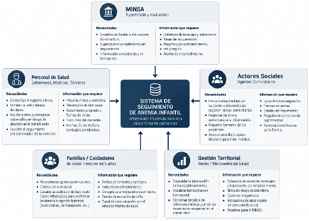
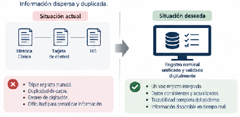
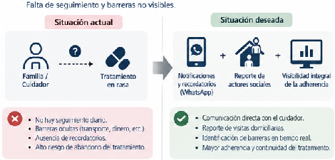
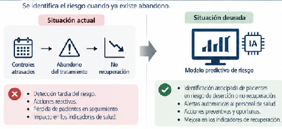
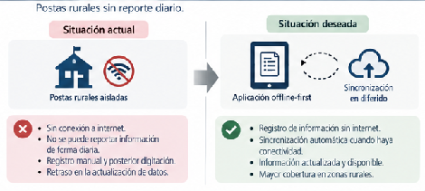
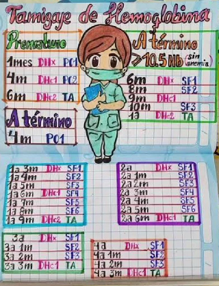
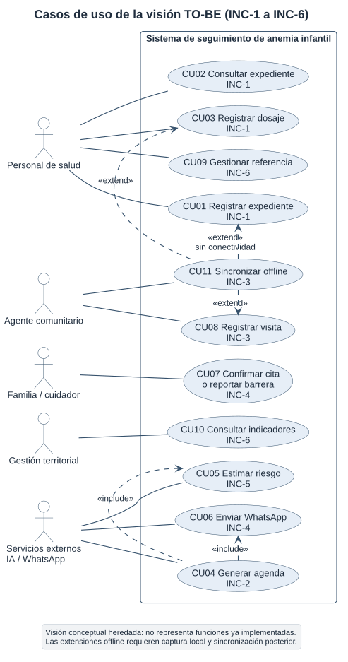
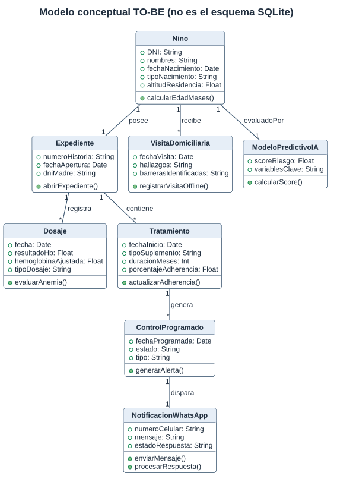

**Universidad Continental**

**Curso:** Procesos de Software — periodo 2026-20

**Unidad:** Diseño de procesos de software con entrega de valor

**Eje temático 1:** Enfoque de procesos de la organización

**ENTREGABLE SEMANA 1**

**Sistema Inteligente para la Detección Temprana de Anemia Infantil en Zonas Rurales de Junín**

**Integrantes del equipo:**

| Integrante | Rol en el proyecto |
| :---- | :---- |
| Porras Veli Ricardo | Ingeniero de Proceso |
| Auqui Huincho Tania | Ingeniero de Desarrollo y Prototipado |
| Huamani Rodriguez Jean Piero | Ingeniero de Calidad y Mejora del Proceso |

**Fecha:** 25 de septiembre de 2026 (versión revisada del entregable de la Semana 1)

---

**Índice**

1. Problema organizacional
2. Actores y necesidades
3. Proceso AS-IS (situación actual)
4. Brechas
5. Proceso TO-BE (con intervención del sistema)
6. Aporte del software
7. Valor organizacional (cadena de valor)
8. Indicadores
9. Preguntas de análisis
10. Síntesis de la argumentación y conexión con la Semana 2
11. Fuentes y referencias
- Anexo A. Detalle técnico del aporte del software
- Anexo B. Diagramas UML complementarios de la visión TO-BE
- Anexo C. Entrevista al personal de salud

**Índice de tablas:** Tabla 1. Situación actual y valor esperado · Tabla 2. Actores, necesidades y decisiones · Tabla 3. Brechas del proceso actual · Tabla 4. Trazabilidad brecha → mejora del TO-BE · Tabla 5. Elementos del TO-BE exigidos por la guía · Tabla 6. Aporte del software por actividad · Tabla 7. Cadena de valor · Tabla 8. Indicadores · Tabla 9. Cadena de argumentación · Tabla 10. Insumos para la Semana 2 · Tablas A.1 a A.6 (Anexo A).

**Índice de figuras:** Figura 1. Mapa de actores · Figura 2. Proceso AS-IS · Figuras 3 a 6. Brechas principales · Figura 7. Proceso TO-BE · Figura 8. Cadena de valor · Figura 9. Esquema de tamizaje · Figura 10. Casos de uso · Figura 11. Clases del dominio.

---

# 1. Problema organizacional

La región Junín presenta una alta prevalencia de anemia infantil, especialmente en las zonas rurales, donde factores geográficos, socioeconómicos y de infraestructura limitan el acceso a los servicios de salud. Pese a la norma técnica vigente del MINSA, la NTS N.° 213-MINSA/DGIESP-2024 (aprobada por la RM N.° 251-2024-MINSA, que derogó la NTS N.° 134-MINSA/2017/DGIESP, y modificada por la RM N.° 429-2024-MINSA), los establecimientos rurales tienen dificultades para realizar un seguimiento oportuno y continuo de las niñas y niños menores de cinco años.

La entrevista al personal de salud rural (Anexo C) evidenció que el tamizaje de hemoglobina se inicia alrededor de los seis meses y que el tratamiento con sulfato ferroso o hierro polimaltosado dura como mínimo seis meses continuos. Ese seguimiento se ve obstaculizado por un registro fragmentado —el "triple registro": historia clínica en papel, tarjeta de control del niño y digitación posterior en el HIS— que provoca pérdida de datos, retrasos en la programación de citas y escasa visibilidad sobre el abandono del tratamiento. Los agentes comunitarios visitan las viviendas cada semana, pero su labor no está integrada con la posta, lo que retrasa la respuesta ante las barreras de atención y pone en riesgo la meta clínica: diagnosticar al niño a los seis meses y lograr su recuperación al año de edad.

El problema **no se formula como ausencia de software**. El valor se pierde cuando una oportunidad preventiva, un dosaje o una indicación de tratamiento no se convierte en seguimiento y acción oportunos. Como referencia de magnitud, la ENDES 2025 estimó en 39,0 % la anemia en niñas y niños de 6 a 35 meses en Junín; esta cifra describe el contexto y no es un resultado atribuible al futuro sistema.

**Tabla 1.** Situación actual y valor esperado del cambio de proceso.

| Situación actual | Valor esperado |
| :---- | :---- |
| Detección del abandono cuando ya ocurrió | Anticipación y prevención del abandono |
| Triple registro manual y disperso | Registro nominal único e información integrada |
| Citas calculadas y recordadas a mano | Agenda oportuna y recordatorios a la familia |
| Barreras familiares invisibles | Barreras reportadas y gestionadas a tiempo |
| Indicadores tardíos e incompletos | Información oportuna para decidir |

# 2. Actores y necesidades

**Tabla 2.** Actores, necesidades y decisiones que deben tomar (formato de la Actividad 1 de la guía).

| Actor | Necesidad | Decisión que debe tomar |
| :---- | :---- | :---- |
| Niña o niño menor de 5 años | Atención preventiva, tamizaje y tratamiento oportunos y continuos | No toma decisiones clínicas; es el beneficiario final del proceso |
| Familia / cuidador | Recordatorios de citas, orientación nutricional y un canal accesible y de bajo costo para confirmar asistencia o reportar barreras | Acudir al control, administrar el suplemento en casa y comunicar barreras económicas o de transporte |
| Personal de salud (enfermeras, médicos, técnicos) | Registro clínico centralizado sin redundancia y alertas sobre niños en riesgo de abandonar el tratamiento | Evaluar, diagnosticar, indicar o ajustar el tratamiento y referir según su competencia y la norma |
| Agente comunitario (actor social) | Herramienta utilizable sin conexión para registrar visitas domiciliarias y reportar barreras | Priorizar qué familia visitar, registrar el consumo de suplementos y escalar la barrera detectada |
| Gestión territorial (redes / microredes) | Información consolidada y oportuna para reportar y coordinar | Priorizar supervisión, recursos y circuitos de referencia cuando el caso no se recupera en el primer nivel |
| MINSA | Estadísticas fiables e indicadores de cobertura y cumplimiento | Supervisar el cumplimiento del seguimiento y evaluar el desempeño del proceso |

**Pregunta orientadora — ¿Qué actor recibe el mayor valor de la mejora del proceso?** La niña o el niño, porque el resultado esperado (diagnóstico a los seis meses y recuperación al año) protege directamente su salud y su desarrollo. La familia es coproductora del valor y recibe acompañamiento; el personal de salud y el agente comunitario ganan capacidad de seguimiento; pero el beneficio final se materializa en el menor.

# 3. Proceso AS-IS (situación actual)

El proceso actual depende del esfuerzo manual del personal y de la comunicación directa entre actores. Es predominantemente **reactivo**: la desviación se detecta cuando el niño ya faltó al control o abandonó el tratamiento. Conforme a la regla de la guía, en este apartado **no se incorpora ninguna solución tecnológica**.

<!-- DIAG-001 pendiente -->

**Elementos del modelo AS-IS** (exigidos por la Actividad 2):

- **Inicio:** la familia acude al establecimiento con el niño (control, campaña, padrón o iniciativa propia).
- **Actores:** familia/cuidador, personal de salud, agente comunitario, gestión territorial y MINSA (un carril por actor).
- **Decisiones:** D1 ¿corresponde control según edad?; D2 ¿corresponde tamizaje?; D3 ¿presenta anemia?; D4 ¿el paciente se recuperó?
- **Fin:** derivación por otro motivo, cita preventiva entregada, caso cerrado por recuperación, o reporte evaluado por el MINSA.

**Descripción del flujo (actividades principales):**

1. La familia acude al establecimiento con el niño.
2. El personal registra los datos del niño y verifica antecedentes y controles pendientes.
3. Se decide si corresponde control según la edad; si no corresponde, se deriva según el motivo de atención.
4. Se decide si corresponde tamizaje; de corresponder, se realiza la prueba de hemoglobina, se interpreta con el ajuste por altitud y se registra el resultado.
5. Si no hay anemia, se indica suplementación preventiva y próximo control; si hay anemia, se diagnostica, se inicia el tratamiento con sulfato ferroso o hierro polimaltosado y se registra la fecha de inicio.
6. La atención se anota en la historia clínica, en la tarjeta de control y, posteriormente, se digita en el HIS (triple registro).
7. La familia administra el tratamiento en casa; el agente comunitario realiza visitas domiciliarias semanales, verifica el consumo del suplemento y reporta barreras de forma verbal o en papel.
8. El personal realiza el seguimiento periódico y evalúa si el niño se recuperó; si no, reevalúa, refuerza el tratamiento o refiere.
9. La gestión territorial consolida la información de los establecimientos y genera reportes para el MINSA, que supervisa y evalúa el desempeño.

**Problemas observados en el AS-IS:** (P1) agendamiento manual sin recordatorios; (P2) débil trazabilidad de la adherencia; (P3) triple registro con errores de digitación, duplicidad y demora; (P4) barreras familiares que permanecen ocultas hasta el abandono; (P5) capacidad limitada del agente comunitario, con carga manual y sin conexión; (P6) controles atrasados y pérdida de pacientes; (P7) cierre no siempre documentado en el HIS; (P8) circuito de referencia no trazable; (P9) indicadores incompletos y tardíos para la gestión.

# 4. Brechas

La guía exige un mínimo de cinco brechas en formato Proceso actual / Problema-brecha / Consecuencia. Se identifican seis, codificadas B1 a B6 para trazarlas en el TO-BE, en el aporte del software y en los incrementos de la Semana 2.

**Tabla 3.** Brechas del proceso actual.

| ID | Proceso actual | Problema / Brecha | Consecuencia |
| :---- | :---- | :---- | :---- |
| B1 | Triple registro manual: historia clínica, tarjeta de control y digitación en el HIS | No existe un registro nominal único y validado digitalmente | Errores de digitación, duplicidad y demora; el estado real del niño no es confiable |
| B2 | Agendamiento de controles calculado a mano por el personal | No se genera automáticamente la agenda según el esquema normativo ni se envían recordatorios | Controles fuera de la ventana normativa y citas olvidadas |
| B3 | Tratamiento administrado en el hogar durante seis meses | Las barreras (transporte, economía, olvido) permanecen ocultas hasta que el niño ya abandonó | Abandono silencioso del tratamiento y recuperación tardía o nula |
| B4 | Visita domiciliaria semanal del agente comunitario | Carga manual en papel, sin conexión y con capacidad limitada frente al volumen de familias | Cobertura insuficiente del seguimiento y demora en escalar barreras |
| B5 | Identificación del riesgo cuando el abandono ya ocurrió | No existe capacidad de anticipación ni de priorización de los casos más frágiles | Se interviene tarde y el personal no se concentra donde más se necesita |
| B6 | Postas rurales con cobertura móvil intermitente y consolidación posterior | La información no se registra ni reporta en el momento; los indicadores llegan incompletos | Pérdida de datos, reportes tardíos al MINSA y decisiones territoriales poco focalizadas |

Las figuras siguientes ilustran la comparación entre la situación actual y la deseada para cuatro de las brechas (B1, B3, B5 y B6), que son las que concentran la pérdida de valor.

# 5. Proceso TO-BE (con intervención del sistema)

El proceso mejorado mantiene las decisiones clínicas en manos del profesional e incorpora **únicamente** los mecanismos que resuelven las brechas de la sección 4: registro nominal validado, agenda automática según norma, notificaciones a la familia, apoyo estructurado a la visita domiciliaria, priorización asistida por un modelo predictivo y operación sin conexión.

**Tabla 4.** Trazabilidad brecha → mejora incorporada en el TO-BE.

| Brecha | Mejora del TO-BE | Quién ejecuta |
| :---- | :---- | :---- |
| B1 Sin registro nominal único | M1. Registro nominal único, validado y deduplicado; se elimina el triple registro | Personal de salud con apoyo del sistema |
| B2 Agenda manual sin recordatorios | M2. Plan de tratamiento y agenda de controles generados según el esquema normativo, por edad y tipo de nacimiento | Sistema (automático) |
| B3 Barreras ocultas | M3. Recordatorio por WhatsApp con confirmación de cita o reporte de barrera, que genera alerta | Sistema y familia |
| B4 Capacidad limitada del agente | M4. Visitas priorizadas y formulario estructurado de visita domiciliaria | Agente comunitario con apoyo del sistema |
| B5 Sin anticipación del riesgo | M5. Estimación del riesgo de abandono (score 0-100, explicable) que ordena la agenda | Sistema; decide el profesional |
| B6 Conectividad intermitente e indicadores tardíos | M6. Registro sin conexión con sincronización diferida e indicadores actualizados | Sistema |

<!-- DIAG-002 pendiente -->

**Tabla 5.** Elementos del TO-BE exigidos por la Actividad 4 de la guía.

| Elemento exigido | Cómo aparece en el TO-BE |
| :---- | :---- |
| 1. Entrada de información | Datos del niño, resultado del dosaje, respuesta de la familia y registro de la visita domiciliaria (con o sin conexión) |
| 2. Actividades mejoradas | Registro nominal validado (M1), agenda normativa (M2), convocatoria por WhatsApp (M3), visita priorizada (M4) |
| 3. Decisiones | ¿Corresponde tamizaje?, ¿presenta anemia?, ¿requiere visita prioritaria?, ¿recuperado según protocolo? — todas humanas |
| 4. Intervención del software | Carril "Sistema": validación, agenda, estimación de riesgo, notificación, sincronización e indicadores |
| 5. Resultado | Seguimiento continuo, barreras gestionadas a tiempo y recuperación documentada del niño |
| 6. Generación de valor | Menor pérdida de seguimiento, atención oportuna y mejor uso del personal disponible |

**Cambios respecto del AS-IS:**

1. El registro pasa a ser nominal, único y validado; se elimina el triple registro.
2. El sistema genera el plan de tratamiento y la agenda de controles aplicando el esquema normativo según edad y tipo de nacimiento.
3. El sistema envía recordatorios a la familia por WhatsApp y recibe la confirmación de la cita o el reporte de una barrera.
4. El modelo predictivo estima el riesgo de abandono y genera alertas priorizadas para el personal y el agente comunitario.
5. El registro del expediente, del dosaje y de la visita domiciliaria funciona sin conexión y se sincroniza al recuperar la señal.
6. El estado de adherencia y de riesgo queda visible para la gestión territorial y el MINSA de forma oportuna.

La priorización asistida se limita al riesgo de abandono y de no recuperación; debe ser explicable, validada y supervisada. **El modelo no diagnostica ni prescribe, y el canal de WhatsApp no sustituye la visita domiciliaria cuando esta es necesaria.**

# 6. Aporte del software

El software **no reemplaza el proceso organizacional**: automatiza o asiste actividades concretas. La secuencia siguiente, equivalente al ejemplo de la guía, muestra dónde interviene:

Datos del niño → Registro (**software**: validación M1) → Programación de controles (**software**: agenda M2) → Tamizaje (humano, con registro asistido) → Estimación de riesgo (**software**: M5) → Recordatorio y reporte de barrera (**software**: M3) → Decisión del profesional (humana) → Visita o control (humano, con apoyo M4 y M6) → Indicadores (**software**) → Valor.

**Tabla 6.** Aporte del software por actividad organizacional (formato de la Actividad 5 de la guía).

| Actividad organizacional | ¿Interviene software? | ¿Cómo aporta? |
| :---- | :---- | :---- |
| Registrar al niño y abrir expediente | Sí (automatiza) | Registro nominal único con validación y deduplicación; elimina el triple registro |
| Programar controles y tamizajes | Sí (automatiza) | Aplica el esquema normativo según edad y tipo de nacimiento y genera la agenda |
| Convocar a la familia al control | Sí (asiste) | Recordatorio, confirmación de cita y reporte de barrera por WhatsApp |
| Realizar el tamizaje de hemoglobina | Sí (asiste) | Presenta antecedentes, captura el resultado y aplica el ajuste por altitud; la medición es humana |
| Diagnosticar e indicar tratamiento | Sí (solo apoyo) | Muestra la información consolidada; la decisión y la firma son del profesional |
| Administrar el suplemento en el hogar | No | Solo entrega instrucciones y recordatorios; la acción es de la familia |
| Realizar la visita domiciliaria | Sí (asiste) | Prioriza a quién visitar y ofrece un formulario estructurado; el contacto es humano |
| Priorizar casos con riesgo de abandono | Sí (modelo predictivo) | Estima un score de riesgo 0-100 con explicabilidad (SHAP) y ordena la agenda; no diagnostica ni decide |
| Registrar y operar sin conexión | Sí (funcionalidad offline) | Captura local cifrada y sincronización diferida con resolución de conflictos |
| Gestionar la referencia hasta su cierre | Sí (asiste) | Mantiene estados, responsables y alertas de atraso hasta el cierre documentado |
| Consolidar información y supervisar | Sí (automatiza) | Calcula indicadores y expone excepciones para la decisión territorial y el reporte al MINSA |

El detalle técnico de estos aportes (esquema normativo integrado en el motor de reglas, variables del modelo predictivo, mensajes de WhatsApp y requisito de operación sin conexión) se presenta en el Anexo A para mantener este documento breve, como pide la guía.

# 7. Valor organizacional (cadena de valor)

La guía pide construir la cadena **Entrada → Actividad → Resultado → Decisión → Acción → Valor**, bajo la relación *actividad mejorada → mejor resultado → valor organizacional*.

<!-- DIAG-003 pendiente -->

**Tabla 7.** Cadena de valor del proceso TO-BE.

| Eslabón | Contenido en el proyecto |
| :---- | :---- |
| Entrada | Datos del niño registrados en la posta o en la visita domiciliaria, con o sin conexión |
| Actividad | El motor de reglas identifica los controles pendientes y el modelo predictivo estima el riesgo de abandono |
| Resultado | Agenda priorizada y alertas con nivel de riesgo, disponibles para el personal y el agente comunitario |
| Decisión | El profesional evalúa si el caso requiere intervención domiciliaria o sigue el flujo rutinario de tamizaje |
| Acción | Visita domiciliaria y gestión de la barrera en los casos de riesgo alto; atención y tamizaje estándar en los rutinarios; en ambos casos con aviso previo a la familia por WhatsApp |
| Valor | Atención continua y oportuna que se traduce en la recuperación confirmada del niño dentro del plazo clínico esperado |

**Relaciones actividad mejorada → resultado → valor:**

- Registro validado → información confiable → decisiones con menor riesgo de error.
- Agenda automática y alerta → seguimiento humano oportuno → menor pérdida de contacto.
- Modelo predictivo → priorización explicable de casos frágiles → uso más eficiente del personal disponible.
- Notificación por WhatsApp → recordatorio de bajo costo y alto alcance → más citas confirmadas y reporte temprano de barreras.
- Funcionalidad offline → ningún registro se pierde por falta de cobertura → datos completos para decidir y auditar.
- Referencia cerrada → coordinación verificable → menor incertidumbre en el circuito.
- Indicadores oportunos → acción correctiva territorial → mejor uso de la capacidad limitada.

# 8. Indicadores

Se definen catorce indicadores en las cuatro categorías que exige la guía (mínimo seis). No se fijan metas numéricas: toda meta requerirá una línea base medida y aprobación institucional.

**Tabla 8.** Indicadores clasificados por tipo.

| Tipo | Indicador | Qué mide | Cómo se mide |
| :---- | :---- | :---- | :---- |
| Proceso | Cobertura oportuna de medición/control | Atención dentro de la ventana normativa | Atendidos oportunamente ÷ elegibles × 100 |
| Proceso | Demora de controles vencidos | Retraso del proceso | Mediana de días entre fecha prevista y realizada |
| Proceso | Cumplimiento de visitas priorizadas | Ejecución del seguimiento comunitario | Visitas oportunas ÷ visitas priorizadas × 100 |
| Proceso | Cierre oportuno de referencias | Continuidad entre actores | Referencias cerradas a tiempo ÷ referencias vencibles × 100 |
| Producto | Registros que superan validaciones | Calidad del dato tras eliminar el triple registro | Registros sin error crítico ÷ evaluados × 100 |
| Producto | Sincronización offline exitosa | Fiabilidad en zonas sin cobertura | Registros sincronizados ÷ pendientes × 100 |
| Producto | Disponibilidad operativa | Uso de funciones esenciales | Minutos disponibles ÷ minutos programados × 100 |
| Producto | Tasa de entrega de notificaciones WhatsApp | Alcance efectivo del recordatorio | Mensajes entregados y leídos ÷ enviados × 100 |
| Producto | Precisión del modelo predictivo | Calidad de la priorización de riesgo | Casos de alto riesgo confirmados ÷ señalados por el modelo × 100 |
| Resultado | Tasa de adherencia al tratamiento | Continuidad del esquema terapéutico | Niños que recogen suplementos en fecha ÷ diagnosticados × 100 |
| Resultado | Recuperación documentada al año | Resultado clínico confirmado | Recuperados ÷ casos con control de cierre válido × 100 |
| Valor | Pérdida de seguimiento | Casos sin atención ni cierre | Casos sobre umbral sin cierre ÷ casos con seguimiento × 100 |
| Valor | Oportunidades recuperadas | Atención lograda tras una acción de seguimiento | Vencidos atendidos tras acción ÷ vencidos con acción × 100 |
| Valor | Prevalencia de anemia en el ámbito atendido | Evolución poblacional del problema | Fuente oficial comparable (ENDES / HIS); no atribuible solo al sistema |

# 9. Preguntas de análisis

## 9.1 ¿Qué problema del proceso organizacional se pretende resolver?

La discontinuidad, la demora y la coordinación poco confiable en la prevención, medición, registro, seguimiento y recuperación de la anemia infantil en las zonas rurales de Junín. Según la entrevista, el proceso depende de un triple registro manual que genera errores de digitación, duplicidad y demoras; los agentes comunitarios visitan cada semana a las familias sin herramientas digitales, y las barreras de adherencia permanecen ocultas hasta que el niño ya abandonó el tratamiento. El problema no es la ausencia de software, sino la pérdida de oportunidades preventivas cuando un dosaje o una indicación no se convierte en seguimiento y acción oportunos.

## 9.2 ¿Qué actividad del AS-IS genera mayor pérdida de valor?

El seguimiento posterior a la indicación del tratamiento (pasos 7 y 8 del AS-IS; brechas B3, B4 y B5). La meta es que un niño diagnosticado a los seis meses se recupere al año, lo que exige seis meses continuos de suplementación con controles periódicos de hemoglobina. Cuando ese seguimiento falla —por inasistencia, barreras familiares no detectadas, capacidad limitada del personal o errores de registro— la medición y la prescripción pierden la mayor parte de su valor clínico. Los agentes comunitarios intentan cubrir esa brecha con visitas semanales, pero su capacidad es insuficiente frente al volumen de familias.

## 9.3 ¿Qué cambia concretamente en el TO-BE?

Se crea un circuito nominal validado con agenda automatizada, tareas priorizadas, registro de barreras, referencias cerrables e indicadores oportunos (mejoras M1 a M6, Tabla 4). Las decisiones clínicas siguen siendo profesionales. Los cuatro mecanismos de apoyo nuevos son:

- **Motor de reglas normativo:** automatiza el esquema de tamizaje y suplementación (DHx, DHc1, DHc2, SF1-SF6, PO1, PO2, TA) según edad y tipo de nacimiento.
- **Notificaciones por WhatsApp:** recordatorios de bajo costo con confirmación de cita y reporte de barreras.
- **Modelo predictivo:** estima el riesgo de abandono mediante un score 0-100 y prioriza la agenda, con explicabilidad SHAP.
- **Funcionalidad offline:** permite registrar expediente, dosaje, visitas y barreras sin conexión, con sincronización al recuperar la señal.

## 9.4 ¿Qué actividades serán automatizadas o mejoradas mediante software?

- **Automatizadas:** validación y deduplicación de registros, generación de la agenda según la norma, sincronización offline, estados de referencia y cálculo de indicadores.
- **Asistidas (mejoradas):** convocatoria a la familia (WhatsApp), registro del tamizaje, registro de la visita domiciliaria y priorización de casos (modelo predictivo).
- **No automatizadas:** diagnóstico y prescripción, administración del suplemento en el hogar y el contacto humano de la visita domiciliaria.

## 9.5 ¿Cómo se demostrará que el nuevo proceso genera valor?

Comparando contra una línea base los indicadores de la Tabla 8: cobertura oportuna de controles, demora entre la fecha programada y la realizada, cierre de visitas y referencias, calidad de los datos, adherencia y recuperación documentada. Una alerta sin acción posterior ni cierre no demuestra valor. Para los componentes nuevos se medirá además la tasa de entrega y lectura de los mensajes de WhatsApp, la precisión del modelo frente a la validación profesional y el porcentaje de registros sincronizados.

# 10. Síntesis de la argumentación y conexión con la Semana 2

El criterio clave de la guía exige justificar el proceso con la cadena **problema organizacional → necesidad de cambio → proceso TO-BE → necesidad de software → resultado → valor → indicador**, y no con afirmaciones como "se utilizará Scrum, DevOps o IA". La Tabla 9 resume esa cadena para el proyecto.

**Tabla 9.** Cadena de argumentación del proyecto.

| Eslabón | Evidencia en este entregable |
| :---- | :---- |
| Problema organizacional | Seguimiento discontinuo de la anemia infantil en zonas rurales de Junín (§1) |
| Necesidad de cambio | Seis brechas B1-B6, con la mayor pérdida de valor en el seguimiento posterior al tratamiento (§4, §9.2) |
| Proceso TO-BE | Circuito nominal con mejoras M1-M6 y decisiones clínicas humanas (§5) |
| Necesidad de software | Registro validado, agenda normativa, WhatsApp, apoyo a la visita, modelo predictivo, operación offline e indicadores (§6) |
| Resultado | Seguimiento continuo, barreras gestionadas a tiempo y recuperación documentada (§7) |
| Valor | Menor pérdida de seguimiento y atención oportuna del niño (§7) |
| Indicador | Catorce indicadores de proceso, producto, resultado y valor (§8) |

**Tabla 10.** Insumos que este entregable deja preparados para la Semana 2 (Eje 2: Modelo de procesos de software).

| Resultado de la Semana 1 | Uso en la Semana 2 |
| :---- | :---- |
| Mejoras M1-M6 del TO-BE | Se convierten en los seis incrementos INC-1 a INC-6 (registro nominal, agenda, offline, WhatsApp, modelo predictivo, tablero) |
| Componente predictivo con variables aún no validadas | Característica de alta incertidumbre y experimentación que condiciona el modelo de proceso (MLOps) |
| Conectividad intermitente (B6) | Riesgo tecnológico que exige probar la sincronización en cada entrega (DevOps) |
| Necesidad de validación del personal de salud | Retroalimentación frecuente con el usuario (Scrum) |
| Indicadores de la Tabla 8 | Indicadores de valor de cada incremento |

Estado de implementación a la fecha de esta revisión: el producto mínimo viable del curso implementa el **INC-1** (registro nominal validado y expediente digital, con dosajes y reporte) como aplicación web en Python con Flask y SQLite, bajo arquitectura hexagonal (carpeta `anemia_junin/` del repositorio). Las demás mejoras del TO-BE (agenda, offline, WhatsApp, modelo predictivo y tablero) permanecen como visión y se planifican en los incrementos siguientes.

# 11. Fuentes y referencias

- MINSA. NTS N.° 134-MINSA/2017/DGIESP — Norma técnica para el manejo terapéutico y preventivo de la anemia (**derogada** por la RM N.° 251-2024-MINSA; se cita solo como antecedente). <https://bvs.minsa.gob.pe/local/MINSA/4190.pdf>
- MINSA. RM N.° 251-2024-MINSA, que aprueba la NTS N.° 213-MINSA/DGIESP-2024 (**norma vigente**) y deroga la NTS N.° 134-MINSA/2017/DGIESP: <https://www.gob.pe/institucion/minsa/normas-legales/5440166-251-2024-minsa>; y RM N.° 429-2024-MINSA, que la modifica: <https://www.gob.pe/institucion/minsa/normas-legales/5670414-429-2024-minsa>
- Plan Multisectorial de Lucha contra la Anemia 2024-2030 (DS N.° 002-2024-SA): <https://cdn.www.gob.pe/uploads/document/file/5735214/5093832-decreto-supremo-n-002-2024-sa%282%29.pdf?v=1706299424>
- Gobierno Regional de Junín. Informe de resultados institucionales: <https://www.regionjunin.gob.pe/documentos_region/2026/2026-02-20/GRJ-172953a0409b63c23ea34470753707ceb60228.pdf>
- INEI. ENDES 2025 — Indicadores de resultados de los programas presupuestales: <https://proyectos.inei.gob.pe/endes/2025/ppr/Informe_Indicadores_de_Resultados_de_los_Programas_Presupuestales_ENDES_2025.pdf>
- Reglamento de la Ley N.° 29733, Ley de Protección de Datos Personales: <https://www.gob.pe/institucion/anpd/normas-legales/6554453-16-2024-jus>
- Entrevista a personal de salud de una posta rural de Junín (2026, comunicación personal; establecimiento omitido por privacidad). Anexo C.
- Guía de trabajo semana 1 — Eje 1: Enfoque de procesos de la organización (documento del curso).

# Anexo A. Detalle técnico del aporte del software

## A.1 Esquema normativo integrado en el motor de reglas

El motor de reglas del TO-BE incorpora el esquema de tamizaje y suplementación para generar la agenda y validar los registros. Las tablas siguientes transcriben el esquema utilizado en el establecimiento entrevistado (Figura 9). El bloque de suplementación a los cuatro meses corresponde al niño nacido a término.

*Nota de coherencia normativa:* la norma vigente es la NTS N.° 213-MINSA/DGIESP-2024 (RM 251-2024-MINSA, modificada por la RM 429-2024-MINSA), que derogó la NTS N.° 134-MINSA/2017/DGIESP. Las Tablas A.1 a A.4 describen un esquema operativo local del establecimiento entrevistado, compatible con la NTS 213-2024: el tamizaje del niño a término se inicia a los 6 meses y el punto de corte de la Tabla A.3 (Hb ≥ 10,5 g/dL) coincide con el de la norma vigente para 6 a 23 meses. El PMV no toma los umbrales de este esquema, sino de la NTS 213-2024: Hb ajustada por altitud de 10,5 g/dL para 6 a 23 meses y de 11,0 g/dL para 24 a 59 meses (`anemia_junin/config/normativa_v1.json`). El calendario de dosajes y suplementación (DHx, DHc1, DHc2, PO1, PO2, SF1 a SF6, TA) se transcribe tal como lo aplica el establecimiento; no se ha contrastado fila por fila con el texto de la norma.

**Tabla A.1.** Niño prematuro.

| Edad | Dosaje | Suplementación |
| :---- | :---- | :---- |
| 1 mes | DHx | PO1 |
| 4 meses | DHc1 | PO2 |
| 6 meses | DHc2 | TA |

**Tabla A.2.** Niño a término.

| Edad | Dosaje | Suplementación |
| :---- | :---- | :---- |
| 4 meses | — | PO1 |

**Tabla A.3.** Niño a término con Hb ≥ 10,5 g/dL (sin anemia).

| Edad | Dosaje | Suplementación |
| :---- | :---- | :---- |
| 6 meses | DHx | SF1 |
| 8 meses | — | SF2 |
| 9 meses | DHc1 | — |
| 10 meses | — | SF3 |
| 1 año | DHc2 | TA |

**Tabla A.4.** Seguimiento por año de edad (transcripción completa del esquema).

| Edad | Dosaje | Suplementación |
| :---- | :---- | :---- |
| 1 a 3 m | DHx | SF1 |
| 1 a 4 m | — | SF2 |
| 1 a 5 m | — | SF3 |
| 1 a 6 m | DHc1 | SF4 |
| 1 a 7 m | — | SF5 |
| 1 a 8 m | — | SF6 |
| 1 a 9 m | DHc2 | TA |
| 2 a | DHx | SF1 |
| 2 a 1 m | — | SF2 |
| 2 a 2 m | — | SF3 |
| 2 a 3 m | — | SF4 |
| 2 a 4 m | — | SF5 |
| 2 a 5 m | — | SF6 |
| 2 a 6 m | DHc1 | TA |
| 3 a | DHx | SF1 |
| 3 a 1 m | — | SF2 |
| 3 a 2 m | — | SF3 |
| 3 a 3 m | DHc1 | TA |
| 4 a | DHx | SF1 |
| 4 a 1 m | — | SF2 |
| 4 a 2 m | — | SF3 |
| 4 a 3 m | DHc1 | TA |

*Abreviaturas:* DHx = tamizaje inicial · DHc = control de dosaje · SF = sulfato ferroso · PO = hierro preventivo · TA = término de atención.

## A.2 Modelo predictivo (estimación de riesgo)

El TO-BE prevé un modelo de clasificación supervisada (Random Forest o Gradient Boosting) entrenado con datos históricos del HIS. Su objetivo no es diagnosticar ni prescribir, sino emitir un score de riesgo (0-100) que permita al personal priorizar a los pacientes con mayor probabilidad de abandonar el tratamiento. Las predicciones deben ser interpretables mediante valores SHAP. La selección definitiva de algoritmo y variables se hará por experimentación en el incremento correspondiente (INC-5).

**Tabla A.5.** Variables candidatas del modelo.

| Variable | Tipo | Justificación | Fuente |
| :---- | :---- | :---- | :---- |
| Edad del niño (meses) | Numérica | El rango de 6 a 35 meses concentra el riesgo | Norma técnica |
| Nivel de hemoglobina previo | Numérica | Predictor directo de la evolución | Registro clínico |
| Altitud de residencia | Numérica | Modifica los valores de referencia de hemoglobina | Norma técnica |
| Adherencia al tratamiento (%) | Numérica | Confirmada en la entrevista; condiciona el alta | Entrevista / app |
| Días desde el último control | Numérica | Mide el aislamiento clínico efectivo del paciente | Registro HIS |
| Tipo de nacimiento | Categórica | Los esquemas de suplementación difieren | Norma técnica |
| N.° de visitas domiciliarias | Numérica | La frecuencia del seguimiento reduce el abandono | Entrevista / app |
| Zona / distrito rural | Categórica | Incidencia diferenciada por territorio | ENDES 2025 |
| Historial de anemia previa | Binaria | Reincidencia biológica y de comportamiento | Registro clínico |

**Tabla A.6.** Matriz de ponderación de variables. Puntaje = (Relevancia clínica × 0,40) + (Disponibilidad del dato × 0,30) + (Capacidad predictiva × 0,30), en escala de 1 a 5.

| Variable | Relevancia (40 %) | Disponibilidad (30 %) | Cap. predictiva (30 %) | Puntaje |
| :---- | :---- | :---- | :---- | :---- |
| Hemoglobina previa | 5 | 5 | 5 | 5,00 |
| Adherencia al tratamiento | 5 | 3 | 5 | 4,40 |
| Edad del niño | 4 | 5 | 4 | 4,30 |
| Días desde el último control | 4 | 5 | 4 | 4,30 |
| Tipo de nacimiento | 4 | 4 | 3 | 3,70 |
| Altitud de residencia | 3 | 5 | 3 | 3,60 |
| Visitas domiciliarias | 3 | 3 | 4 | 3,30 |

Las variables "zona / distrito rural" e "historial de anemia previa" no se ponderaron en esta fase; su ponderación se realizará con los datos disponibles en el INC-5.

## A.3 Interacción mediante notificaciones de WhatsApp

Conectado mediante la API oficial de WhatsApp Business, el sistema automatiza el vínculo con la familia:

- **Recordatorio:** «Sra. María, su hijo Juan tiene control de hemoglobina programado para el 15/10. ¿Confirma asistencia? Responda SÍ o NO». (Ejemplo ilustrativo con datos ficticios.)
- **Reporte de barrera:** si la familia responde que no puede acudir por falta de pasaje, el sistema activa una alerta en el tablero del agente comunitario para coordinar una visita o reprogramar la cita.

## A.4 Requisito no funcional: funcionamiento sin conexión

Las zonas rurales de Junín carecen de señal constante. El aplicativo de campo seguirá una arquitectura *offline-first* (aplicación web progresiva con base de datos local). Los agentes comunitarios registrarán las visitas y el consumo de suplementos localmente y, al regresar a la posta o encontrar cobertura, los datos se sincronizarán cifrados con el servidor central. Cada registro conserva la fecha y hora real de captura para no distorsionar los indicadores de oportunidad.

# Anexo B. Diagramas UML complementarios de la visión TO-BE

Estos diagramas representan la **visión completa** del sistema (incrementos INC-1 a INC-6) y no el alcance del PMV actual. Se conservan porque formalizan los actores, casos de uso y clases que el equipo definió en esta semana.

## B.1 Diagrama de casos de uso

<!-- DIAG-004 pendiente -->

## B.2 Diagrama de clases del dominio

<!-- DIAG-005 pendiente -->

# Anexo C. Entrevista al personal de salud

La transcripción de la entrevista realizada al personal de salud de una posta rural de Junín se encuentra en el archivo `anexos/Entrevista.md`, que acompaña a este entregable. Los hallazgos utilizados en este documento son: inicio del tamizaje hacia los seis meses; tratamiento continuo de al menos seis meses con sulfato ferroso o hierro polimaltosado; meta de recuperación al año; visitas domiciliarias semanales del actor social; y registro simultáneo en historia clínica, tarjeta de control y sistema de información, que sirve de base a la supervisión del MINSA.
