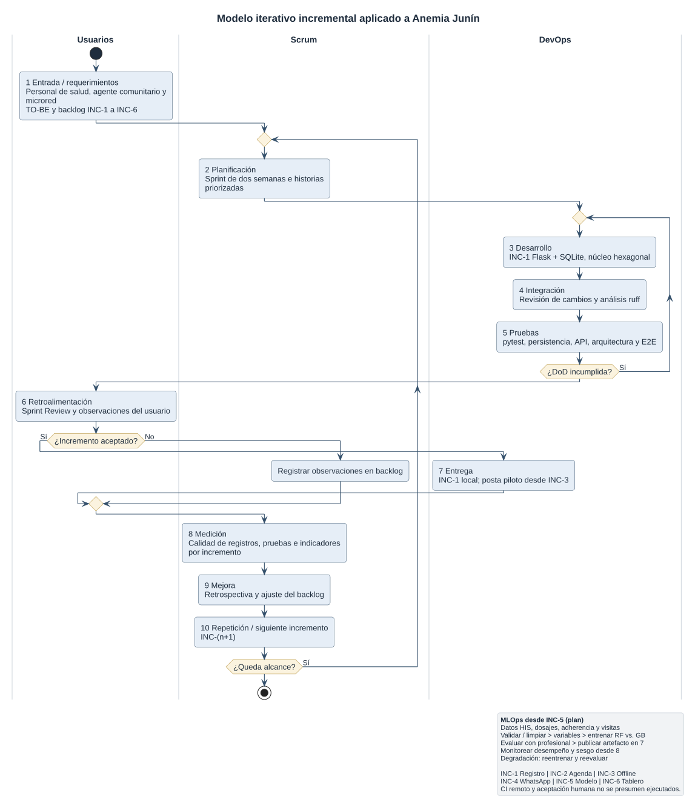

**Universidad Continental**

**Curso:** Procesos de Software — periodo 2026-20

**Unidad:** Diseño de procesos de software con entrega de valor

**Eje temático 2:** Modelo de procesos de software

**ENTREGABLE SEMANA 2**

**Selección y justificación del modelo de proceso**

**Proyecto:** Sistema Inteligente para la Detección Temprana de Anemia Infantil en Zonas Rurales de Junín

**Integrantes del equipo:**

| Integrante | Rol en el proyecto |
| :---- | :---- |
| Porras Veli Ricardo | Ingeniero de Proceso |
| Auqui Huincho Tania | Ingeniero de Desarrollo y Prototipado |
| Huamani Rodriguez Jean Piero | Ingeniero de Calidad y Mejora del Proceso |

**Fecha:** 25 de septiembre de 2026 (versión revisada del entregable de la Semana 2)

---

**Índice**

0. Punto de partida: el TO-BE de la Semana 1
1. Características del proyecto
2. Factores de selección
3. Comparación de modelos
4. Modelo seleccionado
5. Justificación
6. Representación del proceso
7. Entregas incrementales de valor
8. Riesgos y controles
9. Herramientas de soporte
10. Trazabilidad de la decisión
11. Caso de decisión (Actividad 10)
12. Preguntas de análisis
13. Reto de aplicación: defensa de cinco minutos
14. Conceptos de la guía aplicados al proyecto
15. Conexión con las Semanas 3 y 4
16. Fuentes

**Índice de tablas:** Tabla 1. Características del proyecto · Tabla 2. Factores de selección · Tabla 3. Matriz de comparación · Tabla 4. Evidencia de la comparación · Tabla 5. Composición de la decisión · Tabla 6. Matriz de decisión ponderada · Tabla 7. Cadena de argumentación · Tabla 8. Los diez elementos del proceso aplicados · Tabla 9. Incrementos de valor · Tabla 10. Riesgos y controles · Tabla 11. Herramientas de soporte · Tablas 12 a 14. Comparativas de herramientas · Tabla 15. Trazabilidad de la decisión · Tabla 16. Conceptos aplicados · Tabla 17. Insumos para las Semanas 3 y 4.

**Índice de figuras:** Figura 1. Aplicación del modelo de proceso al proyecto.

---

# 0. Punto de partida: el TO-BE de la Semana 1

La Semana 1 concluyó en un proceso TO-BE en el que el software interviene en seis mejoras concretas (M1-M6), cada una asociada a una brecha (B1-B6): registro nominal validado, agenda automática según la norma técnica, notificaciones a la familia por WhatsApp, apoyo a la visita domiciliaria, priorización mediante un modelo predictivo, y operación sin conexión con indicadores oportunos. Esas mejoras son la entrada de esta guía: de ellas se derivan las características del proyecto y, a partir de ellas, el modelo de proceso. La lógica seguida es la que propone la guía:

Proceso TO-BE → características de la solución → características del proyecto → factores de decisión → comparación de modelos → selección del modelo → aplicación al proyecto → entregas de valor.

# 1. Características del proyecto

**Tabla 1.** Matriz de características del proyecto (Actividad 1).

| Factor | Situación del proyecto | Nivel | Evidencia |
| :---- | :---- | :---- | :---- |
| Incertidumbre de requisitos | Los requisitos clínicos están acotados por la norma técnica, pero el componente de IA, la interacción por WhatsApp y el modo offline no lo están | Alto | El algoritmo, las variables predictivas y los umbrales de riesgo solo pueden definirse experimentando con datos reales (S1, Anexo A.2) |
| Complejidad técnica | Modelo predictivo, API de WhatsApp, sincronización offline con resolución de conflictos e interfaces diferenciadas por rol | Alto | Seis mejoras M1-M6 con componentes heterogéneos (S1, Tabla 4) |
| Cambios esperados | El proceso se ajusta según resultados y el modelo requerirá refinamiento tras cada validación con el personal | Alto | La entrevista describe reevaluaciones y ajustes del tratamiento según evolución (S1, Anexo C) |
| Riesgo tecnológico | Cobertura móvil intermitente, rendimiento incierto del modelo y dependencia de una API externa | Alto | Brecha B6 de la Semana 1; la API de WhatsApp Business requiere verificación de cuenta |
| Necesidad de retroalimentación | El personal de salud debe validar que los casos marcados como de alto riesgo coincidan con su criterio clínico | Alto | Sin esa validación la priorización no se adopta; el modelo "no diagnostica ni prescribe" (S1, §5) |
| Frecuencia de entrega | Hay que validar el registro nominal antes de añadir la agenda, y la agenda antes del modelo predictivo | Alto | Dependencia de datos entre mejoras: el modelo necesita registros nominales confiables |
| Necesidad de integración | HIS existente, API de WhatsApp Business, artefacto del modelo y módulo offline | Alto | Cuatro sistemas o componentes externos al núcleo de registro |
| Participación del usuario | Personal de salud, agentes comunitarios y familias intervienen directamente en el proceso | Alto | Seis actores con decisiones propias (S1, Tabla 2) |
| Necesidad de automatización | Despliegue hacia postas dispersas, sincronización automática y reentrenamiento periódico del modelo | Alto | Postas rurales distantes entre sí; no es viable desplegar ni reentrenar manualmente |
| Dependencia de datos | El modelo se entrena con datos históricos del HIS (hemoglobina, edad, altitud, adherencia) de calidad variable | Alto | El triple registro genera errores de digitación y duplicidad (S1, brecha B1) |
| Necesidad de experimentación | Selección de algoritmo (Random Forest frente a Gradient Boosting) e ingeniería de variables | Alto | Matriz de ponderación de variables aún preliminar (S1, Tabla A.6) |
| Criticidad del sistema | El sistema apoya decisiones sobre salud infantil; un fallo retrasa la atención de un niño con anemia | Alto | Meta clínica: diagnóstico a los 6 meses y recuperación al año (S1, §1) |

**Pregunta orientadora — ¿Cuáles son las tres características que más deberían influir en la selección del modelo?**

1. **La incertidumbre y la necesidad de experimentación del componente de IA**, porque impiden definir el alcance por adelantado.
2. **El riesgo tecnológico del entorno rural**, porque la conectividad intermitente condiciona la arquitectura y obliga a probar la sincronización en cada entrega.
3. **La necesidad de retroalimentación del personal de salud**, porque sin su validación la priorización no se usa y el sistema no genera valor.

# 2. Factores de selección

**Tabla 2.** Factores que condicionan la selección del modelo (Actividad 2; la guía exige al menos seis).

| Factor | Importancia | ¿Por qué afecta la selección? |
| :---- | :---- | :---- |
| Cambios de requisitos | Alta | El componente de IA y las reglas de tamizaje evolucionan con nueva evidencia; se necesita un proceso que admita replanificación frecuente sin retrabajo masivo |
| Retroalimentación | Alta | Hay que validar predicciones, alertas y mensajes con el personal y las familias; el proceso debe incluir puntos formales de revisión con el usuario |
| Riesgo | Alta | Una predicción errónea puede desplazar un caso grave y la conectividad intermitente puede perder datos; el proceso debe acotar el riesgo en ventanas cortas |
| Integración | Alta | HIS, WhatsApp y modelo deben integrarse de forma verificable; se requieren pruebas de integración automatizadas |
| Entrega incremental | Alta | El valor debe demostrarse antes de completar todo el sistema: primero registro, luego agenda, después IA |
| Automatización | Alta | El despliegue a postas dispersas y el reentrenamiento del modelo no pueden depender de pasos manuales |
| Datos e IA | Alta | El modelo exige pipeline de datos, experimentación versionada, validación y monitoreo continuo |
| Conectividad intermitente | Alta | La funcionalidad offline obliga a diseñar y probar la sincronización en cada incremento |

# 3. Comparación de modelos

*Aclaración previa.* En sentido estricto, solo Cascada, Incremental y Espiral son modelos de ciclo de vida. Scrum es un marco de trabajo de gestión; Kanban, un método de gestión del flujo; DevOps y MLOps/DataOps, conjuntos de prácticas de ingeniería. Se comparan en una misma tabla, como pide la guía, para evaluar qué capacidades aporta cada enfoque; la decisión de la sección 4 respeta esa distinción.

Escala: 1 = muy bajo · 2 = bajo · 3 = medio · 4 = alto · 5 = muy alto.

**Tabla 3.** Matriz de comparación de los siete enfoques (Actividad 3).

| Modelo | Adaptabilidad | Gestión de riesgos | Entrega incremental | Retroalimentación | Automatización | Adecuación al proyecto | Total |
| :---- | :---- | :---- | :---- | :---- | :---- | :---- | :---- |
| Cascada | 1 | 2 | 1 | 1 | 2 | 1 | 8 |
| Incremental | 3 | 3 | 4 | 3 | 2 | 3 | 18 |
| Espiral | 4 | 5 | 3 | 4 | 2 | 3 | 21 |
| Scrum | 5 | 4 | 5 | 5 | 3 | 5 | 27 |
| Kanban | 4 | 3 | 4 | 4 | 3 | 3 | 21 |
| DevOps | 4 | 4 | 5 | 4 | 5 | 4 | 26 |
| MLOps/DataOps | 4 | 4 | 4 | 4 | 5 | 5 | 26 |

**Tabla 4.** Evidencia que sustenta las puntuaciones de la Tabla 3.

| Modelo | Sustento de la puntuación frente a las características del proyecto |
| :---- | :---- |
| Cascada | Exige congelar requisitos al inicio y valida al final; incompatible con la incertidumbre del componente de IA (característica 1) |
| Incremental | Permite entregar primero el registro y después la IA, pero no prevé revisión formal con el usuario ni automatización |
| Espiral | Máxima gestión de riesgos por su análisis explícito en cada vuelta; costoso en documentación para un equipo de tres personas y sin automatización |
| Scrum | Sprints cortos con revisión formal junto al personal de salud (característica 3); no define cómo automatizar la entrega ni gobernar el modelo |
| Kanban | Flujo continuo útil para operación y mantenimiento; carece de cadencia de revisión y de planificación por incremento |
| DevOps | Automatiza integración, pruebas de sincronización y despliegue a postas dispersas (característica 2); no organiza la priorización con el usuario |
| MLOps/DataOps | Gobierna datos, experimentación, publicación y monitoreo del modelo (adecuación 5 para el componente de IA); cubre solo una parte del producto |

**Pregunta orientadora — ¿El modelo que obtiene la mayor puntuación es necesariamente el que debe seleccionarse?** No. La tabla mide capacidades aisladas y ningún enfoque cubre por sí solo las necesidades del proyecto. Scrum obtiene 27 puntos, pero su automatización es media (3): no resuelve el despliegue a postas dispersas ni el ciclo del modelo. DevOps (26) automatiza la entrega, pero no organiza la retroalimentación con el personal de salud. MLOps (26) gobierna el modelo, pero no el resto del producto. La lectura correcta no es "gana Scrum", sino que las tres necesidades críticas —gestión iterativa con el usuario, entrega automatizada y gobierno del modelo— corresponden a tres enfoques distintos y complementarios. Por eso la sección 4 evalúa combinaciones y no enfoques sueltos.

# 4. Modelo seleccionado

**Tabla 5.** Composición de la decisión por niveles.

| Nivel | Elemento | Función en el proyecto |
| :---- | :---- | :---- |
| Modelo de ciclo de vida | Iterativo e incremental | Base del proceso: el producto se construye en incrementos funcionales sucesivos que se refinan con la evidencia obtenida |
| Marco de gestión | Scrum | Organiza la iteración: sprints de dos semanas, backlog priorizado con el personal de salud y revisión formal con el usuario |
| Prácticas de ingeniería | DevOps | Automatizan construcción, pruebas (incluida la sincronización offline) y despliegue hacia las postas |
| Prácticas de datos y modelo | MLOps | Gobiernan el ciclo del modelo predictivo: datos, entrenamiento, publicación, monitoreo y reentrenamiento |
| Herramientas | GitHub, GitHub Actions, pytest, MLflow, etc. | Instrumentan las prácticas anteriores; se eligen después del proceso (sección 9) |

**Modelo de proceso seleccionado: desarrollo iterativo-incremental, gestionado con Scrum, con prácticas DevOps para la entrega y prácticas MLOps para el componente predictivo.**

**Respuesta a la pregunta central de la guía — ¿qué modelo permite desarrollar este proyecto con menor riesgo y mayor capacidad de entrega de valor?** La combinación seleccionada, porque acota el riesgo de requisitos inciertos en sprints de dos semanas, reduce el riesgo técnico del entorno rural con pruebas y despliegue automatizados, controla el riesgo propio del modelo con prácticas MLOps y entrega valor desde el primer incremento (registro nominal), sin esperar al componente de IA.

## 4.1 Matriz de decisión ponderada

Alternativas evaluadas — **Alt. 1:** iterativo-incremental + Scrum + DevOps + MLOps. **Alt. 2:** flujo continuo con Kanban + DevOps + DataOps. **Alt. 3:** enfoque tradicional, Incremental + Espiral sin prácticas de automatización.

*Justificación de los pesos:* los cuatro criterios con peso 15 % (adaptabilidad, gestión de riesgos, entrega incremental y retroalimentación) corresponden a las tres características determinantes de la sección 1. Los cuatro criterios con peso 10 % son habilitadores necesarios pero no determinantes.

**Tabla 6.** Matriz de decisión (puntaje 1-5 → puntaje ponderado).

| Criterio | Peso | Alt. 1 | Alt. 2 | Alt. 3 |
| :---- | :---- | :---- | :---- | :---- |
| Adaptabilidad | 15 % | 5 → 0,75 | 4 → 0,60 | 3 → 0,45 |
| Gestión de riesgos | 15 % | 4 → 0,60 | 3 → 0,45 | 4 → 0,60 |
| Entrega incremental | 15 % | 5 → 0,75 | 4 → 0,60 | 3 → 0,45 |
| Retroalimentación | 15 % | 5 → 0,75 | 4 → 0,60 | 3 → 0,45 |
| Integración | 10 % | 4 → 0,40 | 4 → 0,40 | 3 → 0,30 |
| Automatización | 10 % | 5 → 0,50 | 5 → 0,50 | 2 → 0,20 |
| Gestión de datos / IA | 10 % | 5 → 0,50 | 4 → 0,40 | 2 → 0,20 |
| Participación del usuario | 10 % | 5 → 0,50 | 3 → 0,30 | 3 → 0,30 |
| **Puntaje total** | **100 %** | **4,75** | **3,85** | **2,95** |

**Lectura de la matriz.** La alternativa 1 no gana por margen general, sino en los criterios que más pesan: retroalimentación y entrega incremental, donde la alternativa 2 pierde por no tener puntos formales de revisión con el usuario, y gestión de datos/IA, donde la alternativa 3 queda muy por debajo. La alternativa 3 empata con la 1 en gestión de riesgos (0,60), porque el modelo Espiral está construido para ello; se descarta por su débil automatización y gobierno del modelo, no por su tratamiento del riesgo.

# 5. Justificación

## 5.1 ¿Qué característica del proyecto hace necesario este modelo?

La imposibilidad de definir por adelantado el componente predictivo. Las variables, el algoritmo y los umbrales de riesgo solo pueden establecerse experimentando con datos históricos reales del HIS, cuya calidad además es variable. A ello se suma que el entorno rural obliga a probar la sincronización offline en condiciones reales y que el personal de salud debe validar la priorización antes de confiar en ella.

## 5.2 ¿Qué problema del proceso de desarrollo ayuda a resolver?

Evita construir durante meses funcionalidades que después no se usan. Al entregar incrementos operativos y revisarlos con la posta, la desviación se detecta en semanas y no al final. Además, resuelve el problema de desplegar hacia establecimientos dispersos mediante un procedimiento manual y propenso a error.

## 5.3 ¿Cómo permite entregar valor progresivamente?

Mediante sprints de dos semanas que producen un incremento funcional validado. El orden de los seis incrementos (sección 7) está diseñado para que cada uno genere valor por sí mismo: el registro nominal (INC-1) ya elimina el triple registro aunque todavía no exista el modelo predictivo.

## 5.4 ¿Cómo permite gestionar cambios?

El backlog se prioriza con el personal de salud y se refina de forma continua. Lo aprendido en la revisión de un sprint se incorpora al siguiente sin alterar la arquitectura central, que se mantiene estable porque el registro nominal y la sincronización se construyen primero.

## 5.5 ¿Cómo permite controlar riesgos?

- **Scrum** acota el impacto de un cambio o de un error de interpretación al ciclo de un sprint.
- **DevOps** reduce el riesgo de despliegue defectuoso mediante integración continua y pruebas automatizadas, incluida la sincronización offline.
- **MLOps** controla la degradación y el sesgo del modelo mediante monitoreo por zona y reentrenamiento.
- **La base iterativa** permite descartar tempranamente un algoritmo que no alcanza la precisión suficiente, sin comprometer el resto del sistema.

## 5.6 ¿Qué limitaciones presenta?

Exige disciplina técnica sostenida para mantener los pipelines y una curva de aprendizaje considerable al combinar tres enfoques. La disponibilidad del personal de salud rural para participar cada dos semanas es limitada por la distancia y la carga asistencial, por lo que la revisión deberá adaptarse (sesiones cortas, remotas o agrupadas). Por último, la calidad del modelo depende de datos históricos que pueden ser insuficientes; si lo son, el INC-5 deberá posponerse sin bloquear los demás.

## 5.7 ¿Por qué se descartaron las otras alternativas?

- **Cascada:** exigiría congelar los requisitos del modelo antes de empezar, lo que es inviable porque dependen de la experimentación.
- **Incremental o Espiral sin prácticas de automatización (Alt. 3):** gestionan bien el riesgo, pero no resuelven el despliegue a postas dispersas ni el gobierno del modelo predictivo, que son necesidades centrales.
- **Kanban + DevOps + DataOps (Alt. 2):** es una opción sólida y será preferible en la fase de operación, pero en la construcción inicial carece de los puntos formales de revisión con el usuario que el proyecto necesita para validar la priorización clínica.

## 5.8 Cadena de argumentación (criterio clave de evaluación)

La guía exige argumentar con la cadena **característica del proyecto → problema/riesgo → necesidad del proceso → característica del modelo → aplicación al proyecto → resultado → valor**, y no con afirmaciones del tipo "elegimos Scrum porque es ágil". La Tabla 7 aplica esa cadena a las tres características determinantes.

**Tabla 7.** Cadena de argumentación de la decisión.

| Característica | Problema / riesgo | Necesidad del proceso | Característica del modelo | Aplicación al proyecto | Resultado | Valor |
| :---- | :---- | :---- | :---- | :---- | :---- | :---- |
| Incertidumbre del componente de IA | Retrabajo o modelo inútil si se fija el alcance por adelantado | Experimentar y ajustar el alcance con evidencia | Base iterativa-incremental y prácticas MLOps (experimentación versionada y validación) | El modelo se aborda en INC-5, con datos ya validados por INC-1 a INC-3 y spikes acotados | Modelo validado por profesionales antes de usarse | Priorización confiable del personal disponible |
| Conectividad intermitente | Pérdida o corrupción de registros clínicos | Verificar la sincronización en cada entrega | Prácticas DevOps: integración continua y pruebas automatizadas | Pruebas de sincronización desde INC-3 y despliegue previo en una posta piloto | Registros sin pérdida en zonas sin cobertura | Datos completos para decidir y continuidad del servicio |
| Necesidad de validación del personal de salud | Baja adopción del sistema | Retroalimentación formal y frecuente | Scrum: backlog priorizado y Sprint Review | Revisión quincenal con la posta, el agente comunitario y la microred | Incrementos aceptados por los usuarios | Sistema efectivamente usado; valor real para el niño y la familia |

# 6. Representación del proceso

El diagrama representa cómo se aplica el modelo seleccionado a este proyecto (no es un diagrama genérico de Scrum o DevOps): nombra los incrementos, los actores que retroalimentan y el subciclo MLOps que se activa a partir del INC-5.

<!-- DIAG-006 pendiente -->

**Tabla 8.** Los diez elementos exigidos por la Actividad 5, aplicados al proyecto.

| N.° | Elemento de la guía | Aplicación en el proyecto | Enfoque |
| :---- | :---- | :---- | :---- |
| 1 | Entrada / requerimientos | TO-BE de la Semana 1 convertido en Product Backlog priorizado con el personal de salud (INC-1 a INC-6) | Scrum |
| 2 | Planificación | Sprint Planning al inicio de cada sprint de dos semanas | Scrum |
| 3 | Desarrollo | Construcción del incremento; el INC-1 se implementa en Python con Flask y SQLite, con arquitectura hexagonal | DevOps |
| 4 | Integración | Integración continua de cada cambio: construcción y análisis estático | DevOps |
| 5 | Pruebas | Pruebas automatizadas de dominio, persistencia, API y arquitectura; prueba de sincronización offline desde INC-3. Si no se cumple la Definición de Hecho, se vuelve a desarrollo | DevOps |
| 6 | Retroalimentación | Sprint Review con la posta, el agente comunitario y la microred (sesiones cortas o remotas) | Scrum |
| 7 | Entrega | Despliegue en una posta piloto antes de extender a otros establecimientos | DevOps |
| 8 | Medición | Indicadores de la Semana 1 asociados a cada incremento (Tabla 9) y, desde INC-5, precisión del modelo | Scrum / MLOps |
| 9 | Mejora | Retrospectiva: ajustes del proceso y del backlog | Scrum |
| 10 | Repetición o siguiente incremento | Se inicia el siguiente sprint o incremento (INC-n+1) | Scrum |

El subciclo MLOps (desde INC-5) recorre: datos del HIS, dosajes, adherencia y visitas → validación y limpieza → ingeniería de variables → entrenamiento y evaluación → validación de alertas con criterio profesional → publicación del artefacto hacia la entrega (elemento 7) → monitoreo de desempeño y sesgo por zona, alimentado por la medición (elemento 8) → reentrenamiento cuando la precisión se degrada.

# 7. Entregas incrementales de valor

La relación exigida por la guía es **necesidad → incremento de software → funcionalidad operativa → resultado para el usuario → valor**.

**Tabla 9.** Matriz de incrementos, resultados, valor e indicadores (Actividad 6).

| Incremento | Funcionalidad | Resultado esperado | Valor generado | Indicador (de la Semana 1) |
| :---- | :---- | :---- | :---- | :---- |
| INC-1 | Registro nominal validado y expediente digital (brecha B1) | Información única y confiable de cada niño | Elimina el triple registro y sus errores | Registros sin error crítico ÷ evaluados × 100 |
| INC-2 | Agenda automática de controles según la norma y alertas (B2) | Controles programados visibles y vencidos identificados | Mayor oportunidad en la atención | Atendidos oportunamente ÷ elegibles × 100 |
| INC-3 | Funcionalidad offline y sincronización (B4, B6) | Registro sin pérdida de datos en zonas sin cobertura | Continuidad del servicio en el ámbito rural | Registros sincronizados ÷ pendientes × 100 |
| INC-4 | Notificaciones por WhatsApp y reporte de barreras (B3) | Familias informadas y barreras reportadas a tiempo | Menor pérdida de seguimiento | Mensajes entregados y leídos ÷ enviados × 100 |
| INC-5 | Modelo predictivo y priorización de la agenda (B5) | Casos de alto riesgo priorizados | Uso más eficiente del personal disponible | Casos confirmados ÷ señalados por el modelo × 100 |
| INC-6 | Tablero de gestión territorial, referencias e indicadores (B6) | Supervisión oportuna por microred y MINSA | Decisiones territoriales basadas en evidencia | Cierre oportuno de referencias; pérdida de seguimiento |

*Nota sobre el orden.* Los incrementos INC-1 a INC-3 se construyen primero porque el modelo predictivo del INC-5 depende de que existan datos nominales confiables y sincronizados; invertir ese orden dejaría al modelo sin insumo válido.

# 8. Riesgos y controles

**Tabla 10.** Riesgos del modelo de proceso seleccionado y mecanismos de control (Actividad 7; la guía exige al menos cinco).

| Riesgo | Causa | Impacto | Mecanismo de control |
| :---- | :---- | :---- | :---- |
| Cambios frecuentes en los requisitos del modelo | Incertidumbre sobre variables y algoritmo | Retrabajo en el componente predictivo | Sprints de dos semanas y spikes técnicos acotados para explorar antes de comprometer |
| Datos históricos insuficientes o de baja calidad | Errores previos de digitación en el HIS y registros incompletos | Modelo con precisión insuficiente para priorizar | Validación de datos previa al entrenamiento y pipeline de limpieza (MLOps); criterio explícito para posponer el INC-5 |
| Fallas de sincronización offline | Conflictos y duplicados al reconectar | Pérdida o corrupción de registros clínicos | Pruebas de integración automatizadas en cada construcción y resolución de conflictos por marca de tiempo de captura |
| Baja adopción por el personal de salud | Resistencia al cambio y capacitación insuficiente | El sistema no se usa y no genera valor | Sprint Review con la posta y capacitación incremental asociada a cada entrega |
| Indisponibilidad o cambios en la API de WhatsApp | Modificaciones de la plataforma o restricciones de la cuenta | Recordatorios no entregados a las familias | Monitoreo del estado de entrega y canal alternativo por SMS previsto desde el diseño |
| Despliegue defectuoso en postas rurales | Conectividad limitada y dispositivos heterogéneos | Interrupción del servicio en el establecimiento | Pipeline de entrega continua con despliegue previo en una posta piloto |
| Sesgo del modelo predictivo | Datos de entrenamiento no representativos de todas las zonas | Subpriorización sistemática de un grupo o distrito | Monitoreo del desempeño desagregado por zona y grupo etario; validación cruzada y revisión profesional de las alertas |

# 9. Herramientas de soporte

La columna *Evidencia* distingue lo que ya está en uso en el repositorio del proyecto de lo que está planificado para incrementos posteriores.

**Tabla 11.** Herramientas que soportan el modelo de proceso (Actividad 8).

| Necesidad del proceso | Herramienta | ¿Qué actividad soporta? | Evidencia |
| :---- | :---- | :---- | :---- |
| Gestión del trabajo | GitHub Projects | Backlog, sprints e historias, junto al código | Planificada para el backlog INC-1 a INC-6 [PENDIENTE: enlace al tablero del equipo] |
| Control de versiones | Git / GitHub | Código, configuración y documentación versionados | Repositorio del proyecto con historial de commits; PMV en `anemia_junin/` |
| Desarrollo de la aplicación | Python con Flask, Waitress y SQLite | Construcción del incremento (elemento 3 del proceso) | `anemia_junin/pyproject.toml` y `anemia_junin/migrations/001_initial.sql` (INC-1) |
| Integración y entrega continua | GitHub Actions | Construcción, pruebas y despliegue automáticos (DevOps) | Planificada; aún no hay flujo de trabajo configurado en el repositorio [PENDIENTE] |
| Calidad de código | SonarCloud (planificado) y ruff (en uso) | Análisis estático y control de deuda técnica | ruff configurado en `anemia_junin/pyproject.toml`; SonarCloud pendiente de configurar |
| Pruebas | pytest con pytest-cov; Playwright para interfaz | Pruebas unitarias, de persistencia, de API, de arquitectura y de interfaz | Suites en `anemia_junin/tests/` (dominio, persistencia, API, arquitectura); en la planificación inicial se previó Selenium y el PMV adoptó Playwright |
| Experimentación y modelos | Google Colab y MLflow | Experimentación y versionado de modelos (MLOps) | Planificada para INC-5 |
| Persistencia | SQLite (INC-1) y PostgreSQL (servidor central) | Almacenamiento del registro nominal; base local para el modo offline | SQLite en uso en el PMV; PostgreSQL previsto para el despliegue multiestablecimiento |
| Notificaciones | WhatsApp Business API | Envío de recordatorios y recepción de respuestas de la familia | Planificada para INC-4 |
| Documentación | Markdown en el repositorio | Documentación versionada junto al código | Entregables `.md` y decisiones de arquitectura en `anemia_junin/docs/adr/` |
| Prototipado | Figma | Diseño de las interfaces antes de construirlas | Planificada [PENDIENTE: enlace a prototipos] |

## 9.1 Comparativa ponderada de las herramientas críticas

**Tabla 12.** Gestión del trabajo — criterios: integración con Git (25 %), facilidad de uso (20 %), gestión de sprints (25 %), costo (15 %), colaboración (15 %).

| Herramienta | Int. Git | Uso | Sprints | Costo | Colab. | Total |
| :---- | :---- | :---- | :---- | :---- | :---- | :---- |
| GitHub Projects | 5 | 4 | 4 | 5 | 4 | 4,40 |
| Jira | 4 | 3 | 5 | 2 | 5 | 3,90 |
| Trello | 2 | 5 | 3 | 4 | 4 | 3,45 |

**Tabla 13.** Integración continua — criterios: integración con GitHub (30 %), facilidad de configuración (20 %), capacidad del pipeline (25 %), costo (15 %), comunidad (10 %).

| Herramienta | Int. GH | Config. | Pipeline | Costo | Comun. | Total |
| :---- | :---- | :---- | :---- | :---- | :---- | :---- |
| GitHub Actions | 5 | 5 | 4 | 5 | 5 | 4,75 |
| GitLab CI | 3 | 4 | 5 | 4 | 4 | 3,95 |
| Jenkins | 3 | 2 | 5 | 5 | 4 | 3,70 |

**Tabla 14.** Plataforma de modelos — criterios: facilidad de experimentación (25 %), seguimiento de modelos (25 %), costo (20 %), GPU (15 %), integración con CI/CD (15 %).

| Herramienta | Experim. | Tracking | Costo | GPU | CI/CD | Total |
| :---- | :---- | :---- | :---- | :---- | :---- | :---- |
| Colab + MLflow | 5 | 5 | 5 | 4 | 3 | 4,55 |
| AWS SageMaker | 4 | 5 | 2 | 5 | 5 | 4,15 |
| Azure ML | 4 | 5 | 2 | 4 | 5 | 4,00 |

**Pregunta orientadora — ¿La herramienta determina el modelo de proceso o el modelo determina qué herramientas necesita el equipo?** El modelo de proceso determina las herramientas. La decisión de automatizar la entrega y de gobernar el ciclo del modelo se tomó a partir de las características de la sección 1; solo después se eligieron herramientas capaces de sostener esas prácticas. El caso de las pruebas de interfaz lo confirma: la práctica (pruebas automatizadas de interfaz) se mantuvo, y la herramienta cambió de Selenium a Playwright sin alterar el proceso. Si se hubiera partido de la herramienta —por ejemplo, un gestor de tareas sin integración con el repositorio— el proceso habría quedado limitado por ella.

# 10. Trazabilidad de la decisión

**Tabla 15.** Matriz de trazabilidad (Actividad 9).

| Elemento | Evidencia del proyecto |
| :---- | :---- |
| Problema | Discontinuidad en la prevención, medición, registro y seguimiento de la anemia infantil en zonas rurales de Junín (S1, §1) |
| Brecha | B1 triple registro; B2 agenda manual sin recordatorios; B3 barreras ocultas; B4 capacidad comunitaria limitada; B5 sin anticipación del riesgo; B6 conectividad intermitente (S1, Tabla 3) |
| Necesidad de software | Registro nominal validado, agenda normativa, operación offline, notificación por WhatsApp, priorización predictiva y tablero de indicadores (mejoras M1-M6) |
| Característica del proyecto | Alta incertidumbre y experimentación en el componente de IA; riesgo tecnológico del entorno rural; necesidad de validación con el personal de salud |
| Factor de selección | Adaptabilidad, retroalimentación, entrega incremental, automatización y gestión de datos e IA |
| Modelo seleccionado | Iterativo-incremental, gestionado con Scrum, con prácticas DevOps y MLOps |
| Forma de trabajo | Sprints de dos semanas con incremento funcional; integración y despliegue automatizados; ciclo de datos y modelo gobernado con MLOps |
| Incremento | INC-1 registro nominal → INC-2 agenda y alertas → INC-3 offline → INC-4 WhatsApp → INC-5 modelo predictivo → INC-6 tablero de gestión |
| Resultado | Atención más oportuna, seguimiento continuo, priorización explicable y comunicación efectiva con las familias |
| Valor | Protección de la salud y el desarrollo del niño: menor pérdida de seguimiento, mayor recuperación documentada y mejor uso de recursos limitados |

# 11. Caso de decisión (Actividad 10)

*Situación planteada por la guía:* un equipo desarrolla una plataforma de salud digital. Los requerimientos no están completamente definidos, el sistema debe integrarse con otros servicios, se espera retroalimentación frecuente de los usuarios y se requiere entregar funcionalidades progresivamente. Algunas funcionalidades utilizan modelos de inteligencia artificial que deberán entrenarse y evaluarse con nuevos datos.

## 11.1 ¿Qué características del proyecto condicionan la selección del proceso?

La incertidumbre de los requerimientos, la necesidad de integración con servicios externos, la expectativa de retroalimentación frecuente, la exigencia de entregas progresivas y la presencia de componentes de aprendizaje automático que dependen de datos aún no analizados. A ello se añade la criticidad propia del dominio de salud.

## 11.2 ¿Qué modelo tradicional podría presentar dificultades?

Cascada. Requiere congelar los requisitos antes de diseñar y construir, y aquí no están definidos. Además, concentra la validación al final, cuando corregir un error de interpretación resulta mucho más costoso.

## 11.3 ¿Qué ventajas ofrecería un enfoque iterativo e incremental?

Permite entregar funcionalidad utilizable desde temprano, obtener evidencia real de uso y ajustar el alcance con esa evidencia. También acota el impacto de un error a un ciclo corto y hace posible descartar una hipótesis técnica antes de haber construido todo el sistema.

## 11.4 ¿Qué aportaría Scrum?

Un marco de gestión para esa iteración: backlog priorizado con los usuarios, sprints de duración fija y una revisión formal al final de cada uno, que convierte la retroalimentación en una actividad planificada y no ocasional.

## 11.5 ¿Qué aportaría DevOps?

Automatización de la construcción, las pruebas y el despliegue. En un sistema que se integra con otros servicios, las pruebas de integración automatizadas en cada cambio son el mecanismo que evita que una modificación rompa la interoperabilidad sin que nadie lo note.

## 11.6 Si existe aprendizaje automático, ¿qué problemas adicionales deben considerarse?

- El modelo depende de datos cuya calidad y representatividad hay que verificar antes de entrenar.
- El desempeño se degrada con el tiempo si cambia la población atendida; requiere monitoreo y reentrenamiento.
- Aparece el riesgo de sesgo: el modelo puede desfavorecer sistemáticamente a un grupo, lo que en salud es especialmente grave.
- Se necesita versionar datos, experimentos y modelos, no solo código.
- En un dominio clínico, la predicción debe ser explicable y quedar siempre supeditada al criterio profesional.

## 11.7 ¿Sería suficiente utilizar Scrum para todo el proyecto?

No. Scrum organiza el trabajo y la retroalimentación, pero no establece cómo automatizar la integración y el despliegue ni cómo gobernar el ciclo de vida de un modelo. Un equipo que solo aplique Scrum puede terminar con sprints bien gestionados y, aun así, con despliegues manuales frágiles y un modelo cuya degradación nadie vigila.

## 11.8 ¿Qué combinación de enfoques podría resultar conveniente?

Una base iterativa e incremental, gestionada con Scrum, con prácticas DevOps para la entrega y prácticas MLOps para el componente de aprendizaje automático. Cada elemento cubre una necesidad que los otros no atienden.

## 11.9 ¿Cómo se entregaría valor en los primeros incrementos?

Priorizando la funcionalidad que resuelve un problema por sí sola aunque el componente de IA todavía no exista: típicamente, el registro confiable de la información y su disponibilidad para quien la necesita. Esos incrementos, además, generan los datos que después harán posible entrenar el modelo.

## 11.10 ¿Qué indicadores permitirían verificar que el proceso está funcionando?

Del proceso de desarrollo: incrementos entregados y aceptados por sprint, frecuencia de despliegues exitosos, cobertura de pruebas automatizadas y tiempo de recuperación ante un fallo. Del producto y su resultado: adopción real por los usuarios, precisión del modelo validada contra criterio experto y los indicadores de valor propios del dominio.

# 12. Preguntas de análisis

## 12.1 ¿Qué características fueron determinantes para seleccionar el modelo?

La incertidumbre y la necesidad de experimentación del componente predictivo, el riesgo tecnológico del entorno rural (conectividad intermitente) y la necesidad de que el personal de salud valide la priorización. Las tres exigen un proceso que entregue en ciclos cortos, automatice la entrega y gobierne el modelo de forma explícita.

## 12.2 ¿Por qué el modelo seleccionado es más adecuado que una alternativa tradicional?

Porque un enfoque tradicional exigiría definir los requisitos del modelo antes de desarrollar, lo que es inviable: el algoritmo, las variables y los umbrales dependen de la experimentación con datos reales. Además, dejaría la validación con el personal para etapas tardías, con el riesgo de construir funcionalidades que no se ajustan al contexto rural de Junín.

## 12.3 ¿Qué riesgos del proyecto trata el modelo seleccionado?

Los sprints acotan el retrabajo ante cambios; las prácticas DevOps reducen el riesgo de despliegue defectuoso y verifican la sincronización offline en cada construcción; las prácticas MLOps controlan la degradación y el sesgo del modelo; y las revisiones periódicas mitigan el riesgo de baja adopción, que es el de mayor impacto sobre el valor esperado (Tabla 10).

## 12.4 ¿Cómo se incorporará la retroalimentación de los usuarios?

Mediante la revisión al final de cada sprint con el personal de salud, el agente comunitario y la microred, adaptada a su disponibilidad (sesiones breves y, cuando sea necesario, remotas). Las familias retroalimentan de forma indirecta a través de las tasas de respuesta y confirmación de los mensajes. El modelo se valida contrastando los casos que marca como de alto riesgo con el criterio clínico del profesional.

## 12.5 ¿Cómo se realizará la entrega incremental de valor?

En los seis incrementos de la sección 7 (INC-1 a INC-6), ordenados de modo que cada uno sea funcional por sí mismo y que los primeros generen los datos que los posteriores necesitan.

## 12.6 ¿Qué actividades del proceso serán automatizadas?

Con DevOps: construcción, análisis estático, pruebas unitarias y de integración (incluida la de sincronización offline), despliegue y monitoreo del sistema. Con MLOps: ingesta y limpieza de datos, entrenamiento y evaluación del modelo, publicación del artefacto, monitoreo del desempeño y reentrenamiento. La gestión del backlog y el seguimiento del sprint se apoyan en la herramienta de gestión del trabajo.

## 12.7 ¿Qué herramientas soportarán el proceso?

Las de la sección 9, seleccionadas después de definir el proceso: Git y GitHub, GitHub Projects, GitHub Actions, Python con Flask y SQLite para el desarrollo, ruff y SonarCloud para calidad, pytest y Playwright para pruebas, Google Colab con MLflow, la API de WhatsApp Business, documentación en Markdown y Figma para prototipado.

## 12.8 ¿Qué limitaciones presenta el modelo seleccionado?

Alta exigencia de disciplina técnica, curva de aprendizaje por combinar tres enfoques, disponibilidad limitada del personal rural para las revisiones y dependencia de la calidad de los datos históricos para el INC-5.

## 12.9 ¿En qué situación cambiarían o complementarían el modelo?

Al pasar a operación y mantenimiento continuo convendría sustituir los sprints por un flujo continuo tipo Kanban, más adecuado para atender correcciones y mejoras menores con prioridades cambiantes. Si más adelante se requiriera analítica poblacional a mayor escala, se incorporarían prácticas DataOps sobre los pipelines de datos.

## 12.10 ¿Cómo demostrarán mediante indicadores que el modelo contribuye al éxito?

Contrastando indicadores del proceso —incrementos aceptados por sprint, frecuencia de despliegue exitoso, cobertura de pruebas, tiempo de recuperación ante fallos y precisión del modelo en cada reentrenamiento— con los indicadores de valor definidos en la Semana 1: cobertura oportuna, adherencia y recuperación documentada. Si la forma de trabajo funciona, la mejora debe verse en ambos planos.

# 13. Reto de aplicación: defensa de cinco minutos

## 13.1 ¿Qué problema tenemos? (aprox. 1 minuto)

En las zonas rurales de Junín el seguimiento de la anemia infantil se rompe. La meta clínica es diagnosticar al niño a los seis meses y recuperarlo al año, lo que exige seis meses continuos de suplementación con controles periódicos. Ese seguimiento se apoya hoy en un triple registro manual —historia clínica, tarjeta de control y digitación posterior en el HIS—, con agendamiento a mano y sin recordatorios. Las barreras de la familia, como no tener pasaje, se descubren cuando el niño ya abandonó. La brecha principal es la falta de visibilidad oportuna del estado real de cada niño.

## 13.2 ¿Qué características tiene nuestro proyecto? (aprox. 1 minuto)

Tres condicionan todo lo demás. Primero, no podemos definir el componente predictivo por adelantado: las variables y los umbrales solo se fijan experimentando con los datos históricos del HIS. Segundo, el entorno tiene cobertura móvil intermitente, así que la aplicación debe funcionar sin conexión y eso hay que probarlo en cada entrega. Tercero, si el personal de salud no valida la priorización, no la usa, y el sistema no genera valor.

## 13.3 ¿Por qué elegimos este modelo? (aprox. 2 minutos)

- Comparamos siete enfoques y ninguno alcanzaba por sí solo: Scrum puntúa alto en adaptabilidad y retroalimentación pero medio en automatización; DevOps automatiza pero no organiza la validación con el usuario; MLOps gobierna el modelo pero no el resto del producto.
- Evaluamos tres combinaciones en una matriz ponderada que da más peso a adaptabilidad, retroalimentación, entrega incremental y riesgos, derivados de nuestras tres características. Ganó la combinación iterativo-incremental + Scrum + DevOps + MLOps con 4,75 sobre 5.
- Precisamos las categorías: el ciclo de vida es iterativo-incremental; Scrum es el marco de gestión; DevOps y MLOps son prácticas de ingeniería.
- Descartamos Cascada porque exigiría congelar requisitos que aún no existen, y Kanban para esta etapa porque carece de puntos formales de revisión, aunque será la mejor opción en operación.

## 13.4 ¿Cómo generará valor? (aprox. 1 minuto)

En seis incrementos, cada uno funcional por sí mismo y con su propio indicador. El primero, el registro nominal validado, ya elimina el triple registro aunque todavía no exista inteligencia artificial; es el incremento que el equipo implementó como producto mínimo viable. Después vienen la agenda automática según la norma, el modo offline, las notificaciones por WhatsApp, el modelo predictivo y el tablero de gestión. El orden no es arbitrario: el modelo del INC-5 necesita datos nominales confiables y sincronizados. Cada incremento se mide contra los indicadores de la Semana 1, de modo que el valor se demuestra antes de terminar el sistema completo.

# 14. Conceptos de la guía aplicados al proyecto

**Tabla 16.** Aplicación de los conceptos listados en la sección 3 de la guía.

| Concepto | ¿Se aplica? | Cómo se aplica o por qué no |
| :---- | :---- | :---- |
| Modelo de proceso de software | Sí | Combinación iterativo-incremental + Scrum + DevOps + MLOps que rige el desarrollo (§4) |
| Proceso tradicional | No | Descartado por la incertidumbre del componente de IA (§5.7) |
| Proceso incremental | Sí | Seis incrementos funcionales INC-1 a INC-6 (§7) |
| Proceso evolutivo | Parcial | La evolución del producto queda cubierta por la base iterativa-incremental y la retroalimentación de Scrum |
| Proceso iterativo | Sí | Sprints de dos semanas que refinan lo ya entregado (§6) |
| Prototipado | Parcial | Solo para interfaces (Figma), no como modelo principal |
| Desarrollo ágil | Sí | Principio que sustenta Scrum: respuesta al cambio y colaboración con el usuario |
| Scrum | Sí | Marco de gestión: backlog, Sprint Planning, Sprint Review y retrospectiva |
| Kanban | No en construcción | Reservado para la fase de operación y mantenimiento (§12.9) |
| DevOps | Sí | Integración, pruebas y despliegue automatizados (§6, elementos 3-5 y 7) |
| MLOps | Sí | Subciclo del modelo predictivo desde INC-5 |
| DataOps | Parcial | Se incorporará si se requiere analítica poblacional a mayor escala (§12.9) |
| Lean | Parcial | No se adopta como marco, aunque el orden de incrementos evita trabajo que no genera valor |
| Gestión de riesgos | Sí | Riesgos y controles del modelo (§8) |
| Entrega incremental de valor | Sí | Matriz de incrementos con indicador (§7) |
| Adaptabilidad | Sí | Backlog priorizado y refinado cada sprint (§5.4) |
| Retroalimentación | Sí | Sprint Review con posta, agente comunitario y microred (§12.4) |
| Integración y entrega continua | Sí (planificada) | GitHub Actions previsto; pruebas automatizadas ya existentes en el PMV (§9) |

# 15. Conexión con las Semanas 3 y 4

**Tabla 17.** Insumos que este entregable deja preparados para la planificación y el seguimiento (Semanas 3 y 4).

| Resultado de la Semana 2 | Uso en las Semanas 3 y 4 |
| :---- | :---- |
| Modelo seleccionado y los diez elementos del proceso (Tabla 8) | Actividades del proceso y actividades repetibles de cada sprint |
| Incrementos INC-1 a INC-6 (Tabla 9) | Estructura de descomposición del trabajo (WBS), priorización y plan de sprints de dos semanas; el Sprint 1 aborda el INC-1 |
| Riesgos y controles (Tabla 10) | Riesgos de planificación y control de desviaciones |
| Indicadores por incremento | Indicadores de seguimiento del proceso |
| Herramientas (Tabla 11) | Configuración del entorno de trabajo del primer sprint |

Estado a la fecha de esta revisión: el INC-1 (registro nominal validado y expediente digital) está implementado como producto mínimo viable en `anemia_junin/`, en Python con Flask y SQLite, con arquitectura hexagonal y pruebas automatizadas con pytest.

# 16. Fuentes

- Guía de trabajo semana 2 — Eje 2: Modelo de procesos de software (documento del curso).
- Entregable de la Semana 1 del equipo: proceso TO-BE, brechas e indicadores del proyecto (`../semana-01/Entregable_Semana1_Anemia_Junin.md`).
- Entrevista a personal de salud de una posta rural de Junín (2026, comunicación personal).
- MINSA. NTS N.° 134-MINSA/2017/DGIESP: <https://bvs.minsa.gob.pe/local/MINSA/4190.pdf>; y NTS N.° 213-MINSA/DGIESP-2024 (RM N.° 251-2024-MINSA): <https://www.gob.pe/institucion/minsa/normas-legales/5440166-251-2024-minsa>
- Configuración del PMV: `anemia_junin/pyproject.toml` y `anemia_junin/docs/adr/001_arquitectura_hexagonal.md`.
