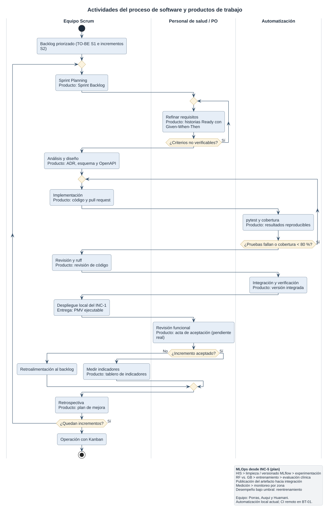
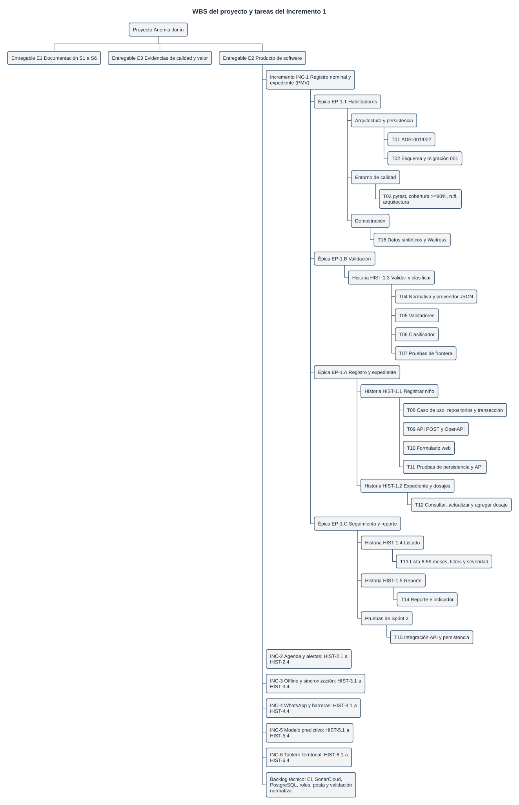
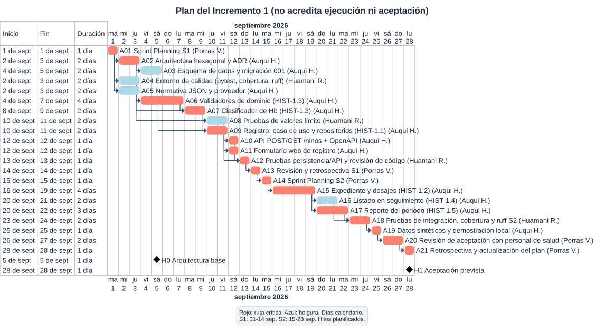
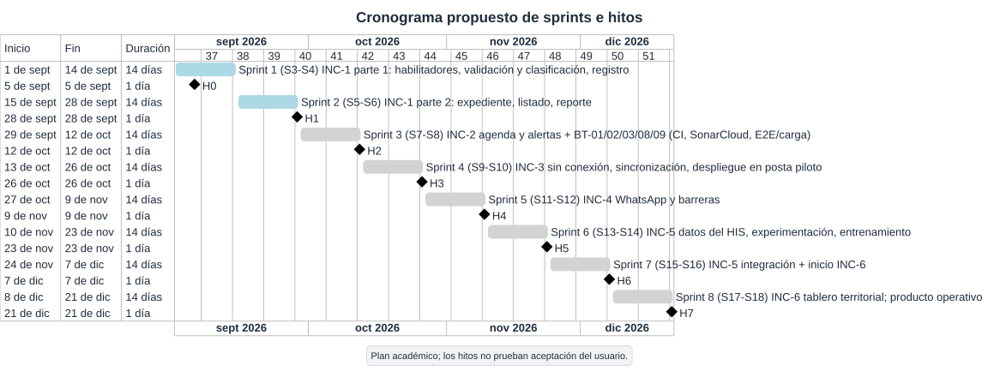
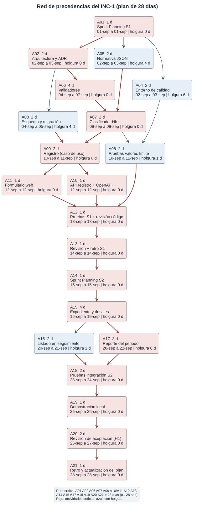
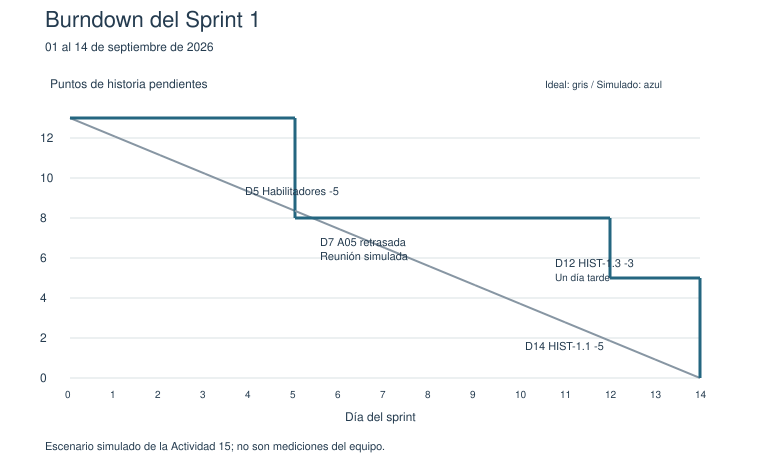

**UNIVERSIDAD CONTINENTAL**

**Facultad de Ingeniería — Ingeniería de Sistemas e Informática**

**Curso:** Procesos de Software (ASUC01702) — Periodo 2026-20

**Unidad I:** Diseño de procesos de software con entrega de valor

**Ejes temáticos 3 y 4:** Actividades del proceso de software · Planificación y seguimiento de proyectos

# Entregable de las Semanas 3 y 4: Actividades, planificación y seguimiento del proceso de software

**Proyecto:** Sistema inteligente para la detección temprana de anemia infantil en zonas rurales de Junín

**Equipo de proyecto**

| Integrante | Rol en el proyecto | Rol en el proceso (Scrum) |
| :---- | :---- | :---- |
| Porras Veli, Ricardo | Ingeniero de Proceso | Responsable del proyecto y facilitador del proceso (Scrum Master) |
| Auqui Huincho, Tania | Ingeniera de Desarrollo y Prototipado | Responsable técnica (desarrollo) |
| Huamani Rodriguez, Jean Piero | Ingeniero de Calidad y Mejora del Proceso | Responsable de calidad |

**Product Owner:** representante del personal de salud de la posta piloto (actor externo al equipo; valida y acepta los incrementos).

**Fecha de la versión revisada:** 25 de septiembre de 2026.

---

## Índice

- Introducción: continuidad desde las Guías 1 y 2
- 1. Características del proyecto
- 2. Modelo de proceso seleccionado
- 3. Actividades del proceso
- 4. Secuencia y dependencias
- 5. Responsables
- 6. Productos de trabajo
- 7. Criterios de terminación
- 8. Incrementos de software (incluye la definición técnica del software)
- 9. Priorización
- 10. Estimación
- 11. Planificación
- 12. Hitos y entregables
- 13. Seguimiento (incluye la simulación de la reunión de seguimiento)
- 14. Indicadores
- 15. Riesgos y desviaciones
- 16. Trazabilidad
- 17. Valor generado
- 18. Caso de decisión (Actividad 17)
- 19. Reto de aplicación: plan ejecutable del incremento prioritario
- 20. Preguntas de análisis
- 21. Referencias
- Anexo A. Registro de cambios respecto de la versión anterior

**Índice de tablas y figuras.** Las tablas se numeran de forma correlativa (Tabla 1 a Tabla 38) y las figuras de la Figura 1 a la Figura 6. Las figuras son diagramas en SVG ubicados en `diagramas/svg/`, elaborados por el equipo a partir de los datos exactos de las tablas de este documento.

---

# Introducción: continuidad desde las Guías 1 y 2

La Guía 1 estableció el problema organizacional (la discontinuidad en la prevención, medición, registro y seguimiento de la anemia infantil en zonas rurales de Junín), los actores, el proceso AS-IS, las brechas, el proceso TO-BE, los seis puntos de intervención del software y los indicadores de valor. La Guía 2 derivó de ese TO-BE las características del proyecto, comparó modelos y seleccionó un **modelo iterativo e incremental gestionado con Scrum, con prácticas DevOps para la entrega y prácticas MLOps para el componente predictivo**.

Esta guía convierte ese modelo en un **proceso ejecutable**: actividades concretas, secuencia y dependencias, responsables, productos de trabajo, criterios de terminación, planificación en ocho sprints, mecanismos de seguimiento, indicadores y control de desviaciones. La cadena de derivación que se desarrolla es la siguiente:

1. Problema organizacional (anemia infantil en Junín) → Guía 1.
2. Proceso TO-BE con seis puntos de intervención del software → Guía 1.
3. Modelo iterativo-incremental + Scrum + DevOps + MLOps → Guía 2.
4. Actividades → secuencia → responsables → productos de trabajo → criterios de terminación → esta guía.
5. Planificación (8 sprints de 2 semanas) → ejecución → seguimiento → control de desviaciones → esta guía.
6. Incremento funcional (INC-1, Producto Mínimo Viable) → resultado → valor organizacional → Semanas 5 y 6.

**Alcance de esta versión.** El documento se revisó el 25 de septiembre de 2026 para que el plan del Incremento 1 coincida con el Producto Mínimo Viable (PMV) efectivamente construido en el repositorio (`anemia_junin/`). Lo que el código todavía no implementa se declara como **backlog** (incrementos posteriores o elementos técnicos pendientes) y no como trabajo terminado.

---

# 1. Características del proyecto

Las características provienen de la Tabla 1 del Entregable de la Semana 2; aquí se indica cómo condiciona cada una a las actividades del proceso.

*Tabla 1. Características del proyecto y su efecto sobre las actividades del proceso*

| Factor | Nivel (S2) | Efecto sobre las actividades del proceso |
| :---- | :---- | :---- |
| Incertidumbre de requisitos | Alto | El refinamiento de requisitos se repite en cada sprint; los umbrales clínicos se externalizan en un archivo normativo versionado para poder cambiarlos sin reprogramar. |
| Complejidad técnica | Alto | El diseño arquitectónico se fija en el Sprint 1 (arquitectura hexagonal) y se reservan *spikes* técnicos antes de los incrementos de mayor incertidumbre (INC-3 e INC-5). |
| Riesgo tecnológico (conectividad rural) | Alto | La prueba de sincronización sin conexión es obligatoria en cada sprint **a partir de INC-3**; el PMV (INC-1) es una aplicación web local y no incluye aún modo sin conexión. |
| Necesidad de retroalimentación | Alto | La revisión del sprint con el personal de salud es una actividad no negociable al cierre de cada sprint. |
| Necesidad de automatización | Alto | En INC-1 la verificación se automatiza localmente (pytest, cobertura mínima del 80 % y ruff); el pipeline de integración continua en GitHub Actions se planifica para el Sprint 3 (elemento BT-01 del backlog). MLOps se activa en INC-5. |
| Dependencia de datos | Alto | La validación y limpieza de datos históricos del HIS es actividad previa obligatoria de INC-5; INC-1 trabaja con datos sintéticos. |
| Criticidad del sistema | Alto | Toda regla clínica se prueba en sus valores límite y cada dosaje registra la versión normativa con la que fue clasificado. |

**Las tres características determinantes** establecidas en la Guía 2 se mantienen:

1. **Incertidumbre del componente de IA** → requiere actividades de experimentación versionadas (subciclo MLOps desde INC-5).
2. **Riesgo del entorno rural (conectividad intermitente)** → requiere actividades de prueba sin conexión en cada sprint desde INC-3.
3. **Necesidad de validación con el personal de salud** → la revisión del sprint es una actividad obligatoria y es la condición de aceptación de cada incremento.

---

# 2. Modelo de proceso seleccionado

*Tabla 2. Composición del modelo de proceso seleccionado en la Guía 2*

| Nivel | Elemento | Función en el proceso ejecutable |
| :---- | :---- | :---- |
| Modelo de ciclo de vida | Iterativo e incremental | Base del proceso: 8 sprints de 2 semanas; cada incremento es funcional por sí mismo. |
| Marco de gestión | Scrum | Organiza la iteración: Product Backlog, Sprint Planning, Daily Scrum, revisión y retrospectiva. |
| Prácticas de ingeniería | DevOps | Automatizan la verificación (pruebas, cobertura, análisis estático) y, desde el Sprint 3, la integración continua y el despliegue. |
| Prácticas de datos y modelo | MLOps | Gobiernan el ciclo del modelo predictivo desde INC-5 (datos, experimentación, entrenamiento, publicación, monitoreo). |

Las actividades de las secciones siguientes no son una lista genérica: cada una se justifica por una de las características de la Tabla 1 y por el elemento del modelo que la exige (columna «Origen» de la Tabla 3).

---

# 3. Actividades del proceso

**(Actividad 1 de la guía.)** Las actividades se clasifican en **actividades de ciclo** (se ejecutan en todos los sprints) y **actividades específicas** de un incremento o fase.

## 3.1 Actividades de ciclo (se repiten en cada sprint)

*Tabla 3. Matriz de actividades de ciclo: propósito, entrada, producto de trabajo y salida*

| Actividad | Origen en el modelo | Propósito | Entrada | Producto de trabajo | Salida |
| :---- | :---- | :---- | :---- | :---- | :---- |
| Sprint Planning | Scrum | Seleccionar y desglosar las historias del sprint | Product Backlog priorizado, velocidad del equipo | Sprint Backlog con criterios de aceptación | Plan del sprint en GitHub Projects |
| Refinamiento de requisitos | Scrum / incertidumbre | Detallar, estimar y aceptar historias de usuario | Épicas del Product Backlog, normativa vigente | Historias de usuario con criterios de aceptación (Dado–Cuando–Entonces) | Backlog refinado (historias en estado «Ready») |
| Análisis y diseño | Iterativo / complejidad | Definir la solución técnica del sprint | Historias aceptadas, arquitectura base (ADR) | Diseño del incremento, cambios al modelo de datos, contrato de API | Diseño revisado por el equipo |
| Implementación | Iterativo | Construir la funcionalidad planificada | Diseño del sprint | Código fuente en el repositorio (rama de funcionalidad) | *Pull request* listo para revisión |
| Pruebas unitarias, de persistencia y de API | DevOps / criticidad | Verificar el comportamiento y los valores límite | Código implementado | Suites de pytest y reporte de cobertura | Pruebas en verde y cobertura ≥ 80 % |
| Prueba de sincronización sin conexión | Riesgo rural | Verificar registro y sincronización sin conexión | Módulo sin conexión (desde INC-3) | Reporte de prueba sin conexión | Confirmación de integridad tras reconexión |
| Revisión de código y análisis estático | DevOps / calidad | Controlar la calidad del código | *Pull request* | Comentarios de revisión y reporte de ruff (SonarCloud desde BT-02) | Código aprobado sin hallazgos críticos |
| Integración y verificación automatizada | DevOps | Construir y verificar el producto integrado | Rama principal actualizada | Ejecución de pruebas, cobertura y análisis estático (local en INC-1; GitHub Actions desde BT-01) | Versión integrada verificada |
| Despliegue | DevOps | Poner el incremento a disposición del usuario | Versión integrada verificada | Versión ejecutable (INC-1: servidor local Waitress con datos sintéticos) | Incremento disponible para la revisión |
| Revisión del sprint | Scrum / validación | Validar el incremento con el personal de salud | Incremento funcional | Acta de revisión con retroalimentación | Backlog actualizado según la retroalimentación |
| Retrospectiva | Scrum / mejora continua | Mejorar la forma de trabajo | Métricas del sprint, observaciones | Plan de mejora del siguiente sprint | Ajustes al proceso documentados |
| Actualización del plan | Seguimiento | Reestimar y replanificar ante desviaciones | Burndown, velocidad, matriz de seguimiento | Plan y backlog actualizados | Cronograma vigente |

## 3.2 Actividades específicas por incremento o fase

*Tabla 4. Actividades específicas por incremento o fase*

| Actividad | Sprint(s) | Propósito | Producto de trabajo |
| :---- | :---- | :---- | :---- |
| Definición de la arquitectura base | 1 | Establecer una arquitectura estable para todos los incrementos | ADR-001 (arquitectura hexagonal) y ADR-002 (decisiones del PMV) |
| Diseño del esquema de datos | 1 | Modelar el esquema inicial con restricciones de integridad | `migrations/001_initial.sql` (niños, dosajes, intentos de registro) |
| Transcripción de la normativa a configuración | 1 | Separar las reglas clínicas del código para poder actualizarlas | `config/normativa_v1.json` versionado |
| Configuración del entorno de calidad | 1 | Automatizar la verificación desde el inicio | `pyproject.toml` con pytest, cobertura mínima del 80 % y ruff; prueba de reglas de arquitectura |
| Configuración del pipeline de integración continua (BT-01) | 3 | Ejecutar la verificación en cada cambio | Flujo de GitHub Actions |
| Configuración del modo sin conexión | 4 (INC-3) | Base local y sincronización robusta | Módulo sin conexión funcional |
| Integración con la API de WhatsApp | 5 (INC-4) | Conectar las notificaciones al servicio externo | Módulo de notificaciones integrado |
| Validación y limpieza de datos del HIS | 4-5 | Preparar datos históricos para el modelo | Conjunto de datos limpio y versionado en MLflow |
| Experimentación y selección de algoritmo | 6 | Comparar Random Forest y Gradient Boosting con datos reales | Experimentos versionados y algoritmo seleccionado |
| Entrenamiento y evaluación del modelo | 6 | Entrenar, validar y registrar el modelo | Artefacto del modelo en MLflow y reporte de desempeño |
| Pipeline MLOps | 6-7 | Automatizar datos, entrenamiento, publicación y monitoreo | Pipeline MLOps operativo |
| Monitoreo y reentrenamiento | 7+ | Detectar degradación del modelo | Reporte de desempeño por zona, modelo actualizado |
| Despliegue en la posta piloto (BT-07) | Desde INC-3 | Llevar el software al establecimiento cuando funcione sin conexión | Versión ejecutable instalada en la posta |
| Capacitación incremental | Cierre de cada incremento desplegado | Habilitar al personal en la nueva funcionalidad | Material de capacitación y registro de asistencia |

## 3.3 Respuesta a las preguntas orientadoras de la Actividad 1

1. **¿Qué actividades son indispensables para desarrollar la solución?** Refinamiento de requisitos (las reglas clínicas deben ser exactas), implementación, pruebas en valores límite, revisión con el personal de salud y despliegue. Sin ellas no hay incremento funcional ni validación.
2. **¿Qué actividades están relacionadas con los riesgos principales?** La transcripción y verificación de la normativa (riesgo de clasificación clínica errónea), la prueba de sincronización sin conexión (riesgo de conectividad, desde INC-3), la validación de datos del HIS (riesgo de calidad de datos) y la revisión del sprint (riesgo de baja adopción).
3. **¿Qué actividades generan evidencia de calidad?** Las pruebas automatizadas con reporte de cobertura, la revisión de código con ruff, la prueba de reglas de arquitectura, la prueba sin conexión (desde INC-3) y el acta de la revisión del sprint.
4. **¿Qué actividades deben repetirse en cada incremento?** Todas las de la Tabla 3.
5. **¿Qué actividades podrían automatizarse?** Pruebas, medición de cobertura y análisis estático (ya automatizados localmente en INC-1), integración continua y despliegue (DevOps, desde BT-01), e ingesta de datos, entrenamiento, publicación y monitoreo del modelo (MLOps, desde INC-5).

---

# 4. Secuencia y dependencias

**(Actividades 2 y 10 de la guía.)**

## 4.1 Flujo específico de actividades del proyecto

El flujo combina el ciclo de Scrum con el subciclo MLOps y se adapta al contexto de salud rural. Contiene inicio, actividades, decisiones, iteraciones, productos de trabajo, validaciones, entregas, retroalimentación y mejora, tal como exige la guía (Figura 1).

<!-- DIAG-100 pendiente -->

Descripción textual del flujo de la Figura 1:

1. **Inicio:** Product Backlog priorizado a partir del TO-BE (S1) y del orden de incrementos (S2).
2. **Sprint Planning** → producto: Sprint Backlog.
3. **Refinamiento de requisitos** → producto: historias «Ready». Decisión: ¿la historia tiene criterios de aceptación verificables? Si no, vuelve a refinamiento.
4. **Análisis y diseño** → producto: diseño del incremento y ADR.
5. **Implementación** → producto: código fuente.
6. **Pruebas automatizadas** (unitarias, persistencia, API, arquitectura; sin conexión desde INC-3) → producto: reporte de pruebas y cobertura. Decisión: ¿pruebas en verde y cobertura ≥ 80 %? Si no, vuelve a implementación.
7. **Revisión de código y análisis estático** → producto: *pull request* aprobado.
8. **Integración y verificación automatizada** → producto: versión integrada.
9. **Despliegue** (INC-1: demostración local; desde INC-3: posta piloto) → entrega del incremento.
10. **Revisión con el personal de salud** (validación) → producto: acta. Decisión: ¿incremento aceptado? Si no, las observaciones vuelven al backlog (retroalimentación) y se replanifica.
11. **Medición de indicadores** → producto: tablero de indicadores.
12. **Retrospectiva** (mejora) → producto: plan de mejora.
13. **Iteración:** ¿quedan incrementos? Si sí, siguiente sprint; si no, **fin** (producto completo y paso a operación con Kanban, según S2).
14. **Subciclo MLOps (desde INC-5, en paralelo):** datos del HIS → limpieza y versionado → experimentación → entrenamiento → evaluación con personal clínico → registro y publicación → monitoreo por zona. Decisión: ¿desempeño menor que el umbral? Si sí, reentrenamiento.

**Respuesta a la pregunta orientadora de la Actividad 2.** Las actividades están organizadas según el modelo seleccionado y no como un proceso tradicional: el ciclo completo (requisitos, diseño, implementación, pruebas, revisión) se repite en cada sprint; la revisión con el usuario es una puerta de decisión obligatoria antes de dar por aceptado un incremento; la retroalimentación retorna al backlog y no a una fase anterior; y el subciclo MLOps corre en paralelo desde INC-5 sin detener el resto del producto.

## 4.2 Dependencias y riesgos de planificación

*Tabla 5. Matriz de dependencias y riesgos de planificación*

| Actividad / incremento | Depende de | Tipo de dependencia | Riesgo | Acción |
| :---- | :---- | :---- | :---- | :---- |
| Clasificación de hemoglobina (HIST-1.3) | Transcripción verificada de la normativa vigente | De datos / normativa | Umbrales o tabla de ajuste por altitud transcritos con error | Archivo normativo versionado, revisión cruzada por el responsable de calidad y consulta a la microred |
| Registro de niño con dosaje inicial (HIST-1.1) | Validadores y clasificador (HIST-1.3), esquema de datos | Técnica | Si la clasificación se retrasa, el registro no puede cerrarse | HIST-1.3 se programa antes que HIST-1.1 dentro del Sprint 1 |
| Revisión del sprint | Disponibilidad del personal de salud de la posta | Organizacional | Distancia y carga asistencial dificultan la asistencia | Sesiones breves (30 min), opción remota, fecha agendada en el Sprint Planning |
| INC-2 (agenda automática) | INC-1 completado | Técnica | La agenda requiere registros nominales y dosajes existentes | INC-1 tiene prioridad absoluta en los Sprints 1-2 |
| INC-3 (sin conexión y sincronización) | INC-1 completado; decisión sobre la base central (PostgreSQL) | Técnica | Conflictos de sincronización complejos pueden extender INC-3 | *Spike* técnico de 2 días al inicio del Sprint 4 |
| INC-4 (notificaciones) | Cuenta aprobada de WhatsApp Business | Externa | La aprobación puede tardar de 4 a 6 semanas | Iniciar la solicitud en el Sprint 3; canal alternativo por SMS |
| INC-5 (modelo predictivo) | INC-1 e INC-3 completados; datos del HIS disponibles | Técnica y de datos | Calidad de datos insuficiente puede posponer INC-5 | Validación de datos en paralelo durante los Sprints 4-5; criterio explícito de postergación |
| Entrenamiento del modelo | Datos del HIS limpios y versionados | De datos | Datos insuficientes producen un modelo con desempeño insuficiente | Criterio mínimo: ≥ 500 registros con hemoglobina, edad y resultado de seguimiento |
| Integración continua (BT-01) | Repositorio remoto y permisos de GitHub Actions | De recursos | Sin pipeline, la verificación depende de ejecuciones manuales | Verificación local obligatoria antes de cada integración hasta el Sprint 3 |

**Cadena de dependencias del componente de IA:** datos del HIS disponibles (validación desde el Sprint 4) → limpieza y versionado (Sprint 5) → experimentación (Sprint 6, semana 1) → entrenamiento y evaluación (Sprint 6, semana 2) → integración modelo-agenda (Sprint 7) → prueba funcional de priorización (Sprint 7, semana 2).

La ruta crítica del incremento prioritario se calcula en la sección 11.4 sobre las actividades A01 a A21.

**Respuesta a la pregunta orientadora de la Actividad 10.** En el incremento prioritario, la actividad que puede retrasar la entrega de valor es la **transcripción y verificación de la normativa**: sin umbrales confiables no hay clasificación y, sin clasificación, el registro con dosaje inicial y la lista priorizada no tienen sentido clínico. A nivel del proyecto, lo es la **validación de datos del HIS**, prerrequisito de INC-5; sin embargo, INC-1 a INC-4 generan valor por sí mismos, por lo que ese retraso no bloquea el valor total del sistema.

---

# 5. Responsables

**(Actividad 3 de la guía.)** La matriz distingue, en línea con la consigna del integrador (S6, §2.3), quién **ejecuta** (R), quién **revisa** y quién **aprueba** cada actividad (matriz RAE).

*Tabla 6. Matriz de responsabilidades RAE (ejecución, revisión y aprobación)*

| Actividad | Responsable de ejecución | Participantes | Revisión | Aprobación | Evidencia |
| :---- | :---- | :---- | :---- | :---- | :---- |
| Requisitos (Sprint Planning y refinamiento) | Porras V. | Auqui H., Huamani R., personal de salud | Huamani R. (verificabilidad de criterios) | Product Owner (representante de la posta) | Sprint Backlog e historias «Ready» en GitHub Projects |
| Análisis | Auqui H. | Porras V., Huamani R. | Huamani R. | Porras V. | Historias con reglas de negocio y casos límite identificados |
| Diseño | Auqui H. | Porras V., Huamani R. | Huamani R. | Porras V. | ADR, esquema de datos, contrato OpenAPI |
| Implementación | Auqui H. | — | Huamani R. (revisión de código) | Huamani R. | *Pull request* integrado |
| Pruebas | Huamani R. | Auqui H. | Porras V. | Huamani R. | Reporte de pytest y cobertura ≥ 80 % |
| Integración | Auqui H. | Automatización local; GitHub Actions desde BT-01 | Huamani R. | Huamani R. | Ejecución completa en verde (pruebas, cobertura, ruff) |
| Despliegue | Auqui H. | Huamani R. | Huamani R. (prueba de humo) | Porras V. | Versión ejecutable y registro de la prueba de humo |
| Evaluación (revisión del sprint) | Porras V. | Todo el equipo y personal de salud | Huamani R. | Personal de salud / microred | Acta de revisión |
| Retrospectiva | Porras V. | Todo el equipo | Todo el equipo | Porras V. | Plan de mejora documentado |
| Prueba sin conexión (desde INC-3) | Huamani R. | Auqui H. | Porras V. | Huamani R. | Reporte de prueba sin conexión |
| Transcripción normativa | Auqui H. | Huamani R. | Huamani R. (contraste con la fuente oficial) | Porras V., tras consulta con la microred | `config/normativa_v1.json` y pruebas de valores límite |
| Experimentación y modelo (MLOps) | Auqui H. | Huamani R. | Huamani R. | Porras V. y personal clínico | Experimentos en MLflow, reporte de desempeño |
| Monitoreo del modelo | Huamani R. | Auqui H. | Porras V. | Porras V. | Reporte de desempeño por zona |
| Capacitación incremental | Porras V. | Auqui H. | Huamani R. | Personal de salud | Registro de asistencia, material entregado |

**Respuesta a la pregunta orientadora de la Actividad 3.** Si una actividad no tiene responsable, nadie la asume, su evidencia no se genera y su criterio de terminación nunca se verifica. En este proyecto el caso más delicado es la transcripción normativa: sin un responsable de revisión explícito, un umbral mal copiado produciría clasificaciones clínicas erróneas que ninguna prueba detectaría, porque las pruebas se escribirían sobre el mismo valor equivocado.

---

# 6. Productos de trabajo

**(Actividad 4 de la guía, primera parte.)** Cada actividad produce un artefacto verificable. La Tabla 7 indica dónde se encuentra cada producto del Incremento 1 en el repositorio.

*Tabla 7. Productos de trabajo por actividad y su ubicación*

| Actividad | Producto de trabajo | Ubicación / forma |
| :---- | :---- | :---- |
| Requisitos | Historias HIST-1.1 a HIST-1.5 con criterios de aceptación | Sección 19.I de este documento y GitHub Projects |
| Análisis y diseño | Decisiones de arquitectura y del PMV | `anemia_junin/docs/adr/001_arquitectura_hexagonal.md`, `002_decisiones_pmv.md` |
| Diseño de datos | Esquema de base de datos | `anemia_junin/migrations/001_initial.sql` |
| Diseño de interfaces | Contrato de la API REST | `anemia_junin/openapi.yaml` |
| Transcripción normativa | Configuración normativa versionada | `anemia_junin/config/normativa_v1.json` |
| Implementación | Código fuente por capas (dominio, aplicación, adaptadores) | `anemia_junin/src/anemia_junin/` |
| Pruebas | Suites de pruebas de dominio, persistencia, API y arquitectura | `anemia_junin/tests/` |
| Integración | Configuración de verificación (pytest, cobertura, ruff) | `anemia_junin/pyproject.toml` |
| Despliegue | Aplicación ejecutable y datos sintéticos de demostración | `bootstrap.crear_app`, `scripts/cargar_datos_sinteticos.py` |
| Evaluación | Acta de revisión del sprint | `[PENDIENTE: acta de la revisión con el personal de salud]` |
| Retrospectiva | Plan de mejora | Documento de retrospectiva en el repositorio |
| MLOps (INC-5) | Experimentos y artefacto del modelo | MLflow |

---

# 7. Criterios de terminación

**(Actividad 4 de la guía, segunda parte.)** Los criterios de terminación (*Definition of Done*, DoD) se definen por actividad (Tabla 8) y por historia de usuario (Tabla 9).

*Tabla 8. Criterios de terminación por actividad y evidencia objetiva*

| Actividad | Producto de trabajo | Criterio de terminación | Evidencia objetiva |
| :---- | :---- | :---- | :---- |
| Refinamiento de requisitos | Historias de usuario (Como… quiero… para…) | Todas las historias del sprint tienen criterios Dado–Cuando–Entonces verificables y fueron estimadas por el equipo | Historias en estado «Ready» en GitHub Projects |
| Análisis y diseño | ADR, esquema de datos, contrato de API | Diseño revisado por los tres integrantes, sin observaciones abiertas | ADR con estado «Aceptado»; comentarios resueltos en el *pull request* |
| Transcripción normativa | `config/normativa_v1.json` | Cada umbral y cada banda de altitud contrastados con la fuente oficial; la aplicación no arranca si el archivo es inválido | Pruebas de valores límite en verde; registro de la revisión cruzada |
| Implementación | Código fuente | Funcionalidad implementada, sin errores de ruff, *pull request* aprobado por al menos un revisor, reglas de arquitectura respetadas | *Pull request* integrado; `tests/arquitectura` en verde |
| Pruebas | Suites de pytest | 0 pruebas fallidas; cobertura ≥ 80 % (umbral `fail_under = 80`); cada regla clínica probada en sus fronteras | Reporte de pytest y de cobertura |
| Prueba sin conexión (desde INC-3) | Reporte de prueba | Escenario de 15 min sin conexión y reconexión: todos los registros se sincronizan sin duplicados ni pérdida | Reporte firmado por el responsable de calidad |
| Revisión de código y análisis estático | Reporte de ruff (SonarCloud desde BT-02) | 0 hallazgos de ruff; 0 hallazgos bloqueantes o críticos | Salida de ruff adjunta al *pull request* |
| Integración | Versión integrada | Ejecución completa en verde (pruebas, cobertura, ruff) sobre la rama principal | Registro de la ejecución (local; GitHub Actions desde BT-01) |
| Despliegue | Versión ejecutable | Aplicación accesible en el ambiente definido y prueba de humo superada (`GET /api/v1/salud` responde 200) | Captura o registro de la prueba de humo |
| Revisión del sprint | Acta de revisión | El personal de salud acepta el incremento o registra observaciones que pasan al backlog | Acta con fecha y participantes |
| Retrospectiva | Plan de mejora | Al menos dos mejoras concretas con responsable | Documento de retrospectiva |
| Experimentación (INC-5) | Experimentos en MLflow | Al menos dos algoritmos comparados con precisión, *recall* y F1 | Panel de MLflow con ≥ 2 experimentos |
| Modelo predictivo (INC-5) | Artefacto registrado | Desempeño ≥ umbral acordado con personal clínico; validación cruzada ejecutada | Reporte de evaluación en MLflow |

*Tabla 9. Definición de terminado (DoD) común a toda historia de usuario*

| N.° | Condición |
| :---- | :---- |
| 1 | Todos los criterios de aceptación de la historia se verifican con al menos una prueba automatizada. |
| 2 | La regla de negocio vive en el dominio o en la configuración normativa, no en rutas, plantillas ni JavaScript (ADR-001). |
| 3 | Pruebas en verde, cobertura ≥ 80 % y 0 hallazgos de ruff. |
| 4 | La funcionalidad está disponible tanto en la interfaz web como en la API REST cuando corresponde, invocando el mismo caso de uso. |
| 5 | El contrato `openapi.yaml` refleja cualquier cambio de la API. |
| 6 | La historia fue demostrada en la revisión del sprint y aceptada, o sus observaciones quedaron registradas en el backlog. |

**Respuesta a la pregunta clave de la Actividad 4.** La terminación se demuestra con **evidencia objetiva y reproducible** (reportes de pruebas y cobertura, salida del análisis estático, ADR aceptados, contrato de API, actas), no con la afirmación del equipo. En un contexto clínico, cada regla normativa se considera terminada solo cuando existe una prueba que verifica su valor frontera; por ejemplo, que 10,4 g/dL ajustados en un niño de 6 a 23 meses se clasifica como anemia leve y 10,5 g/dL como sin anemia.

---

# 8. Incrementos de software

**(Actividades 5 y 6 de la guía.)**

## 8.1 Relación entre actividades e incrementos

*Tabla 10. Matriz de incrementos: funcionalidad, actividades, resultado, valor e indicador*

| Inc. | Funcionalidad | Actividades principales | Resultado esperado | Valor generado | Indicador |
| :---- | :---- | :---- | :---- | :---- | :---- |
| 1 (PMV) | Registro nominal validado, dosajes de hemoglobina clasificados según la normativa y expediente digital | Requisitos, arquitectura base, esquema de datos, transcripción normativa, implementación, pruebas en valores límite, demostración local, revisión | Registro único y confiable de cada niño, con historial de dosajes clasificado | Elimina errores del registro manual y hace visible la severidad de cada caso | Registros aceptados sin error crítico ÷ intentos evaluados × 100 |
| 2 | Agenda automática de controles según la normativa y alertas internas | Refinamiento de reglas de agenda, implementación, prueba de generación automática, revisión con la enfermera | Controles programados y vencidos visibles | Mayor oportunidad en la atención | Cobertura oportuna de controles (%) |
| 3 | Funcionamiento sin conexión y sincronización robusta | *Spike* de sincronización, base local + central, resolución de conflictos, prueba extendida sin conexión, despliegue en la posta piloto | Registro sin pérdida de datos en zonas sin cobertura | Continuidad del servicio en el ámbito rural | Registros sincronizados ÷ pendientes × 100 |
| 4 | Notificaciones por WhatsApp y reporte de barreras | Integración con la API de WhatsApp Business, módulo de barreras, prueba de entrega, revisión con familias | Familias informadas y barreras reportadas a tiempo | Menor pérdida de seguimiento | Mensajes entregados y leídos ÷ enviados × 100 |
| 5 | Modelo predictivo y priorización de la agenda | Validación de datos del HIS, experimentación en MLflow, entrenamiento, evaluación clínica, integración modelo-agenda, pipeline MLOps | Casos de alto riesgo priorizados en la agenda | Uso más eficiente del personal disponible | Casos confirmados ÷ señalados por el modelo × 100 |
| 6 | Tablero de gestión territorial e indicadores | Diseño del tablero, reportes por microred, integración con datos reales, revisión con microred y MINSA | Supervisión por microred y MINSA | Decisiones territoriales basadas en evidencia | Indicadores de cobertura y resultado actualizados |

El orden de la Tabla 10 es el de la Guía 2 (Tabla «Entregas incrementales de valor»), con una precisión: el reporte básico del periodo (HIST-1.5) se entrega ya en INC-1 como primer instrumento de medición de la calidad del registro; el tablero territorial completo sigue siendo INC-6.

## 8.2 Descomposición del proyecto (WBS)

La descomposición sigue la jerarquía que pide la guía: **Proyecto → Entregables → Incrementos → Épicas → Historias de usuario → Tareas** (Figura 2). Las tareas se detallan solo para el incremento prioritario (INC-1); los incrementos posteriores se descomponen en su propio Sprint Planning.

<!-- DIAG-101 pendiente -->

*Tabla 11. Estructura de descomposición del trabajo (niveles 1 a 5)*

| Nivel | Código | Elemento |
| :---- | :---- | :---- |
| 1. Proyecto | P | Sistema de detección temprana de anemia infantil — Junín |
| 2. Entregable | E1 | Documentación del proceso (entregables S1 a S6) |
| 2. Entregable | E2 | Producto de software (incrementos INC-1 a INC-6) |
| 2. Entregable | E3 | Evidencias de calidad y de valor (pruebas, actas, indicadores) |
| 3. Incremento | INC-1 | Registro nominal validado y expediente digital (PMV) |
| 4. Épica | EP-1.A | Registro y expediente del niño (HIST-1.1, HIST-1.2) |
| 4. Épica | EP-1.B | Validación de datos y clasificación normativa de la hemoglobina (HIST-1.3) |
| 4. Épica | EP-1.C | Seguimiento y reporte (HIST-1.4, HIST-1.5) |
| 4. Épica | EP-1.T | Habilitadores técnicos (arquitectura, persistencia, API REST, entorno de calidad) |
| 3. Incremento | INC-2 | Agenda automática y alertas: HIST-2.1 Generar agenda de controles según la normativa; HIST-2.2 Identificar controles vencidos; HIST-2.3 Visualizar agenda del personal; HIST-2.4 Registrar asistencia a control |
| 3. Incremento | INC-3 | Sin conexión y sincronización: HIST-3.1 Registrar sin conexión; HIST-3.2 Sincronizar al reconectar; HIST-3.3 Resolver conflictos; HIST-3.4 Ver sincronización pendiente |
| 3. Incremento | INC-4 | WhatsApp y barreras: HIST-4.1 Enviar recordatorio; HIST-4.2 Registrar confirmación; HIST-4.3 Registrar barreras; HIST-4.4 Alertar barreras críticas |
| 3. Incremento | INC-5 | Modelo predictivo: HIST-5.1 Lista priorizada por riesgo; HIST-5.2 Factores de riesgo de un niño; HIST-5.3 Validar predicción con criterio clínico; HIST-5.4 Reentrenar con nuevos datos |
| 3. Incremento | INC-6 | Tablero territorial: HIST-6.1 Cobertura por posta; HIST-6.2 Distribución por zona; HIST-6.3 Exportar reporte para MINSA; HIST-6.4 Comparar periodos |

*Tabla 12. Descomposición del Incremento 1 en historias y tareas*

| Incremento | Funcionalidad (épica) | Historia / elemento de trabajo | Tarea | Prioridad |
| :---- | :---- | :---- | :---- | :---- |
| INC-1 | EP-1.T Habilitadores | Arquitectura y persistencia | T01 Redactar ADR-001 (hexagonal) y ADR-002 (decisiones del PMV) | Alta |
| INC-1 | EP-1.T Habilitadores | Arquitectura y persistencia | T02 Diseñar el esquema y la migración `001_initial.sql` | Alta |
| INC-1 | EP-1.T Habilitadores | Entorno de calidad | T03 Configurar pytest, cobertura (≥ 80 %), ruff y prueba de reglas de arquitectura | Alta |
| INC-1 | EP-1.B Validación y clasificación | HIST-1.3 (HU-03) | T04 Transcribir la normativa a `config/normativa_v1.json` y crear el proveedor normativo | Alta |
| INC-1 | EP-1.B Validación y clasificación | HIST-1.3 (HU-03) | T05 Implementar los validadores de dominio | Alta |
| INC-1 | EP-1.B Validación y clasificación | HIST-1.3 (HU-03) | T06 Implementar el clasificador (ajuste por altitud y umbrales por edad) | Alta |
| INC-1 | EP-1.B Validación y clasificación | HIST-1.3 (HU-03) | T07 Pruebas unitarias de valores límite | Alta |
| INC-1 | EP-1.A Registro y expediente | HIST-1.1 (HU-01) | T08 Caso de uso «Registrar niño», repositorios y transacción atómica con dosaje inicial | Alta |
| INC-1 | EP-1.A Registro y expediente | HIST-1.1 (HU-01) | T09 Endpoint `POST /api/v1/ninos` y contrato OpenAPI | Alta |
| INC-1 | EP-1.A Registro y expediente | HIST-1.1 (HU-01) | T10 Formulario web de registro (Jinja2 con protección CSRF) | Alta |
| INC-1 | EP-1.A Registro y expediente | HIST-1.1 (HU-01) | T11 Pruebas de persistencia y de API del registro | Alta |
| INC-1 | EP-1.A Registro y expediente | HIST-1.2 (HU-02) | T12 Casos de uso «Consultar expediente», «Actualizar niño» y «Agregar dosaje» con vistas y endpoints | Alta |
| INC-1 | EP-1.C Seguimiento y reporte | HIST-1.4 (HU-04) | T13 Listado de niños de 6 a 59 meses, orden por severidad, filtros y paginación | Media |
| INC-1 | EP-1.C Seguimiento y reporte | HIST-1.5 (HU-05) | T14 Reporte del periodo e indicador de aceptación de registros | Media |
| INC-1 | EP-1.C Seguimiento y reporte | HIST-1.2, 1.4, 1.5 | T15 Pruebas de integración de API y persistencia del Sprint 2 | Alta |
| INC-1 | EP-1.T Habilitadores | Demostración | T16 Script de datos sintéticos y demostración local con Waitress | Media |

## 8.3 Backlog técnico derivado de la revisión frente al código

Los elementos siguientes estaban previstos en la versión anterior del plan como parte del Sprint 1 o del INC-1, pero **no están implementados en el PMV**. Se registran como backlog con su incremento o sprint de destino.

*Tabla 13. Backlog técnico (elementos no implementados en el PMV)*

| ID | Elemento | Estado en el PMV | Destino planificado |
| :---- | :---- | :---- | :---- |
| BT-01 | Pipeline de integración continua en GitHub Actions (ruff, pytest, cobertura) | No existe flujo en el repositorio; verificación local | Sprint 3 |
| BT-02 | Análisis estático con SonarCloud | No configurado; se usa ruff | Sprint 3 |
| BT-03 | Pruebas extremo a extremo con navegador (Playwright) y resultados de carga documentados | La versión confirmada tenía `tests/e2e` y `tests/carga` vacías; T-008 añade un flujo E2E HTTP sin navegador y un escenario de Locust | E2E con navegador en el Sprint 3 (requerido por el integrador S6, §3.3) |
| BT-04 | README de ejecución del PMV | Existe punto de entrada (`python -m anemia_junin`), pero no `anemia_junin/README.md` | Tarea T-008 del desarrollador |
| BT-05 | Base central PostgreSQL y base local con sincronización | Solo SQLite local | INC-3 (Sprint 4) |
| BT-06 | Cuentas de usuario y roles diferenciados | Sin autenticación (ADR-002) | INC-2 / INC-6 |
| BT-07 | Despliegue en la posta piloto | Solo demostración local con datos sintéticos | INC-3, cuando exista modo sin conexión |
| BT-08 | Medición del tiempo de registro por niño | No instrumentado | Sprint 3, antes de la prueba de aceptación con usuarios |
| BT-09 | Marcado de bandas de altitud no verificadas y advertencia al usarlas | Ausente en la versión confirmada; T-008 lo incorpora (`"verificada": false` en ≥ 4000 msnm y advertencia en el clasificador) | Cerrar al confirmar T-008 |
| BT-10 | Prototipo de interfaz en Figma | No evidenciado; las pantallas se construyeron directamente en Jinja2 | Opcional, INC-2 |

## 8.4 Definición técnica del software (base para el desarrollo)

Esta subsección fija la solución técnica que implementa el Incremento 1 y que deben respetar los incrementos siguientes. Proviene del código del repositorio `anemia_junin/` (versión 0.1.0) y de sus ADR, en el estado del árbol de trabajo del 25 de septiembre de 2026, que incluye los ajustes de la tarea de verificación del PMV (T-008) todavía no confirmados en git.

**Tipo de sistema.** Aplicación web monolítica modular con arquitectura hexagonal, que expone la misma lógica mediante una interfaz web (HTML renderizado en el servidor) y una API REST JSON. En el PMV se ejecuta en local con datos sintéticos y muestra el aviso «Demostración académica con datos sintéticos».

*Tabla 14. Pila tecnológica del PMV*

| Capa / necesidad | Tecnología (versión mínima declarada en `pyproject.toml`) |
| :---- | :---- |
| Lenguaje | Python ≥ 3.12 |
| Marco web | Flask ≥ 3.1.1 con plantillas Jinja2 |
| Formularios y seguridad | Flask-WTF ≥ 1.2.2 (protección CSRF en formularios HTML); API sin CORS |
| Servidor de demostración | Waitress ≥ 3.0.1 en `127.0.0.1:8000`, lanzado con `python -m anemia_junin` |
| Persistencia | SQLite (módulo estándar `sqlite3`), con migraciones SQL versionadas (`migrations/`) y tabla `schema_version` |
| Zona horaria | pytz ≥ 2024.2 (filtros de reporte en `America/Lima`; marcas de tiempo en UTC) |
| Pruebas | pytest ≥ 8.3.5, pytest-cov ≥ 6.1.0 (`fail_under = 80`), pytest-xdist ≥ 3.6.1 |
| Análisis estático | ruff ≥ 0.9.10 |
| Pruebas E2E, de carga y de contrato | Flujo E2E sobre servidor HTTP real (sin navegador), Locust ≥ 2.37 (carga), jsonschema y PyYAML (contrato OpenAPI); Playwright ≥ 1.49.1 previsto para E2E con navegador |

*Tabla 15. Módulos de la arquitectura hexagonal y su relación con las historias*

| Capa | Módulo | Responsabilidad | Historias |
| :---- | :---- | :---- | :---- |
| Dominio | `domain/entities.py` | Entidades `Nino`, `Dosaje` (inmutable), `IntentoRegistro`; clasificaciones SEVERA, MODERADA, LEVE, SIN_ANEMIA, NO_EVALUABLE, SIN_DOSAJE | Todas |
| Dominio | `domain/validators.py` | Reglas de validación de cada campo y cálculo de meses completos | HIST-1.3 |
| Dominio | `domain/clasificador.py` | Ajuste de hemoglobina por altitud y clasificación por grupo de edad | HIST-1.3 |
| Dominio | `domain/ports.py` | Puertos: `RepositorioNinos`, `RepositorioDosajes`, `RepositorioIntentos`, `UnidadDeTrabajo`, `ProveedorNormativo`, `Reloj` | Todas |
| Aplicación | `application/casos_de_uso/` | `RegistrarNino`, `ConsultarExpediente`, `ActualizarNino`, `AgregarDosaje`, `ListarNinos`, `ConsultarReporte` | HIST-1.1 a 1.5 |
| Aplicación | `application/dto.py`, `conversores.py` | Objetos de transferencia entre capas | Todas |
| Adaptador de entrada | `adapters/inbound/rest_api/` | API REST `/api/v1` | Todas |
| Adaptador de entrada | `adapters/inbound/web_ui/` | Interfaz web (listado, registro, expediente, edición, dosaje, reporte) | Todas |
| Adaptador de salida | `adapters/outbound/sqlite/` | Repositorios, unidad de trabajo transaccional y migraciones | Todas |
| Adaptador de salida | `adapters/outbound/normativa/proveedor.py` | Lectura y validación de `config/normativa_v1.json`; impide el arranque si es inválido | HIST-1.3 |
| Composición | `bootstrap.py` (`crear_app`) y `__main__.py` | Único punto de cableado de dependencias; arranque con `python -m anemia_junin` | — |

Las reglas de dependencia (el dominio y la aplicación no importan Flask, `sqlite3` ni adaptadores; `bootstrap` es el único punto de cableado) están verificadas por `tests/arquitectura/test_dependencias.py`.

*Tabla 16. Contrato de la API REST v1 (`openapi.yaml`)*

| Método y ruta | Función | Respuestas principales | Historia |
| :---- | :---- | :---- | :---- |
| `GET /api/v1/salud` | Estado de la aplicación y de la base de datos | 200 | Prueba de humo |
| `POST /api/v1/ninos` | Registrar niño con dosaje inicial opcional | 201; 400 errores por campo; 409 DNI duplicado; 415 tipo de contenido | HIST-1.1, 1.3 |
| `GET /api/v1/ninos` | Listar niños en seguimiento con filtros y paginación | 200 | HIST-1.4 |
| `GET /api/v1/ninos/{dni}` | Consultar expediente con historial de dosajes | 200; 404 | HIST-1.2 |
| `PATCH /api/v1/ninos/{dni}` | Actualizar campos editables | 200; 400; 404; 415 | HIST-1.2 |
| `POST /api/v1/ninos/{dni}/dosajes` | Registrar un dosaje de hemoglobina | 201; 400; 404; 415 | HIST-1.2, 1.3 |
| `GET /api/v1/reportes/registros` | Reporte del periodo (`desde`, `hasta`) | 200; 400 | HIST-1.5 |

**Modelo de datos.** Tablas `ninos` (DNI único como texto, peso en gramos, altitud, cuidador, teléfono opcional), `dosajes` (historial inmutable; hemoglobina observada, ajuste y hemoglobina ajustada en décimas de g/dL; edad en meses; clasificación; versión normativa; advertencias), `intentos_registro` (traza de auditoría sin datos personales de los intentos rechazados) y `schema_version`.

**Configuración normativa.** Los umbrales por grupo de edad (6-23 y 24-59 meses) y la tabla de ajuste por altitud (bandas de 500 m entre 0 y 4999 msnm) residen en `config/normativa_v1.json`, no en el código. El archivo declara como fuente la NTS N.° 213-MINSA/DGIESP-2024 y la RM 429-2024-MINSA; el informe de la Actividad 5 indica que esa norma reemplaza a la NTS N.° 134-MINSA/2017 citada en las guías del curso. `[PENDIENTE: verificación documental de la cadena normativa y de los valores transcritos → INV-001]`. Cada dosaje guarda la versión normativa aplicada, de modo que un cambio de norma no altera el historial.

**Decisiones de datos relevantes (ADR-002).** Hemoglobina como entero en décimas de g/dL y peso en gramos, para evitar errores de redondeo en los valores frontera; menores de 6 meses y hemoglobina ajustada negativa se clasifican como NO_EVALUABLE con advertencia; SIN_DOSAJE es distinto de SIN_ANEMIA; la creación del niño y de su dosaje inicial es atómica; solo son editables peso, distrito, altitud, cuidador y teléfono.

**Fuera del alcance del PMV (ADR-002).** Agenda, alertas, sincronización móvil, WhatsApp, integración con el HIS, predicción con IA, prescripción, paneles territoriales y cuentas con permisos diferenciados. Cada uno tiene incremento de destino en la Tabla 10 o en la Tabla 13.

---

# 9. Priorización

**(Actividad 7 de la guía.)** Se usa una **matriz de priorización ponderada** en escala de 1 a 5 (1 = muy bajo; 5 = muy alto). La complejidad se puntúa de forma inversa (5 = baja complejidad), por lo que expresa la **factibilidad técnica**; la columna «Validación» expresa la **necesidad y facilidad de validación** con el usuario.

Pesos: valor para el usuario y la organización (30 %), reducción de riesgo (25 %), dependencia técnica, es decir, cuántos incrementos dependen de este (20 %), complejidad inversa / factibilidad técnica (15 %) y validación (10 %).

*Tabla 17. Matriz de priorización ponderada de incrementos*

| Funcionalidad | Valor (30 %) | Riesgo (25 %) | Dependencia (20 %) | Complejidad inv. (15 %) | Validación (10 %) | Total ponderado | Prioridad |
| :---- | :---- | :---- | :---- | :---- | :---- | :---- | :---- |
| INC-1 Registro nominal y expediente | 5 → 1,50 | 4 → 1,00 | 5 → 1,00 | 4 → 0,60 | 5 → 0,50 | **4,60** | 1.° |
| INC-3 Sin conexión y sincronización | 5 → 1,50 | 5 → 1,25 | 4 → 0,80 | 3 → 0,45 | 4 → 0,40 | **4,40** | 2.° |
| INC-2 Agenda automática | 5 → 1,50 | 3 → 0,75 | 4 → 0,80 | 4 → 0,60 | 5 → 0,50 | **4,15** | 3.° |
| INC-4 WhatsApp y barreras | 4 → 1,20 | 3 → 0,75 | 3 → 0,60 | 3 → 0,45 | 4 → 0,40 | **3,40** | 4.° |
| INC-5 Modelo predictivo | 5 → 1,50 | 4 → 1,00 | 2 → 0,40 | 1 → 0,15 | 3 → 0,30 | **3,35** | 5.° |
| INC-6 Tablero territorial | 4 → 1,20 | 2 → 0,50 | 1 → 0,20 | 3 → 0,45 | 4 → 0,40 | **2,75** | 6.° |

**Lectura de la matriz.** INC-1 lidera porque combina el mayor valor, la mayor dependencia (INC-2, INC-3 e INC-5 necesitan datos registrados) y la validación más sencilla con la posta. INC-3 ocupa el segundo lugar por el alto riesgo del entorno rural. INC-5 tiene alto valor, pero ningún incremento depende de él y su complejidad es muy alta, por lo que se planifica al final.

**Nota sobre el calendario.** Aunque INC-3 puntúa por encima de INC-2, el calendario (Tabla 23) ejecuta INC-2 en el Sprint 3 e INC-3 en el Sprint 4. La razón es una dependencia de recursos: INC-3 requiere antes el pipeline de integración continua (BT-01) y la decisión sobre la base central (BT-05), ambos previstos para el Sprint 3; mientras tanto, INC-2 genera valor inmediato con la arquitectura ya construida.

*Tabla 18. Priorización de las historias del incremento prioritario (INC-1)*

| Historia / elemento | Valor | Riesgo que reduce | Dependencia | Complejidad (1 = baja) | Prioridad (orden) |
| :---- | :---- | :---- | :---- | :---- | :---- |
| EP-1.T Habilitadores técnicos | 3 | 5 | 5 | 3 | 1.° (Sprint 1) |
| HIST-1.3 Validar datos y clasificar hemoglobina | 5 | 5 | 5 | 3 | 2.° (Sprint 1) |
| HIST-1.1 Registrar niño | 5 | 4 | 5 | 2 | 3.° (Sprint 1) |
| HIST-1.2 Expediente y dosajes | 5 | 3 | 4 | 3 | 4.° (Sprint 2) |
| HIST-1.4 Listado en seguimiento | 4 | 3 | 2 | 2 | 5.° (Sprint 2) |
| HIST-1.5 Reporte del periodo | 3 | 2 | 1 | 2 | 6.° (Sprint 2) |

**Respuesta a la pregunta orientadora de la Actividad 7.** Debe desarrollarse primero la funcionalidad que genera mayor valor, reduce mayor riesgo y es prerrequisito de otras, no la técnicamente más fácil. Por eso, dentro de INC-1, la validación y clasificación normativa (HIST-1.3) va antes que el formulario de registro, aunque este sea más sencillo: una clasificación clínica errónea invalidaría todo lo construido después. Desarrollar primero lo fácil crea una ilusión de avance.

---

# 10. Estimación

**(Actividad 8 de la guía.)**

## 10.1 Técnica

Se usan **puntos de historia** (secuencia de Fibonacci: 1, 2, 3, 5, 8, 13…) mediante *Planning Poker* para el Product Backlog completo y **estimación basada en tareas, en horas-persona**, para el incremento prioritario. La velocidad inicial asumida es de 20 puntos por sprint (equipo de 3 personas, sprints de 2 semanas); se recalibra al cierre de cada sprint con la velocidad real.

## 10.2 Estimación del Product Backlog

*Tabla 19. Estimación del Product Backlog en puntos de historia*

| Elemento | Estimación | Unidad | Complejidad | Nivel de incertidumbre |
| :---- | :---- | :---- | :---- | :---- |
| EP-1.T Habilitadores técnicos (arquitectura, persistencia, API, entorno de calidad) | 5 | Puntos de historia | Media | Medio |
| HIST-1.1 Registrar niño | 5 | Puntos de historia | Media | Bajo |
| HIST-1.2 Expediente y dosajes | 3 | Puntos de historia | Media | Bajo |
| HIST-1.3 Validar datos y clasificar hemoglobina | 3 | Puntos de historia | Media | Medio (fuente normativa) |
| HIST-1.4 Listado en seguimiento | 2 | Puntos de historia | Baja | Bajo |
| HIST-1.5 Reporte del periodo | 3 | Puntos de historia | Media | Bajo |
| **INC-1 total** | **21** | Puntos de historia | | |
| INC-2 (HIST-2.1 a 2.4) | 18 | Puntos de historia | Media-alta | Bajo |
| INC-3 (HIST-3.1 a 3.4) | 21 | Puntos de historia | Alta | Alto |
| INC-4 (HIST-4.1 a 4.4) | 16 | Puntos de historia | Media | Medio |
| INC-5 (HIST-5.1 a 5.4) | 34 | Puntos de historia | Muy alta | Muy alto |
| INC-6 (HIST-6.1 a 6.4) | 15 | Puntos de historia | Media | Bajo |
| Backlog técnico BT-01 a BT-03, BT-08, BT-09 | 8 | Puntos de historia | Media | Medio |
| **Total del proyecto** | **133** | Puntos de historia | | |

## 10.3 Estimación en horas del incremento prioritario

*Tabla 20. Estimación basada en tareas del Incremento 1 (horas-persona)*

| Elemento (actividad del plan) | Estimación | Unidad | Complejidad | Nivel de incertidumbre |
| :---- | :---- | :---- | :---- | :---- |
| A01 Sprint Planning del Sprint 1 | 3 | Horas-persona | Baja | Bajo |
| A02 Arquitectura hexagonal y ADR | 6 | Horas-persona | Media | Medio |
| A03 Esquema de datos y migración | 4 | Horas-persona | Media | Bajo |
| A04 Entorno de calidad | 4 | Horas-persona | Baja | Bajo |
| A05 Transcripción normativa y proveedor | 4 | Horas-persona | Media | Alto |
| A06 Validadores de dominio | 8 | Horas-persona | Media | Bajo |
| A07 Clasificador de hemoglobina | 6 | Horas-persona | Media | Medio |
| A08 Pruebas de valores límite del dominio | 6 | Horas-persona | Media | Bajo |
| A09 Caso de uso de registro y repositorios | 8 | Horas-persona | Media | Medio |
| A10 API de registro y contrato OpenAPI | 5 | Horas-persona | Media | Bajo |
| A11 Formulario web de registro | 5 | Horas-persona | Media | Bajo |
| A12 Pruebas de persistencia y API, revisión de código | 6 | Horas-persona | Media | Bajo |
| A13 Revisión y retrospectiva del Sprint 1 | 4 | Horas-persona | Baja | Medio |
| **Subtotal Sprint 1** | **69** | Horas-persona | | |
| A14 Sprint Planning del Sprint 2 | 3 | Horas-persona | Baja | Bajo |
| A15 Expediente, actualización y dosajes | 10 | Horas-persona | Media | Bajo |
| A16 Listado en seguimiento | 6 | Horas-persona | Media | Bajo |
| A17 Reporte del periodo | 6 | Horas-persona | Media | Bajo |
| A18 Pruebas de integración, cobertura y ruff | 8 | Horas-persona | Media | Bajo |
| A19 Datos sintéticos y demostración local | 4 | Horas-persona | Baja | Bajo |
| A20 Revisión con personal de salud (H1) | 4 | Horas-persona | Baja | Alto |
| A21 Retrospectiva y actualización del plan | 3 | Horas-persona | Baja | Bajo |
| **Subtotal Sprint 2** | **44** | Horas-persona | | |
| **Total INC-1** | **113** | Horas-persona | | |

La duración de cada actividad (en días) figura en el plan de trabajo (Tabla 22).

**Respuesta a la pregunta clave de la Actividad 8.** Los elementos con mayor incertidumbre son: (1) en INC-1, la **transcripción normativa** (A05) y la **revisión con el personal de salud** (A20), porque dependen de terceros (fuente oficial, microred y disponibilidad de la posta); (2) en el proyecto, **INC-3** (21 puntos), porque la resolución de conflictos de sincronización en campo es difícil de anticipar, e **INC-5** (34 puntos), porque su desempeño depende de datos del HIS aún no validados. La incertidumbre se controla con *spikes* técnicos de 1 a 2 días antes de comprometer esos incrementos, con la recalibración de la velocidad al cierre de cada sprint y con fechas de consulta a la microred fijadas desde el Sprint Planning.

---

# 11. Planificación

**(Actividad 9 de la guía.)**

## 11.1 Plan de trabajo del incremento prioritario

El Incremento 1 se ejecuta en dos sprints: el Sprint 1 (01 al 14 de septiembre de 2026; 13 puntos: habilitadores, HIST-1.3 e HIST-1.1) y el Sprint 2 (15 al 28 de septiembre de 2026; 8 puntos: HIST-1.2, HIST-1.4 e HIST-1.5, además de la revisión de aceptación). El Sprint 2 se carga por debajo de la velocidad asumida para absorber los ajustes de la revisión y preparar la evidencia del PMV que exige la Semana 5.

*Tabla 21. Objetivos de sprint del Incremento 1*

| Sprint | Fechas | Objetivo del sprint | Elementos | Puntos |
| :---- | :---- | :---- | :---- | :---- |
| Sprint 1 | 01-14 sep 2026 | Registrar un niño con datos validados y dosaje inicial clasificado según la normativa | EP-1.T, HIST-1.3, HIST-1.1 | 13 |
| Sprint 2 | 15-28 sep 2026 | Consultar y mantener el expediente, priorizar el seguimiento por severidad y medir la calidad del registro | HIST-1.2, HIST-1.4, HIST-1.5 | 8 |

*Tabla 22. Plan de trabajo del Incremento 1 (fechas planificadas de 2026)*

| ID | Actividad | Incremento | Responsable | Inicio | Fin | Dependencia | Entregable |
| :---- | :---- | :---- | :---- | :---- | :---- | :---- | :---- |
| A01 | Sprint Planning del Sprint 1 | INC-1 | Porras V. | 01-sep | 01-sep | — | Sprint Backlog S1 |
| A02 | Definir la arquitectura hexagonal y redactar ADR-001/002 | INC-1 | Auqui H. | 02-sep | 03-sep | A01 | ADR aceptados |
| A03 | Diseñar el esquema de datos y la migración 001 | INC-1 | Auqui H. | 04-sep | 05-sep | A02 | `001_initial.sql` |
| A04 | Configurar el entorno de calidad (pytest, cobertura, ruff, prueba de arquitectura) | INC-1 | Huamani R. | 02-sep | 03-sep | A01 | `pyproject.toml`, `tests/arquitectura` |
| A05 | Transcribir la normativa a JSON y crear el proveedor normativo | INC-1 | Auqui H. | 02-sep | 03-sep | A01 | `normativa_v1.json` |
| A06 | Implementar los validadores de dominio (HIST-1.3) | INC-1 | Auqui H. | 04-sep | 07-sep | A02 | `domain/validators.py` |
| A07 | Implementar el clasificador de hemoglobina (HIST-1.3) | INC-1 | Auqui H. | 08-sep | 09-sep | A05, A06 | `domain/clasificador.py` |
| A08 | Pruebas unitarias de valores límite del dominio | INC-1 | Huamani R. | 10-sep | 11-sep | A04, A07 | `tests/domain` en verde |
| A09 | Caso de uso de registro, repositorios y transacción atómica (HIST-1.1) | INC-1 | Auqui H. | 10-sep | 11-sep | A03, A07 | `registrar_nino.py`, repositorios SQLite |
| A10 | Endpoint `POST/GET /api/v1/ninos` y contrato OpenAPI (HIST-1.1) | INC-1 | Auqui H. | 12-sep | 12-sep | A09 | `openapi.yaml`, API REST |
| A11 | Formulario web de registro (HIST-1.1) | INC-1 | Auqui H. | 12-sep | 12-sep | A09 | Pantalla de registro |
| A12 | Pruebas de persistencia y API; revisión de código con ruff | INC-1 | Huamani R. | 13-sep | 13-sep | A08, A10, A11 | Suites en verde, *pull request* aprobado |
| A13 | Revisión del Sprint 1 (demostración local) y retrospectiva | INC-1 | Porras V. | 14-sep | 14-sep | A12 | Acta S1, plan de mejora |
| A14 | Sprint Planning del Sprint 2 | INC-1 | Porras V. | 15-sep | 15-sep | A13 | Sprint Backlog S2 |
| A15 | Expediente: consultar, actualizar y registrar dosajes (HIST-1.2) | INC-1 | Auqui H. | 16-sep | 19-sep | A14 | Casos de uso y vistas del expediente |
| A16 | Listado en seguimiento con orden por severidad y filtros (HIST-1.4) | INC-1 | Auqui H. | 20-sep | 21-sep | A15 | Pantalla y endpoint de listado |
| A17 | Reporte del periodo e indicador de aceptación (HIST-1.5) | INC-1 | Auqui H. | 20-sep | 22-sep | A15 | Pantalla y endpoint de reporte |
| A18 | Pruebas de integración, cobertura ≥ 80 % y ruff del Sprint 2 | INC-1 | Huamani R. | 23-sep | 24-sep | A16, A17 | Reporte de pruebas y cobertura |
| A19 | Datos sintéticos y demostración local con Waitress | INC-1 | Auqui H. | 25-sep | 25-sep | A18 | Script de datos y aplicación en ejecución |
| A20 | Revisión de aceptación con el personal de salud (hito H1) | INC-1 | Porras V. | 26-sep | 27-sep | A19 | Acta de aceptación de INC-1 |
| A21 | Retrospectiva y actualización del plan | INC-1 | Porras V. | 28-sep | 28-sep | A20 | Plan de mejora y plan actualizado |

## 11.2 Cronograma y tablero de planificación

El trabajo se gestiona en **GitHub Projects** con un tablero Kanban (Backlog → Ready → En progreso → En revisión → Listo) que refleja el proceso definido en la sección 4: una historia solo pasa a «Listo» si cumple la DoD de la Tabla 9. El cronograma de la Tabla 22 se representa en la Figura 3 y el calendario del proyecto en la Figura 4. La herramienta representa el proceso; no lo sustituye.

<!-- DIAG-102 pendiente -->

## 11.3 Calendario del proyecto

*Tabla 23. Calendario de los ocho sprints (planificado)*

| Sprint | Semanas del curso | Fechas | Incremento | Funcionalidad principal | Hito |
| :---- | :---- | :---- | :---- | :---- | :---- |
| Sprint 1 | S3-S4 | 01-14 sep 2026 | INC-1 (parte 1) | Habilitadores, validación y clasificación normativa, registro | H0 |
| Sprint 2 | S5-S6 | 15-28 sep 2026 | INC-1 (parte 2) | Expediente, listado en seguimiento, reporte | H1 |
| Sprint 3 | S7-S8 | 29 sep-12 oct 2026 | INC-2 + BT-01/02/03/08/09 | Agenda automática y alertas; integración continua y pruebas E2E | H2 |
| Sprint 4 | S9-S10 | 13-26 oct 2026 | INC-3 | Sin conexión, sincronización y despliegue en la posta piloto | H3 |
| Sprint 5 | S11-S12 | 27 oct-09 nov 2026 | INC-4 | Notificaciones por WhatsApp y barreras | H4 |
| Sprint 6 | S13-S14 | 10-23 nov 2026 | INC-5 (datos y modelo) | Validación de datos del HIS, experimentación, entrenamiento | H5 |
| Sprint 7 | S15-S16 | 24 nov-07 dic 2026 | INC-5 (integración) + INC-6 | Integración modelo-agenda, inicio del tablero | H6 |
| Sprint 8 | S17-S18 | 08-21 dic 2026 | INC-6 | Tablero territorial completo; producto operativo | H7 |

<!-- DIAG-103 pendiente -->

## 11.4 Ruta crítica del incremento prioritario

Con las duraciones y dependencias de la Tabla 22 (días calendario), la ruta crítica del Incremento 1 es la cadena sin holgura que determina la fecha del hito H1:

**A01 → A02 → A06 → A07 → A09 → A10 / A11 → A12 → A13 → A14 → A15 → A17 → A18 → A19 → A20 → A21** (28 días: 01 al 28 de septiembre).

*Tabla 24. Holgura de las actividades fuera de la ruta crítica*

| Actividad | Fin planificado | Fecha más tardía de fin sin retrasar la ruta crítica | Holgura |
| :---- | :---- | :---- | :---- |
| A03 Esquema de datos | 05-sep | 09-sep (A09 inicia el 10-sep) | 4 días |
| A04 Entorno de calidad | 03-sep | 09-sep (A08 inicia el 10-sep) | 6 días |
| A05 Transcripción normativa | 03-sep | 07-sep (A07 inicia el 08-sep) | 4 días |
| A08 Pruebas del dominio | 11-sep | 12-sep (A12 inicia el 13-sep) | 1 día |
| A16 Listado en seguimiento | 21-sep | 22-sep (A18 inicia el 23-sep) | 1 día |

A10 y A11 son paralelas y ambas críticas (misma fecha y sin holgura). La ruta crítica muestra que un retraso en la validación y clasificación (A06, A07) o en el expediente (A15) desplaza directamente el hito H1; por eso son las actividades que se revisan primero en el Daily Scrum (Figura 5).

<!-- DIAG-104 pendiente -->

---

# 12. Hitos y entregables

**(Actividad 11 de la guía.)**

*Tabla 25. Matriz de hitos y entregables*

| Hito | Condición para alcanzarlo | Entregable | Fecha planificada | Evidencia |
| :---- | :---- | :---- | :---- | :---- |
| H0 | Arquitectura base definida, esquema de datos y entorno de calidad operativos | ADR-001/002, migración 001, `pyproject.toml` | 05-sep-2026 | ADR aceptados; primera ejecución de pytest en verde |
| H1 | INC-1 (PMV) aceptado por la posta: registro, dosajes clasificados, expediente, listado y reporte funcionando | Aplicación ejecutable, API REST documentada, suites de pruebas | 28-sep-2026 | Acta de aceptación `[PENDIENTE]`; reporte de pruebas y cobertura `[PENDIENTE: T-008]`; capturas del flujo |
| H2 | INC-2 aceptado y pipeline de integración continua operativo | Agenda automática; flujo de GitHub Actions | 12-oct-2026 | Acta de revisión; ejecución del pipeline en verde |
| H3 | INC-3 aceptado: sin pérdida de datos en prueba de campo; despliegue en la posta piloto | Módulo sin conexión en la posta | 26-oct-2026 | Reporte de prueba sin conexión en campo |
| H4 | INC-4 aceptado: notificaciones enviadas y barreras registradas | Módulo de notificaciones | 09-nov-2026 | Métricas de entrega de mensajes |
| H5 | Datos del HIS validados y modelo entrenado con desempeño ≥ umbral clínico | Artefacto del modelo en MLflow | 23-nov-2026 | Reporte de desempeño validado con personal clínico |
| H6 | INC-5 integrado: priorización visible en la agenda | Priorización en la aplicación | 07-dic-2026 | Acta de validación clínica |
| H7 | INC-6 aceptado: producto operativo con tablero territorial e incrementos integrados | Producto completo | 21-dic-2026 | Acta de aceptación final; indicadores de valor medidos |

**Respuesta a la pregunta clave de la Actividad 11.** Los hitos demuestran **resultados y valor**, no solo avance de actividades: H1 no es «terminar el código del registro», sino «PMV aceptado por la posta», lo que exige que el personal de salud haya usado y validado el incremento. Solo H0 es un hito de habilitación técnica, y se justifica porque sin él ningún incremento posterior puede verificarse.

---

# 13. Seguimiento

**(Actividades 12 y 15 de la guía.)**

## 13.1 Mecanismo de seguimiento

El seguimiento recorre el ciclo que exige la guía, con un mecanismo concreto en cada paso:

*Tabla 26. Ciclo de seguimiento y mecanismo asociado*

| Paso | Mecanismo en el proyecto |
| :---- | :---- |
| Planificado | Sprint Backlog, Tabla 22 y línea ideal del burndown |
| Ejecutado | Daily Scrum de 15 minutos; *commits* y *pull requests*; estado de las tarjetas en GitHub Projects |
| Medición | Burndown diario, horas registradas por actividad, ejecución de pruebas y cobertura |
| Comparación | Planificado frente a real en el Daily Scrum (día a día) y en la revisión del sprint (cierre) |
| Desviación | Umbrales de la Tabla 32 |
| Acción correctiva | Decisión registrada en la matriz de control (Tabla 33) |
| Actualización del plan | Actividad «Actualización del plan» (A21 en INC-1) y nuevo Sprint Planning |

<!-- DIAG-105 pendiente -->

## 13.2 Matriz de seguimiento

Los valores «reales» de la Tabla 27 corresponden al **escenario simulado** de cierre del Sprint 1 que se usa también en la reunión de la sección 13.4; no son mediciones del equipo. La Tabla 28 recoge, en cambio, lo que sí es verificable en el repositorio a la fecha de esta versión.

*Tabla 27. Matriz de seguimiento del Sprint 1 (escenario simulado)*

| Elemento | Planificado | Real (simulado) | Desviación | Causa | Acción |
| :---- | :---- | :---- | :---- | :---- | :---- |
| Actividades | 13 (A01-A13) | 13 completadas; A07 terminó 1 día tarde | +1 día en A07 | Discrepancia sobre la norma vigente para los umbrales de hemoglobina | Consulta a la microred; umbrales externalizados en `normativa_v1.json` |
| Historias | 2 historias + habilitadores (13 puntos) | 2 historias + habilitadores; HIST-1.1 cerrada el último día | 0 puntos; sin margen | Retraso encadenado desde A07 (ruta crítica) | Mantener el alcance; registrar en la retrospectiva |
| Horas | 69 horas-persona | 75 horas-persona | +6 h (+8,7 %) | Corrección de pruebas de frontera por redondeo | Representar la hemoglobina en décimas enteras (ADR-002) |
| Incrementos | INC-1 parte 1 demostrable el 14-sep | Demostrado el 14-sep en local | — | — | Revisión con observación sobre la visibilidad del ajuste por altitud → incorporada a HIST-1.2 |
| Pruebas | 100 % satisfactorias | 95 % el día 12; 100 % al cierre | −5 % transitorio | Dos casos de frontera fallaban por aritmética de coma flotante | Corrección antes de la revisión; caso añadido a la DoD de la Tabla 9 |

*Tabla 28. Estado verificable del PMV en el repositorio (25-sep-2026)*

| Elemento | Planificado para INC-1 | Verificable en el repositorio | Observación |
| :---- | :---- | :---- | :---- |
| Historias | 5 (HIST-1.1 a HIST-1.5) | 5 casos de uso implementados y enlazados a su historia en el código | Ejecución y aceptación `[PENDIENTE: T-008 y acta H1]` |
| API REST | 7 operaciones | 7 operaciones en `/api/v1`, documentadas en `openapi.yaml` | — |
| Pruebas | Dominio, persistencia, API, arquitectura, E2E y carga | Versión confirmada: 154 funciones de prueba en 5 archivos, E2E y carga vacías. Árbol de trabajo con T-008: 218 funciones en 10 archivos (dominio 108, API 47, web 30, persistencia 17, arquitectura 8, arranque y scripts 6, E2E 2) más un escenario de Locust | Conteo estático; resultado de ejecución y cobertura `[PENDIENTE: T-008]` |
| Integración continua | Previsto en la versión anterior para el Sprint 1 | No existe flujo de CI | Replanificado como BT-01 (Sprint 3) |
| Horas reales | 113 horas-persona | No registradas en el repositorio | `[PENDIENTE: registro de horas del equipo]` |

## 13.3 Frecuencia del seguimiento

Diaria (Daily Scrum y burndown), por sprint (revisión, retrospectiva y matriz de seguimiento) y por hito (Tabla 25). El responsable del proyecto consolida la matriz de seguimiento y la presenta en la revisión del sprint.

## 13.4 Simulación de una reunión de seguimiento (Actividad 15)

**Fecha simulada:** lunes 07 de septiembre de 2026 (día 7 del Sprint 1).

*Tabla 29. Roles en la reunión simulada*

| Rol sugerido por la guía | Participante |
| :---- | :---- |
| Responsable del proyecto | Porras V. |
| Responsable de producto | Porras V., en representación del Product Owner (representante de la posta), que se incorpora por videollamada |
| Responsable técnico | Auqui H. |
| Responsable de calidad | Huamani R. |
| Responsable de datos / IA | No aplica en INC-1; lo asumirá Auqui H. desde INC-5 |

**1. ¿Qué estaba planificado al día 7?** A01 a A05 completadas (planificación, arquitectura, esquema, entorno de calidad y transcripción normativa) y A06 (validadores) terminada ese mismo día.

**2. ¿Qué se completó?** A01 a A04 y A06. La primera ejecución de pytest y ruff pasó en verde el día 3, los ADR-001 y ADR-002 fueron aceptados por el equipo y los validadores de dominio (A06) se cierran hoy con sus pruebas.

**3. ¿Qué está pendiente?** El cierre de A06, el clasificador (A07), las pruebas de valores límite (A08), el caso de uso de registro (A09), la API y el formulario (A10, A11).

**4. ¿Qué está retrasado?** A05 (transcripción normativa), planificada para el 03-sep, sigue abierta; A07 depende de ella y está en la ruta crítica.

**5. ¿Qué problemas aparecieron?** Huamani R. detectó que los umbrales de hemoglobina de la NTS N.° 134-MINSA/2017, citada en las guías del curso, no coinciden con los de la norma de 2024 que, según la búsqueda del equipo, la reemplaza (por ejemplo, el corte de anemia en 6 a 23 meses). Además, dos casos de frontera fallaban por la aritmética de coma flotante.

**6. ¿Qué riesgos se materializaron?** El riesgo de **ambigüedad en los requisitos clínicos**, que es de requisitos y no técnico, y el riesgo de **error en valores frontera**, previsto en la característica de criticidad.

**7. ¿Qué decisiones deben tomarse?** (a) Porras V. consulta a la microred qué norma aplica en Junín, con plazo máximo de 2 días; (b) mientras tanto, los umbrales y la tabla de ajuste se externalizan en `config/normativa_v1.json` con su fuente y versión, de modo que el cambio de norma no requiera reprogramar; (c) la hemoglobina se representa como entero en décimas de g/dL (ADR-002).

**8. ¿Qué actividades deben replanificarse?** A05 ya agotó sus 4 días de holgura y terminará el 08-sep, por lo que A07 se desplaza un día (09-10 sep). Como A07 está en la ruta crítica, el retraso se compensa sin mover la revisión del 14-sep: Huamani R. trabaja en pareja con Auqui H. en A09 (11-12 sep) y las pruebas de API de A12 se escriben en paralelo con A10 y A11 (12-13 sep). No se reduce el alcance, pero se acuerda que, si el 12-sep A09 no está terminada, HIST-1.1 se entregará sin dosaje inicial y este pasará a HIST-1.2.

**9. ¿Qué incremento será entregado al final del Sprint 1?** Registro de un niño con datos validados y dosaje inicial clasificado según la normativa (HIST-1.1 e HIST-1.3), demostrado en local con datos sintéticos.

**10. ¿Qué valor se espera generar?** Que el personal de la posta registre a cada niño una sola vez, con los errores críticos rechazados en el momento de la captura y con la severidad de la anemia visible de inmediato, calculada con la norma vigente y trazable a su versión.

---

# 14. Indicadores

**(Actividad 13 de la guía.)**

*Tabla 30. Matriz de indicadores del proceso*

| Indicador | Fórmula / criterio | Meta | Frecuencia | Fuente | Responsable |
| :---- | :---- | :---- | :---- | :---- | :---- |
| **Avance** (actividades) | Actividades terminadas según DoD ÷ planificadas × 100 | ≥ 90 % por sprint | Diaria y al cierre del sprint | GitHub Projects, Tabla 22 | Porras V. |
| **Avance** (historias) | Historias terminadas ÷ comprometidas × 100 | ≥ 80 % por sprint | Al cierre del sprint | GitHub Projects | Porras V. |
| **Cumplimiento** de hitos | Hitos alcanzados en fecha ÷ hitos programados × 100 | 100 % | Por hito | Tabla 25 | Porras V. |
| Velocidad | Puntos terminados por sprint | ≥ 80 % de lo comprometido | Al cierre del sprint | GitHub Projects | Porras V. |
| **Tiempo** (duración) | (Duración real − planificada) ÷ planificada × 100, por actividad crítica | ≤ 10 % | Diaria (ruta crítica) | Tabla 22 y registro real | Porras V. |
| **Tiempo** de ciclo | Días entre «En progreso» y «Listo» por historia | ≤ 5 días | Por historia | GitHub Projects | Porras V. |
| **Tiempo** de entrega | Días entre «Ready» y aceptación en la revisión | ≤ 14 días (un sprint) | Por historia | GitHub Projects, acta | Porras V. |
| **Calidad**: pruebas satisfactorias | Pruebas aprobadas ÷ ejecutadas × 100 | 100 % antes de integrar | Por integración | Reporte de pytest | Huamani R. |
| **Calidad**: cobertura | Líneas cubiertas ÷ líneas totales × 100 | ≥ 80 % (`fail_under`) | Por integración | pytest-cov | Huamani R. |
| **Calidad**: análisis estático | Hallazgos de ruff (SonarCloud desde BT-02) | 0 | Por integración | ruff | Huamani R. |
| **Calidad**: defectos | Defectos encontrados y corregidos en el sprint; defectos mayores ÷ historias entregadas | < 1 defecto mayor por historia; 100 % de los críticos corregidos antes de la revisión | Por sprint | Registro de defectos, acta | Huamani R. |
| Frecuencia de despliegue | Despliegues exitosos por sprint | ≥ 1 (INC-1: demostración local) | Por sprint | Registro de despliegue | Auqui H. |
| **Valor**: calidad del registro | Intentos de registro aceptados ÷ intentos evaluados × 100 (lo calcula HIST-1.5) | Línea base en la primera quincena de uso real; meta a acordar con la posta `[PENDIENTE]` | Mensual | Reporte del periodo | Porras V. |
| **Valor**: funcionalidades aceptadas | Historias aceptadas por el personal de salud ÷ entregadas × 100 | ≥ 80 % | Por revisión | Actas | Porras V. |
| **Valor**: adopción | Personal de la posta que usa la funcionalidad 2 semanas después del despliegue ÷ personal total × 100 | ≥ 70 % | 2 semanas tras cada despliegue en la posta (desde INC-3) | Registro de uso | Porras V. |
| **Valor**: cobertura oportuna (desde INC-2) | Controles realizados en fecha ÷ programados × 100 | +15 % respecto de la línea base AS-IS | Mensual | Sistema / HIS | Porras V. |
| **Valor**: pérdida de seguimiento (desde INC-2) | Niños sin control en 60 días ÷ total activos × 100 | −20 % respecto del AS-IS | Mensual | Sistema / HIS | Porras V. |
| Desempeño del modelo (desde INC-5) | Casos confirmados por personal clínico ÷ señalados por el modelo × 100 | ≥ 75 % | Por reentrenamiento | MLflow | Auqui H. |

**Respuesta a la pregunta orientadora de la Actividad 13.** Demuestran generación de valor, y no solo consumo de tiempo y recursos, los indicadores de funcionalidades aceptadas por el personal de salud, calidad del registro (ya medible desde INC-1 con el reporte de HIST-1.5), adopción, cobertura oportuna y pérdida de seguimiento. Los indicadores de avance, tiempo y calidad son indicadores del proceso: permiten anticipar problemas, pero no prueban por sí solos que el proyecto mejore la atención del niño.

---

# 15. Riesgos y desviaciones

**(Actividad 14 de la guía; complementa la Tabla 5.)**

## 15.1 Registro de riesgos del proyecto

*Tabla 31. Riesgos principales, probabilidad, impacto y respuesta*

| Riesgo | Probabilidad | Impacto | Respuesta | Actividad que lo controla |
| :---- | :---- | :---- | :---- | :---- |
| Umbrales clínicos transcritos o interpretados con error | Media | Alto | Norma externalizada y versionada; pruebas de frontera; consulta a la microred | Transcripción normativa, pruebas |
| Personal de salud no disponible para la revisión | Media | Alto | Revisión agendada en el Sprint Planning; opción remota | Revisión del sprint |
| Verificación manual insuficiente mientras no exista CI | Media | Medio | Verificación local obligatoria antes de integrar; BT-01 en el Sprint 3 | Integración |
| Conflictos de sincronización en INC-3 | Alta | Alto | *Spike* de 2 días; prueba extendida sin conexión | Prueba sin conexión |
| Aprobación tardía de WhatsApp Business | Media | Medio | Solicitud en el Sprint 3; canal SMS | Integración con API externa |
| Datos del HIS insuficientes para el modelo | Media | Alto | Criterio de ≥ 500 registros; postergación explícita de INC-5 | Validación de datos |
| Baja adopción por el personal | Media | Alto | Revisión con el usuario y capacitación incremental | Revisión, capacitación |

## 15.2 Tipos de desviación y umbral de acción

*Tabla 32. Umbrales de desviación y tipo de acción*

| Tipo de desviación | Umbral | Tipo de acción |
| :---- | :---- | :---- |
| Actividad de la ruta crítica retrasada | > 1 día | Replanificación inmediata en el Daily Scrum; uso de holguras |
| Historias terminadas | < 60 % del sprint al día 10 | Reducir el alcance del sprint y devolver historias al backlog |
| Hito retrasado | > 1 semana | Replanificación y evaluación del impacto en cadena |
| Esfuerzo real | > 20 % sobre lo estimado en una historia | Análisis de causa en la retrospectiva; recalibración de la estimación |
| Cobertura de pruebas | < 80 % | No integrar hasta alcanzar el umbral |
| Defecto bloqueante en la versión desplegada | Cualquiera | Corrección en < 4 horas y análisis de causa raíz |
| Calidad de datos del HIS | Por debajo del mínimo | Posponer INC-5 antes del Sprint 6 e informar a la microred |
| Desempeño del modelo | < 70 % | Reentrenamiento y revisión de variables |

## 15.3 Matriz de control de desviaciones

*Tabla 33. Matriz de control de desviaciones*

| Desviación | Causa | Impacto | Decisión | Responsable | Nueva fecha |
| :---- | :---- | :---- | :---- | :---- | :---- |
| A05/A07 retrasadas 1 día (escenario simulado) | Discrepancia entre la NTS 134-2017 y la norma de 2024 | A05 excede su holgura y retrasa 1 día la ruta crítica; riesgo sobre HIST-1.1 | Externalizar la norma en JSON versionado, consultar a la microred y compensar con trabajo en pareja en A09 | Porras V. | A07 termina el 10-sep; revisión del Sprint 1 sin cambios (14-sep) |
| Integración continua no implementada en INC-1 (desviación real) | Se priorizó el alcance funcional del PMV | La verificación depende de ejecuciones locales | Replanificar como BT-01 con criterio de terminación propio | Auqui H. | Sprint 3 (hasta el 12-oct-2026) |
| Pruebas E2E y de carga ausentes en la versión confirmada del PMV (desviación real) | Alcance del Sprint 2 limitado a pruebas de dominio, persistencia y API | El integrador (S6, §3.3) exige evidencia de UI/E2E y carga | Incorporar E2E HTTP y carga en la verificación del PMV (T-008) y la E2E con navegador como BT-03 | Huamani R. | Sprint 3 |
| INC-3 requiere un sprint adicional (riesgo) | Conflictos de sincronización más complejos de lo estimado | Retrasa INC-4 dos semanas | Extender el Sprint 4 o ejecutar INC-4 en paralelo con la segunda parte de INC-3 | Porras V. | Decisión en el Sprint 4, semana 2 |
| API de WhatsApp no aprobada (riesgo) | Aprobación de Meta excede 6 semanas | INC-4 no se completa en el Sprint 5 | Entregar INC-4 con SMS; WhatsApp cuando se apruebe | Auqui H. | Sprint 5 continúa con SMS |
| Datos del HIS insuficientes (riesgo) | Menos de 500 registros utilizables | INC-5 sin calidad suficiente | Posponer INC-5 al Sprint 8 y usar los datos generados por INC-1 | Porras V. | Evaluación en el Sprint 6, semana 1 |

**Respuesta a la pregunta clave de la Actividad 14.** Una desviación requiere **solo seguimiento** cuando se absorbe con la holgura disponible o dentro del sprint en curso sin afectar hitos (por ejemplo, un retraso de hasta 4 días en el esquema de datos, A03, cubierto por su holgura). Requiere **modificar el plan** cuando afecta la ruta crítica más allá de la holgura, desplaza un hito o impide entregar el valor prometido en la fecha acordada (por ejemplo, el retraso de A05 más allá de su holgura, que obligó a reorganizar A07 a A12 dentro del sprint, o la ausencia de integración continua, que obligó a crear BT-01 y a replanificar el Sprint 3).

---

# 16. Trazabilidad

**(Actividad 16 de la guía.)** La matriz actualiza la trazabilidad de la Guía 2 (sección 10 de ese entregable) y la extiende hacia el PMV (S5) y la matriz integral del integrador (S6, §4).

*Tabla 34. Matriz de trazabilidad del proceso*

| Elemento | Evidencia del proyecto |
| :---- | :---- |
| **Problema** | Discontinuidad en la prevención, medición, registro y seguimiento de la anemia infantil en zonas rurales de Junín (S1). |
| **Brecha** | Triple registro con errores; agenda manual sin recordatorios; barreras ocultas hasta el abandono; sin anticipación del riesgo; conectividad intermitente (S1, S2). |
| **Necesidad de software** | Registro nominal validado, agenda según la normativa, operación sin conexión, notificación por WhatsApp, priorización predictiva y tablero de indicadores (S1, S2). |
| **Característica del proyecto** | Incertidumbre del componente de IA; riesgo del entorno rural; necesidad de validación con el personal de salud; criticidad clínica (Tabla 1). |
| **Modelo de proceso** | Iterativo-incremental gestionado con Scrum, con DevOps y MLOps (S2, Tabla 2). |
| **Actividad** | Sprint Planning → refinamiento → análisis y diseño → implementación → pruebas → revisión de código → integración → despliegue → revisión con el usuario → retrospectiva (Tabla 3). |
| **Producto de trabajo** | ADR-001/002, `001_initial.sql`, `normativa_v1.json`, `openapi.yaml`, código en `src/anemia_junin/`, suites en `tests/`, actas (Tabla 7). |
| **Responsable** | Porras V. (proceso, coordinación y aceptación); Auqui H. (desarrollo y, desde INC-5, MLOps); Huamani R. (calidad y pruebas) (Tabla 6). |
| **Planificación** | 8 sprints de 2 semanas (01-sep a 21-dic-2026); 133 puntos; INC-1 en A01-A21 con 113 horas-persona y ruta crítica de 28 días (Tablas 22 a 24). |
| **Incremento** | INC-1 (PMV) → agenda → sin conexión → WhatsApp → modelo predictivo → tablero territorial (Tabla 10). |
| **Resultado** | INC-1: cada niño con expediente único, dosajes clasificados según la norma vigente y listado priorizado por severidad (S5). |
| **Indicador** | Calidad del registro (aceptados ÷ evaluados), funcionalidades aceptadas, cobertura oportuna, pérdida de seguimiento, adopción, desempeño del modelo (Tabla 30). |
| **Valor** | Protección de la salud del niño: menor pérdida de seguimiento, atención priorizada por severidad y mejor uso de recursos limitados (sección 17). |

*Tabla 35. Trazabilidad de las historias del incremento prioritario hacia S5 y S6*

| Brecha (S1) | Historia (S3-4) | Caso de uso en el código | Evidencia de prueba (S5, §3.3 del integrador) | Indicador |
| :---- | :---- | :---- | :---- | :---- |
| Registro duplicado y con errores | HIST-1.1 (HU-01) | `RegistrarNino` | `tests/api`, `tests/persistencia` (alta, duplicado 409, atomicidad) | Calidad del registro |
| Datos inválidos en la captura | HIST-1.3 (HU-03) | Validadores y `ClasificadorHemoglobina` | `tests/domain` (fronteras de edad, altitud y hemoglobina) | Calidad del registro |
| Antecedentes dispersos | HIST-1.2 (HU-02) | `ConsultarExpediente`, `ActualizarNino`, `AgregarDosaje` | `tests/api` (expediente, actualización, dosajes) | Funcionalidades aceptadas |
| Severidad poco visible para priorizar | HIST-1.4 (HU-04) | `ListarNinos` | `tests/api` (listado y paginación) | Funcionalidades aceptadas |
| Consolidación tardía de la información | HIST-1.5 (HU-05) | `ConsultarReporte` | `tests/api` (reporte y fechas inclusivas) | Calidad del registro |

---

# 17. Valor generado

El valor se explica con la cadena que exige el criterio clave de evaluación de la guía: **necesidad organizacional → modelo de proceso → actividad → producto de trabajo → responsable → planificación → ejecución → seguimiento → resultado → valor.**

Debido a que el proyecto combina incertidumbre en sus requisitos clínicos y de IA con un entorno rural de alto riesgo y la necesidad de que el personal de salud valide cada entrega, el equipo aplica un proceso iterativo e incremental gestionado con Scrum y apoyado en prácticas DevOps y MLOps. Por ello, requisitos, diseño, implementación, pruebas y revisión con el usuario se ejecutan en cada sprint; cada actividad tiene un responsable de ejecución, revisión y aprobación, produce un artefacto verificable en el repositorio y termina solo cuando cumple su criterio objetivo. El trabajo se priorizó por valor, riesgo y dependencia, se estimó en puntos y horas antes de iniciar el incremento y se planificó con una ruta crítica explícita. El seguimiento diario y por sprint compara lo planificado con lo real y activa acciones correctivas según umbrales definidos.

*Tabla 36. Valor generado por el incremento prioritario y valor esperado de los siguientes*

| Destinatario | Valor que entrega INC-1 (PMV) | Evidencia o indicador |
| :---- | :---- | :---- |
| Niño y familia | La severidad de la anemia se identifica en el momento del registro, con la norma vigente y el ajuste por altitud propio de Junín | Clasificación y versión normativa guardadas en cada dosaje |
| Personal de salud de la posta | Registro único por DNI, rechazo inmediato de datos imposibles y lista ordenada por severidad para priorizar la atención del día | Listado HIST-1.4; errores por campo de HIST-1.3 |
| Coordinación (microred) | Reporte del periodo con distribución por clasificación y distrito, e indicador de calidad del registro | Reporte HIST-1.5 |
| Proyecto | Arquitectura y datos confiables sobre los que se construyen la agenda (INC-2) y, más adelante, el modelo predictivo (INC-5) | ADR-001, pruebas de arquitectura |

**Valor esperado de los incrementos siguientes.** INC-2 aumenta la oportunidad de los controles; INC-3 garantiza la continuidad del servicio sin conexión; INC-4 reduce la pérdida de seguimiento; INC-5 prioriza los casos de mayor riesgo; e INC-6 permite decisiones territoriales basadas en evidencia. La planificación contribuye al valor porque ordena estos incrementos de modo que cada uno sea útil por sí mismo y genere los datos que necesita el siguiente.

---

# 18. Caso de decisión

**(Actividad 17 de la guía.)**

*Situación planteada: un equipo desarrolla una plataforma inteligente para apoyar la gestión de emergencias municipales. Los requisitos cambian con la retroalimentación, hay integración con varios sistemas, componentes de IA, datos cambiantes, entregas progresivas, recursos limitados, funcionalidades críticas y necesidad de validación temprana. Después de dos semanas, una funcionalidad prioritaria presenta problemas de integración y requiere el doble del esfuerzo estimado.*

**1. ¿Qué actividad del proceso debería permitir detectar el problema?** El seguimiento diario (Daily Scrum) apoyado en el burndown: el esfuerzo real habría superado al planificado desde los primeros días del sprint. Una prueba de integración temprana, o un *spike* de integración, lo habría anticipado incluso antes.

**2. ¿Qué indicador permitiría evidenciar la desviación?** La desviación de duración y esfuerzo por actividad (horas reales frente a estimadas) y el burndown del sprint: si a mitad del sprint solo se completó el 20 % del trabajo previsto frente al 50 % esperado, la desviación es evidente.

**3. ¿Qué impacto tendría sobre el plan?** El sprint no puede completar lo comprometido. Si la funcionalidad está en la ruta crítica, desplaza el hito asociado; si otras funcionalidades dependen de ella, el impacto se propaga a los sprints siguientes.

**4. ¿Debe modificarse el cronograma?** No necesariamente el cronograma general, pero sí el alcance del sprint en curso. En Scrum se preserva la cadencia: se reduce el alcance y el trabajo no terminado vuelve al backlog. El cronograma general se modifica solo si la desviación supera la holgura disponible y afecta un hito.

**5. ¿Debe modificarse la prioridad de otras funcionalidades?** Solo si la funcionalidad afectada es prerrequisito de otras planificadas para el siguiente sprint; en ese caso se repriorizan con la misma matriz de valor, riesgo y dependencia.

**6. ¿Qué riesgo se ha materializado?** La subestimación por complejidad técnica no prevista, específicamente en la integración entre sistemas heterogéneos; debía figurar en el registro de riesgos.

**7. ¿Qué decisión debería tomar el equipo?** Elegir, con evidencia, entre: (a) completar la funcionalidad reduciendo el resto del alcance del sprint; (b) dividirla en una parte básica entregable ahora y una parte avanzada para el siguiente sprint; o (c) si la integración bloquea técnicamente, ejecutar un *spike* y reprogramar la historia.

**8. ¿Cómo mantener la entrega de valor?** Entregando las historias completables y la parte básica de la funcionalidad problemática, de modo que el usuario reciba un incremento utilizable al cierre del sprint.

**9. ¿Qué evidencia debe registrarse?** El problema de integración, el esfuerzo real frente al estimado, la decisión tomada con sus alternativas, el impacto en el cronograma y las lecciones aprendidas, en la matriz de control de desviaciones, el acta de la revisión y el registro de riesgos actualizado.

**10. ¿Qué aprendizaje debería incorporarse al siguiente incremento?** Incluir un *spike* de integración de 1 a 2 días al inicio de todo sprint que dependa de sistemas externos, y recalibrar la estimación con la velocidad real. En este proyecto ya se aplica a INC-3 (sincronización) e INC-4 (WhatsApp).

---

# 19. Reto de aplicación: plan ejecutable del incremento prioritario

El incremento prioritario es **INC-1: Registro nominal validado y expediente digital (PMV)**, primero en la matriz de priorización (Tabla 17). Los identificadores HIST-1.x se conservan desde la versión anterior; entre paréntesis se indica su equivalente HU-0x, que es el que usan el informe de la Semana 5 y la consigna del integrador.

## A. Objetivo del incremento

Que el personal de salud de la posta cuente con un **expediente digital único por niño**, con datos validados en el momento de la captura y dosajes de hemoglobina **clasificados automáticamente según la norma vigente** (ajuste por altitud y umbrales por edad), y que pueda priorizar el seguimiento por severidad y medir la calidad del registro.

## B. Funcionalidades

*Tabla 37. Historias de usuario del incremento prioritario*

| ID | Historia de usuario |
| :---- | :---- |
| HIST-1.1 (HU-01) | Como personal de salud de la posta, quiero registrar a un niño con sus datos básicos y, opcionalmente, su primer dosaje de hemoglobina, para iniciar su expediente digital una sola vez. |
| HIST-1.2 (HU-02) | Como personal de salud, quiero consultar el expediente de un niño por su DNI, actualizar sus datos editables y registrar nuevos dosajes, para mantener su seguimiento al día sin perder el historial. |
| HIST-1.3 (HU-03) | Como personal de salud, quiero que el sistema valide cada dato ingresado y clasifique la hemoglobina según la norma vigente, para que no se guarden registros imposibles y la severidad se calcule sin errores manuales. |
| HIST-1.4 (HU-04) | Como personal de salud, quiero ver la lista de niños de 6 a 59 meses ordenada por la severidad de su última clasificación, con filtros, para priorizar la atención del día. |
| HIST-1.5 (HU-05) | Como coordinador, quiero un reporte del periodo con niños y dosajes registrados, su distribución y el indicador de calidad del registro, para verificar la calidad del dato desde el primer incremento. |
| Habilitador transversal | API REST `/api/v1` documentada en `openapi.yaml`, que expone los mismos casos de uso que la interfaz web. |

**Fuera del incremento (backlog).** Agenda y alertas (INC-2), sin conexión y sincronización (INC-3), WhatsApp (INC-4), predicción (INC-5), tablero territorial (INC-6), cuentas y roles (BT-06), integración continua (BT-01), pruebas E2E y de carga (BT-03) y despliegue en la posta (BT-07).

## C. Actividades

Sprint Planning → arquitectura hexagonal y ADR → esquema de datos → entorno de calidad → transcripción normativa → validadores y clasificador → pruebas de valores límite → caso de uso de registro, API y formulario → revisión de código → revisión del Sprint 1 → expediente y dosajes → listado → reporte → pruebas de integración → demostración local → revisión de aceptación → retrospectiva (A01 a A21, Tabla 22).

## D. Responsables

- **Porras V.** (responsable del proyecto): planificación, consulta normativa a la microred, revisiones con el personal de salud, retrospectivas y actualización del plan.
- **Auqui H.** (responsable técnica): arquitectura, esquema de datos, transcripción normativa, dominio, casos de uso, API, interfaz web y demostración.
- **Huamani R.** (responsable de calidad): entorno de calidad, pruebas de valores límite, de persistencia y de API, revisión de código y aprobación de la integración.
- **Product Owner** (representante de la posta): aceptación del incremento.

## E. Estimación

21 puntos de historia (Tabla 19) y 113 horas-persona (Tabla 20): Sprint 1, 13 puntos y 69 horas; Sprint 2, 8 puntos y 44 horas. Duración: 28 días (01 al 28 de septiembre de 2026), igual a la ruta crítica.

## F. Dependencias

- Fuente normativa vigente confirmada por la microred (prerrequisito de HIST-1.3 y, por tanto, de HIST-1.1).
- Arquitectura y esquema de datos definidos (A02, A03) antes del caso de uso de registro.
- Disponibilidad del personal de salud para las revisiones del 14 y del 26-27 de septiembre.
- Entorno Python ≥ 3.12 con las dependencias fijadas en `pyproject.toml`.

## G. Riesgos

*Tabla 38. Riesgos del incremento prioritario*

| Riesgo | Probabilidad | Impacto | Mitigación |
| :---- | :---- | :---- | :---- |
| Norma o valores transcritos con error | Media | Alto | Norma externalizada y versionada; revisión cruzada; pruebas de frontera; consulta a la microred |
| Errores de redondeo en valores frontera | Media | Alto | Hemoglobina en décimas enteras y peso en gramos (ADR-002) |
| Personal de la posta no disponible para la revisión | Media | Alto | Revisión agendada desde el Sprint Planning; opción remota |
| Verificación manual insuficiente sin CI | Media | Medio | Verificación local obligatoria antes de integrar; BT-01 |
| Confusión entre ausencia de dosaje y ausencia de anemia | Baja | Alto | Estado SIN_DOSAJE distinto de SIN_ANEMIA |

## H. Indicadores

- Puntos terminados ÷ comprometidos × 100 (meta ≥ 80 %) y burndown diario (Figura 6).
- Desviación de duración de las actividades críticas (meta ≤ 10 %).
- Pruebas satisfactorias 100 %, cobertura ≥ 80 % y 0 hallazgos de ruff en cada integración.
- Historias aceptadas por el personal de salud ÷ entregadas × 100 (meta ≥ 80 %).
- Calidad del registro: intentos aceptados ÷ evaluados × 100, calculado por HIST-1.5.

## I. Criterios de aceptación

El incremento se acepta cuando cada historia cumple sus criterios (formato Dado–Cuando–Entonces), la DoD de la Tabla 9 y el personal de salud lo aprueba en la revisión del hito H1.

**HIST-1.1 (HU-01) Registrar niño**

1. Dado un conjunto de datos válidos (DNI de 8 dígitos, nombres y apellidos, fecha de nacimiento con edad menor de 60 meses, sexo F/M, tipo de nacimiento, peso de 1 a 30 kg, distrito, altitud de 0 a 4999 msnm, cuidador y teléfono opcional de 9 dígitos), cuando se envía el formulario o `POST /api/v1/ninos`, entonces se crea el expediente (201) con un identificador único.
2. Dado un DNI ya registrado, cuando se intenta registrarlo de nuevo, entonces se rechaza con 409 y no se crea ningún expediente.
3. Dado un dosaje inicial opcional, cuando se registra el niño, entonces el dosaje se clasifica y se guarda en la misma transacción; si el dosaje es inválido, no se guarda ni el niño ni el dosaje.
4. Cada intento, aceptado o rechazado, queda en la traza de auditoría sin almacenar datos personales del intento rechazado.

**HIST-1.2 (HU-02) Expediente y dosajes**

1. Dado un DNI existente, cuando se consulta el expediente, entonces se muestran sus datos y todos sus dosajes ordenados por fecha clínica descendente, con hemoglobina observada, ajuste, hemoglobina ajustada, clasificación y versión normativa; si el DNI no existe, se responde 404.
2. Dado un expediente, cuando se actualizan datos, entonces solo se aceptan peso, distrito, altitud, cuidador y teléfono; los datos de identidad no son modificables y una actualización vacía se rechaza.
3. Dado un expediente, cuando se registra un dosaje (fecha, hemoglobina observada y altitud), entonces se guarda como un nuevo evento inmutable; los campos calculados enviados por el cliente se rechazan y un dosaje con fecha anterior no reemplaza al último por fecha clínica.

**HIST-1.3 (HU-03) Validar y clasificar**

1. Dado un dato fuera de rango o mal formado (incluida la hemoglobina fuera de 2,0-25,0 g/dL o con más de un decimal), cuando se procesa, entonces se rechaza (400) con un mensaje por campo y no se guarda nada.
2. Dado un dosaje válido de un niño de 6 a 59 meses, cuando se clasifica, entonces la hemoglobina ajustada es la observada menos el ajuste tabulado por altitud, y la clasificación (SEVERA, MODERADA, LEVE o SIN_ANEMIA) aplica los umbrales de su grupo de edad (6-23 o 24-59 meses) leídos de `config/normativa_v1.json`.
3. Dado un niño menor de 6 meses o una hemoglobina ajustada negativa, entonces la clasificación es NO_EVALUABLE con una advertencia explícita.
4. Dado un dosaje a una altitud cuya banda de ajuste está marcada como no verificada en el archivo normativo (≥ 4000 msnm), entonces la clasificación se acompaña de una advertencia de que es solo referencial (incorporado en T-008).
5. Dado un archivo normativo ausente o inválido, cuando se inicia la aplicación, entonces esta no arranca.

**HIST-1.4 (HU-04) Listado en seguimiento**

1. Dado un conjunto de niños, cuando se abre la lista, entonces se muestran solo los de 6 a 59 meses, con la clasificación de su último dosaje, en el orden SEVERA, MODERADA, LEVE, NO_EVALUABLE, SIN_DOSAJE y SIN_ANEMIA.
2. Se puede filtrar por texto (DNI, nombres o apellidos), distrito y clasificación, con paginación de hasta 100 elementos por página; un niño sin dosajes aparece como SIN_DOSAJE, nunca como SIN_ANEMIA.

**HIST-1.5 (HU-05) Reporte del periodo**

1. Dado un rango con `desde` y `hasta` (ambos obligatorios, `hasta` ≥ `desde`, inclusivos e interpretados en la hora de Lima), cuando se genera el reporte, entonces se muestran los niños y dosajes registrados y su distribución por clasificación y por distrito.
2. El indicador de calidad se calcula como intentos aceptados ÷ (aceptados + rechazados) × 100 y se informa como «no calculable» cuando no hay intentos en el periodo.

**Criterios de aceptación con el usuario pendientes de verificación.** El tiempo de registro de un niño menor de 3 minutos, propuesto en la versión anterior, no está instrumentado en el PMV; se medirá en la prueba de aceptación con usuarios (BT-08). El acta de aceptación de H1 es `[PENDIENTE]`.

## J. Valor

El personal de la posta deja de depender del registro manual para los nuevos ingresos: cada niño tiene un único expediente, los datos imposibles se rechazan al capturarlos y la severidad de la anemia se calcula con la norma vigente y el ajuste por altitud propio de Junín, sin cálculos manuales. La lista ordenada por severidad orienta la atención del día y el reporte permite a la coordinación medir la calidad del registro desde el primer incremento. Además, INC-1 genera los datos nominales confiables que después necesitarán la agenda (INC-2) y el modelo predictivo (INC-5).

---

# 20. Preguntas de análisis

1. **¿Qué actividades son críticas para el éxito del proyecto?** La transcripción y verificación de la normativa y las pruebas de valores límite (sin ellas la clasificación clínica no es confiable), la revisión del sprint con el personal de salud (sin validación el sistema no se adopta), la prueba sin conexión desde INC-3 (sin ella el sistema falla en campo) y la validación de datos del HIS (sin datos limpios no hay modelo).
2. **¿Por qué esas actividades son necesarias según el modelo seleccionado?** El modelo iterativo-incremental con Scrum exige que cada sprint entregue un incremento funcional y validado, lo que requiere pruebas y revisión con el usuario; DevOps exige verificación automatizada antes de integrar y desplegar; MLOps exige gobernar los datos y el modelo.
3. **¿Qué actividades deben repetirse en cada incremento?** Las de la Tabla 3: Sprint Planning, refinamiento, análisis y diseño, implementación, pruebas, revisión de código, integración, despliegue, revisión con el usuario, retrospectiva y actualización del plan.
4. **¿Qué productos de trabajo permiten demostrar que una actividad fue realizada?** Los de la Tabla 7: ADR, migraciones, archivo normativo, contrato OpenAPI, código, suites de pruebas con su reporte de cobertura, salida de ruff y actas de revisión.
5. **¿Cómo se determinará objetivamente que una actividad está terminada?** Con los criterios de la Tabla 8 y la DoD de la Tabla 9: pruebas en verde, cobertura ≥ 80 %, 0 hallazgos de ruff, ADR aceptado, contrato actualizado y acta de revisión. No existe el estado «casi terminado».
6. **¿Cómo se priorizaron las funcionalidades?** Con la matriz ponderada de la Tabla 17 (valor 30 %, riesgo 25 %, dependencia 20 %, complejidad inversa 15 % y validación 10 %) y, dentro de INC-1, con la Tabla 18, que coloca primero lo que reduce el riesgo clínico y es prerrequisito de lo demás.
7. **¿Qué elementos presentan mayor incertidumbre en la estimación?** En INC-1, la transcripción normativa y la revisión con el personal de salud; en el proyecto, INC-3 (21 puntos) e INC-5 (34 puntos).
8. **¿Qué dependencias pueden afectar el cronograma?** La confirmación de la norma vigente por la microred, la disponibilidad del personal de salud para las revisiones, la aprobación de WhatsApp Business y la calidad de los datos del HIS.
9. **¿Qué indicadores permitirán controlar el avance?** Actividades e historias terminadas, cumplimiento de hitos, velocidad, desviación de duración de la ruta crítica, burndown, pruebas satisfactorias y cobertura (Tabla 30).
10. **¿Cómo se identificarán las desviaciones?** Con el Daily Scrum y el burndown diario, el seguimiento de la ruta crítica frente a sus holguras y la comparación planificado-real al cierre del sprint, contrastados con los umbrales de la Tabla 32.
11. **¿Qué acciones se tomarán ante un retraso?** Usar primero la holgura disponible; si no basta, reducir el alcance del sprint y devolver historias al backlog, analizar la causa raíz, recalibrar la estimación y registrarlo en la matriz de control (Tabla 33).
12. **¿Cómo se incorporarán los cambios sin perder el control del proyecto?** Todo cambio entra al Product Backlog (no al sprint en curso), se prioriza con la misma matriz y se planifica en el siguiente Sprint Planning; los cambios de norma se absorben actualizando el archivo normativo versionado, sin alterar el historial de dosajes.
13. **¿Cómo se relacionan las actividades con los incrementos de software?** Cada incremento activa el ciclo completo de la Tabla 3 y, además, las actividades específicas de la Tabla 4 según su naturaleza (por ejemplo, la prueba sin conexión en INC-3 o el subciclo MLOps en INC-5), como muestra la Tabla 10.
14. **¿Cómo se demuestra que la planificación contribuye a generar valor?** Los hitos se definen como resultados aceptados por el usuario (Tabla 25), el orden de los incrementos hace que cada uno sea útil por sí mismo, y los indicadores de valor (calidad del registro, funcionalidades aceptadas y, desde INC-2, cobertura oportuna y pérdida de seguimiento) se miden desde el primer incremento.
15. **¿Qué cambiarían en su proceso después de analizar los resultados del seguimiento?** Tres ajustes: (a) adelantar la configuración de la integración continua, cuya ausencia en INC-1 fue la principal desviación real, para que no vuelva a depender de ejecuciones locales; (b) incluir en el refinamiento una verificación explícita de la vigencia de toda norma citada antes de estimar; y (c) recalibrar la velocidad de 20 puntos por sprint con los datos reales de los Sprints 1 y 2.

---

# 21. Referencias

- Universidad Continental. (2026). *Guía de trabajo semanas 3 y 4: Actividades del proceso de software y planificación y seguimiento de proyectos* [Material del curso Procesos de Software, 2026-20].
- Universidad Continental. (2026). *Consigna de trabajo e instrumento de evaluación integrador: Unidades I y II* [Material del curso Procesos de Software, 2026-20].
- Equipo del proyecto. (2026). *Entregable Semana 1* y *Entregable Semana 2* del Sistema de detección temprana de anemia infantil en zonas rurales de Junín.
- Equipo del proyecto. (2026). *Repositorio del PMV `anemia_junin`* (código fuente, ADR-001, ADR-002, `openapi.yaml`, `config/normativa_v1.json`).
- Ministerio de Salud del Perú. (2017). *NTS N.° 134-MINSA/2017/DGIESP: Norma técnica de salud para el manejo terapéutico y preventivo de la anemia en niños, adolescentes, mujeres gestantes y puérperas*. https://bvs.minsa.gob.pe/local/MINSA/4190.pdf
- Ministerio de Salud del Perú. (2024). *NTS N.° 213-MINSA/DGIESP-2024 y Resolución Ministerial N.° 429-2024-MINSA*. https://www.gob.pe/institucion/minsa/normas-legales/5670414-429-2024-minsa `[PENDIENTE: verificar título oficial y relación con la NTS 134 → INV-001]`
- Schwaber, K. y Sutherland, J. (2020). *The Scrum Guide*. Scrum.org.
- Kim, G., Humble, J., Debois, P. y Willis, J. (2016). *The DevOps Handbook*. IT Revolution Press.

---

# Anexo A. Registro de cambios respecto de la versión anterior

- Estructura reordenada según las 17 secciones del apartado 23 de la guía; el caso de decisión, el reto y las preguntas de análisis pasan a las secciones 18 a 20.
- Separación de «Productos de trabajo» (sección 6) y «Criterios de terminación» (sección 7); nueva sección 17 «Valor generado».
- Historias HIST-1.1 a HIST-1.5 y sus criterios de aceptación alineados con el PMV implementado (registro, dosajes, clasificación normativa desde `config/normativa_v1.json`, expediente, listado, reporte y API REST).
- Integración continua en GitHub Actions, SonarCloud, PostgreSQL, Figma, despliegue en la posta y medición del tiempo de registro pasan al backlog (Tabla 13), porque no están en el código.
- Nueva subsección 8.4 «Definición técnica del software».
- Plan de trabajo del Incremento 1 ampliado a A01-A21 (dos sprints), con estimación de 113 horas-persona y ruta crítica explícita (sección 11.4).
- WBS completa (Proyecto → Entregables → Incrementos → Épicas → Historias → Tareas).
- Matriz de responsabilidades convertida en matriz RAE, con las filas que exige la guía.
- Matrices de seguimiento e indicadores completadas con las filas exigidas (actividades, incrementos; tiempo de ciclo y de entrega).
- Corrección de la dependencia de WhatsApp Business, atribuida por error a INC-5 (corresponde a INC-4), y de la fecha de inicio del calendario (01-sep-2026).
- Diagramas ASCII y notas de marcador sustituidos por figuras numeradas en SVG (solicitudes DIAG-100 a DIAG-105); tablas numeradas; portada, índice y referencias.
