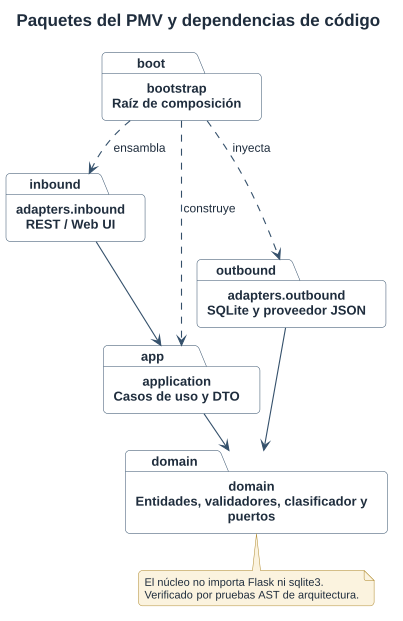
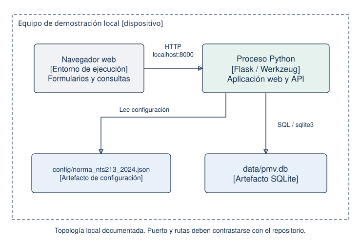
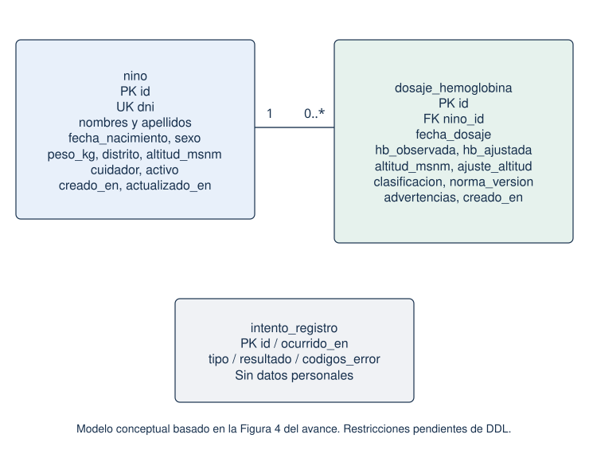
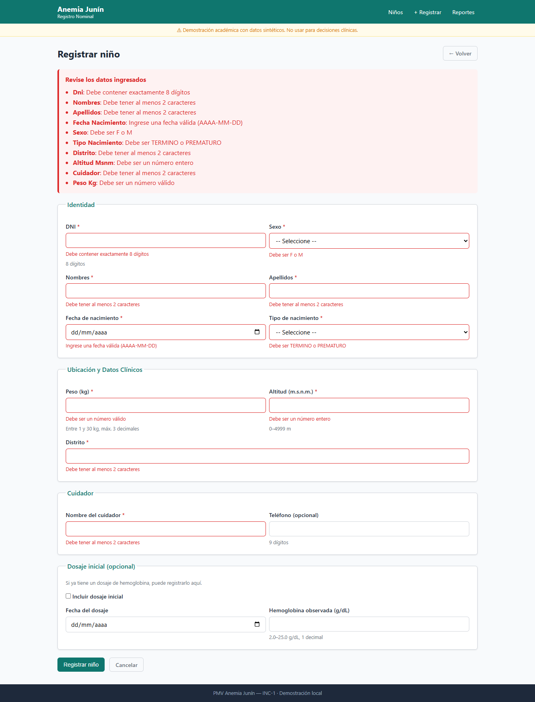
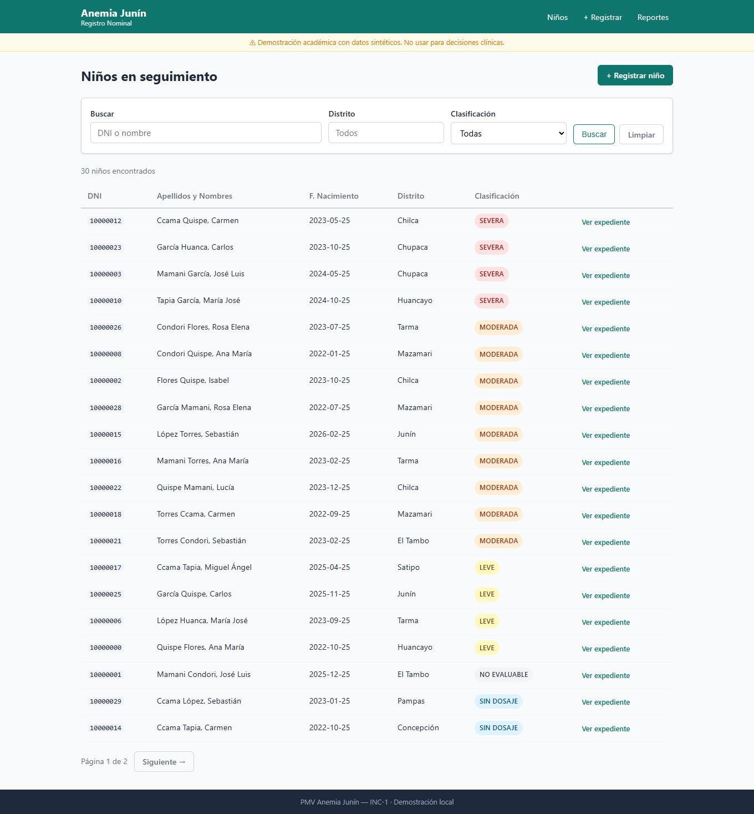
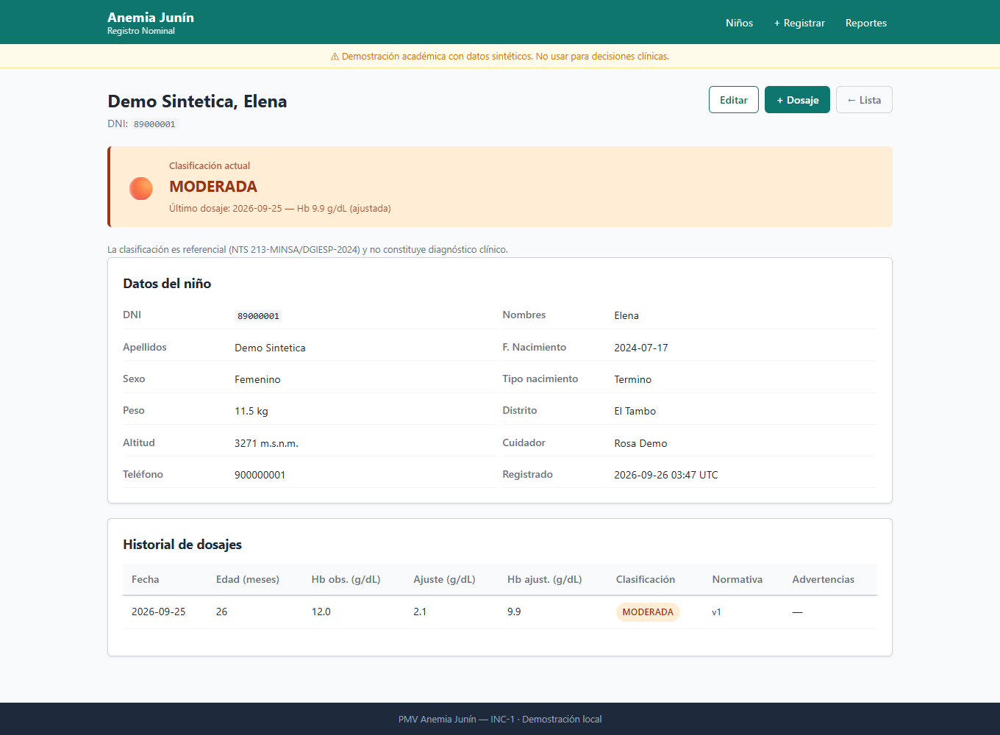
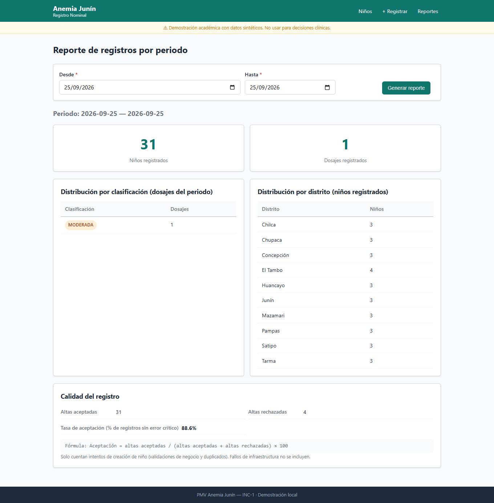

# Ejecución de los procesos principales del primer incremento

Sistema de detección temprana y seguimiento de anemia infantil en Junín

Universidad Continental · Ingeniería de Sistemas e Informática · Procesos de Software ASUC01702 · Ciclo 2026-20

| Integrante | Responsabilidad | Código |
| --- | --- | --- |
| Porras Veli, Ricardo | Proceso y coordinación | [PENDIENTE] |
| Auqui Huincho, Tania | Desarrollo y prototipado | [PENDIENTE] |
| Huamani Rodriguez, Jean Piero | Calidad y mejora | [PENDIENTE] |

Docente: [PENDIENTE]. Fecha de entrega: [PENDIENTE]. Corte de verificación técnica: 25 de septiembre de 2026.

El primer incremento implementa cinco historias de registro nominal y expediente digital. La aplicación funciona con Flask, Jinja2 y SQLite, separa dominio, casos de uso y adaptadores, y permite verificar el flujo en un navegador real. La suite de cierre aprueba 266 casos con cobertura de 96,69 %. Este informe presenta las cinco matrices de la guía S5 y relaciona cada producto de trabajo con su evidencia verificable.

La demostración utiliza exclusivamente datos sintéticos. La clasificación de hemoglobina es referencial y no reemplaza el criterio profesional. No se acredita reducción de anemia, despliegue institucional ni aceptación por personal de salud.

## 1 Delimitación de requisitos del PMV

### Matriz 1.1 Alcance del primer incremento

| ID e historia | Valor y riesgo | Criterio de aceptación verificable | Producto de trabajo |
| --- | --- | --- | --- |
| HIST-1.1 Como personal de salud quiero registrar un niño para iniciar su expediente | Alto / alto | Dado un DNI nuevo y datos válidos, cuando registro, entonces la API devuelve 201 y puedo consultar el expediente. Un DNI repetido produce 409 sin duplicación. | RegistrarNino, formulario, POST /api/v1/ninos y pruebas de alta/concurrencia |
| HIST-1.2 Como personal de salud quiero consultar y mantener el expediente para disponer de antecedentes | Alto / alto | Dado un expediente, cuando actualizo campos permitidos y agrego un dosaje, entonces persisten los cambios y el historial anterior permanece. DNI inexistente produce 404. | ConsultarExpediente, ActualizarNino y AgregarDosaje |
| HIST-1.3 Como personal de salud quiero validar datos antes de guardarlos para corregir errores | Alto / alto | Dada una fecha futura, peso no finito o Hb con precisión inválida, cuando envío, entonces recibo errores por campo y no se crea el expediente. La alta rechazada queda en la traza. | Validadores de dominio y regresiones DEV-101 |
| HIST-1.4 Como personal de salud quiero filtrar el seguimiento para revisar primero los casos de mayor severidad | Medio / medio | Dados niños de 6 a 59 meses, cuando filtro por distrito o clasificación, entonces el listado respeta filtros, paginación y orden de severidad del último dosaje. | ListarNinos, repositorio y pruebas de reloj/edad |
| HIST-1.5 Como coordinador quiero consultar registros de un periodo para revisar la calidad de captura | Medio / medio | Dado un periodo válido, cuando consulto, entonces aparecen conteos y aceptados/(aceptados+rechazados). Si no hay intentos, la tasa es no calculable. | ConsultarReporte, reporte HTML/JSON y pruebas de indicadores |

Prioridad: habilitadores y validación preceden al alta; expediente precede al listado y reporte. El alcance mantiene los 21 puntos del plan S3-4: 13 en Sprint 1 y 8 en Sprint 2. Los 113 horas-persona son estimación, no horas reales acreditadas.

Agenda y controles vencidos corresponden a INC-2; operación desconectada y sincronización a INC-3; WhatsApp a INC-4; predicción de abandono a INC-5; tablero territorial a INC-6. El semáforo actual representa clasificación de Hb y no riesgo predictivo.

## 2 Diseño arquitectónico y estructura de datos

### Matriz 2.1 Diseño del incremento

| Componente | Solución implementada | Artefacto | DoD y evidencia |
| --- | --- | --- | --- |
| Arquitectura | Núcleo Python, aplicación con DTO y puertos, adaptadores Flask/SQLite/JSON | ADR-001 y paquetes hexagonales | Ocho pruebas AST de dependencias aprobadas. La revisión humana de arquitectura sigue a cargo del equipo. |
| Datos | ninos, dosajes, intentos_registro y schema_version; DNI único e historial inmutable | migrations/001_initial.sql | Migración idempotente, rollback y concurrencia verificados sobre SQLite temporal |
| Contrato | Siete operaciones HTTP, JSON y errores por campo | openapi.yaml | Pruebas de rutas y esquemas de respuesta con jsonschema aprobadas |
| Interfaz | Jinja2, formularios CSRF, mensajes y redirección 303 | templates/ y static/ | Recorrido Chromium y suite web aprobados |
| Despliegue | Waitress en 127.0.0.1, archivo SQLite y normativa JSON | __main__.py y README | Arranque real, E2E HTTP, navegador y carga local ejecutados |







La raíz de composición bootstrap.crear_app inyecta repositorios, reloj y proveedor normativo. Los adaptadores de entrada llaman a los mismos casos de uso. La unidad de trabajo asegura atomicidad de niño y dosaje inicial. Un rechazo se registra en una transacción posterior al rollback, sin duplicar datos personales en la traza.

El código almacena peso en gramos y Hb en décimas enteras. Los dosajes conservan la versión de reglas y sus advertencias. Las bandas de altitud marcadas sin verificar mantienen una advertencia visible; una prueba de software no certifica la exactitud clínica de la tabla.

### Contratos de interfaz

| Método y ruta bajo /api/v1 | Función | Respuestas principales |
| --- | --- | --- |
| GET /salud | Arranque y conectividad con SQLite | 200 |
| POST /ninos | Alta atómica y dosaje opcional | 201, 400, 409, 415 |
| GET /ninos | Seguimiento y filtros | 200, 400 |
| GET /ninos/{dni} | Expediente e historial | 200, 404 |
| PATCH /ninos/{dni} | Cambios permitidos | 200, 400, 404, 415 |
| POST /ninos/{dni}/dosajes | Nuevo dosaje | 201, 400, 404, 415 |
| GET /reportes/registros | Reporte por desde/hasta | 200, 400 |

## 3 Construcción e implementación

### Matriz 3.1 Control de construcción

| Módulo | Tecnología y rama | Producto | DoD verificado |
| --- | --- | --- | --- |
| Dominio y aplicación | Python ≥3.12; avance integrado desde desarrollo-anemia mediante PR #1 | domain/ y application/ | Unitarias y reglas de arquitectura aprobadas |
| Web y REST | Flask, Jinja2 y Flask-WTF; misma integración | adapters/inbound/, templates/, openapi.yaml | Validación por campo, CSRF web y contrato probado |
| Persistencia | SQLite, SQL versionado; misma integración | adapters/outbound/sqlite/ y migrations/ | Restricción de unicidad, transacciones y recuperación verificadas |
| Calidad y ejecución | pytest, Ruff, Locust y Playwright | tests/, scripts/ y docs/evidencias/ | Evidencias reproducibles de la sesión de cierre |

El repositorio remoto registrado es [ProcesosSoftwareAnemia](https://github.com/woshtsu/ProcesosSoftwareAnemia). La base integrada corresponde a 67f2c01 y el avance principal a b6c6db2. Las correcciones de esta sesión están en el árbol de trabajo; todavía no constituyen un commit/tag de entrega. Para nuevos cambios se propone rama codex/<tema>, revisión y merge por el equipo. No se atribuye aprobación humana a un resultado automático.

DEV-101 se corrigió validando finitud y capturando InvalidOperation de Decimal. Se añadieron 24 regresiones: 12 de dominio, 6 de API y 6 de formulario. Los intentos de alta inválidos preservan la traza de calidad y no crean expedientes. API devuelve 400 y web devuelve 422 conforme a sus contratos existentes.

## 4 Evidencia de pruebas e integración

### Matriz 4.1 Registro de pruebas del PMV

Entorno de cierre: Windows, Python 3.13.7, SQLite temporal por prueba, pytest 8.3.5. Registro completo en anemia_junin/docs/evidencias/pytest_cierre.txt. La suite usa datos sintéticos y no la base de demostración del usuario.

| ID de evidencia | Tipo y escenario | Esperado | Resultado real y DoD |
| --- | --- | --- | --- |
| EV-01 | Dominio: validadores, clasificación y fronteras | Rechazar datos inválidos y aplicar reglas configuradas | 120 casos aprobados |
| EV-02 | API y contrato: alta, consulta, cambios, filtros y reporte | Códigos HTTP y esquemas correctos | 66 casos aprobados |
| EV-03 | Web: formularios, CSRF, errores y advertencias | Redirección válida y error visible por campo | 39 casos aprobados |
| EV-04 | Persistencia: migraciones, rollback, reloj y concurrencia | Integridad y consulta reproducibles | 24 casos aprobados |
| EV-05 | Arquitectura | Núcleo sin dependencia de Flask/SQLite/adaptadores | 8 casos aprobados |
| EV-06 | Arranque y scripts | Configuración y tratamiento de errores correctos | 7 casos aprobados |
| EV-07 | E2E HTTP real y smoke | Flujo completo con servidor y cookies | 2 casos aprobados |
| EV-08 | Navegador Chromium 149 | Alta, consulta, edición, dosaje, rechazo, reporte y móvil | Recorrido aprobado, capturas y navegador.json |
| EV-09 | Carga Locust, 20 usuarios, 60 s, rampa 5/s | Sin errores y p95 < 2000 ms | Véase tabla de carga del cierre |
| EV-10 | Ruff y cobertura | Sin hallazgos, cobertura ≥80 % | Ruff aprobado; 1315/1360 = 96,69 % |

Los 266 casos corresponden únicamente a pytest; el recorrido Chromium y Locust son ejecuciones adicionales y no se suman como si fueran casos de esa suite. La cobertura mide sentencias ejecutables bajo la configuración del proyecto y no demuestra ausencia total de defectos.

### Resultados de carga

CARGA_CIERRE

Perfil: dos clases de usuarios (personal y coordinación), consultas de listas/expedientes/reportes y escrituras de altas/dosajes, con espera entre 0,5 y 2 segundos. Entorno local Waitress de 8 hilos y base sintética independiente. Los resultados no se extrapolan a una posta ni a una red rural.



## 5 Despliegue y entrega de valor

### Ejecución reproducible

Desde anemia_junin/:

```powershell
python -m venv .venv
.venv\Scripts\python.exe -m pip install -e ".[dev]"
.venv\Scripts\python.exe scripts/cargar_datos_sinteticos.py --db instance/demo_nueva.db
.venv\Scripts\python.exe -m anemia_junin --db instance/demo_nueva.db
```

Abrir http://127.0.0.1:8000/. La siembra exige una base sin niños; para otra demostración utilizar una ruta nueva. Las migraciones se aplican al iniciar. Para detener, Ctrl+C. El README del PMV detalla configuración, pruebas, respaldos y limitaciones.

### Matriz 5.1 Valor operativo generado

| Incremento y función | Resultado directo | Indicador y evidencia | Límite de interpretación |
| --- | --- | --- | --- |
| INC-1 registro validado | Expediente único y rechazo de datos incorrectos | Demo Chromium: 31 aceptados, 4 rechazados, 35 intentos; 88,6 % de aceptación | Datos sintéticos; incluye 30 altas de siembra y una de navegador |
| INC-1 expediente y dosajes | Historial consultable y cambios persistidos | Alta, recarga, edición y dosaje aprobados en navegador | No equivale a adopción por personal de salud |
| INC-1 listado | Filtrado y orden según clasificación actual | API, persistencia y pantalla verificadas | No es agenda ni predicción de abandono |
| INC-1 reporte | Denominadores explícitos y conteos por periodo | Captura del reporte y JSON de evidencia | Niños por fecha de registro; dosajes por fecha clínica |
| INC-1 tiempo de respuesta | Aplicación responde bajo carga local | Percentiles y solicitudes/s de EV-09 | El tiempo automatizado de captura no mide habilidad humana |







### Revisión de terminación

La construcción y verificación técnica del alcance están documentadas. La aceptación por usuario final, las firmas del equipo y la verificación clínica de tablas quedan pendientes de sus responsables. El hito de aceptación H1 no se declara cumplido por ejecutar pruebas automáticas. Antes de uso institucional se requieren autenticación, roles, protección de datos, respaldos operativos y validación clínica.

## 6 Referencias y trazabilidad

Fuente académica primaria: guía de trabajo S5 descargada del aula virtual, actividades 1 a 5 y rúbrica. Fuentes de implementación: código del repositorio, ADR-001/002, openapi.yaml, migrations/001_initial.sql y evidencias de cierre. Planificación: entregable S3-4, tablas 11–24. El PDF anterior de Actividad 5 se conserva como antecedente; sus cifras y rutas no representan esta implementación.

La matriz historia-caso de uso-prueba se encuentra en anemia_junin/docs/trazabilidad.md. La revisión de cada requisito de la guía se conserva en CHECKLIST_CUMPLIMIENTO_S5.md.
