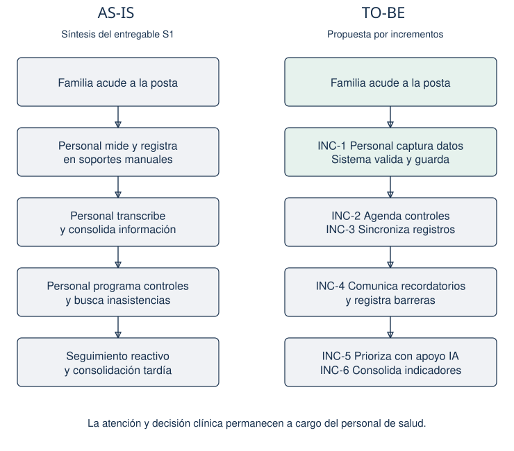
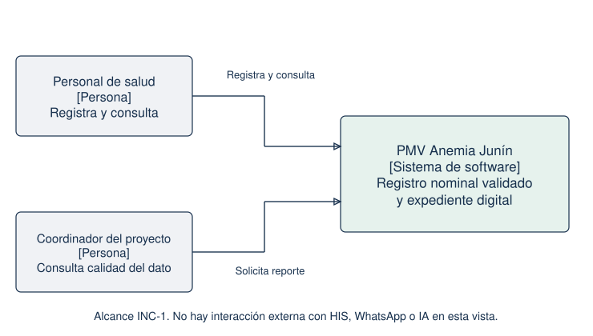
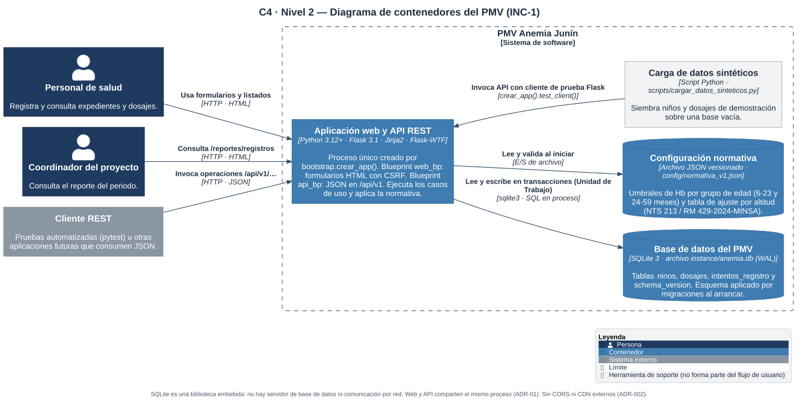
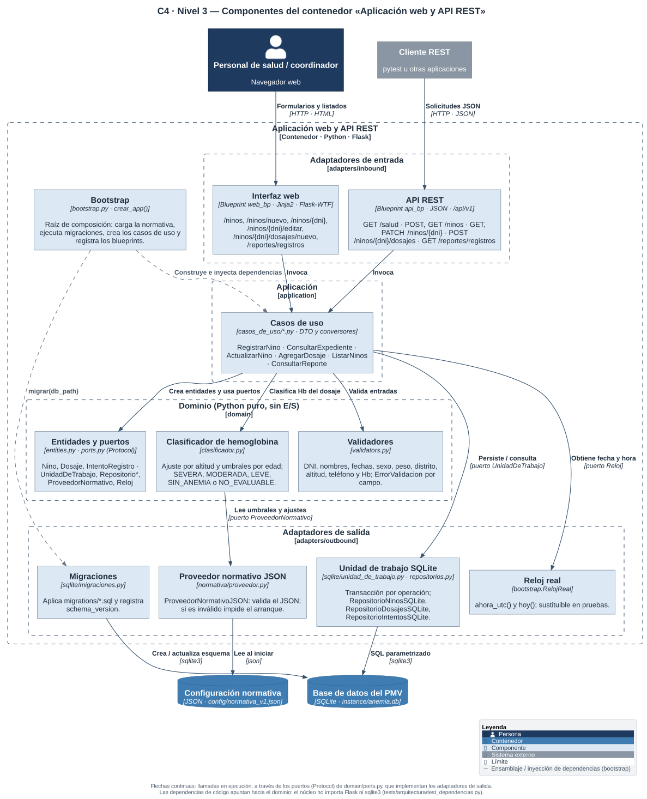
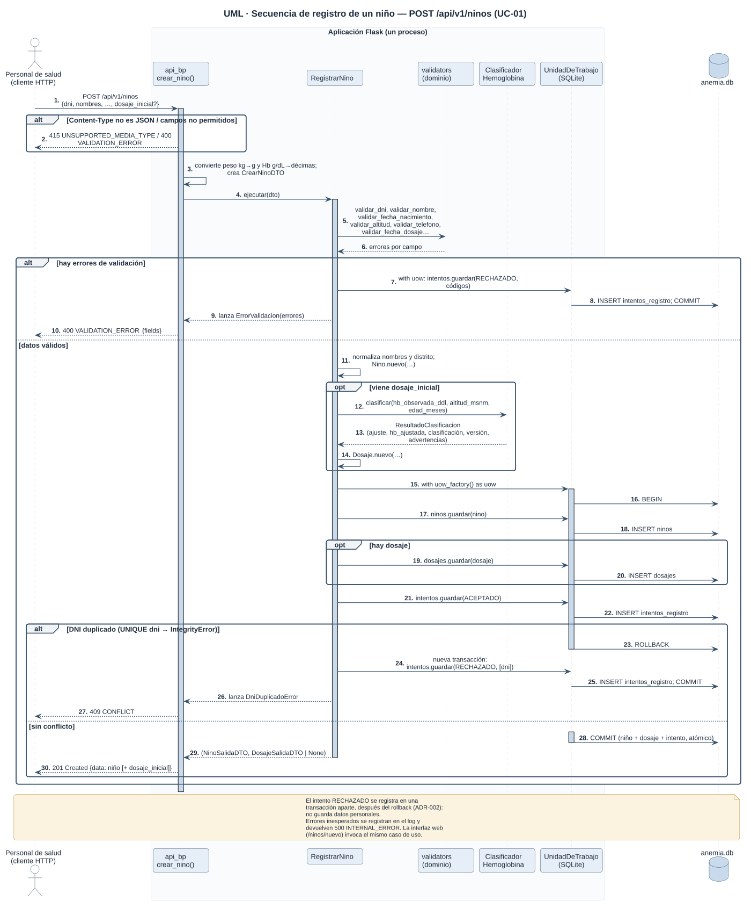

# Informe académico integrador de las Unidades I y II

Diseño e implementación del proceso de software con entrega de valor

Sistema de detección temprana y seguimiento de anemia infantil en Junín

| Datos académicos | Información |
| --- | --- |
| Universidad y carrera | Universidad Continental, Ingeniería de Sistemas e Informática |
| Asignatura | Procesos de Software ASUC01702, noveno ciclo, 2026-20 |
| Organización de referencia | Posta rural de Junín; establecimiento no identificado en los antecedentes |
| Docente | [PENDIENTE: nombre del docente] |
| Fecha de entrega | [PENDIENTE: fecha académica] |
| Corte de evidencias | 25 de septiembre de 2026 |

| Integrante | Rol | Código |
| --- | --- | --- |
| Porras Veli, Ricardo | Ingeniero de Proceso | [PENDIENTE] |
| Auqui Huincho, Tania | Ingeniero de Desarrollo y Prototipado | [PENDIENTE] |
| Huamani Rodriguez, Jean Piero | Ingeniero de Calidad y Mejora del Proceso | [PENDIENTE] |

## 1 Resumen ejecutivo y alcance del proyecto

El proyecto aborda la discontinuidad del seguimiento de anemia infantil en zonas rurales de Junín. El diagnóstico identifica registros fragmentados, programación manual, barreras familiares poco visibles y conectividad intermitente. La propuesta conserva las decisiones clínicas bajo responsabilidad profesional y utiliza software para mejorar la trazabilidad del proceso.

El proceso seleccionado es iterativo e incremental, gestionado con Scrum y prácticas de ingeniería DevOps. El primer incremento implementa registro nominal validado, expediente y dosajes, listado de seguimiento y reporte del periodo. La arquitectura hexagonal separa el núcleo Python de Flask y SQLite. Agenda, operación desconectada, WhatsApp, predicción de abandono y tablero territorial pertenecen a incrementos posteriores.

La verificación local aprueba 266 pruebas y alcanza 96,69 % de cobertura. Incluye contrato OpenAPI, concurrencia, arquitectura, E2E HTTP y regresiones de entradas numéricas. Un recorrido adicional con Chromium comprueba la operación de las pantallas, y una prueba Locust mide el comportamiento con 20 usuarios durante 60 segundos. Las evidencias completas permanecen en el repositorio.

La demostración registra 31 altas aceptadas y 4 intentos rechazados, equivalentes a 88,6 % de aceptación de captura. Este resultado corresponde a datos sintéticos y no demuestra mejora asistencial. La clasificación de hemoglobina es referencial; se mantienen advertencias para reglas sin verificar. La aceptación del usuario final, los datos académicos de portada y el commit/tag de liberación requieren cierre por el equipo.

## 2 Unidad I Fundamentos y diseño del proceso de software

### 2.1 Enfoque de procesos de la organización

#### Diagnóstico y matriz de actores

El problema central no termina en detectar un resultado de Hb: la medición debe conducir a decisiones, controles y seguimiento oportuno. La historia clínica, la tarjeta y la digitación posterior dispersan antecedentes y dificultan conocer las barreras que impiden completar la atención.

| Actor | Necesidad | Intervención y alcance |
| --- | --- | --- |
| Niño o niña | Continuidad de atención | Beneficiario del proceso; no opera la interfaz |
| Familia y cuidador | Indicaciones comprensibles y comunicación de barreras | Proporciona datos al personal; interacción digital futura |
| Personal de salud | Antecedentes y decisiones oportunas | Opera registro, expediente y dosajes en INC-1 |
| Agente comunitario | Visitas priorizadas y registro de barreras | Captura de campo prevista desde INC-3 |
| Gestión territorial | Cobertura y asignación de recursos | Tablero territorial previsto en INC-6 |
| MINSA | Información consolidada y supervisión | Integración HIS futura, sin conexión implementada |
| Coordinador del proyecto | Calidad de datos y evidencia de avance | Consulta el reporte local de INC-1 |

#### Procesos AS-IS y TO-BE

En el AS-IS la familia acude a la posta, el personal revisa antecedentes, decide si corresponde control o tamizaje y registra resultados. La familia cumple indicaciones en casa y el agente reporta visitas. Gestión consolida datos con demora. El seguimiento y cierre dependen de registros manuales y de la comunicación entre actores. Los diagramas completos por carriles se encuentran en S1, figuras 2 y 7.

| Brecha | Mejora TO-BE | Intervención del software | Estado |
| --- | --- | --- | --- |
| B1 Registro fragmentado y duplicidad | M1 Registro nominal único validado | Expediente, identidad única, dosajes e indicador | Implementación local INC-1; no elimina el registro institucional en HIS |
| B2 Agenda manual | M2 Controles programados | Agenda según reglas y alertas de vencimiento | INC-2 |
| B3 Barreras familiares ocultas | M3 Comunicación y confirmación | Recordatorios y reporte de barreras | INC-4 |
| B4 Capacidad limitada de visitas | M4 Visita estructurada y priorizada | Registro de campo y criterios de prioridad | INC-3 y evolución posterior |
| B5 Ausencia de anticipación de abandono | M5 Riesgo explicable | Modelo predictivo y evaluación profesional | INC-5; el semáforo actual no lo implementa |
| B6 Conectividad y consolidación tardía | M6 Captura local y sincronización | Eventos, reconciliación y tablero | INC-3/6; SQLite local actual no sincroniza |

La entrada al TO-BE son datos del niño, dosajes, respuestas familiares y visitas. Las mejoras validan el registro y proponen acciones; el profesional toma decisiones clínicas. El resultado esperado es seguimiento continuo y cierre documentado. El valor esperado es menor pérdida de seguimiento y mejor uso del personal. Estos resultados organizacionales requieren medición futura.

#### Cadena de valor e indicadores

La cadena conecta entrada, actividad, resultado, decisión, acción y valor. En INC-1 se verifica la calidad de la entrada y su conservación en el expediente. Las etapas de agenda, visitas y recuperación de la visión completa aún no tienen evidencia de impacto.

| Tipo | Indicador y fórmula | Evidencia o medición prevista |
| --- | --- | --- |
| Proceso | SP aceptados / SP comprometidos ×100 | Plan INC-1: 21 SP. Aceptación humana pendiente, porcentaje no calculado |
| Producto | Sentencias cubiertas / sentencias medidas ×100 | 1315/1360 = 96,69 % |
| Producto | Altas aceptadas / intentos evaluados ×100 | 31/35 = 88,6 % en demo sintética |
| Resultado | Controles realizados dentro del plazo / controles programados ×100 | Requiere agenda INC-2 y línea base |
| Valor | Niños sin seguimiento / niños activos ×100 | Requiere cohorte, periodo y acuerdo del establecimiento |
| Valor | Recuperaciones documentadas / casos seguidos ×100 | No se ha medido en personas reales |

### 2.2 Selección y comparación del modelo de procesos

#### Factores del proyecto

| Factor | Condición del proyecto | Consecuencia de proceso |
| --- | --- | --- |
| Incertidumbre | Reglas, barreras y operación rural por validar | Incrementos pequeños y revisión frecuente |
| Complejidad | Datos, reglas y futura sincronización | Diseño modular, contratos y pruebas por nivel |
| Riesgo | Pérdida de información y decisiones incorrectas | Validaciones, trazabilidad normativa y control profesional |
| Integración | HIS y WhatsApp futuros | Aislar adaptadores, no inventar integración en INC-1 |
| Datos e IA | Etiquetas de abandono y datos institucionales aún no disponibles | MLOps solo desde INC-5, sujeto a viabilidad de datos |
| Equipo y operación | Tres integrantes y conectividad limitada | Roles agrupados y demostración local inicial |

#### Comparación de alternativas

| Modelo o enfoque | Ventaja en este proyecto | Limitación y decisión |
| --- | --- | --- |
| Cascada | Hitos y documentación anticipada | Retroalimentación tardía ante incertidumbre; no se adopta como base |
| Iterativo incremental | Entrega valor parcial y permite corregir hipótesis | Requiere arquitectura y control de dependencias; base seleccionada |
| Scrum | Prioriza backlog y revisión por sprint | No define por sí solo ingeniería, pruebas o despliegue; se usa para gestión |
| DevOps | Repetibilidad de pruebas e integración | Pipeline remoto aún pendiente; se aplican prácticas locales verificables |
| MLOps | Versiona datos/modelos y monitorea sesgos | No aporta hasta disponer de modelo y datos; previsto para INC-5 |

#### Selección y adaptación

Se adopta base iterativa incremental, sprints de dos semanas y DoD técnico de cobertura ≥80 %, pruebas aprobadas y revisión del producto. Scrum organiza el trabajo; pytest, Ruff y scripts reproducibles sostienen la ingeniería. El equipo utiliza un monolito modular para reducir el costo operativo del PMV. La entrega local se distingue del piloto institucional, condicionado a seguridad, operación de campo y validación.

El ciclo identifica entrada, planificación, desarrollo, integración, pruebas, retroalimentación, entrega, medición, mejora y repetición. INC-1 precede a agenda, offline, mensajería, predicción y tablero. El subciclo MLOps futuro exige validación de datos, entrenamiento, evaluación con especialistas, publicación y monitoreo; no forma parte de la entrega actual.

### 2.3 Actividades responsabilidades y planificación

#### Actividades entradas productos y criterios de terminación

| Actividad | Entrada | Producto y salida | DoD |
| --- | --- | --- | --- |
| Planificar y refinar | TO-BE y backlog | Historias priorizadas y Sprint Backlog | Alcance acotado y criterios Given-When-Then verificables |
| Diseñar | Historias y NFR | ADR, paquetes, C4, datos y OpenAPI | Coherencia entre contrato y arquitectura; revisión de equipo |
| Construir | Diseño y criterios | Código versionado | Pruebas pertinentes y Ruff aprobados |
| Integrar y probar | Código y casos | Versión integrada, cobertura y defectos | Sin fallos en la suite, cobertura ≥80 %, errores críticos corregidos |
| Desplegar y demostrar | Versión y configuración | PMV local y capturas | Arranque reproducible y flujo funcional verificado |
| Revisar con usuario | PMV y criterios | Acta de aceptación u observaciones | Revisión humana documentada; pendiente |
| Medir y mejorar | Evidencias y desviaciones | Indicadores y plan actualizado | Distinguir ejecución real, plan y simulación |

#### Matriz RAE

E ejecuta, R revisa y A aprueba. Los nombres mantienen los roles definidos por el equipo; la tabla asigna responsabilidades y no acredita que las firmas ya existan.

| Actividad | E | R | A |
| --- | --- | --- | --- |
| Plan y requisitos | Porras | Auqui y Huamani | Porras |
| Arquitectura y código | Auqui | Huamani | Porras |
| Pruebas y defectos | Huamani | Auqui | Porras |
| Despliegue local | Auqui | Huamani | Porras |
| Aceptación funcional | Porras | Huamani | Usuario designado, pendiente |
| Mejora del proceso | Porras | Auqui y Huamani | Equipo |

#### WBS estimación y prioridades

El plan de S3-4 descompone Proyecto, Entregables, Incrementos, Épicas, Historias y Tareas. INC-1 incluye EP-1.T habilitadores, EP-1.B validación, EP-1.A registro/expediente y EP-1.C seguimiento/reporte. Las tareas T01–T16 cubren ADR, migración, calidad, normativa, validadores, clasificador, API, web, expediente, listado, reporte y demostración.

| Plan | Puntos | Horas-persona estimadas | Fechas propuestas |
| --- | --- | --- | --- |
| Sprint 1 | 13 | 69 | 01–14 septiembre 2026 |
| Sprint 2 | 8 | 44 | 15–28 septiembre 2026 |
| INC-1 | 21 | 113 | 28 días calendario |

Los puntos no se convierten directamente en horas. No hay registro de horas reales del equipo. La ruta crítica incluye A01, A02, A06, A07, A09, A10/A11, A12, A13, A14, A15, A17, A18, A19, A20 y A21. A10 y A11 son ramas críticas paralelas. El hito H1 es aceptación prevista, no aceptación acreditada.

| Incremento | Puntaje ponderado | Orden y razón |
| --- | --- | --- |
| INC-1 Registro | 4,60 | Primero; habilita datos y expedientes |
| INC-3 Offline | 4,40 | Prioridad rural alta; calendario después de agenda para demo local |
| INC-2 Agenda | 4,15 | Siguiente incremento de la línea base |
| INC-4 Mensajería | 3,40 | Requiere agenda y gestión de barreras |
| INC-5 Predicción | 3,35 | Requiere datos y etiquetas evaluables |
| INC-6 Tablero | 2,75 | Depende de datos operativos de los incrementos anteriores |

Pesos: valor 30 %, reducción de riesgo 25 %, dependencia 20 %, complejidad inversa 15 % y validación 10 %. El cronograma de ocho sprints termina el 21/12/2026 como propuesta académica. La priorización debe revisarse antes de un piloto rural porque INC-3 resuelve conectividad.

#### Seguimiento y control de desviaciones

| Desviación | Acción aplicada o prevista | Responsable |
| --- | --- | --- |
| Informe anterior describe unittest y 49 pruebas | Conciliar documentación con Flask/pytest y evidencia actual | Calidad y Proceso |
| Diagramas enlazados no existían | Generar fuentes, SVG y PNG y validar enlaces | Desarrollo y Proceso |
| Número inválido generaba 500 | Corregir Decimal y añadir 24 regresiones, DEV-101 | Desarrollo y Calidad |
| Despliegue local frente a visión rural | Mantener offline, roles y piloto en backlog explícito | Proceso |
| Resultados clínicos sin línea base | No calcular impacto hasta definir cohorte y medición | Usuario y Proceso |

El burndown ilustra el mecanismo de seguimiento solicitado por la guía; su serie es simulada. El avance real se acredita con código y pruebas, pero la velocidad aceptada y las horas consumidas siguen sin registro. El equipo compara plan, ejecución, medición y desviación para asignar acciones correctivas.

## 3 Unidad II Implementación y adaptación práctica del proceso

### 3.1 Categorización normativa y sastrería

Se utiliza la clasificación pedagógica de la consigna, sin afirmar certificación ISO/IEC 12207.

| Categoría | Actividades | Evidencia |
| --- | --- | --- |
| Principales | Requisitos, diseño, construcción, integración/pruebas y despliegue | Matrices S5, código, API, migración y demo |
| Soporte | Documentación, configuración, verificación, revisión y resolución de problemas | Git, ADR, checklists, DEV-101 y resultados |
| Organizacionales y gestión | Planificación, infraestructura, coordinación y mejora | RAE, cronograma, tablero y guion de defensa |

| Restricción | Tailoring adoptado | Control y efecto |
| --- | --- | --- |
| Equipo de tres integrantes | Agrupar arquitectura, backend y frontend en Desarrollo | Calidad revisa; Proceso coordina |
| Alcance de INC-1 | Monolito Flask con núcleo hexagonal | Evita distribución prematura; conserva puertos para evolución |
| Demostración local | SQLite y Waitress en loopback | Reproducción simple; no se afirma operación offline distribuida |
| Normativa variable | JSON versionado por dosaje | Advertencias y pruebas de frontera; validación clínica separada |
| Entorno de pruebas | pytest, Ruff, Locust y Chromium | Logs y versiones instaladas conservados |
| Usuario final no disponible | Verificación técnica automatizada | Aceptación humana permanece abierta |

### 3.2 Arquitectura del primer incremento

#### Decisiones y atributos de calidad

| Registro real | Decisión | Atributo y comprobación |
| --- | --- | --- |
| ADR-001 | Dominio y aplicación dependen de puertos; adaptadores implementan infraestructura | Mantenibilidad; ocho pruebas AST de dependencias |
| ADR-002 | Monolito local, SQLite, Hb entera en décimas, peso en gramos | Integridad; migraciones, rollback y unicidad |
| ADR-002 | Clasificación referencial y configuración versionada | Trazabilidad; versión y advertencias por dosaje |
| ADR-002 | Formularios CSRF, sin cuentas diferenciadas ni servicios externos | Alcance de seguridad explícito; pruebas CSRF |

UI y API comparten un proceso Flask y los mismos casos de uso. SQLite es almacenamiento embebido y no un servidor HTTP. El script de datos llama a la API mediante el cliente de prueba Flask; no evita las validaciones. Las flechas de C4-3 representan llamadas por puertos y no imports hacia infraestructura.

El esquema reside en migrations/001_initial.sql: ninos, dosajes, intentos_registro y schema_version. DNI es único; un niño admite cero o más dosajes. Un intento rechazado no necesita FK a un expediente inexistente. La edición no modifica identidad ni dosajes anteriores.

| Método y ruta bajo /api/v1 | Contrato |
| --- | --- |
| GET /salud | Estado del servidor y base |
| POST /ninos | 201; errores 400, conflicto 409, tipo 415 |
| GET /ninos | Lista paginada, filtros, 200/400 |
| GET /ninos/{dni} | Expediente, 200/404 |
| PATCH /ninos/{dni} | Campos permitidos, 200/400/404/415 |
| POST /ninos/{dni}/dosajes | Historial, 201/400/404/415 |
| GET /reportes/registros | Periodo e indicadores, 200/400 |

OpenAPI se encuentra en anemia_junin/openapi.yaml y sus pruebas verifican rutas y esquemas. La falta de dosaje produce SIN_DOSAJE, no SIN_ANEMIA. Los registros menores de seis meses se conservan, aunque el listado de seguimiento se limita a 6–59 meses. La configuración clínica se describe como implementación referencial pendiente de revisión especializada.

### 3.3 Estrategia y ejecución de pruebas

La estrategia concentra validaciones en dominio, integra persistencia/API y verifica recorridos completos con HTTP y Chromium. Los casos más costosos se complementan con carga local. No se utiliza SonarCloud ni se atribuye a Ruff una certificación de seguridad.

| Nivel | Casos pytest aprobados | Evidencia |
| --- | --- | --- |
| Dominio | 120 | Validaciones y clasificador |
| API y contrato | 66 | Endpoints, esquemas y entradas |
| Interfaz web | 39 | Formularios, CSRF y advertencias |
| Persistencia | 24 | Repositorios, migraciones, reloj y concurrencia |
| Arquitectura | 8 | Reglas de importación |
| Arranque y scripts | 7 | Configuración y manejo de errores |
| E2E HTTP | 2 | Servidor real y smoke |
| Total | 266 | pytest_cierre.txt |

Cobertura: 1315 de 1360 sentencias, 96,69 %, por encima del DoD de 80 %. Ruff: sin hallazgos. Entorno: Windows y Python 3.13.7. La evidencia corresponde a la base 67f2c01 más correcciones locales del cierre, todavía sin commit de liberación.

El script verificar_navegador.py abre Chromium 149 y verifica alta con CSRF, consulta, edición persistida, dosaje, rechazo, reporte y viewport móvil. El registro automatizado tardó 0,232 s en esta ejecución; no representa tiempo de un operador humano ni acredita el criterio de usabilidad de tres minutos.

CARGA_CIERRE

Carga de 20 usuarios, rampa 5/s y 60 s sobre Waitress de 8 hilos y SQLite independiente. Perfil con consultas y escrituras; esperas entre 0,5 y 2 s. Evidencias y versiones en docs/evidencias/cierre/. El resultado corresponde al equipo local y no mide conectividad rural.

| Defecto o control | Estado de cierre |
| --- | --- |
| DEV-101 números no finitos o desbordados | Corregido; 24 regresiones verifican rechazo y no persistencia |
| Conflicto por DNI simultáneo | Pruebas de concurrencia aprobadas; se conserva un expediente |
| Cifras heredadas de 49 pruebas | Sustituidas por ejecución actual; antecedente conservado en archivo |
| Bandas normativas no verificadas | Advertencia implementada; verificación clínica aún pendiente |

### 3.4 Despliegue y demostración del PMV

El punto de entrada python -m anemia_junin levanta Waitress en 127.0.0.1:8000. Las migraciones se aplican automáticamente. La carga sintética exige una base sin niños. README documenta instalación, configuración, scripts y pruebas. El entorno local satisface la demostración técnica de la guía S5; no constituye un despliegue en la posta.

Guion de demo: abrir lista, registrar niño, comprobar errores, consultar expediente, editar datos, agregar dosaje y revisar reporte. El recorrido técnico conserva 31 altas y 4 rechazos. El reporte cuenta niños por fecha de registro y dosajes por fecha clínica; por ello los dosajes históricos de la siembra no se confunden con el dosaje del día. El acta de aceptación por usuario final sigue pendiente.

## 4 Matriz de trazabilidad integral y generación de valor

| Problema y TO-BE | Modelo y categoría | Decisión y prueba | PMV e indicador |
| --- | --- | --- | --- |
| B1 Duplicidad, M1 identidad única | Incremental; principal construcción y soporte pruebas | ADR-002; concurrencia y API | HIST-1.1, expediente único por DNI |
| B1 Captura inválida, M1 validación | DevOps local; verificación | ADR-001/002; regresiones DEV-101 | HIST-1.3, 31/35 intentos aceptados en demo |
| B1 Antecedentes dispersos, M1 expediente | Incremental; diseño y persistencia | ADR-001; repositorios y Chromium | HIST-1.2, cambios e historial conservados |
| B5 Información poco visible | Tailoring de alcance; construcción | ADR-002; pruebas listado/reloj | HIST-1.4, severidad actual y filtros, sin predicción |
| B6 Consolidación tardía | Gestión de medición; soporte reporte | ADR-002; API y reporte | HIST-1.5, conteos y denominadores explícitos |
| B2/B3/B4/B6 Agenda, barreras y campo | Incrementos futuros | Nuevos contratos y pruebas por definir | INC-2/3/4/6, impacto todavía no medido |
| B5 Riesgo de abandono | MLOps desde INC-5 | Evaluación temporal y clínica futura | Modelo pendiente de datos y etiquetas |

La entrega técnica facilita trazabilidad de datos; la mejora organizacional requiere despliegue, adopción y seguimiento longitudinal. Las metas de cobertura y pérdida de seguimiento de S3-4 son propuestas, no acuerdos institucionales ni resultados observados.

## 5 Conclusiones y lecciones aprendidas

### Tres conclusiones técnicas

1. El núcleo hexagonal permite usar la misma lógica desde HTML y REST y verificar sus dependencias. SQLite y Waitress sostienen una demostración local del primer incremento con un despliegue acotado.
2. La suite de 266 casos, el recorrido Chromium y la carga local aportan evidencia de operatividad. El defecto DEV-101 demuestra por qué cobertura alta no reemplaza revisión de casos límite ni certifica exactitud clínica.
3. El indicador 88,6 % mide aceptación de captura sintética. El proceso conserva la relación entre brecha, funcionalidad, prueba e indicador sin atribuir al PMV reducción de anemia o predicción de abandono.

### Tres lecciones aprendidas

1. Código, diagramas y documentos deben actualizarse juntos. Una cifra de prueba sin versión y evidencia puede describir una implementación anterior.
2. Cada desviación necesita responsable, decisión y comprobación de cierre. La corrección de números inválidos quedó acompañada por regresiones de dominio, API y web.
3. Planes, simulaciones y aceptación humana deben registrarse por separado. Un burndown simulado o un test aprobado no sustituye horas reales ni firma del usuario.

El siguiente incremento de la línea base es agenda y alertas internas (INC-2). Antes de un piloto rural se debe revisar la prioridad de offline/sincronización y validar reglas, protección de datos y operación institucional.

## 6 Anexos y repositorio de código

| Elemento | Ubicación o estado |
| --- | --- |
| Repositorio | https://github.com/woshtsu/ProcesosSoftwareAnemia |
| Versión examinada | 67f2c01 más cambios locales de cierre; historial anterior b6c6db2 |
| Tag v1.0-PMV | Pendiente de commit, revisión y etiquetado del equipo |
| Ejecución | anemia_junin/README.md y __main__.py |
| Datos y contrato | migrations/001_initial.sql, scripts/cargar_datos_sinteticos.py y openapi.yaml |
| Evidencias | docs/evidencias/pytest_cierre.txt, ruff_cierre.txt y cierre/ |
| Defensa | Presentacion_Integrador_Anemia_Junin.md; siete diapositivas derivadas |
| Aceptación humana | Pendiente de usuario designado y acta |

Fuentes primarias del informe: guías S1, S2, S3-4, S5 y consigna integradora descargadas del aula virtual; entregables semanales; código, ADR y pruebas del repositorio. Las referencias normativas conservadas en config/normativa_v1.json y en S1 describen la procedencia declarada de reglas; este informe no sustituye su validación clínica. Los antecedentes del integrador anterior se conservan en archivo/versiones-anteriores/semana-06-integrador/.
