# INFORME ACADÉMICO INTEGRADOR: UNIDADES I Y II

**DISEÑO E IMPLEMENTACIÓN DEL PROCESO DE SOFTWARE CON ENTREGA DE VALOR**

|  |  |
| --- | --- |
| **CARRERA** | Ingeniería de Sistemas e Informática |
| **ASIGNATURA** | Procesos de Software (ASUC01702) – Noveno Ciclo, periodo 2026-20 |
| **PROYECTO DE ASIGNATURA** | Sistema Inteligente para Detección Temprana de Anemia Infantil en Zonas Rurales de Junín (PMV, Incremento 1) |
| **FECHA DE ENTREGA** | [COMPLETAR: fecha de entrega DD/MM/AAAA — ver PASOS_MANUALES paso 1] |
| **DOCENTE** | [COMPLETAR: apellidos y nombres del docente — ver PASOS_MANUALES paso 1] |
| **VERSIÓN DEL INFORME** | 01/10/2026, rama `feature/s6-integrador-final` |

**INTEGRANTES DEL EQUIPO**

**Tabla 1.** Integrantes, códigos y roles del equipo.

| N.° | Apellidos, Nombres | Código | Rol en el proyecto |
| --- | --- | --- | --- |
| 1 | Porras Veli, Ricardo | [COMPLETAR: código de alumno — ver PASOS_MANUALES paso 1] | Ingeniero de Proceso |
| 2 | Auqui Huincho, Tania | [COMPLETAR: código de alumno — ver PASOS_MANUALES paso 1] | Ingeniera de Desarrollo y Prototipado |
| 3 | Huamani Rodriguez, Jean Piero | [COMPLETAR: código de alumno — ver PASOS_MANUALES paso 1] | Ingeniero de Calidad y Mejora del Proceso |

La plantilla de la consigna propone cuatro roles y el equipo tiene tres integrantes. La Tabla 2 muestra cómo se cubren los cuatro roles con las tres personas, según las responsabilidades RAE de la Tabla 11 (§2.3).

**Tabla 2.** Correspondencia entre los cuatro roles de la plantilla y los tres integrantes.

| Rol de la plantilla | Integrante responsable | Fundamento (matriz RAE y roles de S3-4) |
| --- | --- | --- |
| Leader / Software Architect | Porras V. (liderazgo, responsable del proyecto) y Auqui H. (arquitectura, responsable técnico) | Porras V. planifica, coordina y aprueba; Auqui H. ejecuta análisis y diseño (ADR, esquema, contrato) |
| Process & QA Analyst | Porras V. (proceso) y Huamani R. (calidad) | Huamani R. ejecuta pruebas y revisa el código; Porras V. conduce la retrospectiva y la mejora |
| Backend / Data Engineer | Auqui H. | Implementa dominio, casos de uso, API y persistencia |
| Frontend / Mobile Developer | Auqui H. | Implementa la interfaz PWA adaptable |

[COMPLETAR: confirmar o corregir el mapeo de roles antes de exportar — ver PASOS_MANUALES paso 2]

**ÍNDICE**

1. Resumen ejecutivo y alcance del proyecto
2. Unidad I: Fundamentos y diseño del proceso de software
    - 2.1 Enfoque de procesos de la organización
    - 2.2 Selección y comparación del modelo de procesos
    - 2.3 Actividades, responsabilidades y planificación
3. Unidad II: Implementación y adaptación práctica del proceso
    - 3.1 Categorización normativa y sastrería de procesos
    - 3.2 Arquitectura de software del Incremento 1 / PMV
    - 3.3 Estrategia y ejecución de pruebas de software
    - 3.4 Despliegue y demostración del primer incremento / PMV
4. Matriz de trazabilidad integral del proceso y generación de valor
5. Conclusiones y lecciones aprendidas
6. Anexos y repositorio de código

**Nota sobre los datos.** Los datos de niños, DNI y celulares del PMV son sintéticos (nombres y DNI ficticios, generados con `pmv_fastapi/scripts/cargar_datos_prueba.py`). La clasificación de anemia es referencial: el sistema no diagnostica ni prescribe. Las rutas de archivos son relativas a la raíz del repositorio.

## 1. Resumen ejecutivo y alcance del proyecto

El seguimiento de la anemia infantil rural en Junín se pierde porque el proceso es reactivo: triple registro manual (historia clínica, tarjeta de control y digitación en el HIS), agenda manual, barreras familiares ocultas y conectividad intermitente (brechas B1 a B6). El Sistema Inteligente para Detección Temprana de Anemia Infantil en Zonas Rurales de Junín responde por incrementos. El Incremento 1 (PMV) ataca la brecha B1 con un expediente digital único que ajusta la hemoglobina por altitud y la clasifica con reglas parametrizadas, referenciales y no diagnósticas.

El proceso adaptado es iterativo-incremental, gestionado con Scrum en sprints de dos semanas y con prácticas DevOps. MLOps se reserva para el componente predictivo (INC-5). Obtuvo 4,75 puntos en la matriz ponderada, frente a 3,85 y 2,95 de las alternativas.

La arquitectura es hexagonal en un monolito modular: dominio y casos de uso sin dependencias de frameworks, API REST con FastAPI y contrato OpenAPI 3.1, interfaz PWA y PostgreSQL 16 (SQLite en desarrollo). Seis ADR vinculan cada decisión con un atributo de calidad.

Resultados del PMV (tag `v1.0-PMV`): cinco historias de usuario entregadas (HU-01 a HU-05); 77 pruebas automatizadas (62 unitarias, 11 de integración y 4 E2E); cobertura del 99 %; cero hallazgos de Ruff; carga de 50 usuarios con p95 de 58 ms y sin fallos. Se detectaron y cerraron dos defectos mayores (2,0 defectos/KLOC) y, tras corregir DEF-01, el p95 del reporte bajó de 2 200 a 74 ms. El staging se define con Docker Compose y los datos son sintéticos.

Límites: sin autenticación, sin operación sin conexión (INC-3), con SonarCloud preparado pero sin análisis ejecutado y sin acta de aceptación de un usuario final. Un prototipo previo en Flask se conserva solo como antecedente técnico.

## 2. Unidad I: Fundamentos y diseño del proceso de software

### 2.1 Enfoque de procesos de la organización (Resultados Guía Semana 1)

#### Diagnóstico del problema organizacional y matriz de actores y necesidades

La región Junín presenta una alta prevalencia de anemia infantil, sobre todo en zonas rurales. Como referencia de contexto, la ENDES 2025 estimó 39,0 % de anemia en niñas y niños de 6 a 35 meses en Junín; esa cifra describe el entorno y no es un resultado atribuible al sistema. La norma técnica vigente es la NTS N.° 213-MINSA/DGIESP-2024, que derogó la NTS N.° 134-MINSA/2017/DGIESP.

El problema no es la ausencia de software. El valor se pierde cuando un dosaje, una cita o una indicación de tratamiento no se convierte en seguimiento y acción oportunos. El triple registro (historia clínica en papel, tarjeta de control y digitación posterior en el HIS) provoca pérdida de datos y retrasos, la agenda se calcula a mano, las barreras familiares permanecen ocultas hasta el abandono y la visita domiciliaria se registra en papel y sin conexión. Fuente: `entregables/semana-01/Entregable_Semana1_Anemia_Junin.md`, §1.

**Tabla 3.** Matriz de actores, necesidades y decisiones.

| Actor | Necesidad | Decisión que debe tomar |
| --- | --- | --- |
| Niña o niño menor de 5 años | Atención preventiva, tamizaje y tratamiento oportunos y continuos | Ninguna clínica; es el beneficiario final |
| Familia o cuidador | Recordatorios, orientación nutricional y un canal accesible para confirmar asistencia o reportar barreras | Acudir al control, administrar el suplemento y comunicar barreras |
| Personal de salud | Registro clínico centralizado, sin redundancia, y alertas de riesgo de abandono | Evaluar, diagnosticar, indicar o ajustar el tratamiento y referir |
| Agente comunitario | Herramienta utilizable sin conexión para visitas y barreras | Priorizar qué familia visitar y escalar la barrera detectada |
| Gestión territorial (redes y microredes) | Información consolidada y oportuna | Priorizar supervisión, recursos y referencias |
| MINSA | Estadísticas fiables e indicadores de cobertura | Supervisar el cumplimiento y evaluar el desempeño |

Alcance de actores en el PMV: el personal de salud es el único usuario que opera el sistema en el Incremento 1. Los demás actores se incorporan en los incrementos siguientes (INC-2 a INC-6).

#### Diagrama del proceso actual (AS-IS) e identificación de brechas

El proceso actual es reactivo: la desviación se detecta cuando el niño ya faltó al control o abandonó el tratamiento. Tiene nueve actividades principales, cuatro decisiones (D1 ¿corresponde control por edad?; D2 ¿corresponde tamizaje?; D3 ¿presenta anemia?; D4 ¿se recuperó?) y nueve problemas observados (P1 a P9). La Figura 1 sintetiza la comparación entre el proceso actual y el propuesto, y la Figura 2 muestra el AS-IS por carriles de actor.

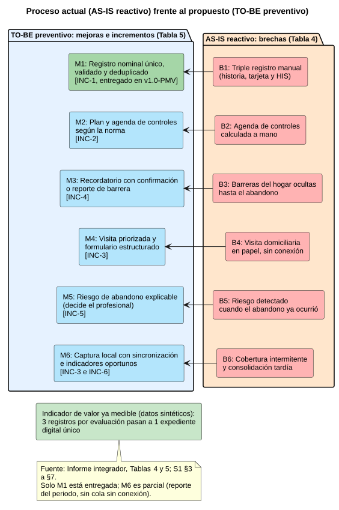

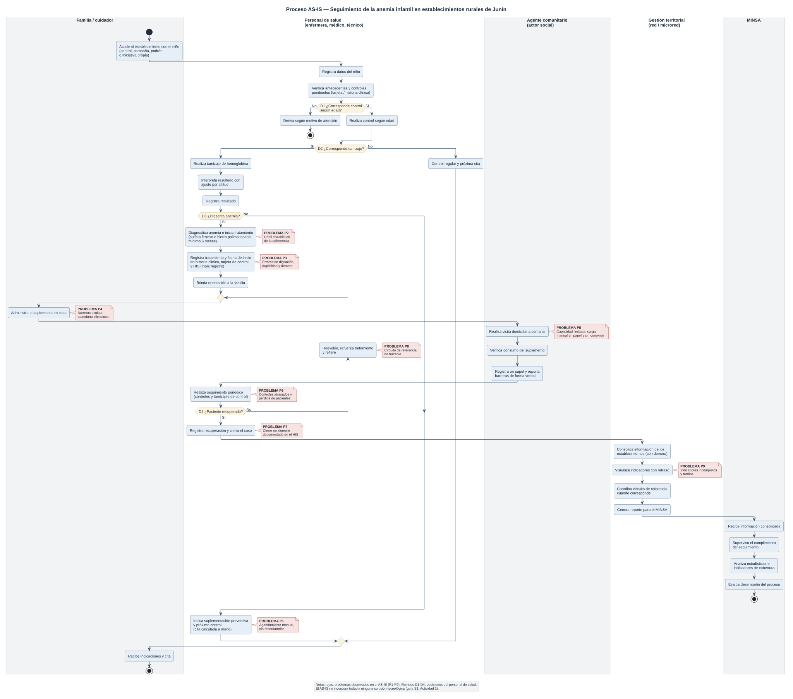

La Tabla 4 identifica seis brechas, una más que el mínimo exigido de cinco.

**Tabla 4.** Brechas del proceso actual (B1 a B6).

| ID | Proceso actual | Problema o brecha | Consecuencia |
| --- | --- | --- | --- |
| B1 | Triple registro manual: historia clínica, tarjeta de control y digitación en el HIS | No existe un registro nominal único y validado digitalmente | Errores de digitación, duplicidad y demora; el estado real del niño no es confiable |
| B2 | Agenda de controles calculada a mano | No se genera la agenda según el esquema normativo ni se envían recordatorios | Controles fuera de la ventana normativa y citas olvidadas |
| B3 | Tratamiento en el hogar durante seis meses | Las barreras permanecen ocultas hasta que el niño abandonó | Abandono silencioso y recuperación tardía o nula |
| B4 | Visita domiciliaria semanal del agente comunitario | Carga en papel, sin conexión y con capacidad limitada | Cobertura insuficiente y demora en escalar barreras |
| B5 | El riesgo se identifica cuando el abandono ya ocurrió | No hay anticipación ni priorización de los casos más frágiles | Se interviene tarde y el personal no se concentra donde más se necesita |
| B6 | Postas rurales con cobertura móvil intermitente y consolidación posterior | La información no se registra ni reporta en el momento | Pérdida de datos, reportes tardíos y decisiones territoriales poco focalizadas |

Fuente: S1 §3 y §4 (`entregables/semana-01/Entregable_Semana1_Anemia_Junin.md`).

#### Diagrama del proceso propuesto (TO-BE) y matriz de intervención del software

El TO-BE mantiene todas las decisiones clínicas en manos del profesional e incorpora solo los mecanismos que resuelven las brechas: registro nominal validado, agenda según la norma, comunicación con la familia, visita priorizada, riesgo explicable y captura local con sincronización. La Figura 3 presenta el proceso propuesto y la Tabla 5 la matriz de intervención del software.

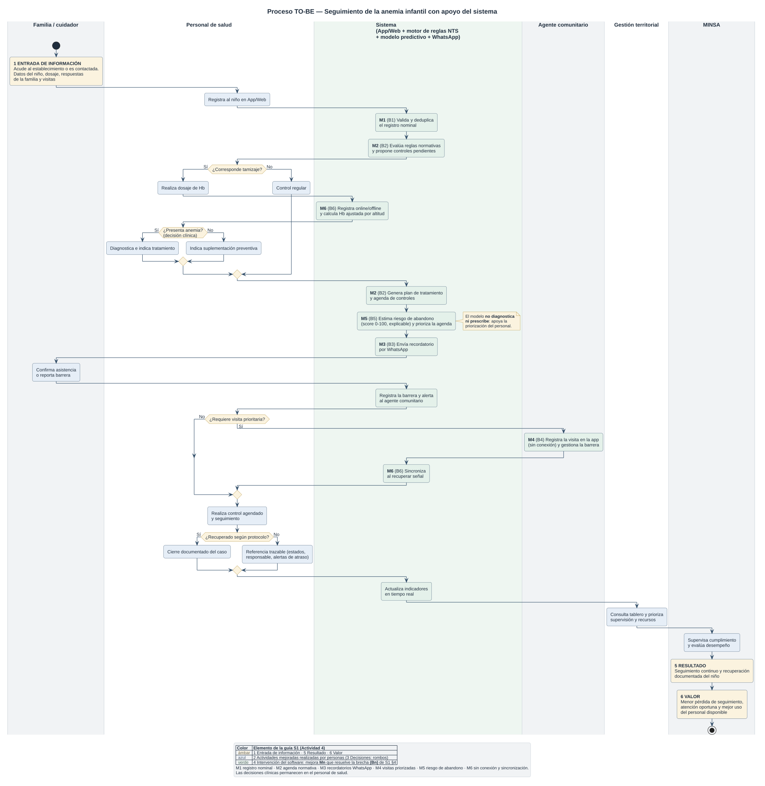

**Tabla 5.** Matriz de intervención del software: brecha, mejora del TO-BE, incremento y estado en el PMV.

| Brecha | Mejora del TO-BE | Quién ejecuta | Incremento | Estado en el PMV (v1.0-PMV) |
| --- | --- | --- | --- | --- |
| B1 | M1. Registro nominal único, validado y deduplicado | Personal de salud con apoyo del sistema | INC-1 | Entregado: HU-01 a HU-05, expediente único con DNI único |
| B2 | M2. Plan y agenda de controles según la norma | Sistema | INC-2 | No implementado; siguiente incremento |
| B3 | M3. Recordatorio con confirmación o reporte de barrera | Sistema y familia | INC-4 | No implementado |
| B4 | M4. Visita priorizada y formulario estructurado | Agente comunitario con apoyo del sistema | INC-3 | No implementado |
| B5 | M5. Riesgo de abandono explicable (decide el profesional) | Sistema | INC-5 | No implementado; la lista de seguimiento solo muestra el estado de control |
| B6 | M6. Captura local con sincronización e indicadores oportunos | Sistema | INC-3 e INC-6 | Parcial: reporte del periodo (HU-05); sin cola sin conexión |

El indicador de valor ya medible en el PMV es la reducción de registros por evaluación, de tres (historia clínica, tarjeta y HIS) a uno (expediente digital único). Es un resultado de diseño con datos sintéticos, no una medición en una posta.

#### Cadena de valor organizacional e indicadores

La cadena de valor se lee como Entrada → Actividad → Resultado → Decisión → Acción → Valor (Figura 4). En el INC-1 se cubre la entrada (datos validados del niño y del dosaje) y su conservación en el expediente; las etapas de agenda, visita y recuperación no tienen evidencia de impacto todavía.

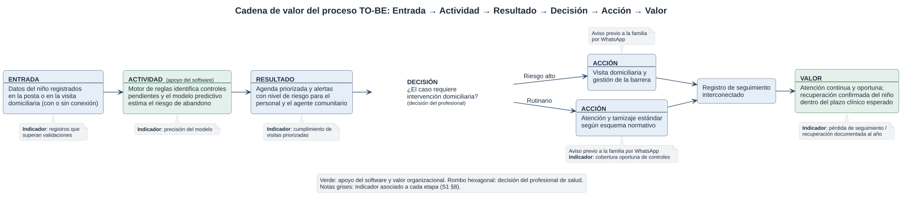

**Tabla 6.** Indicadores de proceso, producto, resultado y valor (S1 §8, catorce indicadores; se muestra uno o más por tipo con su estado de medición).

| Tipo | Indicador | Fórmula | Estado de medición |
| --- | --- | --- | --- |
| Proceso | Cobertura oportuna de medición y control | Atendidos oportunamente ÷ elegibles × 100 | Requiere agenda (INC-2) y línea base |
| Proceso | Cumplimiento de visitas priorizadas | Visitas oportunas ÷ visitas priorizadas × 100 | Requiere INC-3 |
| Producto | Registros que superan validaciones | Registros sin error crítico ÷ evaluados × 100 | El PMV valida y rechaza con error 422 y restricciones de la base de datos; medición con uso real |
| Producto | Disponibilidad y calidad técnica | Cobertura de pruebas y p95 de la API | Medido: 99 % y p95 de 58 ms (§3.3) |
| Resultado | Tasa de adherencia al tratamiento | Niños que recogen suplementos en fecha ÷ diagnosticados × 100 | No medible sin despliegue en una posta |
| Valor | Pérdida de seguimiento | Casos sobre el umbral sin cierre ÷ casos con seguimiento × 100 | Requiere cohorte, periodo y acuerdo con el establecimiento |
| Valor | Registros por evaluación (triple registro) | Registros manuales por evaluación: 3 → 1 | Reducción por diseño, con datos sintéticos |

Las metas numéricas de valor requieren línea base de la posta; no se inventan en este informe.

### 2.2 Selección y comparación del modelo de procesos (Resultados Guía Semana 2)

#### Matriz de factores del proyecto

Los ocho factores de selección de S2 (todos de importancia alta) se agrupan en los cinco factores que exige la consigna: Incertidumbre, Complejidad, Riesgo, Integración y Datos/IA (Tabla 7 y Figura 5).

**Tabla 7.** Matriz de factores del proyecto.

| Factor | Situación del proyecto | Nivel | Consecuencia para el proceso |
| --- | --- | --- | --- |
| Incertidumbre | Los requisitos clínicos están acotados por la norma, pero la IA, la mensajería y el modo sin conexión no; los cambios y la retroalimentación del personal son frecuentes | Alto | Incrementos pequeños y revisión por sprint |
| Complejidad | Modelo predictivo, API de mensajería, sincronización sin conexión e interfaces por rol | Alto | Diseño modular, contratos y pruebas por nivel |
| Riesgo | Pérdida de datos por conectividad intermitente y decisiones sobre salud infantil | Alto | Validación en varios niveles, defensa en profundidad y entrega en ventanas cortas |
| Integración | HIS, mensajería, artefacto del modelo y módulo sin conexión | Alto | Aislar adaptadores y probar la integración de forma automatizada |
| Datos/IA | El modelo exige datos históricos de calidad variable, experimentación versionada y monitoreo | Alto | MLOps desde INC-5, sujeto a la disponibilidad de datos |

Fuente: S2 §1 y §2 (`entregables/semana-02/Entregable_Semana2_Anemia_Junin.md`).

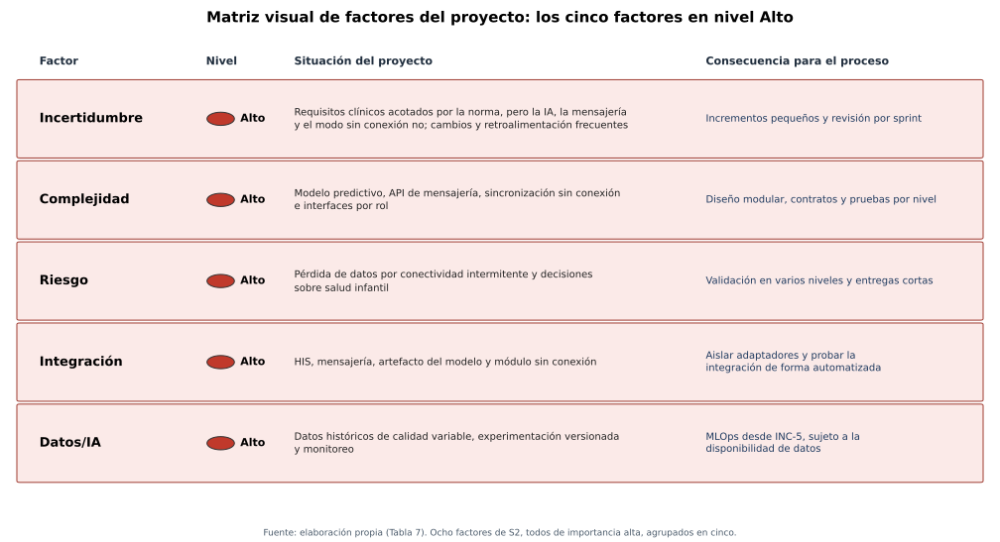

#### Matriz de comparación de modelos de ciclo de vida

Se compararon siete enfoques con una escala de 1 (muy bajo) a 5 (muy alto) en seis criterios; los cinco que exige la consigna están incluidos, más Espiral y Kanban. En sentido estricto, solo Cascada, Incremental y Espiral son modelos de ciclo de vida: Scrum es un marco de gestión y DevOps y MLOps son conjuntos de prácticas. Se comparan juntos para evaluar qué capacidades aporta cada uno.

**Tabla 8.** Matriz de comparación de modelos (S2, Tabla 3).

| Modelo | Adaptabilidad | Gestión de riesgos | Entrega incremental | Retroalimentación | Automatización | Adecuación al proyecto | Total |
| --- | --- | --- | --- | --- | --- | --- | --- |
| Cascada | 1 | 2 | 1 | 1 | 2 | 1 | 8 |
| Incremental | 3 | 3 | 4 | 3 | 2 | 3 | 18 |
| Espiral | 4 | 5 | 3 | 4 | 2 | 3 | 21 |
| Scrum | 5 | 4 | 5 | 5 | 3 | 5 | 27 |
| Kanban | 4 | 3 | 4 | 4 | 3 | 3 | 21 |
| DevOps | 4 | 4 | 5 | 4 | 5 | 4 | 26 |
| MLOps/DataOps | 4 | 4 | 4 | 4 | 5 | 5 | 26 |

El mayor puntaje no decide por sí solo: Scrum suma 27 pero su automatización es media y no gobierna el modelo; DevOps suma 26 pero no organiza la retroalimentación con el personal; MLOps suma 26 pero cubre solo el componente predictivo. Por eso se evaluaron combinaciones (Tabla 9).

#### Justificación técnica de la selección y enfoque de adaptación híbrido (tailoring)

**Tabla 9.** Matriz de decisión ponderada (S2, Tabla 6).

| Alternativa | Puntaje ponderado |
| --- | --- |
| Alt. 1: iterativo-incremental + Scrum + DevOps + MLOps | **4,75** |
| Alt. 2: flujo continuo con Kanban + DevOps + DataOps | 3,85 |
| Alt. 3: enfoque tradicional, Incremental + Espiral sin automatización | 2,95 |

Los ocho criterios son adaptabilidad, gestión de riesgos, entrega incremental y retroalimentación (15 % cada uno), e integración, automatización, gestión de datos/IA y participación del usuario (10 % cada uno).

**Modelo seleccionado:** ciclo de vida iterativo-incremental, gestionado con Scrum (sprints de dos semanas), con prácticas DevOps para la entrega y prácticas MLOps para el componente predictivo desde INC-5. La justificación sigue la cadena característica → riesgo → necesidad del proceso → característica del modelo:

- La incertidumbre del componente de IA impide fijar el alcance por adelantado; la base iterativa y MLOps permiten experimentar con evidencia.
- La conectividad intermitente exige verificar la sincronización y el despliegue en cada entrega; DevOps automatiza integración, pruebas y entrega.
- Sin la validación del personal de salud la priorización no se adopta; Scrum aporta backlog priorizado y revisión formal por sprint.

**Descartes:** Cascada exige congelar requisitos al inicio y validar al final, incompatible con la incertidumbre. Scrum por sí solo no define cómo automatizar la entrega. Kanban con DevOps es sólida para la fase de operación, pero carece de revisión formal por incremento en la construcción inicial.

**Tailoring.** El enfoque híbrido se ajustó a un equipo de tres integrantes y al alcance del Incremento 1: Scrum liviano (sprints de dos semanas, matriz RAE de tres personas), DevOps con pruebas, análisis estático y construcción de imagen automatizados, y MLOps diferido hasta contar con datos y etiquetas (INC-5). Los ajustes por restricción están en §3.1.

#### Representación gráfica del modelo de proceso aplicado al proyecto

La Figura 6 presenta el ciclo adaptado, con el rechazo de Cascada pura y de Scrum puro, y la Figura 7 el ciclo de diez elementos con el subciclo MLOps que se activa desde INC-5.

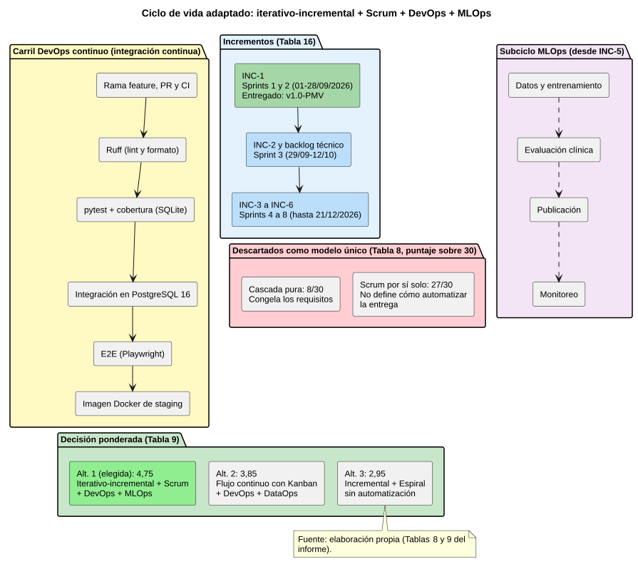

### 2.3 Actividades, responsabilidades y planificación (Resultados Guía Semanas 3 y 4)

#### Matriz de actividades del proceso, entradas, productos de trabajo (artifacts) y salidas

Las actividades se dividen en actividades de ciclo (se repiten en cada sprint) y específicas de un incremento. La Tabla 10 resume las de ciclo, con los productos de trabajo tal como se materializaron en el PMV; la Figura 8 muestra su secuencia.

**Tabla 10.** Matriz de actividades del proceso: entradas, productos de trabajo y salidas.

| Actividad | Entradas | Productos de trabajo (artifacts) | Salidas |
| --- | --- | --- | --- |
| Planificación y refinamiento | TO-BE, backlog priorizado, norma vigente | Historias HU-01 a HU-05 con criterios Dado–Cuando–Entonces; Sprint Backlog | Backlog refinado y plan del sprint |
| Análisis y diseño | Historias y requisitos no funcionales | `pmv_fastapi/docs/adr/ADR-001` a `ADR-006`; `pmv_fastapi/db/01_esquema_postgresql.sql`; `pmv_fastapi/docs/openapi.json`; vistas C4 | Diseño revisado por el equipo |
| Implementación | Diseño | Código de `pmv_fastapi/app/` por capas, en ramas `feature/…` | *Pull request* listo para revisión |
| Pruebas unitarias, de integración y de API | Código implementado | `pmv_fastapi/tests/unitarias/` y `tests/integracion/`; reporte de cobertura | Pruebas en verde y cobertura ≥ 80 % |
| Pruebas E2E y de carga | PMV integrado | `tests/e2e/test_interfaz.py`; `tests/rendimiento/locustfile.py` | Defectos registrados y métricas de rendimiento |
| Revisión de código y análisis estático | *Pull request* | Salida de Ruff | Código aprobado sin hallazgos |
| Integración | Rama de integración actualizada | Pipeline `.github/workflows/ci.yml` | Versión integrada verificada |
| Despliegue | Versión integrada | `pmv_fastapi/Dockerfile` y `docker-compose.yml` | PMV disponible en staging local |
| Gestión de defectos | Fallos detectados | `pmv_fastapi/docs/evidencias/registro_defectos.md`; ramas `fix/…` | Defecto cerrado con prueba de regresión |
| Revisión del sprint | Incremento funcional | Acta de revisión con el personal de salud | Backlog actualizado |
| Retrospectiva y actualización del plan | Métricas del sprint | Plan de mejora | Ajustes al proceso |

Fuente: S3-4 §3 y §6; adaptación a los artefactos del PMV. Acta de revisión: [COMPLETAR: acta de la revisión del Incremento 1; no existe en el repositorio — ver PASOS_MANUALES paso 5].

#### Matriz de responsabilidades RAE (Responsable de Ejecución, Revisión y Aprobación)

**Tabla 11.** Matriz RAE (extracto de S3-4, Tabla 6).

| Actividad | Responsable de ejecución | Revisión | Aprobación | Evidencia |
| --- | --- | --- | --- | --- |
| Requisitos | Porras V. | Huamani R. | Product Owner (representante de la posta) | Sprint Backlog e historias «Ready» |
| Análisis | Auqui H. | Huamani R. | Porras V. | Historias con reglas de negocio y casos límite |
| Diseño | Auqui H. | Huamani R. | Porras V. | ADR, esquema de datos y contrato OpenAPI |
| Implementación | Auqui H. | Huamani R. | Huamani R. | *Pull request* integrado |
| Pruebas | Huamani R. | Porras V. | Huamani R. | Reporte de pytest y cobertura |
| Integración | Auqui H. | Huamani R. | Huamani R. | Ejecución completa en verde |
| Despliegue | Auqui H. | Huamani R. | Porras V. | Versión ejecutable y prueba de humo |
| Evaluación (revisión del sprint) | Porras V. | Huamani R. | Personal de salud o microred | Acta de revisión |
| Retrospectiva | Porras V. | Todo el equipo | Porras V. | Plan de mejora |
| Reglas clínicas parametrizadas | Auqui H. | Huamani R. (contraste con la fuente oficial) | Porras V., tras consulta con la microred | Parámetros versionados y pruebas de frontera |

La matriz asigna responsabilidades; no acredita firmas ni aprobaciones de terceros. El Product Owner y el personal de salud que aprueban son roles previstos: [COMPLETAR: nombre y cargo del Product Owner o usuario que acepta el incremento — ver PASOS_MANUALES paso 5].

#### Criterios de terminación (Definition of Done) por actividad

**Tabla 12.** Criterios de terminación por actividad y evidencia objetiva (S3-4, Tabla 8, aplicada al PMV).

| Actividad | Criterio de terminación | Evidencia objetiva en el PMV |
| --- | --- | --- |
| Refinamiento de requisitos | Todas las historias del sprint tienen criterios Dado–Cuando–Entonces verificables y estimación | Historias HU-01 a HU-05 en `pmv_fastapi/README.md` |
| Análisis y diseño | Diseño revisado por los tres integrantes, sin observaciones abiertas | ADR-001 a ADR-006 en `pmv_fastapi/docs/adr/` |
| Reglas clínicas | Cada umbral y cada banda de altitud contrastados con la fuente; cada regla probada en sus fronteras | `tests/unitarias/test_reglas_clinicas.py` (24 casos); la confirmación de los puntos de corte con la microred sigue abierta |
| Implementación | Funcionalidad implementada, Ruff sin hallazgos, *pull request* aprobado, regla de negocio en el dominio y no en rutas ni interfaz | `docs/evidencias/ruff.txt`; capas `domain`, `application`, `adapters` |
| Pruebas | 0 pruebas fallidas y cobertura ≥ 80 % (`fail_under = 80`) | `docs/evidencias/cobertura.txt`: 99 % |
| Análisis estático | 0 hallazgos de Ruff | `docs/evidencias/ruff.txt`: «All checks passed!» |
| Integración | Ejecución completa en verde (pruebas, cobertura, Ruff) | Pipeline `.github/workflows/ci.yml`; [COMPLETAR: captura o enlace de una ejecución en verde en GitHub Actions — ver PASOS_MANUALES paso 3] |
| Despliegue | Aplicación accesible y prueba de humo superada (`GET /api/salud` responde 200) | `HEALTHCHECK` del `Dockerfile` y `docker-compose.yml` |
| Gestión de defectos | Defecto mayor corregido con prueba de regresión | DEF-01 y DEF-02 cerrados en `registro_defectos.md` |
| Revisión del sprint | El personal de salud acepta el incremento o registra observaciones en el backlog | [COMPLETAR: acta de revisión y aceptación — ver PASOS_MANUALES paso 5] |
| Retrospectiva | Al menos dos mejoras concretas con responsable | Lecciones aprendidas del §5 |

Además, toda historia cumple la DoD común: criterios de aceptación verificados con al menos una prueba automatizada, pruebas en verde con cobertura ≥ 80 % y Ruff sin hallazgos, funcionalidad disponible en la interfaz y en la API invocando el mismo caso de uso, y contrato `pmv_fastapi/docs/openapi.json` actualizado.

#### Descomposición del trabajo (WBS): Épicas, Historias de Usuario y Tareas del Incremento 1

La jerarquía es Proyecto → Entregables → Incrementos → Épicas → Historias de Usuario → Tareas (Figura 9). Las historias HU-01 a HU-05 del PMV equivalen a HIST-1.1 a HIST-1.5 de S3-4. Los incrementos INC-2 a INC-6 se descomponen en su propio Sprint Planning.

**Tabla 13.** Épicas, historias y tareas del Incremento 1.

| Épica | Historia de usuario | Tarea (plan de S3-4) y artefacto equivalente en el PMV |
| --- | --- | --- |
| EP-1.T Habilitadores | Arquitectura, persistencia y calidad | T01 ADR (`docs/adr/`); T02 esquema (`db/01_esquema_postgresql.sql`); T03 Pytest, cobertura ≥ 80 % y Ruff (`pyproject.toml`) |
| EP-1.B Validación y clasificación | HU-03 (HIST-1.3) Validar datos con reglas clínicas | T04 reglas parametrizadas (`app/domain/reglas_clinicas.py`); T05 validadores (`app/domain/entidades.py`); T06 clasificador con ajuste por altitud; T07 pruebas de valores límite |
| EP-1.A Registro y expediente | HU-01 (HIST-1.1) Registrar niño con evaluación inicial | T08 caso de uso de registro y repositorio; T09 `POST /api/ninos` y contrato; T10 interfaz PWA con vista previa; T11 pruebas de integración del registro |
| EP-1.A Registro y expediente | HU-02 (HIST-1.2) Consultar y actualizar el expediente | T12 casos de uso y endpoints de expediente, actualización y nuevo control |
| EP-1.C Seguimiento y reporte | HU-04 (HIST-1.4) Listar niños en seguimiento | T13 listado con filtros y estado de control |
| EP-1.C Seguimiento y reporte | HU-05 (HIST-1.5) Reporte del periodo | T14 reporte en JSON y CSV |
| EP-1.C / EP-1.T | HU-02, HU-04 y HU-05 | T15 pruebas de integración de API y persistencia; T16 datos sintéticos y demostración (`scripts/cargar_datos_prueba.py`, `demo_pmv.mp4`) |

La equivalencia tarea-artefacto es funcional: las tareas T01–T16 se redactaron en S3-4 durante la planificación y aquí se vinculan con los artefactos que realmente contiene el PMV.

#### Estimación de esfuerzo, matriz de priorización (valor/riesgo) y plan de trabajo (cronograma/sprint)

**Estimación.** Se usaron puntos de historia (Fibonacci, Planning Poker) para el backlog completo y horas-persona para el incremento prioritario. El INC-1 suma 21 puntos de historia y 113 horas-persona estimadas (Tabla 14).

**Tabla 14.** Estimación del Incremento 1 (S3-4, Tablas 19 y 20).

| Elemento | Puntos de historia | Sprint | Horas-persona estimadas |
| --- | --- | --- | --- |
| EP-1.T Habilitadores técnicos | 5 | 1 | — |
| HU-01 Registrar niño | 5 | 1 | — |
| HU-03 Validar y clasificar | 3 | 1 | — |
| **Sprint 1** | **13** | 1 | **69** |
| HU-02 Expediente y dosajes | 3 | 2 | — |
| HU-04 Listado en seguimiento | 2 | 2 | — |
| HU-05 Reporte del periodo | 3 | 2 | — |
| **Sprint 2** | **8** | 2 | **44** |
| **Total INC-1** | **21** | 1 y 2 | **113** |

Los puntos no se convierten directamente en horas. Las horas reales del equipo no están registradas en el repositorio: [COMPLETAR: horas reales por integrante y por sprint, si el equipo las llevó — ver PASOS_MANUALES paso 4].

**Priorización valor/riesgo.** Pesos: valor 30 %, reducción de riesgo 25 %, dependencia técnica 20 %, complejidad inversa 15 % y validación 10 %.

**Tabla 15.** Matriz de priorización ponderada de incrementos (S3-4, Tabla 17).

| Incremento | Valor (30 %) | Riesgo (25 %) | Dependencia (20 %) | Complejidad inversa (15 %) | Validación (10 %) | Total | Orden |
| --- | --- | --- | --- | --- | --- | --- | --- |
| INC-1 Registro nominal y expediente | 5 | 4 | 5 | 4 | 5 | **4,60** | 1.° |
| INC-3 Sin conexión y sincronización | 5 | 5 | 4 | 3 | 4 | **4,40** | 2.° |
| INC-2 Agenda automática | 5 | 3 | 4 | 4 | 5 | **4,15** | 3.° |
| INC-4 Mensajería y barreras | 4 | 3 | 3 | 3 | 4 | **3,40** | 4.° |
| INC-5 Modelo predictivo | 5 | 4 | 2 | 1 | 3 | **3,35** | 5.° |
| INC-6 Tablero territorial | 4 | 2 | 1 | 3 | 4 | **2,75** | 6.° |

INC-1 lidera por combinar el mayor valor, la mayor dependencia (INC-2, INC-3 e INC-5 necesitan datos registrados) y la validación más sencilla. Antes de un piloto rural debe revisarse el orden, porque INC-3 resuelve la conectividad.

**Plan de trabajo.** Ocho sprints de dos semanas, del 01/09/2026 al 21/12/2026, con hitos H0 a H7 (Tabla 16, Figuras 10 y 11).

**Tabla 16.** Calendario planificado de sprints (S3-4, Tabla 23).

| Sprint | Fechas | Incremento | Funcionalidad principal | Hito |
| --- | --- | --- | --- | --- |
| 1 | 01–14/09/2026 | INC-1 (parte 1) | Habilitadores, validación y clasificación, registro | H0 |
| 2 | 15–28/09/2026 | INC-1 (parte 2) | Expediente, listado en seguimiento, reporte | H1 |
| 3 | 29/09–12/10/2026 | INC-2 y backlog técnico | Agenda y alertas; integración continua y pruebas E2E | H2 |
| 4 | 13–26/10/2026 | INC-3 | Sin conexión y sincronización | H3 |
| 5 | 27/10–09/11/2026 | INC-4 | Mensajería y barreras | H4 |
| 6 | 10–23/11/2026 | INC-5 (datos y modelo) | Datos, experimentación y entrenamiento | H5 |
| 7 | 24/11–07/12/2026 | INC-5 (integración) e INC-6 | Integración modelo-agenda, inicio del tablero | H6 |
| 8 | 08–21/12/2026 | INC-6 | Tablero territorial completo | H7 |

#### Mecanismos de seguimiento, control de desviaciones e indicadores de avance

**Mecanismo de seguimiento.** El ciclo es planificado → ejecutado → medición → comparación → desviación → acción correctiva → actualización del plan. Se apoya en el Sprint Backlog y el burndown (planificado), el Daily Scrum, los *commits* y los *pull requests* (ejecutado), y la ejecución de pruebas, cobertura y Ruff (medición). La comparación ocurre a diario y en la revisión del sprint.

**Tabla 17.** Umbrales de desviación y acción (S3-4, Tabla 32, extracto).

| Tipo de desviación | Umbral | Acción |
| --- | --- | --- |
| Actividad de la ruta crítica retrasada | Más de 1 día | Replanificación inmediata y uso de holguras |
| Hito retrasado | Más de 1 semana | Replanificación y evaluación del impacto en cadena |
| Esfuerzo real sobre lo estimado en una historia | Más de 20 % | Análisis de causa en la retrospectiva y recalibración |
| Cobertura de pruebas | Menos de 80 % | No integrar hasta alcanzar el umbral |
| Defecto bloqueante en la versión desplegada | Cualquiera | Corrección en menos de 4 horas y análisis de causa raíz |

**Indicadores de avance.** Los indicadores de S3-4 (Tabla 30) incluyen avance de actividades (≥ 90 % por sprint), avance de historias (≥ 80 %), cobertura (≥ 80 %), Ruff (0 hallazgos) y menos de un defecto mayor por historia. En el PMV, las cinco historias están entregadas (5/5, 21/21 puntos), la cobertura es del 99 %, Ruff reporta 0 hallazgos y se registraron dos defectos mayores (DEF-01 y DEF-02), ambos cerrados.

**Tabla 18.** Matriz de control de desviaciones observadas en el Incremento 1.

| Desviación | Causa | Decisión | Estado |
| --- | --- | --- | --- |
| DEF-01: N+1 en `GET /api/reportes/periodo`, p95 de 2 200 ms con 50 usuarios | Consulta del expediente completo por cada evaluación | Consultas por lotes en la rama `fix/def-01-reporte-n-mas-1` (ADR-006) | Cerrado; p95 del reporte de 74 ms |
| DEF-02: el reporte perdía los registros posteriores a las 19:00 (hora de Perú) | El conteo por día se hacía en UTC | Corrección en `fix/def-02-zona-horaria` y prueba CP-16 en tres niveles | Cerrado |
| Entrega del incremento después de la fecha del hito H1 | El hito H1 se planificó para el 28/09/2026 y las fusiones a `develop` y el tag son del 30/09/2026 (historial git de la rama del tag) | Registrar la desviación de 2 días en la retrospectiva | Registrada |
| Pipeline de CI en una subcarpeta que GitHub no ejecuta | El archivo residía en `pmv_fastapi/.github/workflows/` | Pipeline en `.github/workflows/ci.yml` en la raíz | Corregido; falta evidencia de una ejecución en verde |
| SonarCloud sin organización configurada | `sonar.organization` conserva un valor de reemplazo | Ruff como análisis estático obligatorio; Sonar queda preparado | Abierta (paso manual) |
| Horas reales no registradas | No hubo registro sistemático | Indicadores de esfuerzo no calculables | Abierta |

El burndown de la Figura 12 es la serie simulada de S3-4, usada para ilustrar el mecanismo; no es una medición del equipo. La Figura 13 compara el alcance planificado del INC-1 (13 SP en el Sprint 1 y 8 SP en el Sprint 2, según S3-4) con el alcance completado: 21 de 21 SP, que incluyen los 5 SP de la historia técnica EP-1.T. No es una serie temporal medida: el historial git del tag solo permite verificar que todas las fusiones y el tag son del 30/09/2026, es decir, la entrega ocurrió dos días después del hito H1 (28/09/2026). La Figura 14 reúne los indicadores de proceso, producto y valor.

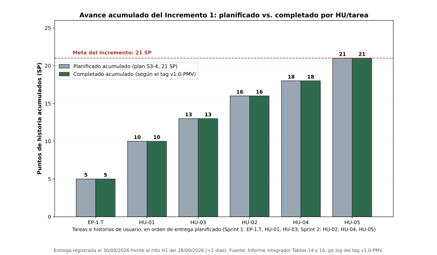

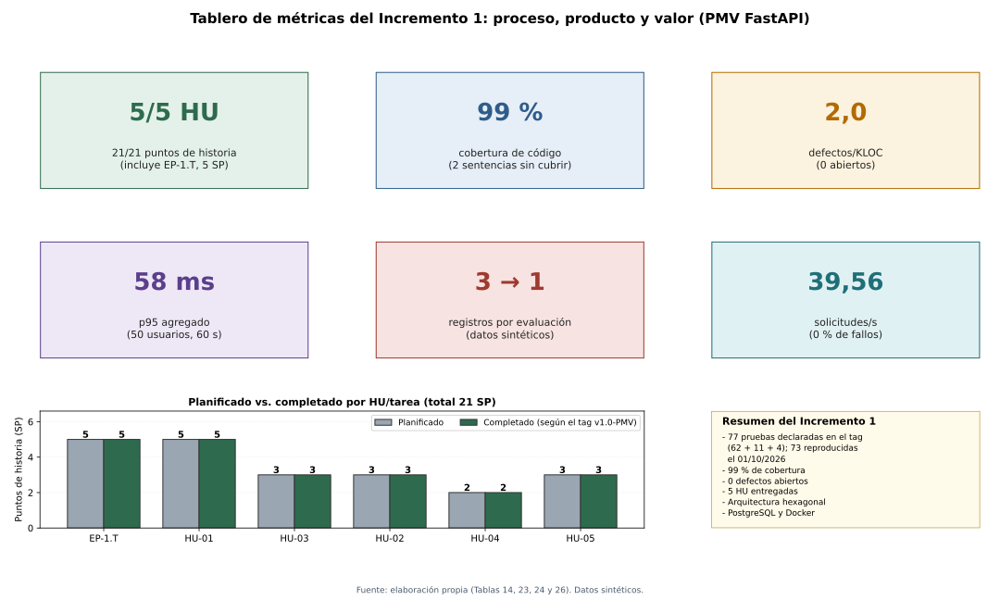

## 3. Unidad II: Implementación y adaptación práctica del proceso

### 3.1 Categorización normativa y sastrería de procesos (Resultados Guía Semana 5)

#### Clasificación en procesos principales, de soporte y organizacionales/gestión

Se aplica la clasificación pedagógica de la consigna, sin afirmar certificación ISO/IEC 12207.

**Tabla 19.** Clasificación de procesos y evidencia en el PMV.

| Categoría | Actividades | Evidencia en el PMV |
| --- | --- | --- |
| Principales | Requisitos, diseño, construcción, integración y pruebas, despliegue | Historias HU-01 a HU-05; ADR, esquema SQL y OpenAPI; código de `pmv_fastapi/app/`; suites de `pmv_fastapi/tests/`; Docker Compose |
| Soporte | Documentación, configuración, verificación, revisión y resolución de problemas | `pmv_fastapi/README.md` y `docs/`; Git con flujo `main` ← `develop` ← `feature/…`; Ruff y cobertura; *pull requests*; `registro_defectos.md` |
| Organizacionales y de gestión | Planificación, infraestructura, coordinación y mejora | Plan de ocho sprints y matriz RAE (S3-4); Docker Compose y pipeline CI; ADR-006 y retrospectiva |

#### Matriz de adaptación práctica (tailoring) a las restricciones del proyecto

**Tabla 20.** Matriz de tailoring del PMV.

| Restricción | Adaptación adoptada | Control y efecto |
| --- | --- | --- |
| Equipo de tres integrantes | Roles agrupados (Tabla 2); Scrum liviano y RAE de tres personas | Calidad revisa; Proceso coordina |
| Alcance del Incremento 1 | Monolito modular con núcleo hexagonal (ADR-001); microservicios descartados | Evita la distribución prematura y conserva puertos para evolucionar |
| Conectividad y operación en postas | Cliente PWA adaptable con borrador local (ADR-002); el registro definitivo requiere conexión | La cola sin conexión queda para INC-3 |
| Normativa variable | Reglas clínicas parametrizadas en el dominio (ADR-004) | Puntos de corte pendientes de confirmación por la microred |
| Integridad del dato | PostgreSQL 16 con restricciones; SQLite en desarrollo y pruebas (ADR-003) | La suite de integración corre en ambos motores en el pipeline |
| Entorno de pruebas y entrega | Pytest, Ruff, Playwright, Locust, Docker Compose y pipeline CI | Evidencias versionadas en `pmv_fastapi/docs/evidencias/` |
| Usuario final no disponible | Verificación técnica automatizada y datos sintéticos | La aceptación humana permanece abierta |

**Antecedente técnico.** El Incremento 1 se exploró primero en un prototipo con Flask y SQLite (`anemia_junin/`), que sirvió como espiga técnica para validar la arquitectura hexagonal. El PMV oficial es `pmv_fastapi/`, con FastAPI y PostgreSQL, y ninguna cifra del prototipo se presenta como resultado del PMV. Justificación del cambio de pila (propuesta de redacción): integridad de datos con PostgreSQL, contrato OpenAPI nativo y despliegue en contenedores con CI. [COMPLETAR: confirmar o reescribir la justificación del cambio de Flask a FastAPI — ver PASOS_MANUALES paso 6]

### 3.2 Arquitectura de software del Incremento 1 / PMV (Resultados Guía Semana 6)

#### Registros de Decisiones Arquitectónicas (ADR) que impactan en atributos de calidad (NFR)

**Tabla 21.** ADR del PMV y atributos de calidad (`pmv_fastapi/docs/adr/`).

| ADR | Decisión | NFR principal | Dato de verificación |
| --- | --- | --- | --- |
| ADR-001 | Arquitectura hexagonal en un monolito modular; microservicios descartados | Mantenibilidad, capacidad de prueba y evolución | 62 pruebas unitarias en menos de 1 s con el adaptador en memoria; la misma suite de integración pasa en SQLite y en PostgreSQL |
| ADR-002 | Cliente PWA web adaptable (manifest, service worker y borrador en `localStorage`) | Portabilidad, despliegue en postas y tolerancia a red intermitente | El registro definitivo requiere conexión; la cola sin conexión llega en INC-3 |
| ADR-003 | PostgreSQL 16 central con `UNIQUE(dni)`, llaves foráneas y `CHECK` | Integridad y confiabilidad del dato | Defensa en profundidad; dos motores mitigados con integración en ambos en CI |
| ADR-004 | Reglas clínicas parametrizadas en el dominio (OMS 2024; menores de 6 meses = NO_APLICA) | Exactitud clínica y trazabilidad normativa | El sistema no diagnostica; los parámetros esperan la confirmación de la microred |
| ADR-005 | API REST JSON con OpenAPI 3.1 y errores por campo en español | Interoperabilidad y usabilidad | Sin WebSockets ni gRPC: el INC-1 no necesita tiempo real |
| ADR-006 | Consultas por lotes en reportes (corrige DEF-01) | Rendimiento (latencia p95) | p95 del reporte de 2 200 a 74 ms; p95 agregado de 310 a 58 ms; 39,6 solicitudes/s; 0 fallos |

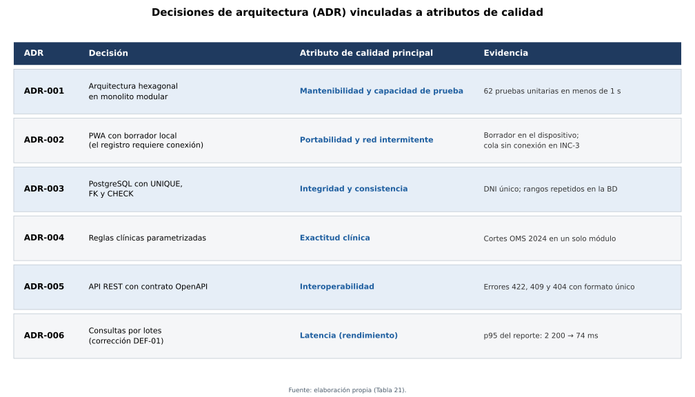

#### Representación de vistas C4: Nivel 1 (Contexto), Nivel 2 (Contenedores) y Nivel 3 (Componentes)

La Figura 16 presenta el contexto del PMV: el personal de salud usa el sistema y los actores restantes se incorporan en incrementos futuros. La Figura 17 muestra los contenedores (cliente PWA, API FastAPI y base de datos PostgreSQL o SQLite). La Figura 18 descompone la aplicación en sus componentes hexagonales.

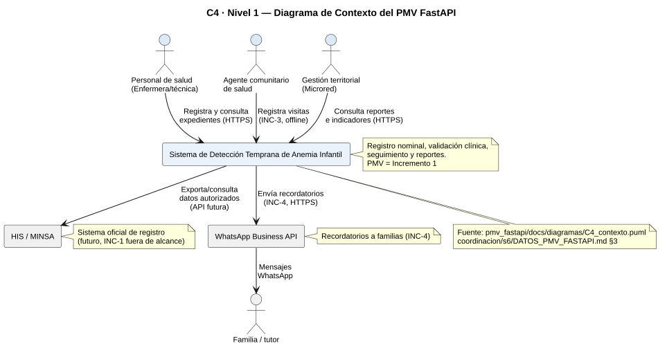

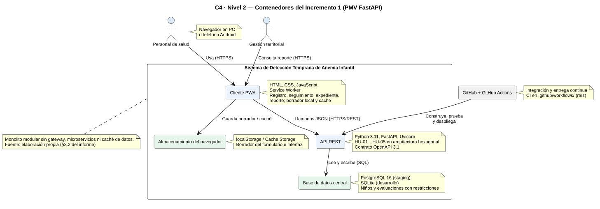

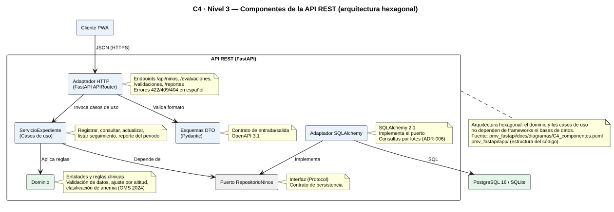

Las capas son dominio (`entidades.py`, `reglas_clinicas.py`, `errores.py`), aplicación (`casos_uso.py` con `ServicioExpediente` y los puertos `RepositorioNinos` y `Reloj`), adaptador de entrada HTTP (`api.py` y `esquemas.py`), adaptadores de salida (`sqlalchemy_repo.py` y `memoria.py`), interfaz PWA y raíz de composición (`main.py`, con la fábrica `crear_app`). El dominio no depende de frameworks.

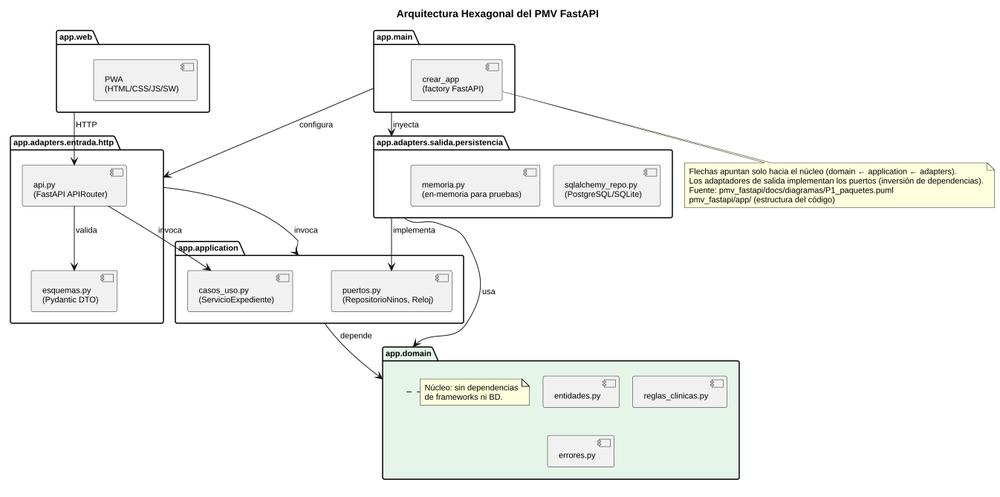

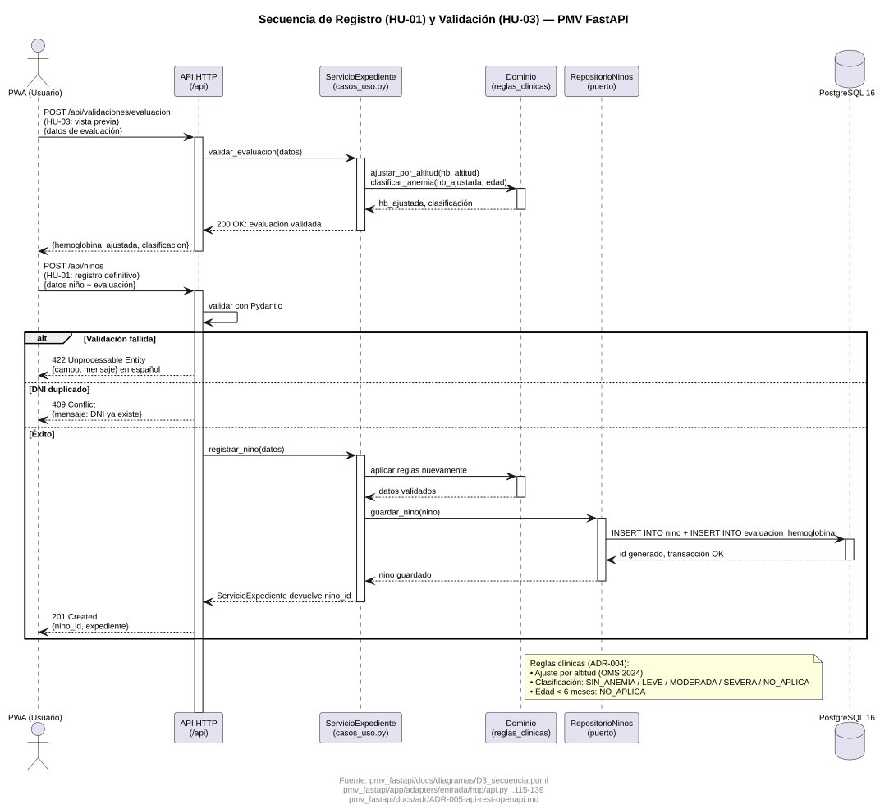

#### Especificación del modelo de datos y contratos de interfaces/API (OpenAPI / JSON)

**Modelo de datos.** El esquema `pmv_fastapi/db/01_esquema_postgresql.sql` define dos tablas, una vista y los índices de apoyo (Figura 21).

- `nino` (16 columnas): `id` (clave primaria), `dni` único con `CHECK` de ocho dígitos, datos personales, `sexo` (F o M), `altitud_m` entre 0 y 5000, datos del tutor con celular que empieza con 9, `estado` (ACTIVO o ALTA), auditoría de registro y marcas de tiempo.
- `evaluacion_hemoglobina` (13 columnas): clave foránea a `nino` con borrado en cascada, `edad_meses` de 0 a 59, hemoglobina observada de 3 a 20, hemoglobina ajustada, `clasificacion` (SIN_ANEMIA, LEVE, MODERADA, SEVERA o NO_APLICA), peso de 1,5 a 30 kg y talla de 40 a 125 cm.
- Vista `v_ultimo_control`: último control por niño, apoyo de HU-04.
- Relación: un niño tiene de cero a N evaluaciones. Las restricciones `CHECK` repiten las reglas del dominio (ADR-003).

**Contrato de la API.** El router FastAPI con prefijo `/api` expone nueve operaciones REST (Tabla 22). El contrato OpenAPI 3.1 está en `pmv_fastapi/docs/openapi.json` y Swagger UI se sirve localmente en `/docs`. Los errores usan un formato único `{mensaje, errores:[{campo, mensaje}]}` en español (422 validación, 409 duplicado y 404 no encontrado; ADR-005). La auditoría usa el encabezado `X-Usuario`; el PMV no tiene autenticación, limitación conocida y declarada (Ley N.° 29733).

**Tabla 22.** Endpoints de la API del PMV (`pmv_fastapi/app/adapters/entrada/http/api.py`).

| Método y ruta | Historia o etiqueta | Respuestas |
| --- | --- | --- |
| GET `/api/salud` | Operación (healthcheck de Docker) | 200 `{"estado":"ok"}` |
| POST `/api/validaciones/evaluacion` | HU-03: vista previa de Hb ajustada y clasificación antes de guardar | 200 / 422 |
| POST `/api/ninos` | HU-01: registro | 201 / 409 duplicado / 422 |
| GET `/api/ninos?estado=&q=&clasificacion=` | HU-04: seguimiento con `control_atrasado` | 200 |
| GET `/api/ninos/dni/{dni}` | HU-02: expediente por DNI | 200 / 404 |
| GET `/api/ninos/{nino_id}` | HU-02: expediente | 200 / 404 |
| PATCH `/api/ninos/{nino_id}` | HU-02: actualización | 200 |
| POST `/api/ninos/{nino_id}/evaluaciones` | HU-02: nuevo control | 201 |
| GET `/api/reportes/periodo?desde=&hasta=&formato=json\|csv` | HU-05: reporte del periodo | 200 (JSON o CSV) |

### 3.3 Estrategia y ejecución de pruebas de software (Resultados Guía Semana 7)

#### Pirámide de pruebas adaptada

La estrategia concentra las validaciones en el dominio (base de la pirámide, sin base de datos ni HTTP), verifica la API y la persistencia en el nivel intermedio y reserva pocas pruebas E2E y de carga para los recorridos completos (Figura 22). El conteo de casos por nivel se verificó estáticamente sobre los archivos de prueba.

**Tabla 23.** Pirámide de pruebas del PMV: niveles y casos.

| Nivel | Casos | Archivos y casos de prueba (CP) | Alcance |
| --- | --- | --- | --- |
| Unitarias | 62 | `test_reglas_clinicas.py` (24; CP-01 a CP-06), `test_entidades.py` (24; CP-07 a CP-12), `test_casos_uso.py` (14; CP-13 a CP-20) | Reglas clínicas, validación de entrada y casos de uso con el adaptador en memoria |
| Integración y API | 11 | `test_api.py` (10; CP-21 a CP-32), `test_zona_horaria.py` (1) | API con persistencia SQLAlchemy sobre SQLite y también sobre PostgreSQL 16 en el pipeline |
| E2E y UI (Playwright) | 4 | `test_interfaz.py` (CP-33 a CP-36): registro con vista previa, datos inválidos, seguimiento y reporte | Interfaz con servidor real |
| Rendimiento y carga | 1 escenario | `tests/rendimiento/locustfile.py`: clase `PersonalPosta`, esperas de 0,5 a 2 s, tareas con pesos 5/4/3 | 50 usuarios durante 60 s |
| **Total automatizadas** | **77** | 62 + 11 + 4 | |

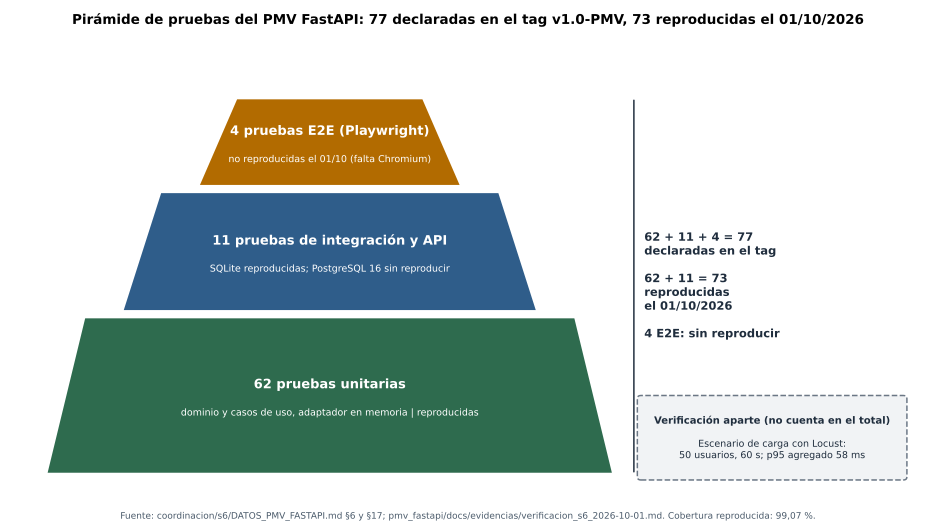

#### Matriz de registro de ejecución de pruebas y reporte de cobertura de código

**Tabla 24.** Registro de ejecución de pruebas.

| Nivel | Casos | Resultado | Evidencia |
| --- | --- | --- | --- |
| Unitarias | 62 | Reproducido el 01/10/2026: 62 pasan | `pmv_fastapi/docs/evidencias/verificacion_s6_2026-10-01.md` |
| Integración y API (SQLite) | 11 | Reproducido el 01/10/2026: 11 pasan | `pmv_fastapi/docs/evidencias/verificacion_s6_2026-10-01.md` |
| Integración en PostgreSQL 16 | (las mismas 11) | En verde según el tag; no reproducido el 01/10/2026 | README, tag y `docs/evidencias/cobertura.txt` |
| E2E (Playwright) | 4 | En verde según el tag; no reproducido el 01/10/2026 | README y tag |
| Carga (Locust) | 1 escenario, 50 usuarios, 60 s | 0 fallos; p95 de 58 ms según el tag; no reproducido el 01/10/2026 (no cuenta como prueba) | `docs/evidencias/carga/` |

Las 77 pruebas automatizadas (62 + 11 + 4) son las declaradas en el README y en el mensaje del tag; el escenario de carga no se suma al total; el conteo de 77 casos se confirmó estáticamente. Además, el 01/10/2026 se reprodujo la suite por defecto (Windows, Python 3.14.6, SQLite, sin Docker): 73 pruebas pasadas y 0 fallidas (62 unitarias y 11 de integración), cobertura de 99,07 % y Ruff con 0 hallazgos (`pmv_fastapi/docs/evidencias/verificacion_s6_2026-10-01.md`). En esa reproducción no se ejecutaron las 4 pruebas E2E (falta el navegador de Playwright), la integración sobre PostgreSQL ni la carga; esos resultados son los declarados en el tag y en los archivos de evidencia. Con Python 3.14 el conteo de sentencias difiere del informe original (548 frente a 641), pero el porcentaje de cobertura coincide.

**Tabla 25.** Cobertura de código por módulo (`pmv_fastapi/docs/evidencias/cobertura.txt`).

| Módulo | Cobertura |
| --- | --- |
| `api.py`, `esquemas.py`, `memoria.py`, `casos_uso.py`, `puertos.py`, `errores.py`, `reglas_clinicas.py`, `main.py` | 100 % |
| `entidades.py` | 99 % |
| `sqlalchemy_repo.py` | 97 % |
| **Total** | **99 %: 641 sentencias (2 sin cubrir) y 98 ramas (4 parciales)** |

La cobertura por sentencias es de aproximadamente 99,7 % (639 de 641). El umbral de la DoD es 80 % (`fail_under = 80` con cobertura de ramas activada).

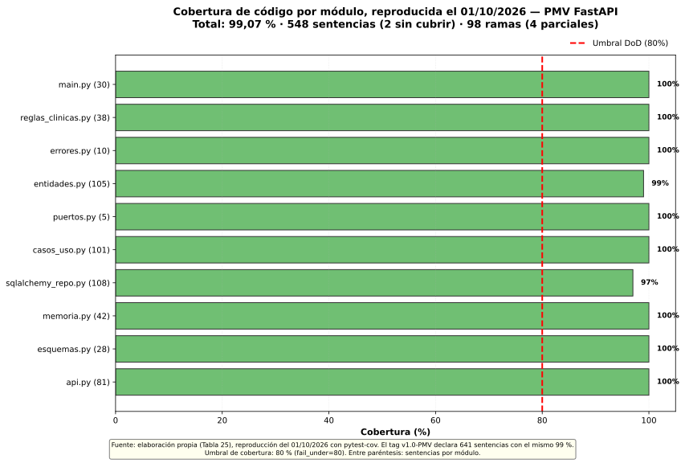

**Prueba de carga.** Locust con 50 usuarios durante 60 s, antes y después de corregir DEF-01 (`pmv_fastapi/docs/evidencias/carga/`).

**Tabla 26.** Resultados de la prueba de carga.

| Escenario | Solicitudes | Fallos | Mediana | p95 | p99 | Solicitudes/s |
| --- | --- | --- | --- | --- | --- | --- |
| Línea base, antes de DEF-01 (agregado) | 2 170 | 0 | 24 ms | 310 ms | 1 600 ms | 36,74 |
| Después de DEF-01 (agregado) | 2 336 | 0 | 9 ms | 58 ms | 97 ms | 39,56 |
| `GET /api/reportes/periodo`, antes → después | — | — | 530 → 13 ms | 2 200 → 74 ms | — | — |
| `GET /api/ninos`, antes → después | — | — | — | 250 → 75 ms | — | — |
| `POST /api/ninos`, antes → después | — | — | — | 100 → 36 ms | — | — |

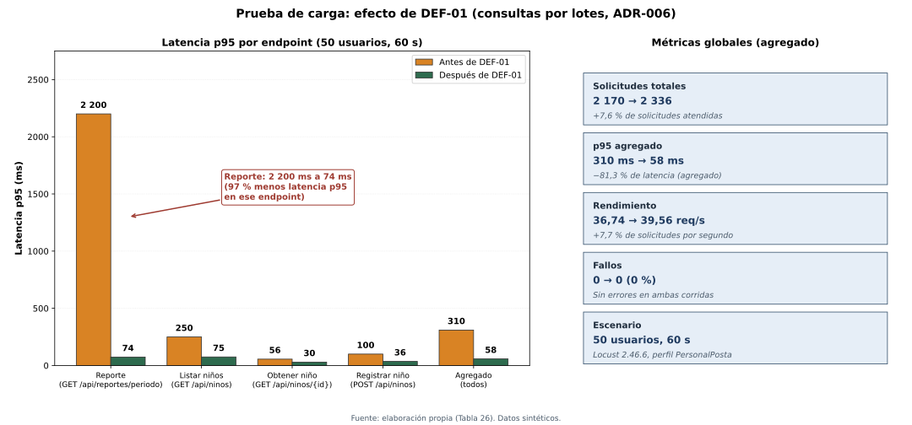

La prueba de carga no mide la conectividad rural.

#### Análisis estático de código (linting/SonarQube) y gestión de defectos

**Ruff.** El análisis estático obligatorio es Ruff 0.15.11 (reglas E, F, W, I, B, UP, S y C90; complejidad McCabe ≤ 12; línea de 120). La evidencia `pmv_fastapi/docs/evidencias/ruff.txt` registra «All checks passed!» y «33 files already formatted»: 0 hallazgos.

**SonarCloud.** El repositorio incluye `pmv_fastapi/sonar-project.properties` (`sonar.projectKey=anemia-junin-pmv`) y un paso del pipeline condicionado al secreto `SONAR_TOKEN`. La propiedad `sonar.organization` conserva un valor de reemplazo y no hay evidencia de un análisis ejecutado. Por eso este informe no afirma resultados de SonarCloud: está preparado y pendiente de activación. [COMPLETAR: activar SonarCloud (organización, `SONAR_TOKEN`, análisis y captura del *quality gate*), o decidir no usarlo — ver PASOS_MANUALES paso 7]

**Gestión de defectos.** El registro `pmv_fastapi/docs/evidencias/registro_defectos.md` contiene dos defectos mayores, ambos cerrados.

**Tabla 27.** Registro de defectos del Incremento 1.

| ID | Descripción | Severidad | Detectado por | Corrección y verificación | Estado |
| --- | --- | --- | --- | --- | --- |
| DEF-01 | N+1 en `GET /api/reportes/periodo`: p95 de 2 200 ms con 50 usuarios | Mayor (rendimiento) | CP-15 y prueba de carga | Consultas por lotes en `fix/def-01-reporte-n-mas-1` (ADR-006); p95 de 74 ms | Cerrado |
| DEF-02 | El reporte contaba días en UTC y perdía los registros posteriores a las 19:00 en Perú | Mayor (exactitud) | CP-14 y E2E (30/09/2026, 20:40) | Corrección en `fix/def-02-zona-horaria`; verificada por CP-16 (unitaria, integración en SQLite y PostgreSQL, y E2E) | Cerrado |

**Densidad de defectos:** 2 defectos / 1,02 KLOC de Python = 2,0 defectos/KLOC, con 0 abiertos. El código de la aplicación tiene 1 191 líneas en `app/**/*.py`.

### 3.4 Despliegue y demostración del primer incremento / PMV

#### Arquitectura del entorno de despliegue (Staging / Nube / Emulador)

El entorno de despliegue es un staging local reproducible con Docker Compose (Figura 25). No hay despliegue en la nube documentado.

**Tabla 28.** Componentes del entorno de despliegue.

| Elemento | Definición |
| --- | --- |
| `Dockerfile` | Imagen `python:3.11-slim`; usuario sin privilegios `appuser`; puerto 8000; `HEALTHCHECK` a `/api/salud` cada 30 s; comando `uvicorn app.main:crear_app --factory` |
| `docker-compose.yml` | Servicio `db` (`postgres:16-alpine`, volumen `datos_pg`, esquema montado en `docker-entrypoint-initdb.d`, `pg_isready`) y servicio `api` (`DATABASE_URL` hacia `db:5432`, puerto `8000:8000`, `depends_on` con `service_healthy`) |
| Comandos de staging | `POSTGRES_PASSWORD=... docker compose up -d --build` y `docker compose exec api python -m scripts.cargar_datos_prueba` |
| Desarrollo | `pip install -r requirements-dev.txt`, `python -m scripts.cargar_datos_prueba` y `uvicorn app.main:crear_app --factory --reload --port 8000`; Swagger en `/docs` |
| Pipeline CI (`.github/workflows/ci.yml`) | Disparadores: *push* a `main`, `develop` y `feature/**`, y *pull request* a `main` y `develop`. Job `calidad-y-pruebas` con servicio `postgres:16`: Ruff, Pytest con cobertura, esquema SQL con `psql`, integración en PostgreSQL, E2E con Playwright y publicación del artefacto `reportes-calidad`; análisis de SonarCloud condicionado a `SONAR_TOKEN`. Job `imagen-staging` (solo en `main`): `docker build` |
| Flujo de ramas | `main` (liberaciones con tag) ← `develop` ← `feature/huXX-…`, con *pull request* y pipeline en verde |

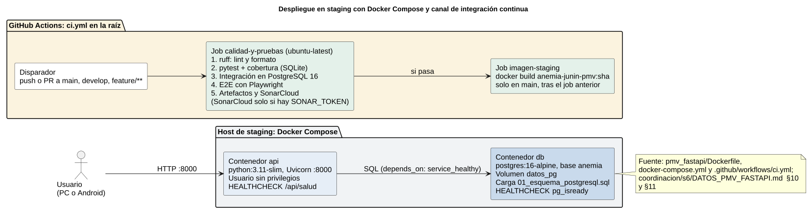

Sobre el pipeline: hasta esta versión el archivo residía en `pmv_fastapi/.github/workflows/`, ruta que GitHub no lee; el pipeline vigente está en `.github/workflows/ci.yml` en la raíz del repositorio. El repositorio no contiene evidencia de una ejecución en verde. [COMPLETAR: captura o enlace de la ejecución en verde en Actions tras el *push* — ver PASOS_MANUALES paso 3] Tampoco se ejecutó el despliegue de staging durante la redacción de este informe: [COMPLETAR: staging con `docker compose up -d --build` y captura de `GET /api/salud` — ver PASOS_MANUALES pasos 8 y 9].

#### Evidencia del incremento funcional operativo (capturas de pantalla / flujo de ejecución)

El PMV entrega las cinco historias de usuario (Tabla 29). Las capturas 01 a 08 (Figuras 26 a 33) muestran el flujo de ejecución con datos sintéticos: registro con vista previa, validación de datos inválidos, expediente nuevo, seguimiento, evolución del expediente, reporte del periodo, vista móvil y documentación OpenAPI.

**Tabla 29.** Historias de usuario del Incremento 1 y su evidencia.

| Historia | Descripción | Estado | Evidencia visual |
| --- | --- | --- | --- |
| HU-01 | Registrar niño con evaluación inicial | Entregada | Figuras 26 y 28 |
| HU-02 | Consultar y actualizar el expediente, incluido el nuevo control | Entregada | Figuras 28 y 30 |
| HU-03 | Validar datos con reglas clínicas (vista previa y rechazo comprensible) | Entregada | Figuras 26 y 27 |
| HU-04 | Listar niños en seguimiento con estado de control | Entregada | Figura 29 |
| HU-05 | Reporte del periodo en JSON y CSV | Entregada | Figura 31 |

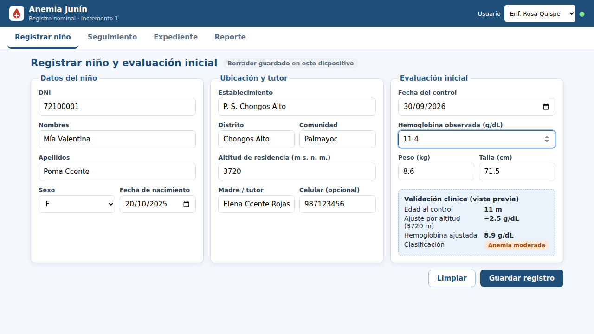

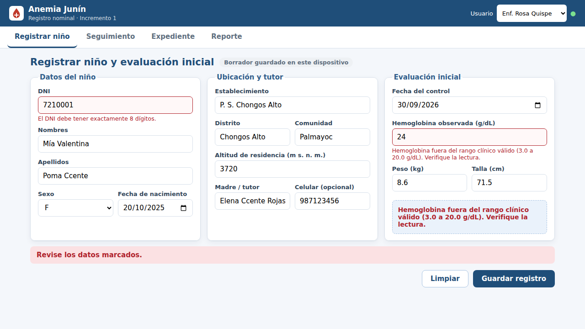

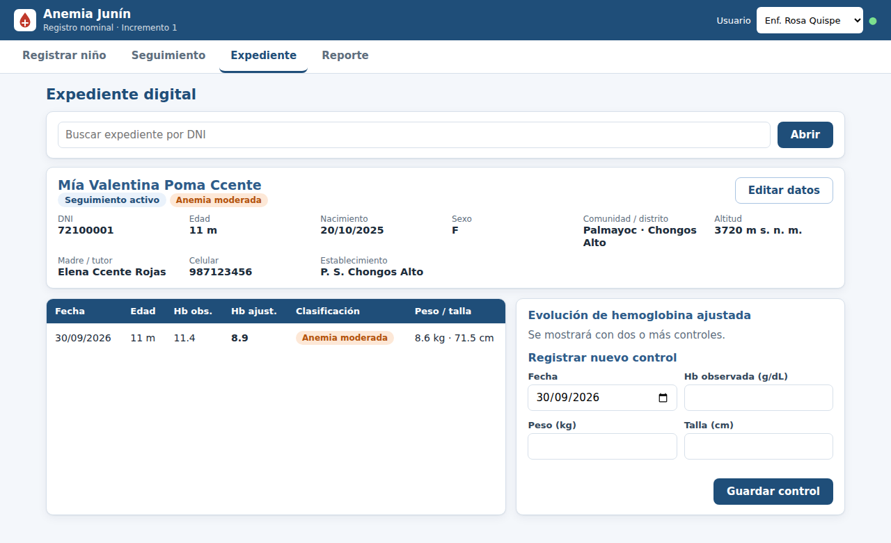

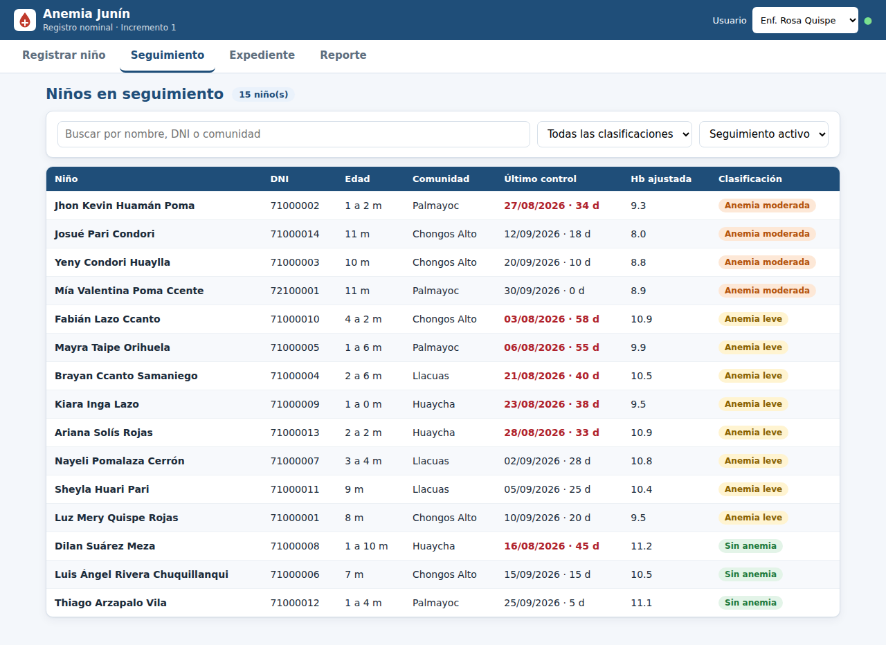

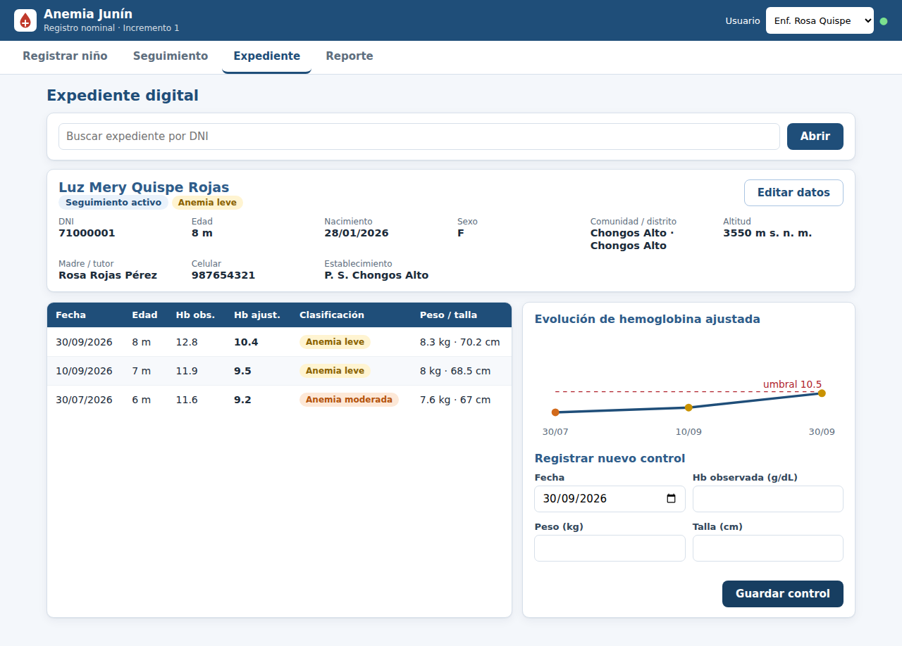

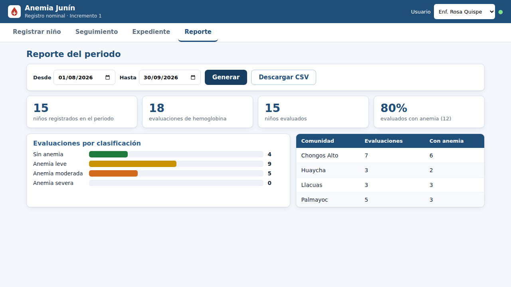

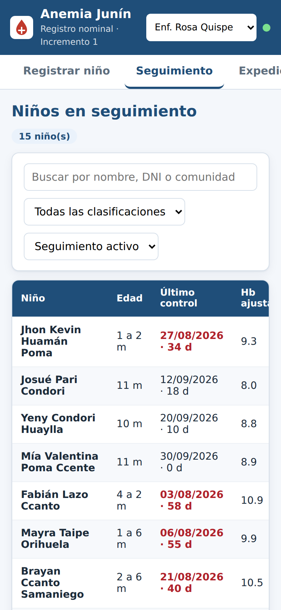

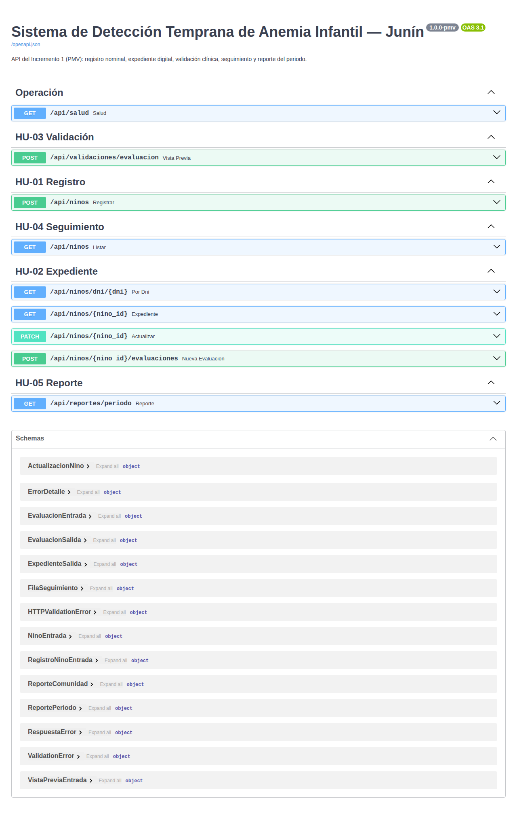

**Video de demostración.** `pmv_fastapi/docs/evidencias/demo_pmv.mp4` (1 640 388 bytes, aproximadamente 1,6 MB), generado con `pmv_fastapi/scripts/grabar_demo.py`. [COMPLETAR: duración del video y, si el aula virtual lo exige, enlace público — ver PASOS_MANUALES paso 10]

**Aceptación del usuario.** No existe un acta de aceptación de un usuario final real. [COMPLETAR: acta o correo de aceptación del usuario final; si no se obtiene, declarar el incremento como verificado técnicamente y pendiente de aceptación — ver PASOS_MANUALES paso 5]

## 4. Matriz de trazabilidad integral del proceso y generación de valor

La matriz recorre las ocho columnas de la consigna, desde el problema organizacional hasta el indicador de valor. Las filas 1 a 5 corresponden al PMV entregado; las filas 6 a 8 son incrementos futuros, marcadas como INC-n, sin resultados medidos. Los rangos de casos de prueba (CP) son los de la Tabla 23.

**Tabla 30.** Matriz de trazabilidad integral.

| Problema Org. | Proceso TO-BE | Modelo Adaptado | Categoría/Actividad | Decisión Arquitectura | Caso Prueba | PMV Entregado | Indicador Valor |
| --- | --- | --- | --- | --- | --- | --- | --- |
| B1: triple registro sin registro nominal único ni identidad única | M1: registro nominal único y deduplicado | Iterativo-incremental con Scrum (Sprints 1 y 2) | Principal: requisitos, construcción; soporte: pruebas | ADR-001 hexagonal; ADR-003 `UNIQUE(dni)` | CP-13 a CP-32 (casos de uso e integración, incluido el duplicado 409) | HU-01: `POST /api/ninos` y registro en la PWA | Registros por evaluación: 3 → 1 (datos sintéticos) |
| B1: errores de digitación y datos inválidos | M1: validación al capturar, con vista previa | Iterativo-incremental con DevOps (pruebas automatizadas) | Soporte: verificación; principal: diseño | ADR-004 reglas parametrizadas; ADR-005 errores por campo | CP-01 a CP-12; E2E de datos inválidos (CP-33 a CP-36) | HU-03: `POST /api/validaciones/evaluacion` y rechazo 422 | Registros sin error crítico ÷ evaluados × 100 (S1); medición con uso real |
| B1: antecedentes dispersos del niño | M1: expediente digital único | Iterativo-incremental | Principal: diseño y construcción | ADR-003 PostgreSQL con `CHECK` y llaves foráneas; ADR-005 | CP-21 a CP-32 | HU-02: expediente, actualización y nuevo control | Expediente único con historial de evaluaciones (3 → 1) |
| B5: casos que requieren atención no son visibles | M5 (parcial): lista de seguimiento con estado de control; sin predicción | Tailoring de alcance: primero visibilidad, luego riesgo (INC-5) | Principal: construcción | ADR-006 consultas por lotes; vista `v_ultimo_control` | E2E de seguimiento (CP-33 a CP-36) | HU-04: `GET /api/ninos` con `control_atrasado` | p95 del listado: 250 → 75 ms (producto); pérdida de seguimiento requiere INC-2 y línea base |
| B6: consolidación tardía e indicadores incompletos | M6 (parcial): reporte del periodo | DevOps: medición y corrección continua | Soporte: resolución de problemas; gestión: mejora | ADR-006 (DEF-01); zona horaria UTC-5 (DEF-02) | CP-14 a CP-16 y E2E de reporte; Locust | HU-05: `GET /api/reportes/periodo` en JSON y CSV | p95 del reporte: 2 200 → 74 ms; p95 agregado de 58 ms con 50 usuarios |
| B2 y B3: agenda manual y barreras ocultas | M2 y M3: agenda y recordatorios | Siguientes sprints (INC-2 e INC-4) | INC-2: agenda y alertas; INC-4: mensajería | Por definir en INC-2 e INC-4 | Por definir | INC-2 e INC-4 (no entregados) | Cobertura oportuna; mensajes entregados y leídos ÷ enviados |
| B4 y B6: visita en papel y conectividad intermitente | M4 y M6: captura sin conexión y sincronización | DevOps con prueba de sincronización desde INC-3 | INC-3 e INC-6 | Cola sin conexión (ADR-002 la difiere a INC-3) | Prueba sin conexión de 15 min (por definir) | INC-3 e INC-6 (no entregados) | Registros sincronizados ÷ pendientes × 100 |
| B5: riesgo de abandono | M5: modelo de riesgo explicable | MLOps desde INC-5 | INC-5 | Por definir en INC-5 | Evaluación del modelo con criterio clínico (por definir) | INC-5 (no entregado) | Casos confirmados ÷ señalados por el modelo × 100 |

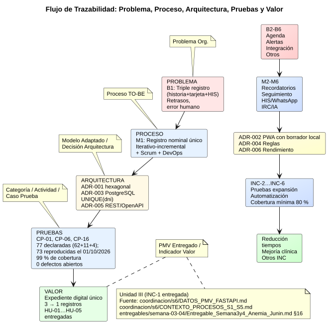

La entrega técnica garantiza la trazabilidad del dato desde el problema hasta la prueba. La mejora organizacional (menor pérdida de seguimiento, mejor uso del personal) requiere despliegue en una posta, adopción y seguimiento longitudinal, y no se atribuye al PMV. Las metas de S3-4 son propuestas, no acuerdos institucionales ni resultados observados.

## 5. Conclusiones y lecciones aprendidas

### Tres conclusiones técnicas sobre la efectividad del proceso de software diseñado

1. **El modelo híbrido entregó el incremento completo con trazabilidad de extremo a extremo.** El ciclo iterativo-incremental con Scrum y DevOps produjo cinco historias de usuario (21 puntos) con su ADR, su caso de prueba y su artefacto. La arquitectura hexagonal (ADR-001) permitió ejecutar 62 pruebas unitarias en menos de 1 s con el adaptador en memoria y reutilizar la misma suite de integración en SQLite y PostgreSQL.
2. **Los controles de calidad detectaron defectos de naturaleza distinta, y la cobertura sola no los habría revelado.** Con 99 % de cobertura y 0 hallazgos de Ruff, la prueba de carga reveló el N+1 de DEF-01 (p95 de 2 200 ms) y la prueba E2E detectó el error de zona horaria de DEF-02. Ambos se cerraron con prueba de regresión; la densidad final es de 2,0 defectos/KLOC y el p95 agregado bajó de 310 a 58 ms.
3. **El proceso demuestra valor técnico y de diseño, no impacto asistencial.** La matriz de la sección 4 conecta B1 con HU-01 a HU-05 y con el indicador 3 → 1 registros por evaluación, pero con datos sintéticos y sin una posta. La reducción de la pérdida de seguimiento exige INC-2 en adelante, una línea base y un piloto.

### Tres lecciones aprendidas sobre el control de desviaciones y la adaptación del ciclo de vida

1. **Las desviaciones se controlan mejor cuando una prueba las hace visibles y el ciclo cierra con evidencia.** DEF-01 y DEF-02 se detectaron por CP-15 y CP-14, se corrigieron en ramas `fix/…`, se documentaron en el registro de defectos y se verificaron con CP-16 y la nueva carga. La desviación de calendario (entrega el 30/09/2026 frente al hito H1 del 28/09/2026) se registró y no afectó el alcance.
2. **«Configurado» no equivale a «en operación»: la Definición de Hecho debe exigir evidencia de ejecución.** El pipeline de CI estaba en una subcarpeta que GitHub no ejecuta, SonarCloud tenía una organización de reemplazo y el tag apunta a un commit de la rama `entrega-s5-s7`, no integrado en la historia de `main` (que incorporó el PMV mediante *squash*) aunque con código idéntico. Se corrigió con el traslado del pipeline y se declara con honestidad lo que sigue abierto.
3. **Adaptar el ciclo incluye cambiar de tecnología cuando los requisitos no funcionales lo piden y mantener los documentos sincronizados.** El prototipo en Flask cumplió como espiga técnica; la pila definitiva (FastAPI y PostgreSQL) responde a integridad del dato, contrato OpenAPI y despliegue en contenedores [COMPLETAR: confirmar este motivo — ver PASOS_MANUALES paso 6]. Los entregables de semanas anteriores describían el prototipo, de modo que código, diagramas y documentos deben actualizarse en conjunto para no presentar cifras de una versión anterior.

### Siguiente incremento

El siguiente incremento es INC-2, **agenda automática y alertas internas** (HIST-2.1 a HIST-2.4, 18 puntos de historia), planificado en el Sprint 3 (29/09 a 12/10/2026) junto con el backlog técnico de integración continua y pruebas E2E. Antes de un piloto rural debe revisarse la prioridad de INC-3 (sin conexión y sincronización), segundo en la matriz (4,40), y validarse con la microred los puntos de corte clínicos, la protección de datos personales (Ley N.° 29733) y la autenticación, hoy inexistente.

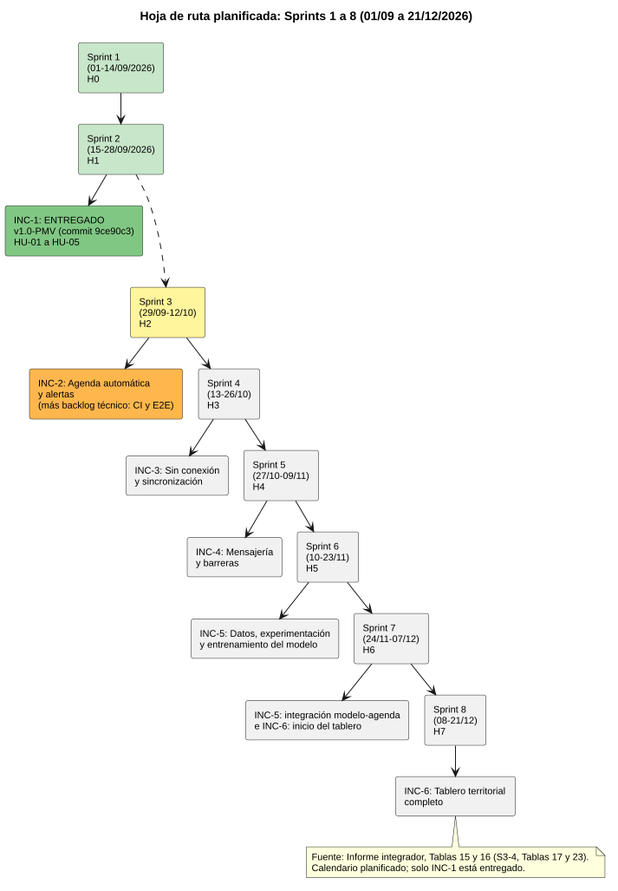

## 6. Anexos y repositorio de código

**Tabla 31.** Repositorio, tag y evidencias.

| Elemento | Ubicación |
| --- | --- |
| Repositorio Git | <https://github.com/woshtsu/ProcesosSoftwareAnemia> |
| Tag de liberación | `v1.0-PMV` (anotado, objeto 6a17c63), commit `9ce90c3` «release: v1.0-PMV — Incremento 1»: <https://github.com/woshtsu/ProcesosSoftwareAnemia/tree/v1.0-PMV> |
| Código vigente del PMV | Carpeta `pmv_fastapi/` del repositorio |
| README con compilación, despliegue y base de datos | `pmv_fastapi/README.md` (ejecución local, staging con Docker Compose, pruebas y calidad) |
| Scripts de base de datos | `pmv_fastapi/db/01_esquema_postgresql.sql` (esquema); `pmv_fastapi/scripts/cargar_datos_prueba.py` (datos sintéticos) |
| Contrato de la API | `pmv_fastapi/docs/openapi.json` (OpenAPI 3.1) |
| ADR | `pmv_fastapi/docs/adr/ADR-001` a `ADR-006` |
| Evidencias de calidad | `pmv_fastapi/docs/evidencias/cobertura.txt` y `cobertura.xml`, `ruff.txt`, `registro_defectos.md`, `carga/` |
| Capturas y video | `pmv_fastapi/docs/evidencias/capturas/01` a `08` y `demo_pmv.mp4`; guion de grabación en `pmv_fastapi/scripts/grabar_demo.py` |
| Pipeline CI | `.github/workflows/ci.yml` |
| Entregables previos | `entregables/semana-01/`, `semana-02/` y `semana-03-04/` |
| Acta de aceptación del Incremento 1 | Anexo A de este informe |

**Nota sobre el tag `v1.0-PMV`.** El tag existe en el repositorio remoto y apunta al commit `9ce90c3`, que pertenece a la rama `entrega-s5-s7`. En ese commit el PMV está en la raíz del repositorio, y su contenido es idéntico al de `pmv_fastapi/` en la rama `main` (carpetas `app`, `tests`, `db`, `docs` y `scripts`, y los archivos `Dockerfile`, `docker-compose.yml`, `README.md` y `.github`). El commit `9ce90c3` no forma parte de la historia de `main`, porque `main` incorporó el PMV con una fusión por *squash*. Quien abra el tag verá el código del PMV, pero no los entregables del curso, que están en `main`.

**Fuentes.** Guías y entregables S1, S2 y S3-4; consigna integradora S6; código, ADR, pruebas y evidencias de `pmv_fastapi/`. Las referencias normativas (NTS N.° 213-MINSA/DGIESP-2024 y parámetros OMS 2024) describen la procedencia declarada de las reglas; este informe no sustituye su validación clínica.

### Anexo A. Acta de aceptación del Incremento 1

Plantilla para registrar la aceptación del Incremento 1 por el Product Owner. Los campos pendientes los completa el equipo tras la reunión de aceptación; hasta entonces, la aceptación del usuario figura como pendiente y el incremento está verificado técnicamente.

| Campo | Contenido |
| --- | --- |
| Incremento | INC-1: registro único, expediente, listado en seguimiento y reporte (HU-01 a HU-05); tag `v1.0-PMV` |
| Fecha de la reunión | [COMPLETAR: fecha de la reunión de aceptación — ver PASOS_MANUALES paso 5] |
| Participantes (nombre y rol) | [COMPLETAR: participantes, incluido el Product Owner — ver PASOS_MANUALES paso 5] |
| Historias de usuario aceptadas | [COMPLETAR: marcar cuáles de HU-01 a HU-05 se aceptan — ver PASOS_MANUALES paso 5] |
| Observaciones y cambios solicitados | [COMPLETAR: observaciones del Product Owner — ver PASOS_MANUALES paso 5] |
| Decisión | [COMPLETAR: aceptado / aceptado con observaciones / no aceptado — ver PASOS_MANUALES paso 5] |
| Firma del Product Owner | [COMPLETAR: firma — ver PASOS_MANUALES paso 5] |
| Firma del equipo | [COMPLETAR: firmas de los tres integrantes — ver PASOS_MANUALES paso 5] |
