# 1 · Del triple registro al expediente único

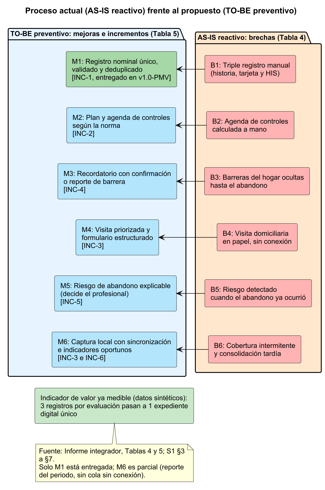

Brechas **B1–B6** · Datos ➔ Software ➔ Decisión ➔ Impacto
Valor: **3 registros → 1** por evaluación (sintético)
Anemia Junín · Procesos de Software 2026-20 · Porras · Auqui · Huamani

<!--
[Expone: Porras V. (Ingeniero de Proceso). Tiempo: 1:05. Acumulado 1:05]
PITCH (1,5 min de la consigna, reducido a 1:05):
- 0:00 Problema. En Junín el seguimiento de la anemia infantil se pierde porque el proceso es reactivo: triple registro manual (historia clínica, tarjeta de control y digitación en el HIS), agenda a mano, barreras familiares ocultas y conectividad intermitente. Son las brechas B1 a B6.
- 0:25 Propuesta. Pasamos de un proceso reactivo a uno preventivo. La cadena de valor es Datos, Software, Decisión e Impacto: el software no decide, ordena el dato para que el profesional decida a tiempo.
- 0:45 Indicador. El Incremento 1 ataca B1: el indicador de valor medible hoy es pasar de 3 registros manuales por evaluación a 1 expediente digital único. Es un resultado de diseño con datos sintéticos; no inventamos tiempos de respuesta que no medimos.
- 1:00 Transición: "¿Qué proceso usamos para construirlo? Ricardo/Tania, siguiente".
Cifras: DATOS_PMV §1 y Informe §2.1 (Tabla 4 y Tabla 6).
-->

---

# 2 · Tailoring: híbrido, no Cascada

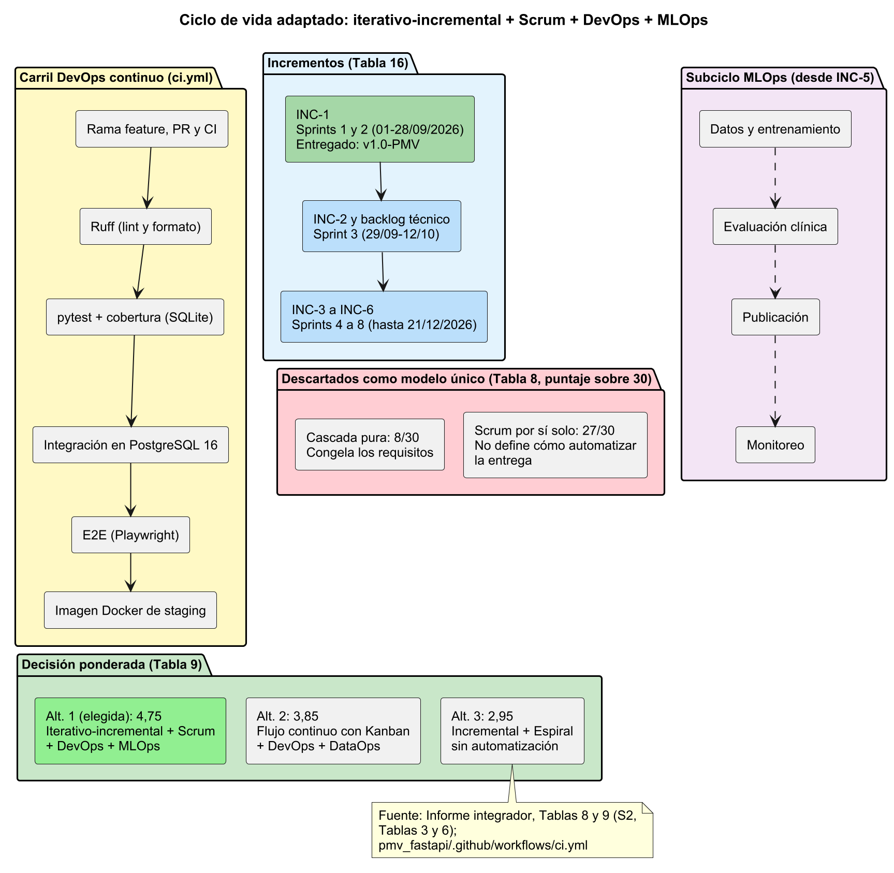 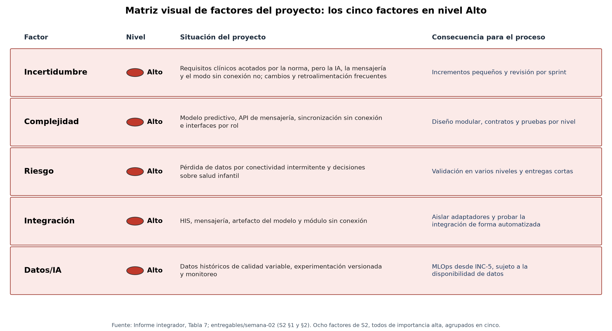

Iterativo-incremental + **Scrum** + **DevOps** (MLOps desde INC-5)
Puntaje ponderado **4,75** vs. 3,85 vs. 2,95
Rechazados: **Cascada pura (8/30)** y Scrum puro

<!--
[Expone: Porras V. Tiempo: 1:05. Acumulado 2:10]
PITCH (por qué las características del proyecto exigieron esta adaptación):
- 0:00 Factores. Cinco factores en nivel alto: incertidumbre (IA, mensajería y modo sin conexión no están cerrados), complejidad, riesgo (decisiones sobre salud infantil y pérdida de datos), integración (HIS, mensajería) y datos/IA.
- 0:20 Decisión. Matriz ponderada de ocho criterios: híbrido iterativo-incremental + Scrum + DevOps (MLOps diferido a INC-5) obtuvo 4,75; Kanban + DevOps + DataOps, 3,85; el enfoque tradicional, 2,95.
- 0:40 Rechazos explícitos. Cascada pura suma 8 de 30 en la comparación de modelos: exige congelar requisitos y validar al final, incompatible con la incertidumbre. Scrum puro no automatiza la entrega: sin ingeniería continua (pruebas, análisis estático, imagen en CI) no hay evidencia por sprint.
- 0:55 Tailoring: equipo de 3 personas, Scrum liviano con sprints de dos semanas, matriz RAE de tres roles.
Cifras: Informe §2.2 (Tablas 7 a 9) y §3.1 (Tabla 20).
-->

---

# 3 · Arquitectura: monolito hexagonal + API REST

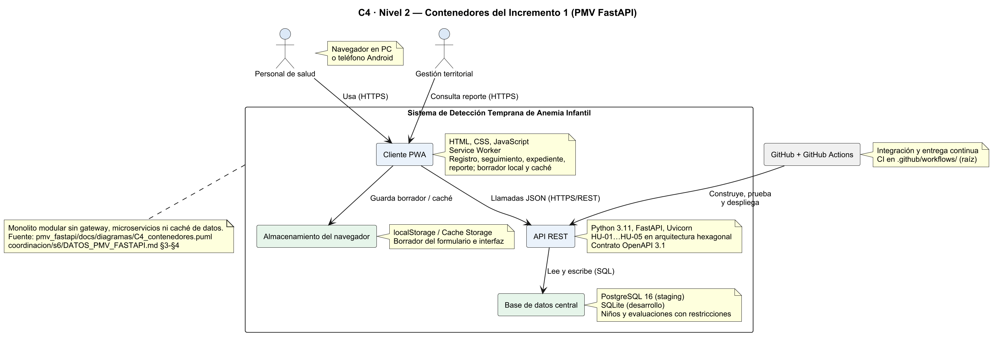 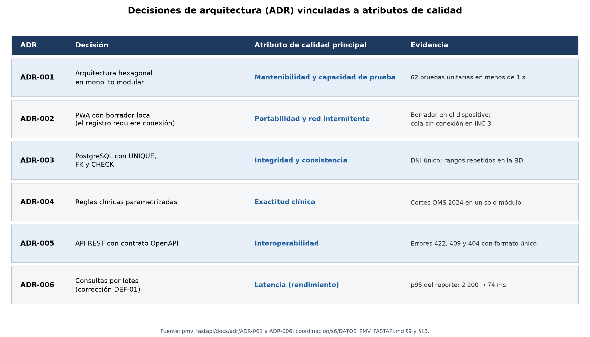

REST/JSON + OpenAPI 3.1 (ADR-005): sin WebSockets ni gRPC
Sin microservicios, gateway ni caché de servidor (ADR-001)
**ADR-003** integridad · **ADR-006** latencia · **ADR-002** disponibilidad

<!--
[Expone: Auqui H. (Ingeniero de Desarrollo y Prototipado; arquitectura). Tiempo: 1:05. Acumulado 3:15]
PITCH (cómo la arquitectura soporta los requerimientos no funcionales):
- 0:00 C4 nivel 2. Tres contenedores: cliente PWA (HTML/CSS/JS, manifest y service worker), API FastAPI con núcleo hexagonal (dominio, aplicación, adaptadores) y base de datos PostgreSQL 16 (SQLite en desarrollo y pruebas).
- 0:20 Por qué no hay lo que la consigna menciona: no hay API gateway, microservicios ni caché de servidor. ADR-001 descarta microservicios: con 3 personas y un solo incremento, distribuir sería prematuro; el hexágono deja puertos para evolucionar. La única caché es la de interfaz de la PWA (service worker).
- 0:35 ADR y NFR: ADR-003 PostgreSQL con UNIQUE(dni), FK y CHECK da integridad y concurrencia (un DNI duplicado, incluso en altas simultáneas, lo rechaza la propia base de datos y la API responde 409). ADR-006 consultas por lotes corrigió el N+1: latencia p95 del reporte de 2 200 a 74 ms. ADR-002 PWA con borrador local da disponibilidad de interfaz con red intermitente; el registro definitivo exige conexión y la cola sin conexión llega en INC-3.
- 0:55 Protocolo: REST/JSON con OpenAPI 3.1 y errores por campo en español (ADR-005). WebSockets y gRPC se descartan: el INC-1 no necesita tiempo real. Limitación declarada: sin autenticación (solo X-Usuario).
Cifras: DATOS_PMV §3, §4, §13; Informe §3.2.
-->

---

# 4 · Pruebas: evidencia objetiva de calidad

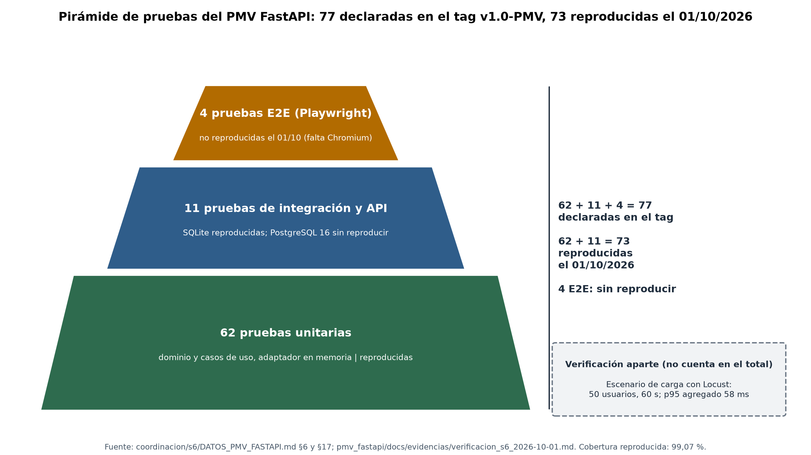 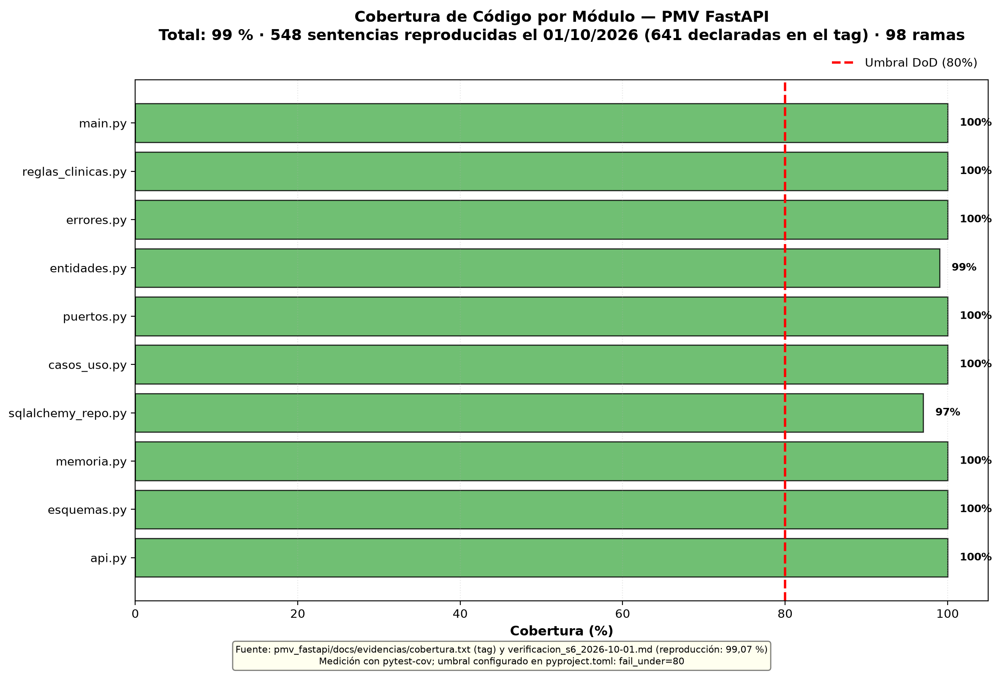 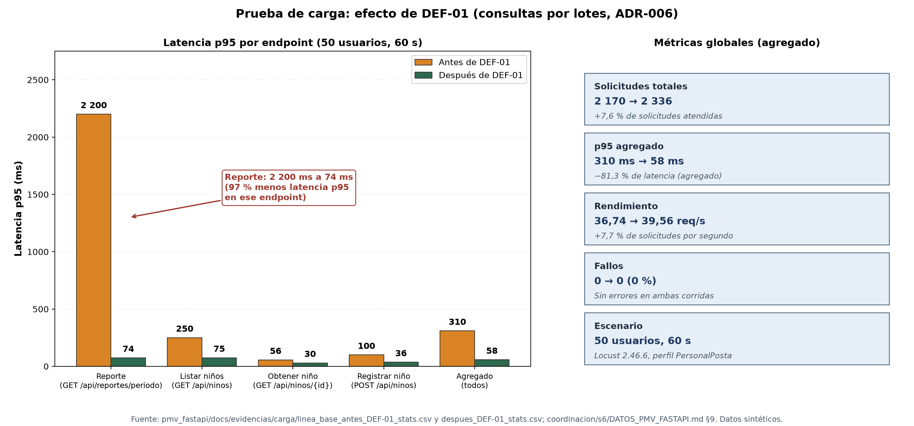

**62+11+4 = 77** declaradas, **73** reproducidas el 01/10
Carga: verificación aparte, no cuenta como prueba
Cobertura **99 %**, p95 **310 → 58 ms**
DoD cumplida: ≥ 80 %, Ruff 0

<!--
[Expone: Huamani R. (Ingeniero de Calidad y Mejora). Tiempo: 1:05. Acumulado 4:20]
PITCH (evidencia objetiva de calidad y estabilidad del código):
- 0:00 Pirámide: base amplia en el dominio, 62 unitarias (sin BD ni HTTP, menos de 1 s con el adaptador en memoria); 11 de integración y API (SQLite y PostgreSQL 16 en CI); 4 E2E con Playwright; y, aparte, una verificación de carga. Total: 62 + 11 + 4 = 77 pruebas automatizadas declaradas en el tag; 73 reproducidas el 01/10. La prueba de carga es una verificación aparte y no cuenta en ese total.
- 0:20 Cobertura (pytest-cov, equivalente a Jacoco/Istanbul): 99 % con ramas, 641 sentencias y solo 2 sin cubrir; el umbral de la DoD es 80 %.
- 0:35 Carga con Locust (equivalente a k6/JMeter), 50 usuarios, 60 s: antes de DEF-01 el p95 agregado era 310 ms; después, 58 ms, con 39,6 req/s y 0 fallos. El reporte pasó de 2 200 a 74 ms.
- 0:50 DoD: cobertura >= 80 %, Ruff 0 hallazgos, suite en verde. HONESTIDAD: el 01/10 reprodujimos 73 pruebas (62 + 11) pasando, 99,07 % y Ruff 0. Las 4 E2E (falta el navegador de Playwright), la integración en PostgreSQL y la carga no se re-ejecutaron: sus resultados son los declarados en el tag. SonarCloud está preparado pero sin análisis ejecutado.
Cifras: DATOS_PMV §6 a §9 y §17; Informe §3.3.
-->

---

# 5 · Demo: HU-01 a HU-05 operativas

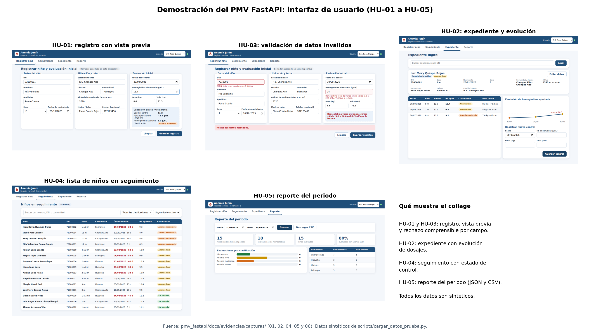 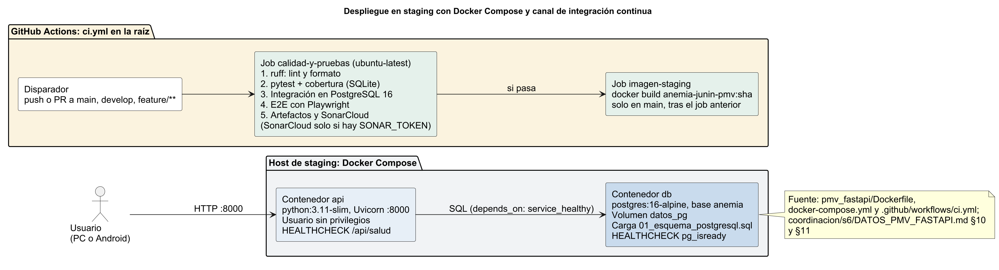

HU-01 · HU-02 · HU-03 · HU-04 · HU-05: **entregadas** · video `demo_pmv.mp4`
Staging: Docker Compose (API + PostgreSQL 16) + CI
Aceptación del usuario: pendiente de acta (ver anexo)

<!--
[Expone: Auqui H. (demo) con apoyo de Huamani R. Tiempo: 1:25. Acumulado 5:45]
GUION DE LA DEMO (consigna: 2 min; reducido a 1:25). Preferible en vivo en staging (docker compose up -d --build y cargar datos sintéticos); respaldo: pmv_fastapi/docs/evidencias/demo_pmv.mp4 (1,6 MB; duración [COMPLETAR]).
- 0:00 Contexto: PMV con las 5 historias (la consigna pide al menos HU-01 a HU-03): HU-01 registro con evaluación inicial, HU-02 expediente y nuevos controles, HU-03 validación con vista previa y rechazo comprensible, HU-04 seguimiento, HU-05 reporte JSON y CSV.
- 0:10 Registro (captura 01): se ingresan datos de un niño sintético; la vista previa muestra la hemoglobina ajustada por altitud y la clasificación antes de guardar.
- 0:30 Validación (captura 02): un dato inválido se rechaza con mensaje por campo (422), no con un error genérico.
- 0:45 Expediente y seguimiento (03, 04, 05): el niño registrado aparece en el listado con su estado de control; un nuevo control actualiza la evolución.
- 1:00 Reporte (06) y OpenAPI (08): reporte del periodo en JSON/CSV; contrato OpenAPI 3.1 en /docs.
- 1:10 Entorno: staging con Docker Compose (api + postgres:16) y CI en GitHub Actions. No hay despliegue en la nube. Datos sintéticos.
- 1:20 Validación con usuario final: NO existe acta de aceptación de un usuario real. Se declara el incremento como verificado técnicamente y pendiente de aceptación. [COMPLETAR: acta o correo de aceptación del Product Owner o personal de salud]
Plan B si falla la demo en vivo: reproducir el video y mostrar la captura 07 (vista móvil).
-->

---

# 6 · Tablero: proceso, producto y valor

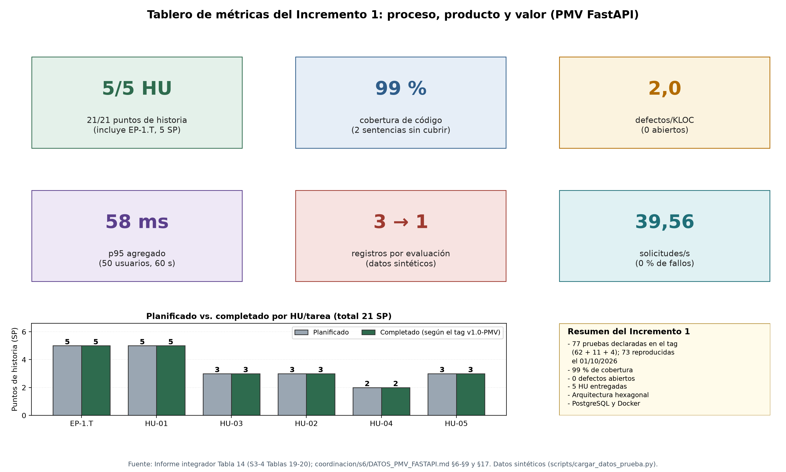 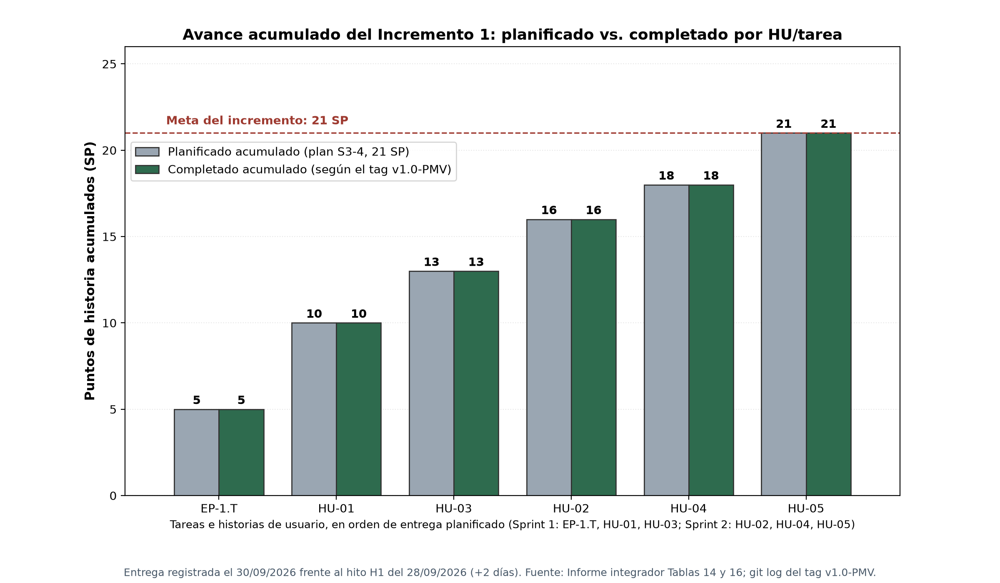

INC-1: **5/5** historias, **21/21** SP, hito H1 **+2 días**
**2,0 defectos/KLOC** (0 abiertos) · cobertura **99 %**
Valor: **3 → 1** registros por evaluación (sintético)

<!--
[Expone: Huamani R. Tiempo: 0:40. Acumulado 6:25]
PITCH (datos cuantitativos del éxito de la iteración):
- 0:00 Proceso: planificado vs. completado. El INC-1 planificó 21 puntos de historia en dos sprints (13 + 8) y entregó las 5 historias (21/21). El gráfico compara lo planificado con lo completado (21/21 SP); no es una serie diaria, porque todos los commits del tag son del 30/09. El burndown de S3-4 es un escenario simulado y se rotula así. Desviación: el hito H1 era el 28/09 y la entrega fue el 30/09 (+2 días), registrada en la retrospectiva.
- 0:15 Producto: 2 defectos mayores (DEF-01 N+1 y DEF-02 zona horaria), ambos cerrados: 2 defectos / 1,02 KLOC = 2,0 por KLOC; cobertura 99 %; Ruff 0.
- 0:28 Valor: lo único medido es el 3 → 1 registros por evaluación, por diseño y con datos sintéticos. No atribuimos reducción de pérdida de seguimiento: exige despliegue en una posta, línea base y seguimiento (INC-2 en adelante).
Cifras: DATOS_PMV §8; Informe §2.3 (Tablas 14 y 18, Figuras 12 a 14).
Nota (C-10): los SP por HU del tablero del PMV (5,3,3,2,3,5) difieren del desglose de S3-4; usar los de S3-4 (13 + 8).
-->

---

# 7 · Trazabilidad integral y cierre

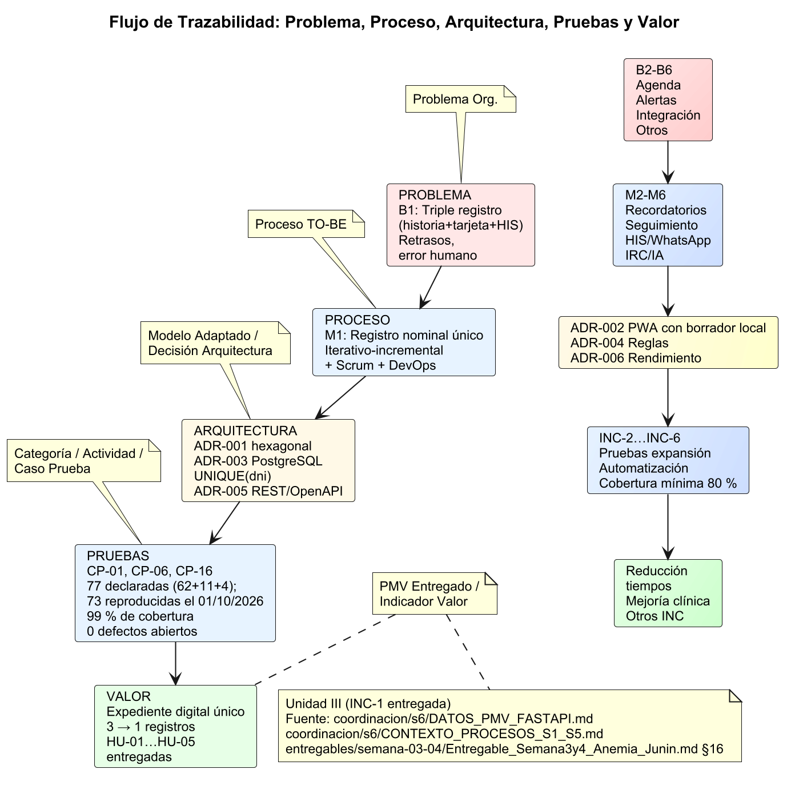 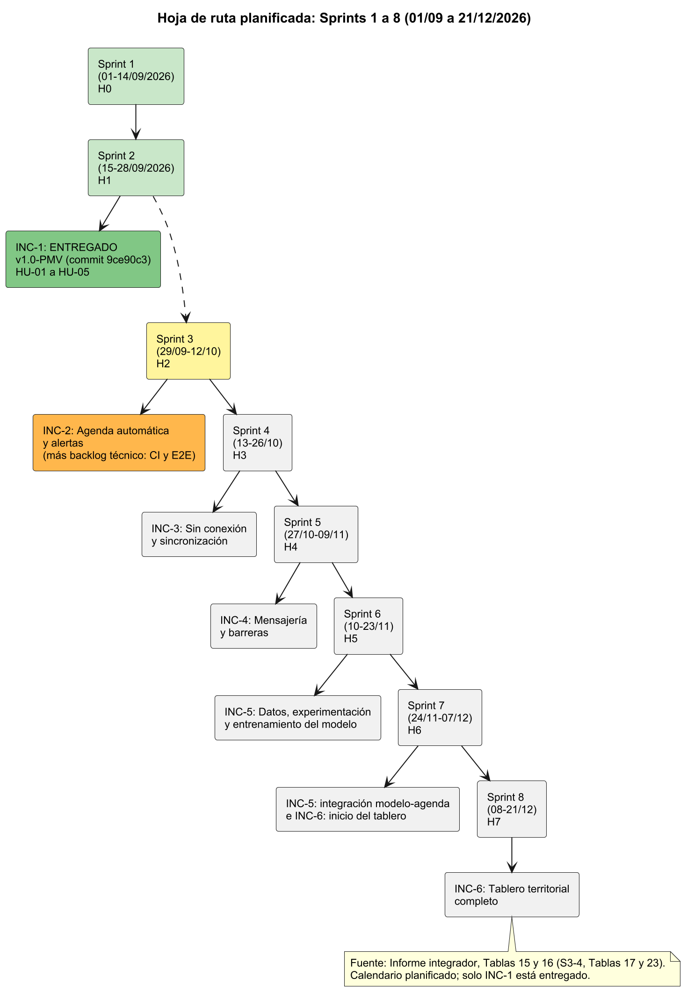

1. Híbrido: 5 HU con ADR, prueba y artefacto
2. Carga y E2E revelaron DEF-01 y DEF-02 (cerrados)
3. Valor técnico demostrado; impacto por medir
Siguiente: **INC-2**, agenda y alertas (Unidad III)

<!--
[Expone: Porras V. (cierre; los tres pueden sumarse para la defensa). Tiempo: 0:35. Acumulado 7:00]
PITCH (coherencia completa del trabajo):
- 0:00 Hilo: B1 (triple registro) -> M1 registro único -> modelo híbrido (Sprints 1 y 2) -> ADR-001, 003, 004, 005 -> CP-01 a CP-36 -> HU-01 a HU-05 -> indicador 3 -> 1. La matriz completa conecta las Unidades I y II (Informe §4, Tabla 30).
- 0:15 Tres conclusiones: (1) el modelo híbrido entregó el incremento completo con trazabilidad extremo a extremo; (2) la cobertura sola no habría revelado DEF-01 ni DEF-02: los detectaron la carga y el E2E; (3) demostramos valor técnico y de diseño, no impacto asistencial.
- 0:28 Siguiente: INC-2, agenda automática y alertas (HIST-2.1 a 2.4, 18 puntos), Sprint 3 (29/09 a 12/10). Antes de un piloto: revisar prioridad de INC-3, confirmar puntos de corte con la microred, protección de datos (Ley N.° 29733) y autenticación.
Cierre: "Gracias; quedamos atentos a las preguntas".
-->
